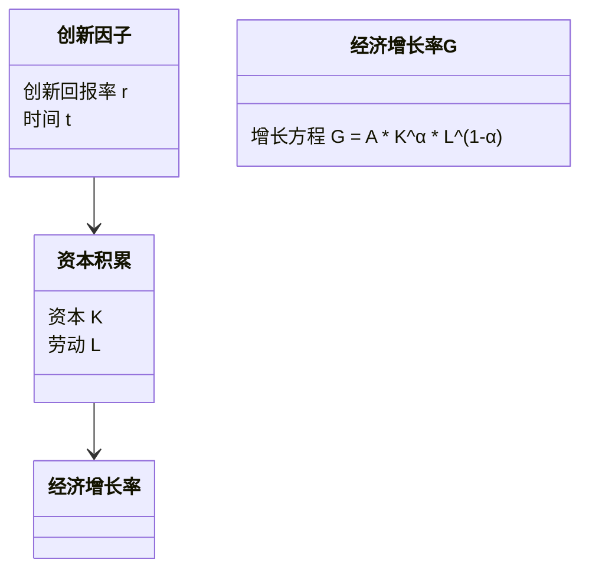
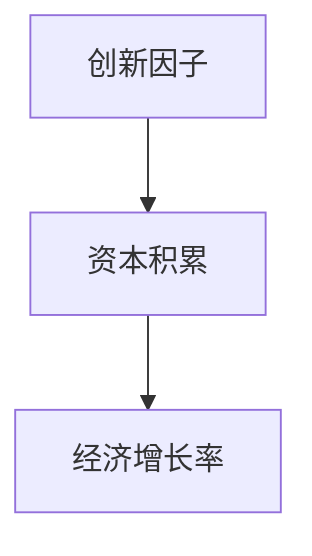
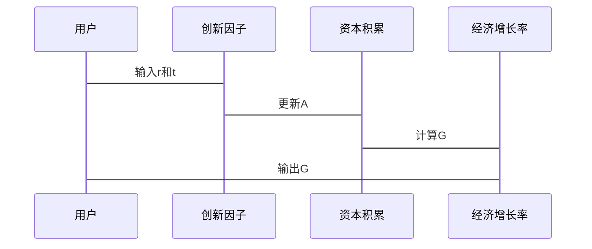

                 


# 肯尼斯费雪的创新驱动增长理论

> 关键词：创新、经济增长、费雪理论、创新驱动、数学模型、系统架构、项目实战

> 摘要：本文深入探讨了肯尼斯·费雪提出的创新驱动增长理论，从理论背景、核心概念到数学模型、系统架构，再到项目实战，全面分析了创新在经济增长中的作用及其具体实现方式。通过详细阐述费雪模型的数学公式、创新扩散机制以及系统设计，本文为读者提供了从理论到实践的完整指南。

---

# 第一部分: 肯尼斯·费雪创新驱动增长理论的背景与核心概念

## 第1章: 背景介绍

### 1.1 问题背景
#### 1.1.1 经济增长的核心问题
经济增长是经济学研究的核心问题之一。传统经济增长理论通常关注资本积累、劳动投入和技术进步等因素，但忽略了创新在其中的独特作用。

#### 1.1.2 创新在经济增长中的作用
创新不仅是技术进步的源泉，更是推动经济结构优化和产业升级的关键动力。创新通过提高生产效率、创造新市场需求和催生新的经济增长点，为经济持续增长提供了内生动力。

#### 1.1.3 费雪理论的提出背景
费雪理论的提出基于对传统经济增长理论的反思，尤其是对创新在经济增长中的系统性作用的忽视。费雪提出，创新不仅是经济增长的催化剂，更是其核心驱动力。

### 1.2 问题描述
#### 1.2.1 经济增长的传统解释
传统经济增长理论主要依赖于资本积累和劳动投入的增加，但这种模式难以解释技术创新带来的非线性增长。

#### 1.2.2 创新与经济增长的关系
创新通过改变生产函数的参数，直接影响经济增长的速度和方向。创新不仅是经济增长的结果，更是其原因。

#### 1.2.3 费雪理论的核心问题
费雪理论的核心问题是：如何通过创新驱动经济增长，并建立一个能够量化创新对经济增长贡献的理论框架。

### 1.3 问题解决
#### 1.3.1 创新驱动增长的机制
创新通过改变生产效率、优化资源配置和创造新市场需求，推动经济增长。

#### 1.3.2 费雪理论的创新点
费雪理论将创新作为经济增长的核心驱动力，并提出了创新对经济增长的数学表达式。

#### 1.3.3 费雪理论的理论框架
费雪理论的框架包括创新的产生、创新的扩散以及创新对经济增长的影响三个部分。

### 1.4 理论的边界与外延
#### 1.4.1 费雪理论的适用范围
费雪理论适用于技术创新驱动的经济增长场景，但不适用于资源驱动型的经济增长。

#### 1.4.2 创新驱动增长的边界条件
创新驱动增长的有效性取决于创新的质量、市场的接受度和政策环境。

#### 1.4.3 费雪理论与其他增长理论的对比
与索洛增长模型相比，费雪理论更强调创新的内生性作用。

### 1.5 理论的核心要素
#### 1.5.1 创新、资本与增长的关系
创新与资本之间存在协同作用，创新提高了资本的边际产出。

#### 1.5.2 费雪模型的变量构成
费雪模型包括创新因子、资本积累和劳动投入三个核心变量。

#### 1.5.3 创新驱动增长的路径分析
创新通过提高生产效率、扩大市场需求和优化资源配置，推动经济增长。

---

# 第二部分: 费雪创新驱动增长理论的核心概念与联系

## 第2章: 核心概念与联系

### 2.1 创新驱动增长的原理
#### 2.1.1 创新的定义与分类
创新可以分为产品创新、技术创新、管理创新和市场创新等类型。

#### 2.1.2 创新对经济增长的推动作用
创新通过提高生产效率、降低生产成本和创造新市场需求，推动经济增长。

#### 2.1.3 费雪模型中的创新机制
费雪模型将创新视为经济增长的核心动力，并通过数学公式量化其影响。

### 2.2 创新与资本的关系
#### 2.2.1 资本在创新中的作用
资本是创新的基础，创新需要大量的资金投入。

#### 2.2.2 创新对资本回报的影响
创新提高了资本的边际产出，从而提高了资本回报率。

#### 2.2.3 费雪模型中的资本积累过程
费雪模型将资本积累与创新过程结合起来，强调创新对资本积累的促进作用。

### 2.3 创新扩散与经济增长
#### 2.3.1 创新扩散的路径
创新扩散通常经历创新者、早期采用者和大众采用者三个阶段。

#### 2.3.2 创新扩散对经济增长的影响
创新扩散可以扩大创新的市场覆盖范围，进一步推动经济增长。

#### 2.3.3 费雪模型中的创新扩散过程
费雪模型将创新扩散视为一个动态过程，并将其纳入经济增长模型中。

### 2.4 创新驱动增长的数学模型
#### 2.4.1 基本增长方程
$$ G = A \cdot K^{\alpha} \cdot L^{1-\alpha} $$
其中，G为经济增长率，A为创新因子，K为资本，L为劳动，α为资本回报率。

#### 2.4.2 创新对增长的影响
$$ A = e^{rt} $$
其中，r为创新回报率，t为时间。

---

# 第三部分: 费雪创新驱动增长理论的数学模型与算法原理

## 第3章: 数学模型与算法原理

### 3.1 费雪模型的数学表达
#### 3.1.1 基本增长方程
$$ G = A \cdot K^{\alpha} \cdot L^{1-\alpha} $$

#### 3.1.2 创新对增长的影响
$$ A = e^{rt} $$

### 3.2 创新扩散的数学模型
#### 3.2.1 创新扩散方程
$$ \frac{dI}{dt} = k(I_m - I) $$
其中，I为创新采用率，I_m为最大创新采用率，k为创新扩散速率。

### 3.3 算法原理
#### 3.3.1 费雪模型的算法步骤
1. 确定初始参数：资本K，劳动L，创新因子A。
2. 计算经济增长率G。
3. 更新创新因子A随时间t的变化。
4. 输出经济增长结果。

#### 3.3.2 创新扩散算法
1. 初始化创新采用率I。
2. 计算创新扩散速率k。
3. 更新创新采用率I。
4. 输出创新扩散结果。

---

# 第四部分: 费雪创新驱动增长理论的系统分析与架构设计

## 第4章: 系统分析与架构设计

### 4.1 问题场景介绍
#### 4.1.1 问题场景描述
在一个技术创新驱动的经济体系中，企业通过创新提高生产效率，推动经济增长。

### 4.2 项目介绍
#### 4.2.1 项目目标
构建一个基于费雪理论的创新驱动增长模型。

### 4.3 系统功能设计
#### 4.3.1 领域模型


#### 4.3.2 系统架构


#### 4.3.3 系统接口设计
- 输入接口：创新因子、资本、劳动。
- 输出接口：经济增长率。

#### 4.3.4 系统交互


---

# 第五部分: 费雪创新驱动增长理论的项目实战

## 第5章: 项目实战

### 5.1 环境安装
#### 5.1.1 环境要求
- Python 3.8+
- Mermaid图支持工具
- LaTeX公式编辑器

### 5.2 系统核心实现
#### 5.2.1 Python核心代码
```python
def calculate_growth(A, K, L, alpha):
    return A * (K ** alpha) * (L ** (1 - alpha))

def update_A(r, t):
    return (1 + r) ** t

# 示例
r = 0.05
t = 10
alpha = 0.7
K = 100
L = 50

A = update_A(r, t)
G = calculate_growth(A, K, L, alpha)
print(G)
```

#### 5.2.2 代码解读与分析
- `calculate_growth`函数计算经济增长率。
- `update_A`函数更新创新因子。

### 5.3 实际案例分析
#### 5.3.1 案例背景
假设某国的创新因子A在10年内以5%的年增长率增长，资本K为100，劳动L为50，资本回报率α为0.7。

#### 5.3.2 案例分析
计算10年后的经济增长率：
$$ G = e^{0.05*10} \cdot 100^{0.7} \cdot 50^{0.3} $$

---

# 第六部分: 总结与展望

## 第6章: 总结与展望

### 6.1 最佳实践
- 创新是经济增长的核心驱动力。
- 费雪模型提供了量化创新影响的工具。

### 6.2 小结
费雪创新驱动增长理论通过数学模型量化了创新对经济增长的作用，为政策制定和企业管理提供了理论依据。

### 6.3 注意事项
- 创新驱动增长的效果取决于创新的质量和市场的接受度。
- 政策支持对创新扩散至关重要。

### 6.4 拓展阅读
- 《经济增长理论》
- 《创新经济学》

---

# 附录

## 附录A: 费雪模型的数学公式
$$ G = e^{rt} \cdot K^{\alpha} \cdot L^{1-\alpha} $$

## 附录B: 系统设计文档


## 附录C: Python源代码
```python
def calculate_growth(A, K, L, alpha):
    return A * (K ** alpha) * (L ** (1 - alpha))

def update_A(r, t):
    return (1 + r) ** t

# 示例
r = 0.05
t = 10
alpha = 0.7
K = 100
L = 50

A = update_A(r, t)
G = calculate_growth(A, K, L, alpha)
print(G)
```

---

# 作者：AI天才研究院/AI Genius Institute & 禅与计算机程序设计艺术 /Zen And The Art of Computer Programming

---

通过以上目录结构，文章将系统地介绍费雪创新驱动增长理论的核心思想、数学模型、系统架构以及实际应用，帮助读者全面理解和应用该理论。

