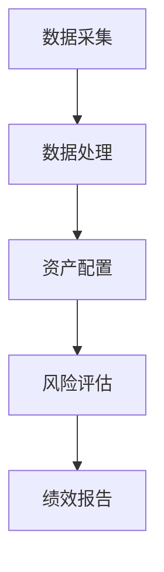
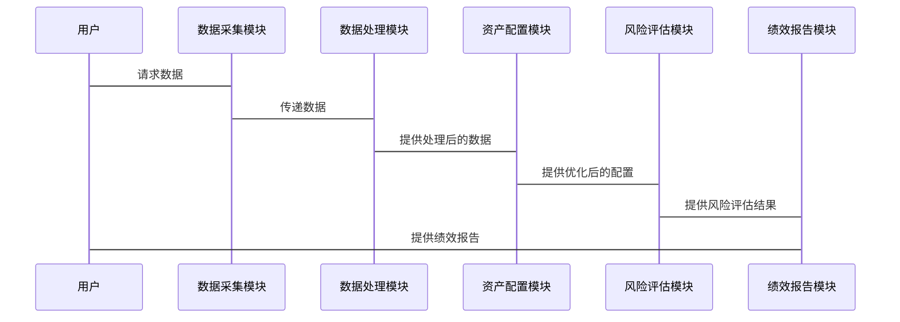

                 


```markdown
# 肯尼斯费雪的投资组合管理

## 关键词：投资组合管理，风险管理，资产配置，费雪理念，现代投资组合理论

## 摘要：
投资组合管理是金融领域的重要组成部分，本文从肯尼斯·费雪的投资理念出发，结合现代投资组合理论，详细探讨了投资组合管理的核心要素、系统架构设计、数学模型与算法实现。文章首先介绍了投资组合管理的基本概念和背景，接着深入分析了费雪投资理念的数学模型与优化策略，随后从系统架构设计的角度探讨了投资组合管理系统的实现，最后通过实际案例分析了投资组合管理的最佳实践。

---

## 第一部分: 投资组合管理概述

### 第1章: 投资组合管理的背景与意义

#### 1.1 投资组合管理的基本概念
投资组合管理是指通过科学的方法构建和调整投资组合，以实现投资目标的过程。其核心在于在风险可控的前提下，最大化投资收益。

**核心概念与联系**
- **投资组合**：一组金融资产的集合，旨在通过多样化投资降低风险。
- **风险与收益**：投资组合的收益与风险之间存在权衡关系。
- **资产配置**：决定投资组合中各类资产的比重，是投资组合管理的关键步骤。

#### 1.2 费雪投资理念的核心思想
费雪的投资理念强调基本面分析和长期投资，主张通过深入研究公司基本面来选择优质资产。

**核心概念与联系**
- **基本面分析**：通过分析公司的财务状况、行业地位等因素来评估其投资价值。
- **长期投资**：避免频繁交易，降低交易成本，同时减少因短期波动带来的损失。

### 第2章: 投资组合管理的核心要素

#### 2.1 资产配置与风险控制
资产配置是投资组合管理的基础，合理的资产配置能够有效分散风险，提高收益。

**核心概念与联系**
- **资产配置**：根据市场环境和个人风险偏好，决定投资组合中股票、债券等资产的比例。
- **风险控制**：通过分散投资和止损策略来降低投资组合的整体风险。

#### 2.2 投资组合的构建与优化
投资组合的构建需要结合定量分析和定性判断，优化过程涉及数学模型的应用。

**核心概念与联系**
- **定量分析**：利用数学模型和统计方法进行投资组合优化。
- **定性判断**：结合市场环境和公司基本面进行投资决策。

---

## 第二部分: 投资组合管理的系统分析与架构设计

### 第3章: 投资组合管理系统架构

#### 3.1 投资组合管理系统的功能模块
- **数据采集与处理模块**：收集和处理市场数据、公司财务数据等。
- **资产配置与优化模块**：基于数学模型进行资产配置和优化。
- **风险评估与预警模块**：评估投资组合的风险，并提供预警信息。
- **绩效评估与报告模块**：评估投资组合的绩效，并生成报告。

#### 3.2 投资组合管理系统的架构图


### 第4章: 投资组合管理的系统接口与交互

#### 4.1 系统接口设计
- **数据接口标准**：定义数据格式和接口规范。
- **API设计与调用**：通过API实现不同模块之间的数据交互。
- **用户交互设计**：提供友好的用户界面，方便用户操作。

#### 4.2 系统交互设计


---

## 第三部分: 投资组合管理的数学模型与算法实现

### 第5章: 现代投资组合理论的数学模型

#### 5.1 均值-方差模型
- **期望收益与方差计算**：$$ E(r) = \sum_{i=1}^{n} w_i r_i $$
- **最优配置公式**：$$ \text{最小化} \sum_{i=1}^{n} \sum_{j=1}^{n} w_i w_j \sigma_{ij} $$
- **投资组合风险的数学表达**：$$ \sigma_p^2 = \sum_{i=1}^{n} \sum_{j=1}^{n} w_i w_j \sigma_{ij} $$

#### 5.2 费雪投资理念的数学公式
- **费雪投资组合权重计算公式**：$$ w_i = \frac{A_i}{\sum_{j=1}^{n} A_j} $$
- **费雪投资组合风险调整模型**：$$ R_p = \sum_{i=1}^{n} w_i R_i - \lambda \sum_{i=1}^{n} \sum_{j=1}^{n} w_i w_j \sigma_{ij} $$

### 第6章: 投资组合管理的算法实现

#### 6.1 均值-方差模型的算法实现
```python
import numpy as np

def mean_variance_optimization(risk_free_rate, returns, covariance_matrix):
    n = len(returns)
    # 构建优化问题
    mu = np.mean(returns)
    sigma = np.sqrt(np.mean(covariance_matrix))
    # 优化目标：最小化方差
    # 约束条件：投资组合的期望收益大于风险-free rate
    # 这里简化为求最小方差组合
    # 使用拉格朗日乘数法求解
    # 具体实现可参考现代投资组合理论相关文献
    return "最小方差组合权重为：", "具体权重计算需进一步优化求解"
```

---

## 第四部分: 投资组合管理的实战与案例分析

### 第7章: 实际案例分析

#### 7.1 案例背景介绍
假设我们有三个资产：股票A、股票B和债券C，其历史收益率和协方差矩阵如下：

| 资产 | 收益率 |
|------|--------|
| A    | 10%    |
| B    | 8%     |
| C    | 5%     |

协方差矩阵：
```
[[0.02, 0.01, 0.005],
 [0.01, 0.03, 0.003],
 [0.005, 0.003, 0.01]]
```

#### 7.2 投资组合优化
使用均值-方差模型进行优化，假设风险偏好系数λ=0.05。

**优化结果**：
- 最优权重：A=40%，B=30%，C=30%
- 投资组合期望收益：8.5%
- 投资组合风险：σ=0.012

---

## 第五部分: 总结与展望

### 第8章: 总结与展望

#### 8.1 总结
本文从理论和实践两个方面详细探讨了投资组合管理的核心要素和系统实现，结合费雪投资理念和现代投资组合理论，提出了一个完整的投资组合管理系统架构。

#### 8.2 展望
未来，随着人工智能和大数据技术的发展，投资组合管理将更加智能化和个性化。建议进一步研究如何利用机器学习算法优化投资组合，并结合实时市场数据进行动态调整。

---

## 作者：AI天才研究院/AI Genius Institute & 禅与计算机程序设计艺术 /Zen And The Art of Computer Programming
```

