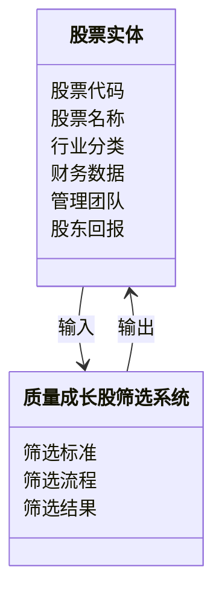

                 


# 肯尼斯费雪的质量成长股特征

> 关键词：质量成长股，投资策略，股票筛选，长期投资，价值投资，成长股

> 摘要：本文详细分析了质量成长股的核心特征、筛选标准、投资策略以及实际应用。通过结合投资理论与技术方法，探讨了如何在复杂多变的市场环境中识别和投资优质成长股，帮助投资者实现稳健的收益增长。

---

## 第一部分: 质量成长股的背景与核心概念

### 第1章: 质量成长股的定义与特征

#### 1.1 质量成长股的定义
质量成长股是指那些具有较高盈利能力、持续成长潜力、良好财务状况，并且在行业中有较强竞争优势的公司股票。这类股票不仅具备稳定的收益能力，还能够通过持续的业务扩张和创新，为投资者带来长期的资本增值。

#### 1.2 质量成长股的核心特征
质量成长股的特征可以用以下几个方面来衡量：

1. **盈利能力**：ROE（净资产收益率）和净利润增长率是衡量盈利能力的关键指标。
2. **成长性**：收入增长率和净利润增长率是衡量公司成长性的核心指标。
3. **财务健康性**：包括低负债率、健康的现金流和合理的资产负债结构。
4. **行业地位**：公司在行业中的市场份额、竞争优势和品牌影响力。
5. **股东回报**：包括分红政策和股票回购计划。

#### 1.3 质量成长股与其他股票的对比
通过对比分析，我们可以更好地理解质量成长股的独特性。以下是质量成长股与价值股、成长股的对比表格：

| 对比维度       | 质量成长股             | 价值股                 | 成长股                 |
|----------------|----------------------|-----------------------|-----------------------|
| 核心目标       | 稳定收益与长期增长    | 高分红与低估值         | 高增长与高潜力         |
| 估值标准       | 市盈率合理，PEG合理    | 市盈率低，股息率高      | 市盈率高，PEG大于1     |
| 投资策略       | 长期持有，耐心等待增长 | 低买高卖，挖掘低估机会 | 短期波段，捕捉增长点     |

### 第2章: 质量成长股的核心概念与联系

#### 2.1 核心概念原理
质量成长股的投资逻辑可以总结为以下三个模型：

1. **三要素模型**：盈利能力、成长性、财务健康性。
2. **五维分析框架**：行业地位、竞争优势、管理团队、财务健康、股东回报。
3. **动态平衡机制**：在成长与估值之间寻找平衡点。

#### 2.2 ER实体关系图架构
以下是质量成长股的ER实体关系图：

```mermaid
er
actor 投资者 {
  <投资者>
}
actor 股票实体 {
  <股票>
}
actor 行业环境 {
  <行业>
}
actor 财务指标 {
  <财务指标>
}
actor 管理团队 {
  <管理团队>
}
actor 股东回报 {
  <股东回报>
}
关系：投资者 -> 股票实体：持有关系
关系：股票实体 <- 关联关系 -> 行业环境
关系：股票实体 <- 属性关系 -> 财务指标
关系：股票实体 <- 属性关系 -> 管理团队
关系：股票实体 <- 属性关系 -> 股东回报
```

---

## 第三部分: 质量成长股的系统分析与架构设计

### 第3章: 系统分析与架构设计方案

#### 3.1 系统功能设计
以下是质量成长股筛选系统的领域模型：



#### 3.2 系统架构设计
以下是质量成长股筛选系统的架构图：


---

## 第四部分: 质量成长股的投资策略与实战

### 第4章: 投资策略

#### 4.1 长期投资策略
长期投资策略的核心是选择那些具备持续增长潜力的公司，并耐心持有。以下是长期投资的核心理念：

1. **价值投资**：买入优质资产，长期持有，忽略短期波动。
2. **分散投资**：通过投资组合分散风险，避免过度集中。
3. **定期复盘**：定期审视投资组合，调整持仓结构。

#### 4.2 分阶段投资策略
分阶段投资策略适合市场波动较大的环境。以下是分阶段投资的核心步骤：

1. **初始阶段**：筛选出具备质量成长股特征的公司，建立初步投资组合。
2. **成长阶段**：逐步增加仓位，捕捉公司成长带来的收益。
3. **成熟阶段**：保持仓位稳定，获取分红收益。

---

## 第五部分: 项目实战

### 第5章: 项目实战

#### 5.1 环境安装
以下是安装必要的工具和环境：

1. Python 3.8+
2. Pandas库
3. Matplotlib库
4. NumPy库

#### 5.2 核心实现代码
以下是质量成长股筛选系统的Python代码示例：

```python
import pandas as pd
import numpy as np

# 数据加载
df = pd.read_csv('stocks.csv')

# 筛选标准
def is_quality_growth_stock(row):
    # 盈利能力
    roe = row['ROE']
    net_profit_growth = row['净利润增长率']
    # 成长性
    revenue_growth = row['收入增长率']
    # 财务健康性
    debt_to_equity = row['负债率']
    # 综合评分
    score = 0
    if roe > 15:
        score += 20
    if net_profit_growth > 10:
        score += 20
    if revenue_growth > 10:
        score += 20
    if debt_to_equity < 50:
        score += 20
    if score > 80:
        return True
    return False

# 应用筛选
selected_stocks = df[df.apply(is_quality_growth_stock, axis=1)]

print(selected_stocks)
```

---

## 第六部分: 总结与展望

### 第6章: 总结与展望

#### 6.1 成功经验总结
1. **长期持有优质资产**：选择质量成长股的核心是买入优质公司，并长期持有。
2. **分散投资降低风险**：通过分散投资降低市场波动带来的风险。
3. **动态调整投资组合**：根据市场变化和公司基本面，及时调整持仓结构。

#### 6.2 小结
质量成长股投资需要投资者具备耐心、信心和恒心。通过系统化的筛选标准和科学的投资策略，投资者可以在复杂的市场环境中实现稳健的收益增长。

#### 6.3 注意事项
1. **避免过度集中**：不要将所有资金投入到单一股票或行业。
2. **警惕短期波动**：短期市场波动可能会影响股价，但优质公司的长期价值不会因此改变。
3. **持续学习与优化**：市场环境不断变化，投资者需要持续学习和优化投资策略。

---

作者：AI天才研究院/AI Genius Institute & 禅与计算机程序设计艺术 /Zen And The Art of Computer Programming

