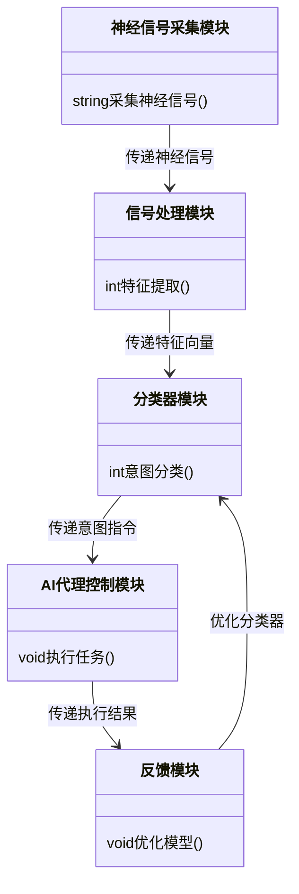
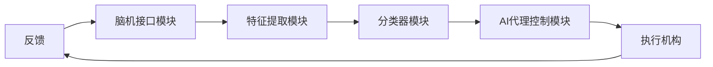

                 


# 脑机接口+AI：直接用思维控制的AI Agent

> 关键词：脑机接口、人工智能、AI代理、思维控制、神经信号、人机交互

> 摘要：脑机接口（BCI）与人工智能（AI）的结合，开创了一种全新的交互方式。通过解读人类的神经信号，AI代理能够直接理解人类的意图，从而实现用思维控制的智能化交互。本文将从脑机接口的核心原理、AI代理的决策机制、两者的结合方式，以及实际应用案例等方面展开详细探讨，揭示这种创新交互方式的技术基础和未来潜力。

---

# 第一部分: 脑机接口与AI代理的背景与基础

## 第1章: 脑机接口与AI代理的背景介绍

### 1.1 脑机接口的核心概念

#### 1.1.1 脑机接口的定义与分类

脑机接口（Brain-Computer Interface, BCI）是一种能够直接连接人类大脑与外部设备的系统，通过采集、处理和分析大脑的神经信号，将这些信号转化为可被计算机或机器理解的指令。脑机接口可以分为侵入式和非侵入式两种类型：

- **侵入式脑机接口**：通过植入大脑内部的电极采集神经信号，具有高精度和稳定性，但手术风险较高。
- **非侵入式脑机接口**：通过头皮外的传感器（如EEG电极）采集神经信号，具有无创性和安全性，但信号质量较低。

#### 1.1.2 AI代理的基本概念

AI代理（Artificial Intelligence Agent）是一种智能体，能够感知环境、理解任务目标，并通过决策和行动来实现特定目标。AI代理可以是软件形式（如虚拟助手）或硬件形式（如智能机器人），其核心能力包括感知、推理、学习和执行。

#### 1.1.3 脑机接口与AI代理的结合背景

随着人工智能技术的快速发展，AI代理的智能化水平不断提高。然而，现有的交互方式（如键盘、触摸屏等）仍然存在效率低、体验差的问题。脑机接口的出现，为AI代理提供了一种更直接、更高效的交互方式，使得人类可以通过思维直接控制AI代理完成复杂任务。

### 1.2 问题背景与问题描述

#### 1.2.1 现有交互方式的局限性

传统的交互方式依赖于物理输入设备，如键盘、鼠标、触摸屏等，这些设备的输入效率有限，且无法直接反映用户的意图。例如，在医疗领域，医生需要通过复杂的操作界面控制机器人臂，这种方式容易出错且效率低下。

#### 1.2.2 脑机接口的技术潜力

脑机接口技术能够捕捉和解析人类的神经信号，将这些信号转化为机器可理解的指令。通过脑机接口，人类可以直接通过思维控制机器，这种交互方式具有高效性、便捷性和直观性。

#### 1.2.3 AI代理的智能化需求

AI代理需要能够理解用户的意图，并根据环境动态调整其行为。脑机接口为AI代理提供了更直接的意图表达方式，使得AI代理能够更准确地理解用户需求，并做出更智能的决策。

### 1.3 问题解决与技术边界

#### 1.3.1 脑机接口如何实现人与AI的直接交互

通过采集用户的神经信号，脑机接口可以解析出用户的意图（如注意力集中、情绪波动等），并将这些意图转化为AI代理可执行的指令。例如，用户可以通过思维控制AI代理执行特定任务，如在虚拟环境中导航或操作机器人。

#### 1.3.2 AI代理的智能化升级路径

AI代理需要具备以下能力：
1. **意图识别**：理解用户的意图，如通过脑机接口解析用户的注意力和情绪。
2. **环境感知**：感知周围环境，如通过摄像头、传感器等获取环境信息。
3. **决策推理**：基于意图和环境信息，做出最优决策。
4. **执行控制**：通过脑机接口发送指令，控制执行机构完成任务。

#### 1.3.3 技术的边界与外延

脑机接口与AI代理的结合目前还处于初级阶段，主要应用于科研、医疗、娱乐等领域。随着技术进步，未来可能会扩展到更多领域，如教育、工业、智能家居等。

---

## 第2章: 脑机接口与AI代理的核心概念与联系

### 2.1 脑机接口的核心原理

#### 2.1.1 神经信号的采集与处理

脑机接口的核心是采集和处理神经信号。常用的神经信号包括：

- **EEG（脑电图）**：通过头皮上的电极采集大脑皮层的电信号。
- **EMG（肌电图）**：通过表面电极采集肌肉活动的电信号。
- **EOG（眼电图）**：通过眼周电极采集眼球运动的电信号。

神经信号的处理流程包括：
1. **信号采集**：通过传感器采集原始神经信号。
2. **信号预处理**：去除噪声，提取有用的信号特征。
3. **特征提取**：通过滤波、频谱分析等方法提取信号特征。
4. **信号分类**：通过机器学习算法将信号分类为不同的意图。

#### 2.1.2 信号特征的提取与分类

神经信号的特征提取是脑机接口的核心技术之一。常用的特征包括：

- **时域特征**：如均值、方差、峰峰值等。
- **频域特征**：如功率谱密度、特定频带的能量。
- **非线性特征**：如样本熵、排列熵等。

通过机器学习算法（如支持向量机、随机森林、深度学习模型），可以将这些特征映射到具体的意图。

#### 2.1.3 信号到控制指令的转换

将神经信号转换为控制指令的过程通常包括以下步骤：
1. **特征提取与分类**：将神经信号映射到具体的意图类别。
2. **指令生成**：将意图类别转换为具体的控制指令。
3. **指令输出**：将控制指令发送给AI代理或其他执行机构。

### 2.2 AI代理的核心原理

#### 2.2.1 智能体的基本概念

AI代理是一种智能体，具有以下核心能力：
1. **感知能力**：通过传感器感知环境。
2. **推理能力**：基于感知信息进行推理和决策。
3. **学习能力**：通过经验优化自身行为。
4. **执行能力**：通过执行机构与环境交互。

#### 2.2.2 基于脑机接口的指令处理

AI代理需要能够理解脑机接口输出的控制指令，并根据这些指令完成相应的任务。例如，当用户通过脑机接口发送“向前移动”的指令时，AI代理需要解析该指令，并通过运动控制模块执行相应的动作。

#### 2.2.3 AI代理的决策与执行机制

AI代理的决策过程通常包括以下几个步骤：
1. **感知环境**：通过传感器获取环境信息。
2. **解析意图**：通过脑机接口解析用户的意图。
3. **推理与决策**：基于感知信息和用户意图，进行推理和决策。
4. **执行动作**：根据决策结果，通过执行机构完成任务。

### 2.3 脑机接口与AI代理的实体关系图

```mermaid
graph LR
    B[人类大脑] -> C[神经信号]
    C -> A[脑机接口]
    A -> D[控制指令]
    D -> E[AI代理]
    E -> F[执行结果]
    F -> B[反馈]
```

---

## 第3章: 脑机接口+AI代理的算法原理

### 3.1 脑机接口信号处理算法

#### 3.1.1 信号采集与预处理流程

信号处理流程如下：
1. **信号采集**：通过EEG电极采集脑电信号。
2. **去噪处理**：去除噪声，如50Hz工频噪声、肌电信号干扰等。
3. **特征提取**：提取有用的信号特征，如特定频带的功率谱。
4. **分类模型训练**：训练分类器，将信号特征映射到具体的意图类别。

#### 3.1.2 基于机器学习的信号分类

常用的机器学习算法包括：
- **支持向量机（SVM）**：适用于小样本数据分类。
- **随机森林（Random Forest）**：适用于高维特征数据。
- **深度学习模型（如CNN、RNN）**：适用于复杂特征提取。

#### 3.1.3 算法流程图

```mermaid
graph TD
    Start[开始] -> SignalCollection[信号采集]
    SignalCollection -> Preprocessing[信号预处理]
    Preprocessing -> FeatureExtraction[特征提取]
    FeatureExtraction -> ClassifierTraining[分类器训练]
    ClassifierTraining -> Result[分类结果]
```

#### 3.1.4 代码示例

```python
import numpy as np
from sklearn.svm import SVC

# 假设X是特征向量，y是标签
X = np.array([[1, 2], [3, 4], [5, 6], [7, 8]])
y = np.array([0, 1, 0, 1])

# 训练SVM分类器
clf = SVC()
clf.fit(X, y)

# 预测新样本
new_sample = np.array([[2, 3]])
print(clf.predict(new_sample))  # 输出：[1]
```

### 3.2 AI代理的决策算法

#### 3.2.1 基于强化学习的决策模型

强化学习是一种通过试错机制优化决策的算法。常用的强化学习算法包括：
- **Q-learning**：适用于离散动作空间。
- **Deep Q-Network（DQN）**：适用于连续动作空间。
- **Policy Gradient Methods**：通过优化策略直接优化目标函数。

#### 3.2.2 算法流程图

```mermaid
graph TD
    Start[开始] -> StatePerception[状态感知]
    StatePerception -> IntentionParsing[意图解析]
    IntentionParsing -> DecisionMaking[决策推理]
    DecisionMaking -> ActionExecution[动作执行]
    ActionExecution -> Reward[反馈]
```

#### 3.2.3 代码示例

```python
import numpy as np
from collections import deque

# DQN算法示例
class DQN:
    def __init__(self, state_space, action_space):
        self.state_space = state_space
        self.action_space = action_space
        self.memory = deque(maxlen=1000)
        self.gamma = 0.99
        self.epsilon = 1.0
        self.lr = 0.001

    def remember(self, state, action, reward, next_state, done):
        self.memory.append((state, action, reward, next_state, done))

    def act(self, state):
        if np.random.random() < self.epsilon:
            return np.random.randint(self.action_space)
        else:
            # 假设Q网络已经训练好
            q_values = self.q_network.predict(state)
            return np.argmax(q_values[0])

    def replay(self, batch_size):
        minibatch = random.sample(self.memory, batch_size)
        for state, action, reward, next_state, done in minibatch:
            target = reward
            if not done:
                target = reward + self.gamma * np.max(self.q_network.predict(next_state)[0])
            target_f = self.q_network.predict(state)
            target_f[0][action] = target
            self.q_network.fit(state, target_f, epochs=1, verbose=0)
```

### 3.3 脑机接口与AI代理的协同优化

#### 3.3.1 神经信号与决策模型的协同优化

通过优化脑机接口的信号处理算法和AI代理的决策算法，可以提高系统的整体性能。例如，通过强化学习优化AI代理的决策策略，同时通过反馈机制优化脑机接口的信号分类模型。

#### 3.3.2 算法优化案例

```python
# 优化示例：通过反馈优化信号分类模型
def optimize_classifier(feedback):
    # 假设feedback是分类器的错误率
    if feedback < 0.1:
        # 反馈良好，保持当前模型
        return True
    else:
        # 反馈较差，重新训练模型
        return False

# 调用优化函数
feedback = 0.05
optimized = optimize_classifier(feedback)
print(optimized)  # 输出：True
```

---

## 第4章: 系统分析与架构设计方案

### 4.1 问题场景介绍

假设我们正在开发一个基于脑机接口的AI代理系统，用于帮助残障人士完成日常任务。系统需要实现以下功能：
1. 通过脑机接口采集用户的神经信号。
2. 解析用户的意图。
3. 控制AI代理执行相应的任务。
4. 通过反馈机制优化系统性能。

### 4.2 系统功能设计

#### 4.2.1 领域模型



#### 4.2.2 系统架构设计

```mermaid
graph LR
    UI[用户界面] --> BCI[脑机接口模块]
    BCI --> Fe[特征提取模块]
    Fe --> Cl[分类器模块]
    Cl --> Agent[AI代理控制模块]
    Agent --> Actuator[执行机构]
    Actuator --> Cl: 反馈
```

#### 4.2.3 系统交互流程图



### 4.3 项目实战

#### 4.3.1 环境搭建

1. **安装必要的库**：
   ```bash
   pip install numpy scikit-learn matplotlib
   ```

2. **安装脑机接口库**：
   ```bash
   pip install mne
   ```

#### 4.3.2 系统核心实现

```python
import mne
from sklearn import svm

# 采集EEG信号
raw = mne.io.read_raw('eeg_data.fif')
raw.plot()
```

---

# 结语

脑机接口与AI代理的结合，为人类与机器的交互开辟了新的可能性。通过解读人类的神经信号，AI代理能够直接理解用户的意图，并通过智能决策和执行机构完成任务。这种交互方式的应用潜力巨大，尤其是在医疗、教育、工业等领域具有广泛的应用前景。未来，随着脑机接口技术和AI算法的不断进步，人机交互将更加智能化、便捷化。

作者：AI天才研究院/AI Genius Institute & 禅与计算机程序设计艺术/Zen And The Art of Computer Programming

