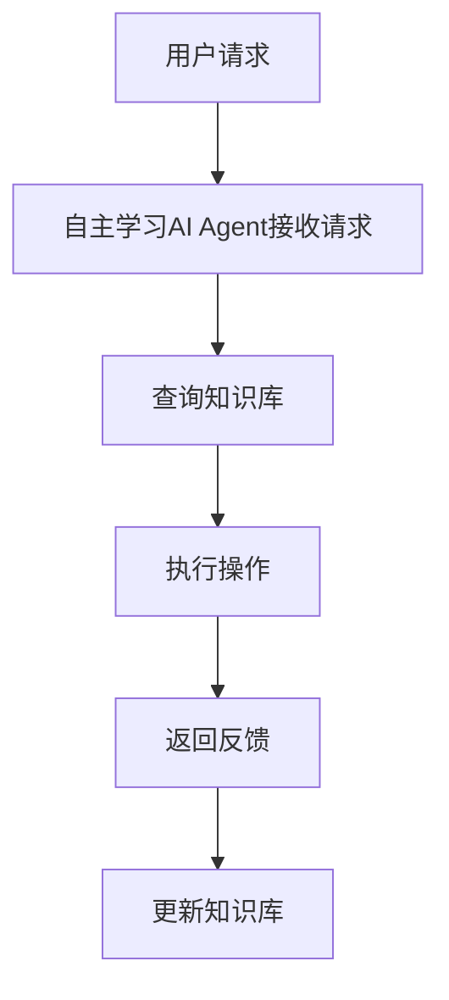
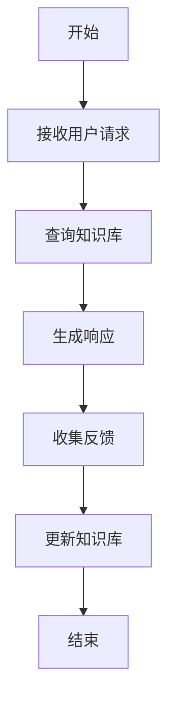
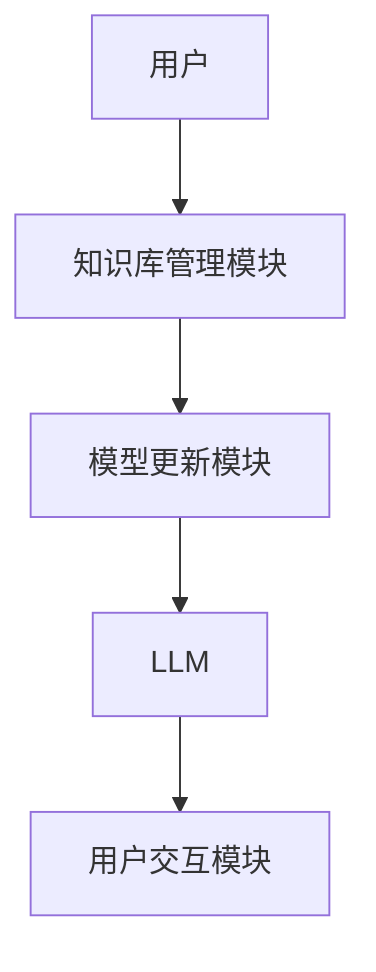

                 


# 自主学习AI Agent：LLM驱动的终身学习系统

**关键词：** 自主学习AI Agent，LLM，终身学习，人工智能，系统架构，算法原理

**摘要：**  
本文深入探讨了自主学习AI Agent的构建与实现，重点分析了基于大语言模型（LLM）的终身学习系统。从概念解析到算法实现，从系统架构到项目实战，系统性地阐述了自主学习AI Agent的核心原理、技术实现与实际应用。通过详细的技术分析和代码示例，本文为读者提供了一套完整的自主学习AI Agent构建方案，帮助读者全面理解并掌握相关技术。

---

# 第一部分：自主学习AI Agent的背景与概念

# 第1章：自主学习AI Agent的背景与概念

## 1.1 自主学习AI Agent的定义与特点
### 1.1.1 自主学习AI Agent的定义
自主学习AI Agent（Autonomous Learning AI Agent）是一种能够通过与环境交互和自我学习，逐步提升自身能力的智能系统。它不同于传统的被动接收指令的AI系统，具备自我决策、自我学习和自适应的能力。

### 1.1.2 自主学习AI Agent的核心特点
- **自主性**：无需外部干预，能够自主决策和行动。
- **智能性**：具备问题解决、知识学习和推理能力。
- **自适应性**：能够根据环境反馈不断优化自身行为和知识储备。
- **终身学习**：系统能够持续学习新知识，适应不断变化的环境。

### 1.1.3 自主学习AI Agent与传统AI的区别
| 特性               | 自主学习AI Agent                     | 传统AI系统                       |
|--------------------|--------------------------------------|---------------------------------|
| 决策能力           | 高度自主，具备决策能力               | 依赖预设规则，缺乏自主性         |
| 学习能力           | 具备终身学习能力                     | 依赖外部数据输入，无法自我优化   |
| 环境适应能力       | 能够自适应环境变化                     | 需要人工重新训练或调整             |
| 应用场景           | 适用于复杂、动态的环境               | 适用于简单、静态的任务           |

---

## 1.2 LLM驱动的终身学习系统
### 1.2.1 大语言模型（LLM）的概述
大语言模型（Large Language Model, LLM）是一种基于深度学习的自然语言处理模型，具有强大的文本理解和生成能力。LLM的核心是其庞大的参数量和复杂的模型结构，使其能够捕捉到语言中的复杂模式。

### 1.2.2 终身学习系统的定义与目标
终身学习系统是指能够持续从新数据中学习并适应变化的系统。其目标是通过不断优化模型参数和知识库，提升系统的性能和准确性。

### 1.2.3 LLM在终身学习系统中的作用
- **知识表示**：LLM能够将知识以语言形式表示，便于系统理解和应用。
- **动态更新**：通过增量学习，LLM能够不断更新其知识库，适应新任务。
- **多任务处理**：LLM的通用性使其能够处理多种任务，提升系统的灵活性。

---

## 1.3 自主学习AI Agent的应用场景
### 1.3.1 教育领域中的应用
自主学习AI Agent可以在教育领域中作为智能辅导系统，为学生提供个性化的学习建议和指导。

### 1.3.2 企业智能化管理中的应用
在企业中，自主学习AI Agent可以作为智能助手，帮助管理人员进行决策支持和流程优化。

### 1.3.3 个人助手与智能服务中的应用
自主学习AI Agent可以作为个人助手，提供日程管理、信息检索、任务提醒等服务。

---

## 1.4 本章小结
本章从自主学习AI Agent的定义、特点出发，分析了其与传统AI的区别，并探讨了LLM在终身学习系统中的作用。通过应用场景的介绍，读者可以更好地理解自主学习AI Agent的实际价值。

---

# 第2章：自主学习AI Agent的核心概念与联系

## 2.1 自主学习AI Agent的核心概念
### 2.1.1 自主性与智能性
自主性是自主学习AI Agent的核心特征，它使系统能够独立决策和行动。智能性则体现在系统具备问题解决和知识学习的能力。

### 2.1.2 终身学习与自适应能力
终身学习使系统能够持续更新知识库，而自适应能力则使系统能够在不同环境中灵活应对。

### 2.1.3 LLM与知识表示
LLM通过语言模型的形式表示知识，使其能够被系统理解和应用。

---

## 2.2 核心概念的对比分析
### 2.2.1 自主学习与监督学习的对比
| 特性               | 自主学习                     | 监督学习                     |
|--------------------|------------------------------|------------------------------|
| 数据依赖           | 依赖环境反馈                 | 依赖标注数据                 |
| 学习目标           | 提升自主决策能力             | 优化模型预测能力             |
| 应用场景           | 复杂、动态的环境               | 简单、静态的任务             |

### 2.2.2 LLM与其他NLP模型的对比
| 特性               | LLM                          | 传统NLP模型                  |
|--------------------|-------------------------------|------------------------------|
| 参数规模           | 大型或超大型（如GPT-3）       | 较小规模                     |
| 多任务能力         | 具备较强的多任务处理能力     | 通常专注于单一任务           |
| 自然语言理解能力   | 强大                         | 较弱                         |

### 2.2.3 终身学习系统与其他自适应系统的对比
| 特性               | 终身学习系统                 | 其他自适应系统               |
|--------------------|------------------------------|------------------------------|
| 学习机制           | 增量学习                     | 批量学习                     |
| 知识更新           | 动态更新                     | 定期重新训练                 |
| 应用场景           | 动态变化的环境               | 静态或变化较慢的环境         |

---

## 2.3 实体关系图与流程图
### 2.3.1 自主学习AI Agent的实体关系图（ER图）
```mermaid
er
  actor: 用户
  agent: 自主学习AI Agent
  knowledge_base: 知识库
  action: 行动/操作
  feedback: 反馈

  actor --> agent: 发出请求
  agent --> knowledge_base: 查询知识
  agent --> action: 执行操作
  action --> feedback: 返回反馈
  agent --> feedback: 更新知识库
```

### 2.3.2 自主学习AI Agent的流程图


---

## 2.4 本章小结
本章通过对比分析和实体关系图，详细阐述了自主学习AI Agent的核心概念及其与其他技术的区别，为后续的算法实现和系统设计奠定了基础。

---

# 第3章：自主学习AI Agent的算法原理

## 3.1 基于LLM的自适应学习算法
### 3.1.1 算法概述
基于LLM的自适应学习算法通过不断优化模型参数和知识库，实现系统的自我改进和能力提升。

### 3.1.2 算法流程


### 3.1.3 算法的数学模型
$$P(\text{输出} | \text{输入}) = \text{模型参数} \times \text{输入特征}$$

---

## 3.2 LLM驱动的终身学习算法
### 3.2.1 终身学习的基本原理
终身学习算法通过增量学习，逐步更新模型参数，以适应新数据和任务。

### 3.2.2 增量学习的实现方法
增量学习的实现步骤如下：
1. 接收新数据。
2. 更新模型参数。
3. 验证模型性能。
4. 重复上述步骤，直到达到目标。

### 3.2.3 知识蒸馏与模型更新
知识蒸馏是一种通过教师模型指导学生模型学习的技术。在模型更新过程中，通过蒸馏技术，可以有效提升模型的泛化能力。

---

## 3.3 算法实现的代码示例
### 3.3.1 基于LLM的自适应学习算法
```python
def adaptive_learning_algorithm(input_data, knowledge_base):
    # 查询知识库
    knowledge = knowledge_base.query(input_data)
    # 生成响应
    response = model.generate_response(input_data, knowledge)
    # 收集反馈
    feedback = get_feedback(input_data, response)
    # 更新知识库
    knowledge_base.update(knowledge, feedback)
    return response
```

### 3.3.2 终身学习算法的实现
```python
def lifelong_learning_algorithm():
    while True:
        # 接收新数据
        new_data = receive_data()
        # 更新模型参数
        model.update_parameters(new_data)
        # 验证模型性能
        performance = evaluate_model()
        if performance >= threshold:
            break
```

---

## 3.4 本章小结
本章详细介绍了自主学习AI Agent的算法原理，包括基于LLM的自适应学习算法和终身学习算法的实现方法。通过代码示例和数学模型的分析，读者可以更好地理解算法的实现细节。

---

# 第4章：自主学习AI Agent的系统架构设计

## 4.1 系统功能设计
### 4.1.1 知识库管理模块
知识库管理模块负责存储和管理系统的知识库，支持增量学习和知识蒸馏。

### 4.1.2 模型更新模块
模型更新模块负责根据反馈更新模型参数，确保系统的性能不断提升。

### 4.1.3 用户交互模块
用户交互模块负责接收用户的请求和反馈，支持多种交互方式。

---

## 4.2 系统架构设计
### 4.2.1 系统架构图


### 4.2.2 系统接口设计
- **输入接口**：接收用户的请求和反馈。
- **输出接口**：生成响应并返回给用户。
- **知识库接口**：与知识库管理模块交互，支持查询和更新。

---

## 4.3 本章小结
本章从系统架构的角度，详细分析了自主学习AI Agent的功能模块和架构设计，为系统的实现提供了理论基础。

---

# 第5章：自主学习AI Agent的项目实战

## 5.1 项目环境安装
### 5.1.1 安装Python
```bash
python --version
pip install --upgrade pip
```

### 5.1.2 安装必要的库
```bash
pip install numpy
pip install transformers
pip install torch
```

---

## 5.2 系统核心实现
### 5.2.1 知识库管理模块的实现
```python
class KnowledgeBase:
    def __init__(self):
        self.knowledge = {}

    def query(self, input_data):
        return self.knowledge.get(input_data, "")

    def update(self, input_data, feedback):
        self.knowledge[input_data] = feedback
```

### 5.2.2 模型更新模块的实现
```python
class ModelUpdater:
    def __init__(self):
        self.model = ...

    def update_parameters(self, new_data):
        # 更新模型参数
        pass

    def evaluate(self):
        # 评估模型性能
        pass
```

---

## 5.3 实际案例分析
### 5.3.1 案例背景
假设我们正在开发一个智能客服系统，目标是通过自主学习AI Agent提升客户服务质量。

### 5.3.2 案例实现
```python
# 初始化知识库
knowledge_base = KnowledgeBase()

# 接收用户请求
user_request = "如何退款？"
response = adaptive_learning_algorithm(user_request, knowledge_base)
print(response)
```

### 5.3.3 案例分析
通过案例分析，我们可以看到自主学习AI Agent在实际应用中的优势，包括快速响应和持续优化。

---

## 5.4 本章小结
本章通过项目实战，详细介绍了自主学习AI Agent的实现过程，包括环境安装、核心模块实现和实际案例分析。

---

# 第6章：自主学习AI Agent的最佳实践

## 6.1 技术选型建议
- **模型选择**：选择适合任务的LLM模型。
- **数据处理**：确保数据质量和多样性。
- **系统优化**：优化模型性能和系统架构。

## 6.2 开发注意事项
- **代码规范**：遵循行业规范，确保代码可读性。
- **测试与验证**：进行全面的测试，确保系统的稳定性和可靠性。

## 6.3 拓展阅读
- 建议读者进一步阅读相关领域的最新论文和技术文档，以深入了解自主学习AI Agent的前沿技术。

---

# 第7章：总结与展望

## 7.1 本章总结
本文从理论到实践，系统性地阐述了自主学习AI Agent的构建与实现，详细分析了其算法原理和系统架构。

## 7.2 未来展望
随着人工智能技术的不断发展，自主学习AI Agent将在更多领域得到应用，未来的研究方向包括更高效的增量学习算法和更智能的知识表示方法。

---

**作者：AI天才研究院/AI Genius Institute & 禅与计算机程序设计艺术 /Zen And The Art of Computer Programming**

