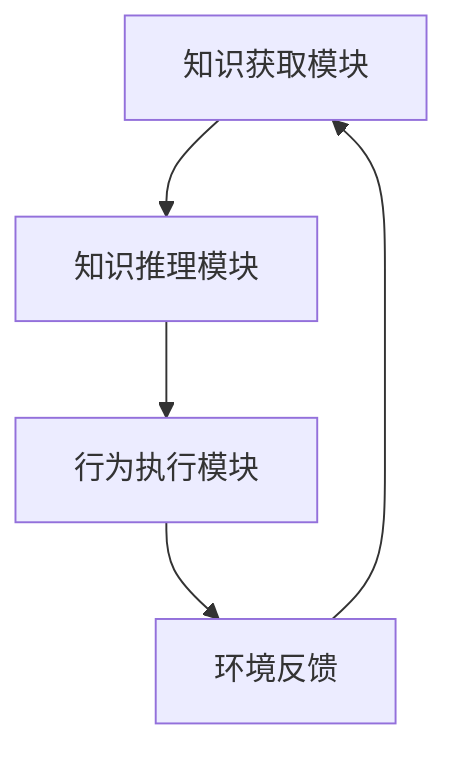
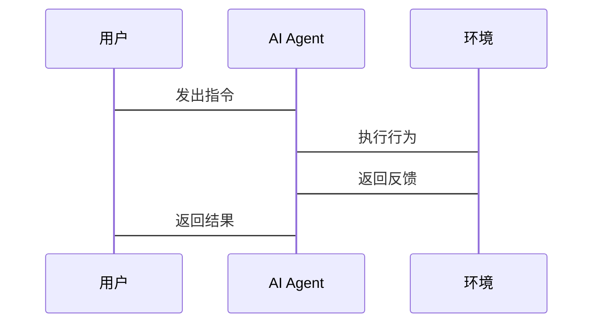

                 


# 自主学习型 AI Agent：利用 LLM 实现持续进化

> 关键词：大语言模型、AI Agent、自主学习、持续进化、机器学习、知识表示、强化学习

> 摘要：本文探讨了自主学习型 AI Agent 的概念、实现机制及其与大语言模型（LLM）的结合。通过分析自主学习的核心原理、算法实现、系统架构和实际案例，本文详细阐述了如何利用 LLM 实现 AI Agent 的持续进化，并对未来的发展方向进行了展望。

---

# 第1章 自主学习型 AI Agent 的概念与背景

## 1.1 AI Agent 的定义与特点

### 1.1.1 AI Agent 的定义
AI Agent（人工智能代理）是一种能够感知环境、做出决策并采取行动的智能实体。它可以是一个软件程序、机器人或其他形式的智能系统，其核心目标是通过与环境的交互来实现特定任务。

### 1.1.2 AI Agent 的核心特点
1. **自主性**：AI Agent 可以自主决策，无需外部干预。
2. **反应性**：能够实时感知环境变化并做出响应。
3. **目标导向**：基于目标驱动行为，优化决策过程。
4. **学习能力**：通过经验或数据改进自身性能。

### 1.1.3 自主学习型 AI Agent 的背景与意义
随着大语言模型（LLM）的快速发展，AI Agent 的自主学习能力成为研究热点。自主学习型 AI Agent 能够通过与环境的交互，不断优化自身知识库和行为策略，从而实现持续进化。

---

## 1.2 自主学习的核心概念

### 1.2.1 自主学习的定义
自主学习是指系统在没有外部监督的情况下，通过与环境的交互，主动探索和发现新知识的过程。与传统的被动学习不同，自主学习强调系统的主动性和创造性。

### 1.2.2 自主学习与传统学习方式的对比

| 对比维度         | 自主学习                     | 传统学习                     |
|------------------|------------------------------|------------------------------|
| 数据来源         | 环境交互生成                | 标签数据集                  |
| 监督方式         | 自动调整策略                | 人工标注或微调              |
| 适应性           | 强，能够应对未知环境          | 弱，依赖已知数据集           |

### 1.2.3 自主学习型 AI Agent 的核心要素
1. **知识表示**：如何有效地存储和表示知识。
2. **推理能力**：基于现有知识进行推理和决策。
3. **学习机制**：通过交互或数据优化自身能力。

---

## 1.3 大语言模型（LLM）与 AI Agent 的结合

### 1.3.1 LLM 的基本概念
大语言模型（LLM）是一种基于深度学习的自然语言处理模型，具有强大的语言理解和生成能力。LLM 的核心是通过大量数据训练出的概率分布模型。

### 1.3.2 LLM 在 AI Agent 中的应用场景
1. **自然语言理解**：通过 LLM 理解用户的输入指令。
2. **知识库构建**：利用 LLM 的生成能力，构建动态知识库。
3. **决策推理**：结合 LLM 的理解能力，优化决策过程。

### 1.3.3 自主学习型 AI Agent 的实现路径
1. **知识获取**：通过环境交互获取新知识。
2. **知识整合**：将新知识整合到知识库中。
3. **行为优化**：通过学习不断优化行为策略。

---

## 1.4 本章小结
本章介绍了 AI Agent 的基本概念、自主学习的核心原理以及 LLM 在 AI Agent 中的应用。通过对比自主学习与传统学习的差异，我们明确了自主学习型 AI Agent 的核心要素和实现路径。

---

# 第2章 大语言模型（LLM）技术原理

## 2.1 大语言模型的定义与特点

### 2.1.1 大语言模型的定义
大语言模型（LLM）是一种基于深度神经网络的自然语言处理模型，能够理解和生成人类语言。其核心是通过大量数据训练出的概率分布模型。

### 2.1.2 大语言模型的核心特点
1. **大规模训练数据**：通常使用数百万级别的文本数据进行训练。
2. **深度神经网络**：通过多层神经网络结构，捕捉语言的复杂性。
3. **概率生成**：基于概率分布生成文本，而非确定性规则。

---

## 2.2 大语言模型的训练原理

### 2.2.1 监督微调（Fine-tuning）
监督微调是通过在特定任务数据上对预训练模型进行进一步训练。例如，我们可以对一个通用的 LLM 进行微调，使其在特定领域（如医疗或法律）上表现更好。

### 2.2.2 强化学习（Reinforcement Learning）
强化学习通过奖励机制优化模型的生成策略。模型在生成文本时，会根据环境反馈调整其生成策略，以最大化奖励。

### 2.2.3 对抗训练（Adversarial Training）
对抗训练通过引入对抗网络，增强模型的鲁棒性。例如，生成器（GAN）和判别器相互博弈，生成更高质量的文本。

---

## 2.3 大语言模型的数学模型

### 2.3.1 概率分布与损失函数
大语言模型的目标是最小化生成文本的损失函数。通常使用交叉熵损失函数：

$$
\text{Loss} = -\sum_{i=1}^{n} \log p(y_i | y_{<i})
$$

其中，$y_i$ 是生成的第 $i$ 个词，$p(y_i | y_{<i})$ 是在给定前 $i-1$ 个词的条件下生成第 $i$ 个词的概率。

### 2.3.2 变量关系与公式推导
假设我们有一个简单的语言模型，其概率分布为：

$$
p(y_1, y_2, ..., y_n) = \prod_{i=1}^{n} p(y_i | y_{<i})
$$

通过对数转换，我们得到：

$$
\log p(y_1, y_2, ..., y_n) = \sum_{i=1}^{n} \log p(y_i | y_{<i})
$$

这就是交叉熵损失函数的推导过程。

---

## 2.4 本章小结
本章详细介绍了大语言模型的定义、训练原理和数学模型。通过监督微调、强化学习和对抗训练等方法，我们可以不断提升 LLM 的性能，使其更好地应用于 AI Agent 的自主学习。

---

# 第3章 自主学习型 AI Agent 的实现机制

## 3.1 自主学习的驱动因素

### 3.1.1 内在动机与外部激励
内在动机是系统本身的驱动力量，例如好奇心和探索欲望。外部激励则是通过环境反馈（如奖励）来驱动行为。

### 3.1.2 目标设定与策略优化
自主学习型 AI Agent 需要设定明确的目标，并通过策略优化不断改进行为。

### 3.1.3 知识表示与推理能力
知识表示是自主学习的基础，而推理能力则是实现目标的关键。

---

## 3.2 自主学习的实现步骤

### 3.2.1 知识获取与存储
AI Agent 通过与环境交互获取知识，并将其存储在知识库中。知识表示可以是符号表示（如 RDF）或向量表示（如 Word2Vec）。

### 3.2.2 状态感知与决策
AI Agent 需要感知当前状态，并基于知识库进行推理，制定决策策略。

### 3.2.3 行为执行与反馈
AI Agent 根据决策策略执行行为，并通过环境反馈不断优化策略。

---

## 3.3 本章小结
本章详细探讨了自主学习的驱动因素和实现步骤。通过知识获取、状态感知和行为执行，AI Agent 可以实现自主学习，并通过反馈不断优化自身性能。

---

# 第4章 自主学习型 AI Agent 的系统架构

## 4.1 系统功能设计

### 4.1.1 知识获取模块
知识获取模块负责从环境中获取新知识，并将其存储在知识库中。

### 4.1.2 知识推理模块
知识推理模块基于知识库进行推理，制定决策策略。

### 4.1.3 行为执行模块
行为执行模块根据决策策略执行具体行为，并收集环境反馈。

---

## 4.2 系统架构设计

### 4.2.1 系统架构图


### 4.2.2 交互流程图


---

## 4.3 本章小结
本章通过系统功能设计和架构图，展示了自主学习型 AI Agent 的整体架构。通过模块化设计，我们可以更好地理解系统的实现过程。

---

# 第5章 项目实战：利用 LLM 实现自主学习型 AI Agent

## 5.1 环境安装与依赖项

```python
# 安装依赖项
pip install transformers torch
```

---

## 5.2 核心实现代码

### 5.2.1 知识获取模块
```python
from transformers import AutoTokenizer, AutoModelForCausalLM
import torch

class Knowledge获取模块:
    def __init__(self, model_name):
        self.tokenizer = AutoTokenizer.from_pretrained(model_name)
        self.model = AutoModelForCausalLM.from_pretrained(model_name)

    def 获取知识(self, prompt):
        inputs = self.tokenizer(prompt, return_tensors="pt")
        outputs = self.model.generate(inputs.input_ids, max_length=100)
        return self.tokenizer.decode(outputs[0], skip_special_tokens=True)
```

### 5.2.2 知识推理模块
```python
class 知识推理模块:
    def 推理(self, 知识库, 目标):
        # 具体推理逻辑根据实际需求实现
        return 推理结果
```

### 5.2.3 行为执行模块
```python
class 行为执行模块:
    def 执行行为(self, 决策策略):
        # 具体执行逻辑根据实际需求实现
        return 执行结果
```

---

## 5.3 项目小结
通过本章的实战，我们详细讲解了如何利用 LLM 实现自主学习型 AI Agent 的核心模块。从环境安装到代码实现，读者可以逐步掌握实现过程。

---

# 第6章 自主学习型 AI Agent 的扩展与应用

## 6.1 技术扩展

### 6.1.1 知识图谱的构建与应用
通过知识图谱构建，可以更高效地管理知识，并提升推理能力。

### 6.1.2 多模态学习
结合视觉、听觉等多种模态信息，可以进一步提升 AI Agent 的感知能力。

---

## 6.2 实际应用案例

### 6.2.1 教育领域
AI Agent 可以作为虚拟助教，为学生提供个性化的学习建议。

### 6.2.2 医疗领域
AI Agent 可以辅助医生进行诊断，提供治疗建议。

---

## 6.3 本章小结
本章探讨了自主学习型 AI Agent 的技术扩展和实际应用案例。通过多模态学习和知识图谱的构建，我们可以进一步提升 AI Agent 的能力。

---

# 第7章 总结与展望

## 7.1 本文章总结
本文详细探讨了自主学习型 AI Agent 的概念、实现机制及其与大语言模型的结合。通过系统架构设计和项目实战，我们展示了如何利用 LLM 实现 AI Agent 的持续进化。

## 7.2 未来展望
随着大语言模型和人工智能技术的不断发展，自主学习型 AI Agent 的应用前景将更加广阔。未来的研究方向包括更高效的自主学习算法、多模态学习以及更强大的知识表示方法。

---

# 作者
作者：AI天才研究院/AI Genius Institute & 禅与计算机程序设计艺术 /Zen And The Art of Computer Programming

