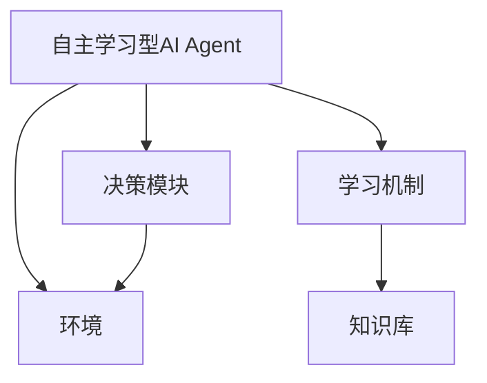
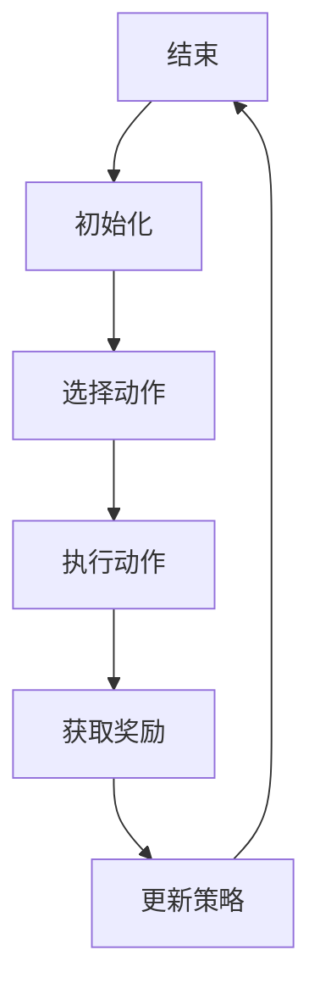
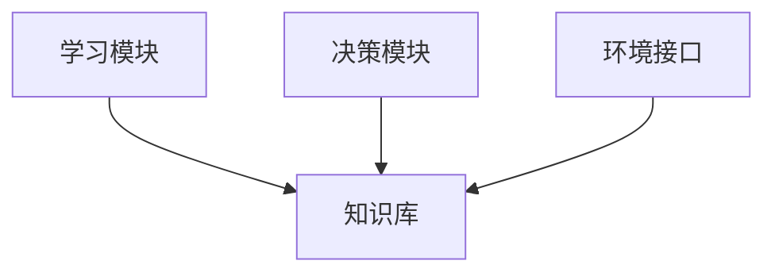
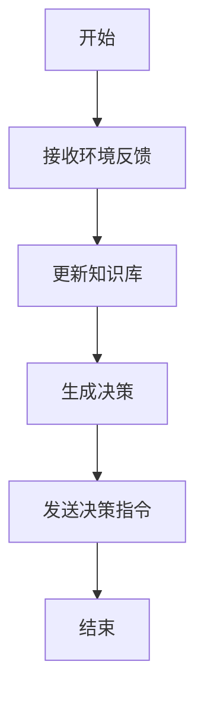

                 


# 自主学习型AI Agent：持续进化的智能体

## 关键词：自主学习型AI Agent，AI Agent，人工智能，强化学习，机器学习，自主决策

## 摘要：  
本文详细探讨了自主学习型AI Agent的定义、核心原理、算法实现、系统架构以及实际应用。通过分析其与传统AI Agent的区别，结合数学模型和实际案例，展示了自主学习型AI Agent在持续进化中的智能体设计与实现方法。

---

## 第一部分：自主学习型AI Agent概述

### 第1章：自主学习型AI Agent的背景与概念

#### 1.1 自主学习型AI Agent的定义  
自主学习型AI Agent是一种能够通过与环境交互，自主发现知识、优化决策并适应新情况的智能体。其核心特征包括：  
- **自主性**：无需外部干预，自主驱动学习和决策。  
- **适应性**：能够根据环境变化调整行为和知识库。  
- **主动性**：主动探索未知领域，而非仅依赖预设规则。  

#### 1.2 自主学习型AI Agent的背景与现状  
人工智能技术的快速发展，使得AI Agent在各个领域得到广泛应用。然而，传统AI Agent依赖预设规则，难以应对复杂动态环境。自主学习型AI Agent通过结合强化学习、无监督学习等技术，能够实现自我优化和持续进化，成为当前研究的热点。

#### 1.3 自主学习型AI Agent的问题描述  
传统AI Agent存在以下问题：  
- 依赖预设规则，缺乏灵活性。  
- 面对未知环境时，决策能力有限。  
- 无法有效处理动态变化的复杂场景。  

自主学习型AI Agent的目标是通过自我学习和进化，解决这些问题，实现更高效、更智能的决策能力。

#### 1.4 自主学习型AI Agent的边界与外延  
- **边界**：自主学习型AI Agent专注于通过与环境交互进行学习，不涉及外部知识库的直接输入。  
- **外延**：其技术可以应用于机器人控制、智能推荐系统、自动驾驶等领域。  

#### 1.5 自主学习型AI Agent的概念结构与核心要素  
- **核心要素**：学习机制、知识表示、决策模块、环境交互。  
- **关系**：通过学习机制获取知识，知识表示用于推理，决策模块基于推理结果与环境交互。

---

## 第二部分：自主学习型AI Agent的核心概念与联系

### 第2章：自主学习型AI Agent的核心原理

#### 2.1 自主学习型AI Agent的核心原理  
自主学习型AI Agent通过以下机制实现进化：  
- **学习机制**：通过强化学习、无监督学习等方法，从环境中获取反馈，优化决策策略。  
- **知识表示**：使用符号逻辑或概率模型表示知识，支持推理与决策。  
- **决策与行动**：基于当前知识和环境反馈，自主生成行动方案。

#### 2.2 自主学习型AI Agent的核心概念对比  
| 对比维度       | 自主学习型AI Agent | 强化学习          | 监督学习          |
|----------------|--------------------|-------------------|-------------------|
| 数据来源       | 环境交互           | 环境反馈          | 标签数据          |
| 决策方式       | 自主决策           | 基于反馈优化      | 基于标签校正      |
| 适应性         | 高                 | 中                 | 低                 |

#### 2.3 自主学习型AI Agent的实体关系图  


---

## 第三部分：自主学习型AI Agent的算法原理

### 第3章：算法原理

#### 3.1 算法概述  
自主学习型AI Agent的核心算法包括强化学习和无监督学习。以下是一个基于强化学习的算法流程：

#### 3.2 算法流程图  


#### 3.3 数学模型与公式  
强化学习的目标是最化累积奖励，数学模型如下：  
$$ V(s) = \max_a Q(s,a) $$  
其中，\( V(s) \) 表示状态 \( s \) 的价值函数，\( Q(s,a) \) 表示动作 \( a \) 在状态 \( s \) 的价值。

#### 3.4 Python代码实现  
```python
import numpy as np

class AI_Agent:
    def __init__(self, state_space, action_space):
        self.state_space = state_space
        self.action_space = action_space
        self.Q = np.zeros((state_space, action_space))

    def choose_action(self, state, epsilon=0.1):
        if np.random.random() < epsilon:
            return np.random.randint(self.action_space)
        return np.argmax(self.Q[state])

    def update_Q(self, state, action, reward, learning_rate=0.1):
        self.Q[state, action] += learning_rate * (reward + np.max(self.Q[state]) - self.Q[state, action])
```

---

## 第四部分：系统分析与架构设计

### 第4章：系统架构

#### 4.1 系统功能设计  
- **学习模块**：负责与环境交互，更新知识库。  
- **决策模块**：基于知识库，生成最优决策。  
- **环境接口**：与外部环境进行数据交互。  

#### 4.2 系统架构图  


#### 4.3 接口与交互设计  
- **输入接口**：接收环境反馈。  
- **输出接口**：发送决策指令。  

#### 4.4 交互流程图  


---

## 第五部分：项目实战

### 第5章：项目实战

#### 5.1 环境安装  
安装必要的库：  
```bash
pip install numpy
pip install matplotlib
```

#### 5.2 核心实现  
```python
import numpy as np

class Agent:
    def __init__(self, state_dim, action_dim):
        self.state_dim = state_dim
        self.action_dim = action_dim
        self.Q = np.zeros((state_dim, action_dim))

    def act(self, state, epsilon=0.1):
        if np.random.random() < epsilon:
            return np.random.randint(self.action_dim)
        return np.argmax(self.Q[state])

    def update(self, state, action, reward, next_state):
        target = reward + np.max(self.Q[next_state])
        self.Q[state, action] = target
```

#### 5.3 实际案例分析  
通过模拟环境，展示Agent的学习过程和决策优化。  

---

## 第六部分：最佳实践与总结

### 第6章：小结与展望

#### 6.1 最佳实践  
- 定期更新知识库，保持Agent的适应性。  
- 优化算法参数，提升学习效率。  

#### 6.2 注意事项  
- 确保环境反馈的准确性。  
- 防止过拟化，保持模型的泛化能力。  

#### 6.3 拓展阅读  
推荐阅读《强化学习导论》和《机器学习实战》。

---

## 作者：AI天才研究院/AI Genius Institute & 禅与计算机程序设计艺术/Zen And The Art of Computer Programming

---

通过本文的详细分析，我们探讨了自主学习型AI Agent的定义、原理、算法实现以及实际应用。希望这些内容能够为读者提供清晰的思路，并为未来的研究提供参考。

