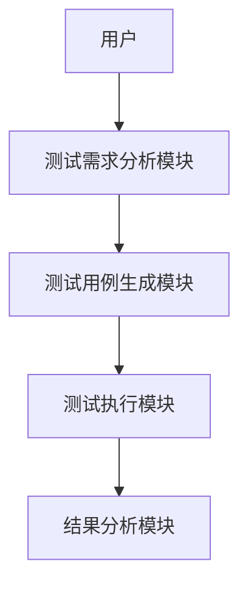
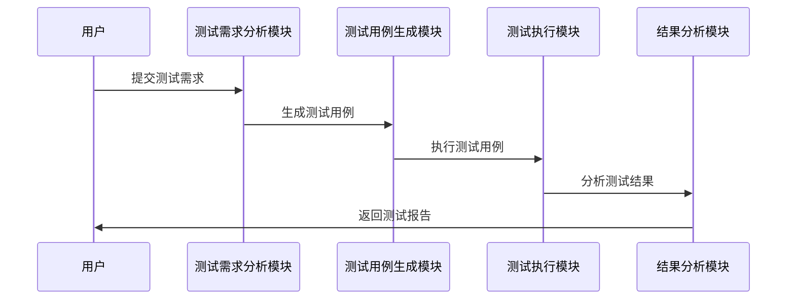

                 


# 自动化测试AI Agent：LLM辅助的软件质量保证

## 关键词：自动化测试，LLM，AI大模型，软件质量保证，测试用例生成

## 摘要：本文探讨了LLM在自动化测试中的应用，分析了其在软件质量保证中的作用，详细介绍了基于LLM的自动化测试AI Agent的原理、系统架构设计及项目实战。

---

# 第1章: 自动化测试与AI大模型的结合

## 1.1 自动化测试的背景与挑战

### 1.1.1 软件测试的基本概念
软件测试是确保软件质量的关键步骤，包括单元测试、集成测试和系统测试。传统测试方法依赖手动编写测试用例，效率低且容易出错。

### 1.1.2 自动化测试的定义与特点
自动化测试利用工具和脚本自动执行测试，节省时间和成本，提高覆盖率和准确性。然而，测试用例生成和维护仍面临挑战。

### 1.1.3 AI大模型在自动化测试中的应用前景
AI大模型，尤其是LLM，具备自然语言理解和生成能力，可辅助生成测试用例，优化测试流程，提升测试效率。

## 1.2 LLM在软件质量保证中的作用

### 1.2.1 LLM的基本概念与特点
LLM（Large Language Model）通过大量数据训练，能理解上下文，生成自然语言文本。其优势在于理解和生成能力，适用于多种任务。

### 1.2.2 LLM在软件测试中的优势
LLM能够自动生成测试用例，分析测试结果，提供改进建议，减少人工干预，提高测试效率。

### 1.2.3 LLM辅助测试的具体应用场景
- 测试用例生成：根据需求文档生成多种测试场景。
- 测试结果分析：自动分析测试报告，识别潜在问题。
- 代码审查：辅助检测代码中的潜在缺陷。

## 1.3 本章小结
本章介绍了自动化测试的背景、挑战及LLM的应用前景，为后续章节奠定了基础。

---

# 第2章: 自动化测试AI Agent的核心概念与原理

## 2.1 自动化测试AI Agent的定义

### 2.1.1 AI Agent的基本概念
AI Agent是智能体，能感知环境并采取行动以实现目标。在测试中，AI Agent负责执行测试任务，分析结果并反馈。

### 2.1.2 自动化测试AI Agent的定义与特点
自动化测试AI Agent结合了自动化测试工具和AI技术，能自动生成测试用例，执行测试并分析结果，具备智能化和自动化特点。

## 2.2 LLM在测试用例生成中的应用

### 2.2.1 测试用例生成的基本原理
测试用例生成需理解需求，设计输入、步骤和预期结果。传统方法依赖人工，效率低。

### 2.2.2 LLM辅助测试用例生成的流程
1. 输入需求文档。
2. LLM分析需求，生成多种测试场景。
3. 生成测试用例，覆盖更多边界条件。

### 2.2.3 LLM在测试用例优化中的作用
LLM能优化测试用例，减少冗余，提高覆盖率，确保测试的有效性。

## 2.3 自动化测试AI Agent的架构设计

### 2.3.1 系统整体架构
系统包括需求分析模块、测试用例生成模块、测试执行模块和结果分析模块。

### 2.3.2 各模块的功能与交互
- 需求分析模块：解析需求文档，提取测试点。
- 测试用例生成模块：利用LLM生成测试用例。
- 测试执行模块：执行测试并收集结果。
- 结果分析模块：分析结果，生成报告。

### 2.3.3 架构设计的优缺点分析
优点：模块化设计，便于扩展；各模块分工明确，提高效率。
缺点：需确保模块间通信顺畅，可能增加系统复杂性。

## 2.4 本章小结
本章详细讲解了自动化测试AI Agent的核心概念和架构设计，为后续实现奠定了基础。

---

# 第3章: 自动化测试AI Agent的算法原理

## 3.1 LLM的训练与推理机制

### 3.1.1 LLM的训练过程
LLM通过监督学习和强化学习训练，使用大规模数据，优化模型参数以最小化损失函数。

### 3.1.2 LLM的推理过程
输入测试需求，模型生成测试用例，涉及上下文理解和生成策略。

### 3.1.3 LLM在测试用例生成中的具体应用
模型分析需求，生成测试场景，涵盖多种输入和边界条件，确保测试覆盖率。

## 3.2 测试用例生成算法

### 3.2.1 基于LLM的测试用例生成算法
算法步骤：
1. 输入需求文档。
2. LLM分析，生成测试场景。
3. 转换为具体测试用例。

### 3.2.2 算法的实现步骤
- 文档解析：提取关键需求点。
- 场景生成：生成多个测试场景。
- 用例转换：将场景转化为具体测试步骤。

### 3.2.3 算法的优化与改进
- 结合测试覆盖率，优化生成策略。
- 动态调整测试用例，确保全面覆盖。

## 3.3 算法实现的代码示例

### 3.3.1 环境安装
安装Python和必要的库，如transformers和torch。

### 3.3.2 核心代码实现
```python
from transformers import pipeline

def generate_test_cases(prompt):
    # 初始化LLM管道
    generator = pipeline('text-generation', model='gpt2')
    # 生成测试场景
    scenarios = generator(prompt, max_length=50, num_return_sequences=3)
    # 转换为测试用例
    test_cases = []
    for scenario in scenarios:
        test_cases.append({
            'name': scenario['sequence'],
            'steps': scenario['input_ids']
        })
    return test_cases

# 示例用法
prompt = "Test the login functionality when user enters valid credentials."
test_cases = generate_test_cases(prompt)
print(test_cases)
```

### 3.3.3 代码解读与分析
代码使用Hugging Face的GPT-2模型生成测试场景，然后将每个场景转换为具体的测试用例。生成多个场景以确保覆盖不同情况。

## 3.4 本章小结
本章详细介绍了LLM的训练与推理机制，以及测试用例生成算法，展示了如何通过代码实现自动化测试。

---

# 第4章: 自动化测试AI Agent的系统架构与设计

## 4.1 系统功能设计

### 4.1.1 测试需求分析模块
功能：解析需求文档，提取测试点。

### 4.1.2 测试用例生成模块
功能：基于需求生成测试用例。

### 4.1.3 测试执行与结果分析模块
功能：执行测试，分析结果并生成报告。

## 4.2 系统架构设计

### 4.2.1 系统架构图


### 4.2.2 各模块之间的交互关系
用户输入需求，需求分析模块处理后传递给测试用例生成模块，生成用例后执行，结果交由结果分析模块处理。

## 4.3 系统接口设计

### 4.3.1 接口定义
- 输入：测试需求文档。
- 输出：测试用例和报告。

### 4.3.2 接口实现
通过REST API实现模块间通信，确保数据传递高效。

### 4.3.3 接口测试
使用Postman测试接口，确保各模块协同工作。

## 4.4 系统交互流程图


## 4.5 本章小结
本章通过系统架构设计，展示了自动化测试AI Agent的整体结构和各模块的交互关系。

---

# 第5章: 项目实战——基于LLM的自动化测试AI Agent开发

## 5.1 项目背景与目标
本项目旨在开发一个基于LLM的自动化测试AI Agent，实现测试用例生成、执行和结果分析的自动化。

## 5.2 项目环境与工具

### 5.2.1 环境安装
安装Python 3.8以上版本，安装必要的库如transformers和fastapi。

### 5.2.2 工具选择
使用Hugging Face的GPT-2模型，搭配FastAPI框架搭建Web服务。

## 5.3 系统核心代码实现

### 5.3.1 测试需求分析模块
```python
import json

def analyze_test_requirements(prompt):
    # 分析测试需求
    return json.loads(prompt)
```

### 5.3.2 测试用例生成模块
```python
from transformers import pipeline

def generate_test_cases(prompt):
    generator = pipeline('text-generation', model='gpt2')
    scenarios = generator(prompt, max_length=50, num_return_sequences=3)
    test_cases = []
    for scenario in scenarios:
        test_cases.append({
            'name': scenario['sequence'],
            'steps': scenario['input_ids']
        })
    return test_cases
```

### 5.3.3 测试执行模块
```python
def execute_test(test_case):
    # 执行测试用例
    return {'status': 'pass', 'result': 'Test passed'}
```

### 5.3.4 结果分析模块
```python
def analyze_results(results):
    pass_rate = sum(1 for r in results if r['status'] == 'pass') / len(results) * 100
    return f'Pass rate: {pass_rate}%'
```

## 5.4 案例分析与详细讲解
假设需求是测试登录功能，AI Agent生成多个测试用例，执行后生成报告，分析结果，优化测试策略。

## 5.5 项目小结
本项目展示了如何利用LLM开发自动化测试AI Agent，实现高效、智能的测试流程。

---

# 总结与展望

## 6.1 总结
本文详细探讨了LLM在自动化测试中的应用，介绍了AI Agent的核心概念、系统架构和项目实现。

## 6.2 展望
未来，LLM将与自动化测试进一步结合，提升测试效率和质量，推动软件开发的智能化。

---

# 最佳实践 tips

## 7.1 注意事项
- 确保LLM模型的训练数据质量，避免偏见。
- 定期更新模型，适应新需求。
- 处理测试结果时，结合人工审核。

## 7.2 拓展阅读
推荐阅读Hugging Face的文档和相关研究论文，深入了解LLM的应用。

---

作者：AI天才研究院/AI Genius Institute & 禅与计算机程序设计艺术 /Zen And The Art of Computer Programming

