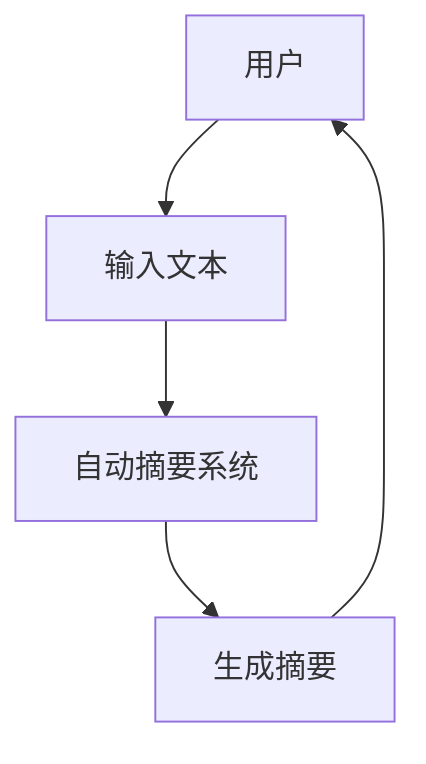
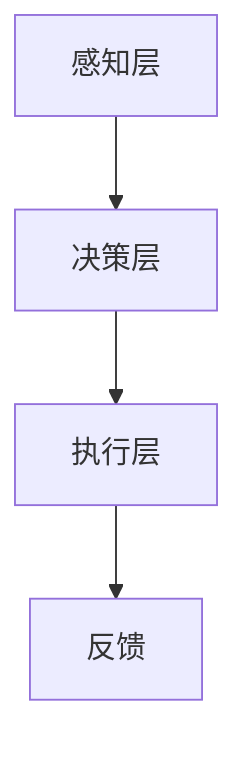
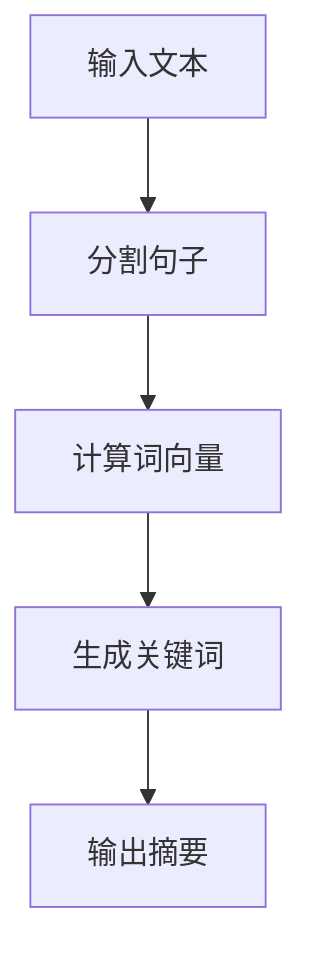
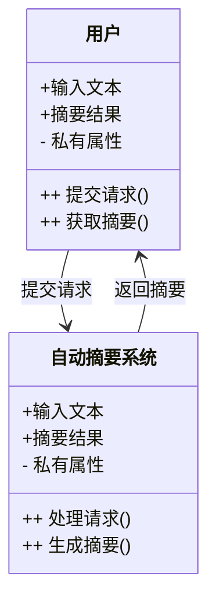
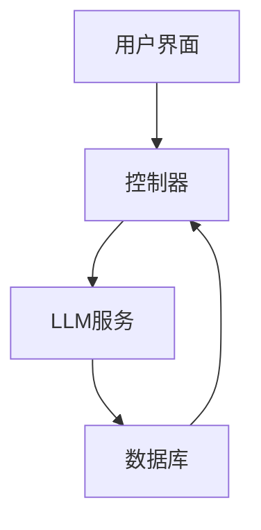
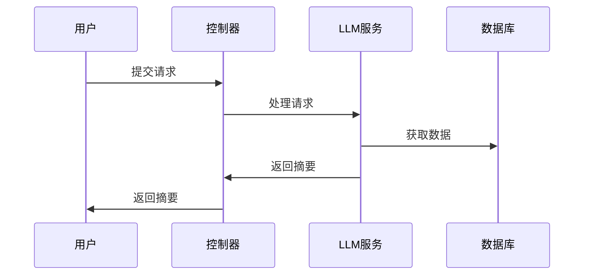

                 


# 自动摘要AI Agent：LLM驱动的文本压缩与提炼

> 关键词：自动摘要，AI Agent，LLM，文本压缩，自然语言处理

> 摘要：本文详细探讨了自动摘要AI Agent的实现，重点分析了基于LLM（大语言模型）的文本压缩与提炼技术，从背景、原理、系统设计到实战应用，为开发者和研究者提供全面的技术指南。

---

# 第一章: 自动摘要与AI Agent概述

## 1.1 问题背景与问题描述
### 1.1.1 文本压缩与自动摘要的背景
在信息爆炸的时代，如何高效处理大量文本数据成为关键挑战。自动摘要技术能够帮助用户快速获取文本的核心信息，提升信息处理效率。

### 1.1.2 自动摘要的核心问题与挑战
自动摘要需要解决如何提取关键信息，同时保持语义完整性和简洁性。挑战包括处理长文本、保持生成内容的连贯性等。

### 1.1.3 AI Agent在文本处理中的角色
AI Agent作为智能体，能够协调和执行自动摘要任务，通过与用户的交互提供精准的信息处理服务。

## 1.2 自动摘要与AI Agent的核心概念
### 1.2.1 自动摘要的定义与属性
自动摘要是一种技术，通过算法生成文本的关键信息，属性包括简洁性、准确性、连贯性等。

### 1.2.2 AI Agent的定义与特征
AI Agent是智能体，具备自主性、反应性、目标导向性和社会性，能够执行复杂任务。

### 1.2.3 两者的核心要素对比（表格）
| 对比维度 | 自动摘要 | AI Agent |
|----------|----------|----------|
| 核心任务 | 提取关键信息 | 协调和执行任务 |
| 输入 | 文本数据 | 多源数据 |
| 输出 | 简洁摘要 | 动态响应 |

## 1.3 实体关系与系统架构
### 1.3.1 自动摘要系统中的实体关系（Mermaid图）


### 1.3.2 AI Agent的系统架构（Mermaid图）


## 1.4 本章小结
本章介绍了自动摘要和AI Agent的基本概念，分析了它们的属性和关系，为后续章节奠定了基础。

---

# 第二章: LLM驱动的文本压缩与提炼原理

## 2.1 LLM在自动摘要中的作用
### 2.1.1 LLM的文本生成机制
LLM通过概率生成模型，预测文本的下一个词，生成连贯且有意义的摘要。

### 2.1.2 LLM在文本压缩中的优势
LLM能够捕捉文本的语义信息，生成简洁而准确的摘要，减少冗余信息。

## 2.2 自动摘要的算法原理
### 2.2.1 基于LLM的自动摘要算法流程（Mermaid图）


### 2.2.2 算法实现的核心代码（Python示例）
```python
import torch
from transformers import AutoTokenizer, AutoModelForMaskedLM

tokenizer = AutoTokenizer.from_pretrained('bert-base-uncased')
model = AutoModelForMaskedLM.from_pretrained('bert-base-uncased')

def generate_summary(text):
    inputs = tokenizer.encode_plus(text, max_length=512, truncation=True, padding=True, return_tensors='pt')
    with torch.no_grad():
        outputs = model(inputs.input_ids)
    summary = tokenizer.decode(outputs.logits.argmax(dim=-1).squeeze())
    return summary
```

### 2.2.3 数学模型与公式
LLM的损失函数：
$$ \text{Loss} = -\sum_{i=1}^{n} \log p(x_i) $$
其中，$p(x_i)$是模型生成第i个词的概率。

生成模型的条件概率：
$$ P(\text{摘要} | \text{输入文本}) = \prod_{i=1}^{m} P(x_i | x_{i-1}, \text{输入文本}) $$

## 2.3 本章小结
本章详细解释了LLM在自动摘要中的作用，分析了算法原理和数学模型，为后续实现奠定了基础。

---

# 第三章: 系统分析与架构设计

## 3.1 问题场景与项目介绍
### 3.1.1 自动摘要系统的应用场景
包括新闻摘要、会议记录、文档管理等领域。

### 3.1.2 项目目标与范围
设计一个基于LLM的自动摘要系统，实现文本压缩与提炼功能。

## 3.2 系统功能设计
### 3.2.1 领域模型设计（Mermaid类图）


### 3.2.2 系统架构设计（Mermaid图）


## 3.3 接口设计与交互流程
### 3.3.1 系统接口设计
包括提交请求接口和返回结果接口。

### 3.3.2 系统交互流程（Mermaid序列图）


## 3.4 本章小结
本章分析了系统的应用场景，设计了系统功能和架构，为后续实现提供了蓝图。

---

# 第四章: 项目实战与实现

## 4.1 环境安装与配置
### 4.1.1 开发环境搭建
安装Python、必要的库和开发工具。

### 4.1.2 依赖库安装
使用pip安装必要的库，如transformers、torch等。

## 4.2 核心代码实现
### 4.2.1 LLM模型加载与初始化
加载预训练的LLM模型，初始化tokenizer和模型。

### 4.2.2 自动摘要算法实现
实现文本分割、向量化、关键词提取和摘要生成。

### 4.2.3 系统功能模块实现
实现用户界面、控制器和LLM服务模块。

## 4.3 案例分析与结果展示
### 4.3.1 典型案例分析
分析一个新闻文本的自动摘要过程。

### 4.3.2 实验结果与性能分析
评估系统的性能指标，如准确率、生成速度等。

## 4.4 项目小结
总结项目实现的关键点和经验教训。

---

# 第五章: 最佳实践与注意事项

## 5.1 最佳实践Tips
### 5.1.1 开发中的注意事项
包括模型选择、数据预处理和性能优化。

### 5.1.2 部署与优化建议
如何高效部署系统，优化性能。

## 5.2 系统设计与实现中的注意事项
### 5.2.1 性能优化技巧
包括缓存机制、并行处理等。

### 5.2.2 模型选择与调优建议
根据任务需求选择合适的模型，并进行微调。

## 5.3 拓展阅读与深入学习
### 5.3.1 相关领域推荐读物
推荐相关的书籍和论文。

### 5.3.2 未来研究方向
探讨自动摘要技术的未来发展方向。

## 5.4 本章小结
本章提供了实用的建议和未来的研究方向。

---

# 第六章: 总结与展望

## 6.1 全书总结
回顾全书内容，总结自动摘要AI Agent的核心技术和实现方法。

## 6.2 未来展望
讨论技术的发展趋势和潜在的应用场景。

## 6.3 最终思考与建议
对开发者和技术研究者提出建议，鼓励深入研究和实践。

---

# 作者：AI天才研究院 & 禅与计算机程序设计艺术

---

以上是一个详细的大纲，确保每部分内容充实，结构清晰。接下来，我可以根据这个大纲撰写完整的技术博客文章。

