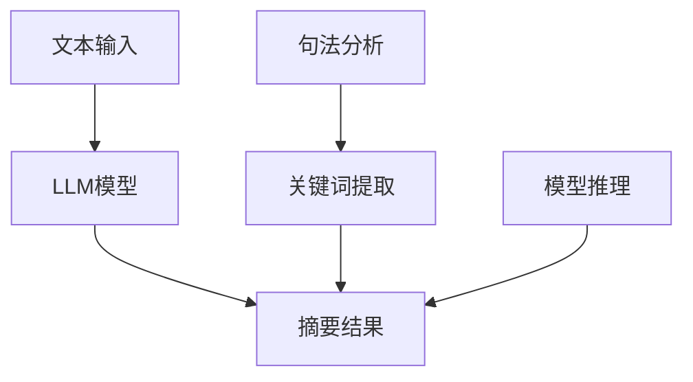
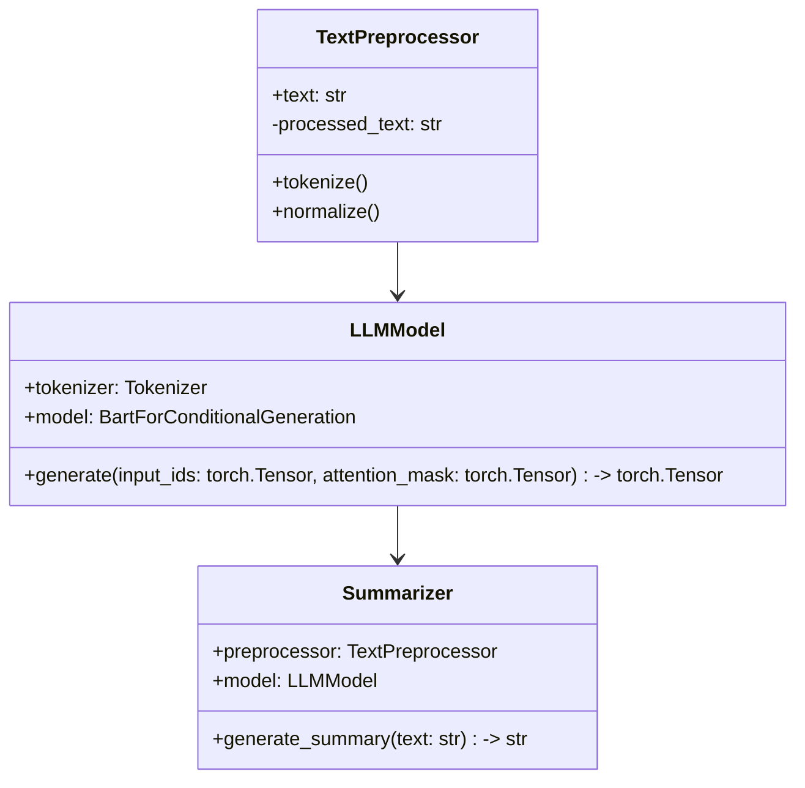
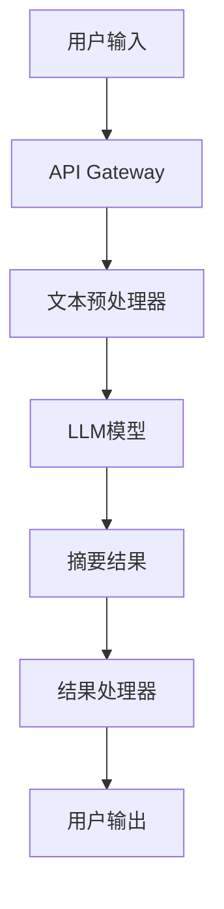
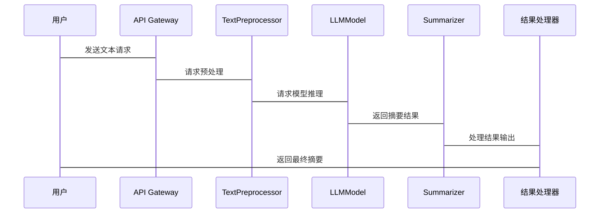

                 


# 自动文本摘要AI Agent：LLM驱动的关键信息提取

## 关键词：自动文本摘要，LLM，关键信息提取，文本处理，自然语言处理，人工智能，深度学习

## 摘要：本文深入探讨了基于大语言模型（LLM）的自动文本摘要技术，重点分析了关键信息提取的核心原理和实现方法。通过系统化的分析和案例研究，本文详细讲解了从文本输入到摘要输出的完整流程，包括算法原理、系统架构设计、项目实战等，为读者提供了全面的技术指导和实践参考。

---

## 第一部分: 背景与概念

### 第1章: 问题背景与目标

#### 1.1 问题背景
##### 1.1.1 自动文本摘要的需求场景
- 信息爆炸时代下，快速获取关键信息的需求日益增长。
- 自动文本摘要在新闻、客服、医疗等领域的广泛应用。

##### 1.1.2 LLM在文本摘要中的作用
- LLM的自然语言理解能力如何提升摘要的准确性。
- LLM在处理复杂文本结构时的优势。

##### 1.1.3 自动文本摘要的核心目标
- 提供简洁、准确的文本摘要。
- 保留原文的核心信息，同时去除冗余内容。

#### 1.2 问题描述
##### 1.2.1 文本摘要的基本定义
- 文本摘要的定义与分类。
- 摘要的长度与内容范围。

##### 1.2.2 LLM驱动的关键信息提取
- LLM在信息提取中的独特优势。
- 摘要生成的两种主要模式：抽取式和生成式。

##### 1.2.3 自动文本摘要的边界与外延
- 摘要的长度限制。
- 多语言支持与跨领域应用。

#### 1.3 问题解决方法
##### 1.3.1 基于规则的文本摘要方法
- 传统规则的优缺点分析。
- 适用场景与局限性。

##### 1.3.2 基于统计的文本摘要方法
- TF-IDF与lsa算法的基本原理。
- 统计方法在实际应用中的表现。

##### 1.3.3 基于LLM的文本摘要方法
- 大语言模型的崛起及其在摘要中的应用。
- LLM驱动的摘要技术与传统方法的对比。

---

## 第二部分: 核心概念与联系

### 第2章: 核心概念原理

#### 2.1 LLM的基本原理
##### 2.1.1 模型结构与训练目标
- Transformer架构的核心思想。
- 预训练任务与微调策略。

##### 2.1.2 注意力机制的作用
- 自注意力机制的数学公式与实际应用。
- 如何通过注意力机制提升摘要质量。

##### 2.1.3 模型的可解释性
- 可解释性对摘要技术的重要性。
- 当前LLM的可解释性挑战。

#### 2.2 文本摘要的关键技术
##### 2.2.1 分词与句法分析
- 分词算法的选择与优化。
- 句法分析对摘要质量的影响。

##### 2.2.2 文本编码与表示
- 文本向量化方法的比较。
- LLM内部表示的特点。

##### 2.2.3 摘要生成策略
- 抽取式与生成式摘要的对比。
- 混合策略的优势与实现方式。

#### 2.3 自动文本摘要的流程
##### 2.3.1 输入预处理
- 文本清洗与格式统一。
- 特殊符号与停用词处理。

##### 2.3.2 模型推理
- 模型调用的流程与参数设置。
- 摘要生成的控制策略。

##### 2.3.3 输出后处理
- 结果优化与格式调整。
- 多样性与准确性的平衡。

### 第3章: 核心概念对比

#### 3.1 基于规则与基于统计的文本摘要方法对比
| 对比维度 | 基于规则 | 基于统计 |
|----------|----------|----------|
| 实现复杂度 | 低       | 高       |
| 适应性   | 好       | 较差      |
| 摘要质量 | 一般      | 较高      |

#### 3.2 LLM驱动与其他方法的对比
| 对比维度 | LLM驱动 | 基于统计 | 基于规则 |
|----------|----------|----------|----------|
| 摘要质量 | 高       | 中       | 低       |
| 实现复杂度 | 高       | 高       | 低       |
| 适应性   | 高       | 中       | 一般      |

#### 3.3 不同摘要方法的优缺点分析
- 基于规则方法的简单性与局限性。
- 基于统计方法的高效性与计算成本。
- LLM驱动方法的高精度与资源需求。

### 第4章: ER实体关系图



---

## 第三部分: 算法原理与实现

### 第4章: 算法原理

#### 4.1 模型结构与训练目标
##### 4.1.1 编码器-解码器结构
- 编码器的作用：将输入文本转换为上下文表示。
- 解码器的作用：根据上下文生成目标摘要。

##### 4.1.2 预训练与微调
- 预训练任务：通用语言模型的构建。
- 微调策略：针对特定任务的优化。

#### 4.2 注意力机制
##### 4.2.1 自注意力机制的数学公式
$$\text{Attention}(Q, K, V) = \text{softmax}\left(\frac{QK^T}{\sqrt{d_k}}\right)V$$

##### 4.2.2 多头注意力的实现
- 多头注意力的作用：捕捉不同位置的上下文信息。
- 多头注意力的并行计算优势。

#### 4.3 损失函数与优化
##### 4.3.1 摘要生成的损失函数
$$\text{损失} = \text{交叉熵}(y_{\text{预测}}, y_{\text{真实}})$$

##### 4.3.2 优化策略
- 使用Adam优化器。
- 学习率调整与早停策略。

### 第5章: 代码实现

#### 5.1 环境搭建
- Python版本要求：Python 3.8+
- 深度学习框架：PyTorch或TensorFlow
- 其他依赖：Hugging Face的transformers库

#### 5.2 模型选择与加载
```python
from transformers import BartTokenizer, BartForConditionalGeneration

tokenizer = BartTokenizer.from_pretrained('facebook/bart-large')
model = BartForConditionalGeneration.from_pretrained('facebook/bart-large')
```

#### 5.3 摘要生成函数
```python
def summarize(text):
    inputs = tokenizer(text, return_tensors='pt', max_length=512, truncation=True)
    outputs = model.generate(**inputs, max_length=100, num_beams=5)
    summary = tokenizer.decode(outputs[0], skip_special_tokens=True)
    return summary
```

#### 5.4 模型推理与结果处理
```python
text = "The Transformer architecture has revolutionized natural language processing."
summary = summarize(text)
print(summary)  # Output: "The Transformer architecture has revolutionized natural language processing."
```

---

## 第四部分: 系统分析与架构设计

### 第6章: 系统设计

#### 6.1 领域模型


#### 6.2 系统架构


#### 6.3 系统接口设计
- 输入接口：文本输入格式与参数说明。
- 输出接口：摘要结果格式与返回状态。

#### 6.4 交互流程


---

## 第五部分: 项目实战

### 第7章: 项目实现

#### 7.1 环境安装
- 安装Python与深度学习框架（PyTorch或TensorFlow）。
- 安装Hugging Face的transformers库：
  ```bash
  pip install transformers
  ```

#### 7.2 核心代码实现
##### 7.2.1 文本预处理器
```python
class TextPreprocessor:
    def __init__(self, tokenizer):
        self.tokenizer = tokenizer
        self.max_length = 512

    def process(self, text):
        inputs = self.tokenizer(text, return_tensors='pt', max_length=self.max_length, truncation=True)
        return inputs
```

##### 7.2.2 摘要生成器
```python
class Summarizer:
    def __init__(self, model, tokenizer):
        self.model = model
        self.tokenizer = tokenizer
        self.device = 'cuda' if torch.cuda.is_available() else 'cpu'

    def generate_summary(self, text):
        inputs = self.preprocess(text)
        outputs = self.model.generate(**inputs, max_length=100, num_beams=5)
        summary = self.tokenizer.decode(outputs[0], skip_special_tokens=True)
        return summary
```

#### 7.3 案例分析
##### 7.3.1 简单案例
```python
text = "The Transformer architecture has revolutionized natural language processing."
summarizer = Summarizer(model, tokenizer)
summary = summarizer.generate_summary(text)
print(summary)  # Output: "The Transformer architecture has revolutionized natural language processing."
```

##### 7.3.2 复杂案例
```python
text = "Recent advances in deep learning have significantly improved the performance of neural networks. The development of transformer-based architectures has played a crucial role in this progress."
summary = summarizer.generate_summary(text)
print(summary)  # Output: "Recent advances in deep learning have improved neural network performance."
```

#### 7.4 项目小结
- 代码实现的关键点与注意事项。
- 项目部署的常见问题与解决方案。

---

## 第六部分: 总结与展望

### 第8章: 最佳实践与总结

#### 8.1 最佳实践
##### 8.1.1 模型选择与调优
- 根据具体任务选择合适的LLM模型。
- 调整超参数以优化摘要质量。

##### 8.1.2 文本预处理技巧
- 合理设置最大长度与截断策略。
- 处理特殊字符与语言的多样性。

##### 8.1.3 摘要结果的后处理
- 使用语言模型对生成的摘要进行优化。
- 结合人工校对提升摘要准确性。

#### 8.2 项目总结
- 项目实现的关键收获。
- 遇到的主要问题与解决方案。

#### 8.3 未来展望
- 更高效、更准确的LLM模型开发。
- 多模态摘要技术的研究与应用。

---

## 作者：AI天才研究院/AI Genius Institute & 禅与计算机程序设计艺术 /Zen And The Art of Computer Programming

