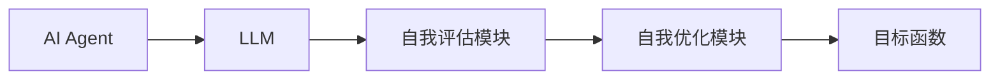
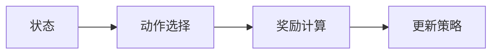
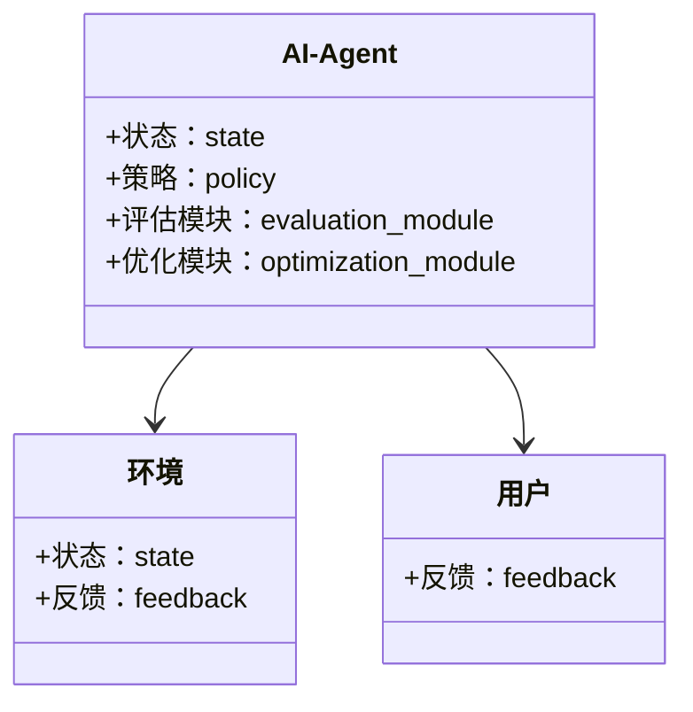
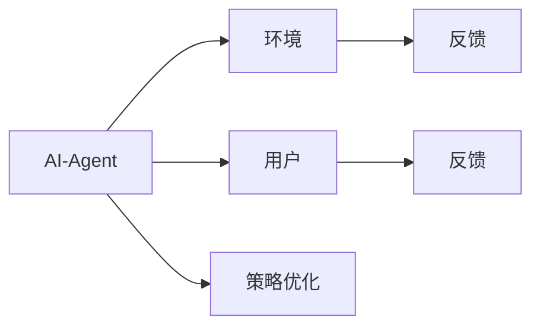
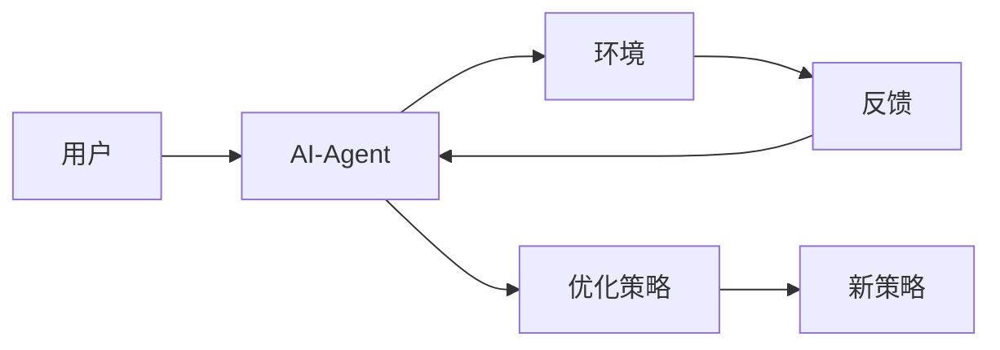

                 


# 自我改进型AI Agent：LLM的自我评估与优化

> 关键词：自我改进型AI代理，LLM，自我评估，优化算法，强化学习，系统架构

> 摘要：本文详细探讨了自我改进型AI代理的核心概念、算法原理及系统架构设计。通过对大型语言模型（LLM）的自我评估与优化机制的分析，结合实际案例，深入阐述了如何设计和实现一个能够持续改进的AI代理系统。本文内容涵盖背景介绍、核心概念、算法实现、系统设计及项目实战，旨在为读者提供全面的技术指导。

---

# 第一部分: 自我改进型AI Agent概述

## 第1章: 自我改进型AI Agent的背景与概念

### 1.1 问题背景

#### 1.1.1 AI Agent的基本概念
人工智能代理（AI Agent）是指能够感知环境并采取行动以实现目标的智能体。AI Agent可以是软件程序、机器人或其他智能系统，其核心能力包括感知、推理、决策和执行。

#### 1.1.2 自我改进型AI Agent的定义
自我改进型AI Agent是一种能够通过自我评估和优化算法，持续改进自身性能的智能体。与传统AI代理不同，它具备自主学习和优化的能力，能够根据反馈不断调整策略，以更好地完成目标任务。

#### 1.1.3 问题描述与目标
传统AI代理的性能通常依赖于初始设计和训练数据，难以在动态变化的环境中自适应改进。自我改进型AI Agent的目标是通过内置的自我评估和优化机制，实现性能的持续提升，适应复杂多变的任务需求。

### 1.2 核心概念与联系

#### 1.2.1 自我评估机制的原理
自我评估机制是自我改进型AI Agent的核心模块，负责对代理的当前状态、行为和结果进行分析，生成反馈信号以指导优化过程。该机制通常结合内部评估（基于模型的评估）和外部反馈（基于用户或环境的反馈）。

#### 1.2.2 自我优化算法的特点
自我优化算法通过强化学习、遗传算法或其他优化方法，根据评估结果调整代理的策略参数，以提高任务完成效率和准确性。

#### 1.2.3 相关概念对比表格
以下是自我改进型AI Agent与其他类型AI代理的关键区别对比：

| 比较维度       | 传统AI代理                     | 自我改进型AI Agent       |
|----------------|---------------------------------|--------------------------|
| 学习能力       | 静态，依赖初始训练数据         | 动态，具备自主学习能力     |
| 优化能力       | 无，无法自适应改进             | 有，具备自我优化能力       |
| 环境适应性     | 较弱，难以应对复杂变化         | 强，能够自适应复杂环境变化   |

#### 1.2.4 实体关系图（Mermaid）
以下是自我改进型AI Agent的核心模块关系图：



---

## 第2章: LLM的自我评估机制

### 2.1 自我评估的核心原理

#### 2.1.1 内部评估机制
内部评估机制基于代理的内部状态和历史行为，通过模型参数的变化或行为表现来评估当前策略的有效性。例如，可以通过损失函数的变化率来判断模型预测的准确性。

#### 2.1.2 外部反馈机制
外部反馈机制通过与外部环境或用户的交互，收集真实的反馈信息。例如，用户对代理输出的满意度评分，或任务完成后的结果是否符合预期。

#### 2.1.3 综合评估模型
综合评估模型将内部评估和外部反馈相结合，生成最终的评估结果。例如，可以通过加权平均的方式，综合考虑模型预测的准确性和用户反馈的满意度。

### 2.2 评估指标与方法

#### 2.2.1 常见评估指标
以下是常用的评估指标：

- **准确率（Accuracy）**：正确预测的比例。
- **召回率（Recall）**：真实正例中被正确预测的比例。
- **F1分数（F1 Score）**：准确率和召回率的调和平均。
- **用户满意度（User Satisfaction）**：基于用户反馈的评分。

#### 2.2.2 基于强化学习的评估方法
强化学习（Reinforcement Learning）是一种通过奖励机制来优化代理行为的方法。代理根据环境反馈的奖励值调整策略，以最大化累计奖励。

#### 2.2.3 基于对比学习的评估方法
对比学习（Contrastive Learning）通过比较不同行为的结果，评估代理策略的优劣。例如，通过A/B测试的方式，比较两种不同策略在任务完成中的表现。

---

## 第3章: 自我优化算法的设计与实现

### 3.1 算法原理

#### 3.1.1 基于强化学习的优化流程
强化学习是一种常用的自我优化方法。以下是基于强化学习的优化流程：

1. **状态感知**：代理感知当前环境状态。
2. **动作选择**：根据当前状态选择一个动作。
3. **奖励计算**：环境根据动作的结果返回奖励值。
4. **策略更新**：根据奖励值更新策略，以提高未来动作的选择概率。



#### 3.1.2 基于反馈的优化策略
基于反馈的优化策略通过收集用户或环境的反馈信息，调整代理的行为策略。例如，根据用户的评分调整模型的预测权重。

#### 3.1.3 贪心算法与随机搜索的结合
贪心算法（Greedy Algorithm）和随机搜索（Random Search）的结合可以有效平衡探索与利用。例如，在优化过程中，代理可以先尝试随机的动作，然后根据反馈选择最优动作。

### 3.2 算法实现

#### 3.2.1 强化学习算法的Mermaid流程图
以下是强化学习算法的流程图：


#### 3.2.2 Python代码示例
以下是基于强化学习的优化算法的Python代码示例：

```python
def optimize_policy(reward_func):
    while True:
        state = get_current_state()
        action = choose_action(state)
        reward = reward_func(action)
        update_policy(reward)
```

#### 3.2.3 数学模型与公式
以下是优化算法的数学模型：

- **损失函数**：
  $$ L = -\sum_{i=1}^{n} \log(p_i) $$
  
- **优化目标**：
  $$ \theta = \arg\max_{\theta} \mathbb{E}[R] $$

---

## 第4章: 系统分析与架构设计

### 4.1 问题场景分析

#### 4.1.1 代理系统的核心功能
- 状态感知
- 动作选择
- 奖励计算
- 策略优化

#### 4.1.2 系统的输入输出描述
- 输入：环境状态、用户反馈
- 输出：优化后的策略、动作选择

#### 4.1.3 系统的性能指标
- 响应时间
- 任务完成率
- 用户满意度

### 4.2 系统功能设计

#### 4.2.1 领域模型（Mermaid类图）
以下是系统功能的领域模型：



#### 4.2.2 系统架构设计（Mermaid架构图）
以下是系统架构设计：



#### 4.2.3 接口设计与交互流程图
以下是系统交互的流程图：



---

## 第5章: 项目实战

### 5.1 环境安装

```bash
pip install gym numpy matplotlib
```

### 5.2 核心实现

#### 5.2.1 评估模块的实现
以下是评估模块的Python代码：

```python
def evaluate_policy(policy, env, num_episodes=100):
    rewards = []
    for _ in range(num_episodes):
        state = env.reset()
        episode_reward = 0
        done = False
        while not done:
            action = policy.choose_action(state)
            state, reward, done, _ = env.step(action)
            episode_reward += reward
        rewards.append(episode_reward)
    return np.mean(rewards)
```

#### 5.2.2 优化模块的实现
以下是优化模块的Python代码：

```python
def optimize_policy(reward_func, learning_rate=0.01):
    params = get_initial_params()
    for _ in range(num_iterations):
        state = get_current_state()
        action = choose_action(state)
        reward = reward_func(action)
        params = update_params(params, reward, learning_rate)
    return params
```

### 5.3 案例分析

#### 5.3.1 实际案例分析
以下是实际案例分析：

- **任务描述**：设计一个自我改进型AI代理，用于优化在线购物推荐系统。
- **评估指标**：用户点击率、购买转化率。
- **优化策略**：基于强化学习的推荐策略优化。

#### 5.3.2 代码解读与分析
以下是代码解读与分析：

```python
def update_params(params, reward, learning_rate):
    gradient = compute_gradient(params, reward)
    params = params - learning_rate * gradient
    return params
```

---

## 第6章: 小结与展望

### 6.1 最佳实践Tips

1. 在实际应用中，建议结合强化学习和对比学习，以实现更高效的优化效果。
2. 定期监控和评估代理的性能，及时调整优化策略。
3. 注意保护用户隐私，确保代理系统的数据安全。

### 6.2 未来展望

随着人工智能技术的不断发展，自我改进型AI Agent将在更多领域得到应用。未来的研究方向包括更高效的优化算法、更智能的自我评估机制，以及更强大的多任务处理能力。

---

作者：AI天才研究院/AI Genius Institute & 禅与计算机程序设计艺术 /Zen And The Art of Computer Programming

