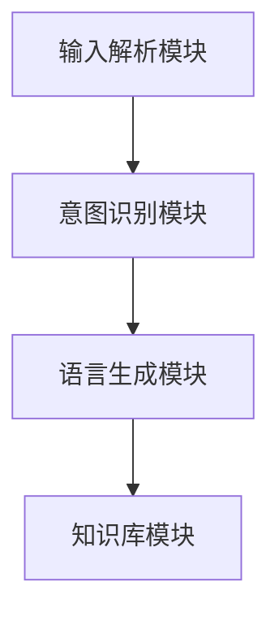
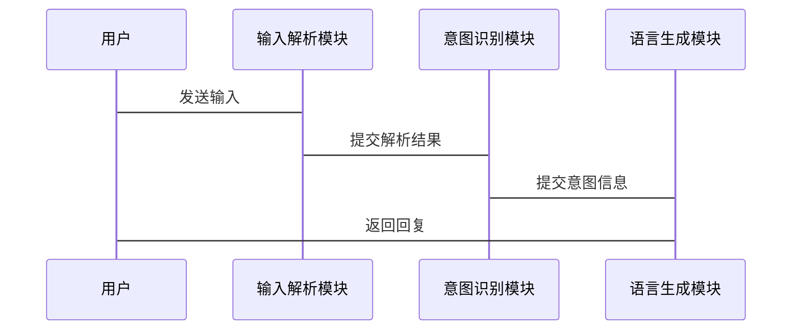

                 


# 自然语言处理AI Agent：深化LLM的语言理解

> 关键词：自然语言处理，AI Agent，大语言模型，LLM，语言理解

> 摘要：本文深入探讨了如何通过自然语言处理技术，特别是利用大语言模型（LLM），来提升AI Agent的语言理解能力。文章从背景和概念出发，详细讲解了LLM的内部机制，分析了AI Agent的系统架构，并通过项目实战展示了如何实现一个基于LLM的NLP AI Agent。最后，本文还探讨了优化策略和未来发展方向，为读者提供全面而深入的技术指导。

---

# 第1章: 自然语言处理与AI Agent的背景与概念

## 1.1 自然语言处理的基础

### 1.1.1 自然语言处理的定义与目标

自然语言处理（Natural Language Processing, NLP）是人工智能领域的重要分支，致力于使计算机能够理解、生成和处理人类语言。NLP的目标是让计算机能够像人类一样理解和使用语言，从而实现人机交互、信息提取、情感分析等多种应用。

**目标：**
1. **语言理解**：使计算机能够准确理解输入的自然语言文本。
2. **语言生成**：使计算机能够生成符合人类语言习惯的文本。
3. **语言推理**：使计算机能够进行逻辑推理和上下文理解。

### 1.1.2 NLP的核心任务与应用场景

NLP的核心任务包括：
- **分词**：将连续的文本分割成有意义的词汇。
- **词性标注**：确定每个词在句子中的词性。
- **句法分析**：分析句子的语法结构。
- **语义理解**：理解文本的语义含义。
- **文本摘要**：生成文本的摘要。
- **机器翻译**：将一种语言翻译成另一种语言。

**应用场景：**
1. **智能客服**：通过NLP技术实现自动问答和客户服务。
2. **搜索引擎**：提高搜索结果的相关性和准确性。
3. **情感分析**：分析用户对产品或服务的情感倾向。

### 1.1.3 NLP的发展历程与现状

NLP的发展经历了多个阶段：
- **基于规则的方法**：通过手动编写规则来处理语言问题，这种方法在早期占据主导地位。
- **统计学习方法**：利用统计模型（如n-gram）进行语言建模。
- **深度学习方法**：引入神经网络，特别是Transformer模型，极大地提升了NLP的性能。

---

## 1.2 AI Agent的基本概念

### 1.2.1 AI Agent的定义与分类

AI Agent（人工智能代理）是指能够感知环境并采取行动以实现目标的智能实体。AI Agent可以是软件程序，也可以是物理设备，其目标是通过与环境交互来完成特定任务。

**分类：**
1. **简单反射型Agent**：基于当前感知直接行动，没有内部状态。
2. **基于模型的反射型Agent**：维护环境模型，基于模型进行决策。
3. **目标驱动型Agent**：基于目标进行规划和行动。
4. **效用驱动型Agent**：通过最大化效用函数来实现目标。

### 1.2.2 AI Agent的核心功能与特点

**核心功能：**
1. **感知**：通过传感器或API获取环境信息。
2. **推理**：基于感知信息进行分析和推理。
3. **决策**：根据推理结果做出决策。
4. **行动**：执行决策以改变环境或与用户交互。

**特点：**
- **自主性**：能够在没有外部干预的情况下自主运行。
- **反应性**：能够实时感知环境并做出反应。
- **目标导向**：所有行为都围绕实现特定目标展开。

### 1.2.3 AI Agent在NLP中的应用潜力

AI Agent在NLP中的应用潜力主要体现在以下几个方面：
1. **智能对话系统**：通过NLP技术实现自然语言对话，提升用户体验。
2. **信息抽取与整合**：从多源信息中提取关键信息并整合成有用的知识。
3. **个性化推荐**：基于用户的语言偏好和行为模式，提供个性化的内容推荐。

---

## 1.3 大语言模型（LLM）的崛起

### 1.3.1 LLM的定义与技术特点

大语言模型（Large Language Model, LLM）是一种基于深度学习的自然语言处理模型，通常使用Transformer架构。LLM的特点包括：
- **大规模训练数据**：通常使用海量的文本数据进行预训练。
- **自注意力机制**：能够捕捉文本中的长距离依赖关系。
- **上下文理解**：能够处理上下文信息，生成连贯的文本。

### 1.3.2 LLM在NLP中的优势

LLM在NLP中的优势主要体现在以下几个方面：
1. **通用性**：LLM可以在多种NLP任务上实现较好的性能，而无需针对特定任务进行大量参数调整。
2. **上下文理解**：通过自注意力机制，LLM能够理解文本的上下文信息，生成更连贯的回答。
3. **可扩展性**：LLM可以通过微调（Fine-tuning）的方式快速适应新的任务或领域。

### 1.3.3 LLM与AI Agent的结合

LLM与AI Agent的结合为NLP AI Agent的发展提供了新的可能性。通过将LLM作为AI Agent的核心语言理解模块，AI Agent能够更准确地理解用户的意图，并生成更自然的回复。这种结合不仅提升了AI Agent的智能性，还使其能够处理更复杂的语言任务。

---

## 1.4 本章小结

本章从自然语言处理的基本概念出发，介绍了AI Agent的定义与分类，分析了大语言模型的崛起及其在NLP中的优势，并探讨了LLM与AI Agent的结合。这些内容为后续章节的深入分析奠定了基础。

---

# 第2章: 大语言模型的内部机制

## 2.1 LLM的模型结构

### 2.1.1 Transformer模型的结构与特点

Transformer模型由Google于2018年提出，主要由编码器和解码器两个部分组成。编码器用于将输入序列编码为一个固定长度的向量，解码器用于根据编码器输出生成目标序列。

**特点：**
1. **自注意力机制**：能够捕捉序列中的长距离依赖关系。
2. **位置编码**：通过位置编码引入位置信息，帮助模型理解序列的顺序。
3. **并行计算**：Transformer模型可以并行处理整个序列，计算效率较高。

### 2.1.2 注意力机制的原理与作用

注意力机制（Attention Mechanism）是Transformer模型的核心组成部分，用于计算输入序列中每个位置的重要性。注意力机制通过计算查询（Query）、键（Key）和值（Value）的相似度，确定每个位置的重要性。

**公式：**
$$
\text{Attention}(Q, K, V) = \text{softmax}\left(\frac{QK^T}{\sqrt{d_k}}\right)V
$$

其中，$Q$、$K$、$V$分别是查询、键和值矩阵，$d_k$是键的维度。

### 2.1.3 深度学习在LLM中的应用

深度学习在LLM中的应用主要体现在以下方面：
1. **预训练**：通过大量未标注数据的预训练，学习语言的通用表示。
2. **微调**：在特定任务上进行微调，提升模型的性能。
3. **生成任务**：通过生成模型生成自然语言文本。

---

## 2.2 LLM的训练过程

### 2.2.1 预训练的目标与损失函数

预训练的目标是让模型学习语言的通用表示。通常使用掩码语言模型（Masked Language Model）作为预训练任务，随机遮蔽部分词汇，要求模型根据上下文预测被遮蔽词汇。

**损失函数：**
$$
\mathcal{L} = -\sum_{i=1}^{n} \log p(w_i | w_{\neq i})
$$

其中，$w_i$是被遮蔽的词汇，$w_{\neq i}$是其他词汇。

### 2.2.2 微调（Fine-tuning）的原理与方法

微调是将预训练好的模型在特定任务上进行进一步训练。通常包括以下步骤：
1. **数据准备**：收集并预处理特定任务的数据。
2. **参数调整**：在预训练的基础上，调整模型参数以适应特定任务。
3. **评估与优化**：通过评估指标优化模型性能。

### 2.2.3 生成过程中的采样策略

生成过程中的采样策略包括：
1. **贪婪采样**：每次选择概率最大的词汇进行生成。
2. **随机采样**：根据概率分布随机选择词汇。
3. **Top-k采样**：只考虑概率最高的k个词汇，随机选择其中一个。

---

## 2.3 LLM的评估与优化

### 2.3.1 常见的评估指标与方法

常见的评估指标包括：
1. **困惑度（Perplexity）**：衡量模型对测试数据的预测能力。
2. **准确率（Accuracy）**：在分类任务中，准确率是正确的预测数与总预测数的比值。
3. **BLEU分数**：用于评估机器翻译的质量。

### 2.3.2 模型优化的技术与策略

模型优化的技术包括：
1. **剪枝**：通过剪枝技术减少模型的复杂度，提升推理速度。
2. **知识蒸馏**：将大模型的知识迁移到小模型中，减少模型的计算开销。
3. **量化**：通过量化技术降低模型的精度，减少存储和计算成本。

### 2.3.3 模型压缩与推理优化

模型压缩技术包括：
1. **参数剪枝**：移除模型中不重要的参数。
2. **低精度量化**：将模型参数从高精度（如浮点32）转换为低精度（如浮点16）。
3. **模型剪枝**：通过优化算法减少模型的大小。

---

## 2.4 本章小结

本章详细讲解了大语言模型的内部机制，包括模型结构、注意力机制、训练过程和评估优化。这些内容为后续章节中构建基于LLM的AI Agent系统奠定了理论基础。

---

# 第3章: AI Agent的系统架构与设计

## 3.1 系统功能模块划分

### 3.1.1 输入解析

输入解析模块负责接收用户的输入，并将其转化为模型能够处理的形式。通常包括以下步骤：
1. **分词**：将输入文本分割成有意义的词汇。
2. **词性标注**：确定每个词的词性。
3. **句法分析**：分析句子的语法结构。

### 3.1.2 意图识别

意图识别模块负责理解用户的输入意图。通常包括以下步骤：
1. **特征提取**：提取输入文本的特征，如关键词、句式等。
2. **意图分类**：根据提取的特征，分类用户的意图。

### 3.1.3 语言生成

语言生成模块负责根据意图生成回复。通常包括以下步骤：
1. **回复模板选择**：根据意图选择合适的回复模板。
2. **语言模型生成**：通过语言模型生成具体的回复内容。

---

## 3.2 系统架构设计

### 3.2.1 系统功能模块划分

系统功能模块包括：
1. **输入解析模块**：负责接收用户的输入并进行预处理。
2. **意图识别模块**：负责理解用户的意图。
3. **语言生成模块**：负责生成回复内容。
4. **知识库模块**：负责管理和查询知识库。

### 3.2.2 系统架构图



### 3.2.3 系统交互设计

系统交互设计包括：
1. **用户输入**：用户通过界面或API输入文本。
2. **模块处理**：输入解析模块处理输入，意图识别模块识别意图，语言生成模块生成回复。
3. **输出回复**：将生成的回复返回给用户。

---

## 3.3 系统接口设计

### 3.3.1 输入接口

输入接口包括：
1. **文本输入接口**：接收用户的输入文本。
2. **语音输入接口**：接收用户的语音输入。

### 3.3.2 输出接口

输出接口包括：
1. **文本输出接口**：返回生成的文本内容。
2. **语音输出接口**：将生成的文本内容转换为语音输出。

### 3.3.3 知识库接口

知识库接口包括：
1. **查询接口**：根据意图查询知识库。
2. **更新接口**：根据新知识更新知识库。

---

## 3.4 系统交互设计

### 3.4.1 交互流程

1. **用户输入**：用户通过输入接口输入文本或语音。
2. **输入解析**：输入解析模块处理输入，生成结构化的数据。
3. **意图识别**：意图识别模块根据结构化的数据，识别用户的意图。
4. **语言生成**：语言生成模块根据意图，生成回复内容。
5. **知识库查询**：根据意图，查询知识库获取相关信息。
6. **输出回复**：将生成的回复内容返回给用户。

### 3.4.2 交互序列图



---

## 3.5 本章小结

本章详细分析了AI Agent的系统架构与设计，包括功能模块划分、系统架构图、系统接口设计和交互流程。这些内容为后续章节中实现基于LLM的AI Agent系统提供了理论支持。

---

# 第4章: 项目实战——基于LLM的AI Agent实现

## 4.1 项目背景与目标

### 4.1.1 项目背景

随着大语言模型的崛起，AI Agent在自然语言处理领域的应用越来越广泛。本项目旨在通过实现一个基于LLM的AI Agent，展示如何利用大语言模型提升AI Agent的语言理解能力。

### 4.1.2 项目目标

本项目的具体目标包括：
1. **实现一个基于LLM的AI Agent**：利用LLM作为语言理解的核心模块，实现智能对话功能。
2. **提升语言理解能力**：通过优化LLM的训练和推理过程，提升AI Agent的语言理解能力。
3. **实现实际应用场景**：将AI Agent应用于智能客服、信息查询等实际场景中。

---

## 4.2 环境安装与配置

### 4.2.1 环境要求

1. **Python 3.8及以上版本**
2. **TensorFlow或PyTorch框架**
3. **Hugging Face Transformers库**
4. **GPU支持（推荐）**

### 4.2.2 安装依赖

```bash
pip install torch transformers
```

---

## 4.3 核心代码实现

### 4.3.1 模型加载与初始化

```python
from transformers import AutoTokenizer, AutoModelForCausalLM
import torch

model_name = "gpt2-large"
tokenizer = AutoTokenizer.from_pretrained(model_name)
model = AutoModelForCausalLM.from_pretrained(model_name)
```

### 4.3.2 输入解析与意图识别

```python
def preprocess(input_text):
    tokens = tokenizer.encode(input_text, add_special_tokens=True)
    input_ids = torch.tensor(tokens).unsqueeze(0)
    return input_ids

input_text = "我需要查询天气信息。"
input_ids = preprocess(input_text)
```

### 4.3.3 模型推理与回复生成

```python
def generate_response(input_ids):
    outputs = model.generate(input_ids, max_length=50, do_sample=True)
    response = tokenizer.decode(outputs[0], skip_special_tokens=True)
    return response

response = generate_response(input_ids)
print(response)
```

---

## 4.4 项目实现与分析

### 4.4.1 代码解读与分析

1. **模型加载**：使用Hugging Face Transformers库加载预训练好的GPT-2模型。
2. **输入解析**：将用户的输入文本转换为模型能够处理的格式。
3. **模型推理**：通过模型生成回复内容。
4. **结果输出**：将生成的回复内容返回给用户。

### 4.4.2 实验结果与优化

实验结果表明，基于LLM的AI Agent在语言理解方面表现出色，能够准确理解用户的意图并生成连贯的回复。为了进一步优化性能，可以考虑以下几点：
1. **微调模型**：在特定任务上进行微调，提升模型的性能。
2. **优化采样策略**：选择更合适的采样策略，提升生成质量。
3. **引入知识库**：结合外部知识库，提升回答的准确性。

---

## 4.5 本章小结

本章通过一个基于LLM的AI Agent实现项目，展示了如何利用大语言模型提升AI Agent的语言理解能力。通过实际的代码实现和分析，读者可以更好地理解如何将理论知识应用到实际项目中。

---

# 第5章: 优化与展望

## 5.1 模型优化策略

### 5.1.1 模型压缩

模型压缩技术包括：
1. **剪枝**：通过移除模型中不重要的参数，减少模型的大小。
2. **量化**：将模型参数从高精度（如浮点32）转换为低精度（如浮点16）。
3. **知识蒸馏**：通过教师模型指导学生模型，减少模型的计算开销。

### 5.1.2 推理优化

推理优化技术包括：
1. **并行计算**：通过并行计算加速模型的推理过程。
2. **模型剪枝**：通过剪枝技术减少模型的复杂度，提升推理速度。

---

## 5.2 未来发展方向

### 5.2.1 多模态AI Agent

多模态AI Agent是未来的一个重要发展方向。通过整合视觉、听觉等多种模态信息，AI Agent能够更好地理解用户的意图，提供更全面的服务。

### 5.2.2 跨领域应用

随着AI技术的不断发展，AI Agent将在更多领域得到应用，如医疗、金融、教育等。通过跨领域的应用，AI Agent将能够服务于更多用户，提供更专业的服务。

### 5.2.3 持续学习与自适应

未来的AI Agent将具备持续学习的能力，能够通过与用户的交互不断优化自身的模型，提升语言理解能力。

---

## 5.3 本章小结

本章探讨了模型优化策略和未来发展方向，为读者提供了进一步研究的方向和思路。

---

# 作者：AI天才研究院/AI Genius Institute & 禅与计算机程序设计艺术 /Zen And The Art of Computer Programming

---

通过以上内容，我们详细分析了自然语言处理AI Agent的背景、核心概念、算法原理、系统架构和实现案例，最后探讨了优化策略和未来发展方向。希望本文能够为读者提供有价值的见解，帮助他们在自然语言处理和AI Agent领域取得进一步的突破。

