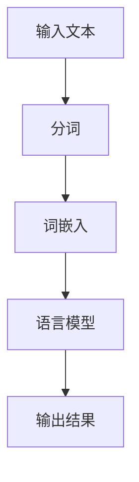
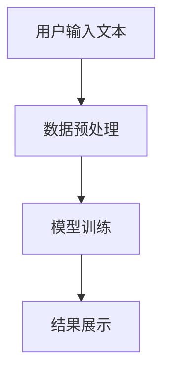

                 


# 自然语言处理在金融AI应用中的最佳实践

> **关键词**: 自然语言处理, 人工智能, 金融应用, 文本分析, 机器学习

> **摘要**: 自然语言处理（NLP）技术在金融人工智能（AI）应用中扮演着越来越重要的角色。本文将系统地介绍NLP的核心概念、算法原理以及在金融领域的具体应用，包括文本分类、情感分析、实体识别等关键技术。通过实际案例分析和系统设计，本文深入探讨了NLP在金融AI中的最佳实践方法，旨在为读者提供一份全面的技术指南。

---

# 第1章: 自然语言处理与金融AI的背景介绍

## 1.1 自然语言处理的定义与特点

### 1.1.1 自然语言处理的定义

自然语言处理（NLP）是人工智能（AI）领域的重要分支，旨在让计算机能够理解和处理人类语言。NLP的核心目标是让计算机能够像人类一样理解、生成和操作自然语言文本。

### 1.1.2 自然语言处理的核心特点

- **语义理解**: NLP能够提取文本中的语义信息，理解文本的含义。
- **上下文依赖性**: 自然语言具有高度的上下文依赖性，同一个词语在不同语境中有不同的含义。
- **多样性**: 自然语言数据具有多样性，包括文本、语音等多种形式。

### 1.1.3 自然语言处理与人工智能的关系

NLP是AI的核心技术之一，许多AI应用（如智能助手、机器翻译）都依赖于NLP技术。AI为NLP提供了更强大的计算能力和算法支持，而NLP则帮助AI更好地理解和处理人类语言。

## 1.2 金融AI的定义与特点

### 1.2.1 金融AI的定义

金融AI是人工智能技术在金融领域的应用，旨在通过AI技术解决金融问题，如股票预测、风险评估、欺诈检测等。

### 1.2.2 金融AI的核心特点

- **数据驱动**: 金融AI依赖于大量金融数据（如股票价格、交易记录）进行分析和预测。
- **实时性**: 金融市场的动态变化要求金融AI具备实时处理能力。
- **高精度**: 金融AI的应用往往需要高精度的预测和分析能力。

### 1.2.3 金融AI与传统金融技术的区别

- **数据来源**: 传统金融技术主要依赖于结构化数据，而金融AI可以处理非结构化数据（如新闻、社交媒体文本）。
- **分析能力**: 金融AI能够通过机器学习算法发现数据中的隐藏模式，而传统方法难以做到这一点。
- **自动化**: 金融AI可以实现自动化交易、自动化报告生成等任务，而传统方法需要大量人工干预。

## 1.3 自然语言处理在金融AI中的应用背景

### 1.3.1 金融领域的信息处理需求

金融市场中的信息高度分散，包括新闻、社交媒体、公司财报等多种形式的文本数据。这些数据往往是非结构化的，难以通过传统数据库进行处理。

### 1.3.2 自然语言处理在金融AI中的优势

- **非结构化数据处理**: NLP能够处理新闻、社交媒体等非结构化文本数据，提取有用的信息。
- **情感分析**: 通过NLP技术，可以分析市场情绪，预测股票价格走势。
- **实时监控**: NLP可以实时监控市场动态，发现潜在的市场机会或风险。

### 1.3.3 金融AI应用的现状与趋势

- **现状**: 当前，NLP在金融领域的应用主要集中在新闻分析、情感分析、风险评估等方面。
- **趋势**: 未来，NLP在金融AI中的应用将更加广泛，包括智能投顾、自动交易、监管合规等领域。

## 1.4 本章小结

本章介绍了自然语言处理和金融AI的基本概念，分析了它们的特点和区别。同时，我们还探讨了NLP在金融AI中的应用背景及其优势，为后续章节的深入分析奠定了基础。

---

# 第2章: 自然语言处理的核心概念与原理

## 2.1 自然语言处理的核心概念

### 2.1.1 语言模型的定义

语言模型是NLP的核心技术之一，用于估计一个给定序列的条件概率。语言模型的目标是理解文本的语义和语法结构。

$$ P(w_1, w_2, ..., w_n) = \prod_{i=1}^{n} P(w_i | w_1, ..., w_{i-1}) $$

### 2.1.2 词嵌入的定义与作用

词嵌入是一种将词语表示为低维向量的方法，常用的词嵌入模型包括Word2Vec、GloVe和FastText。

### 2.1.3 注意力机制的定义与作用

注意力机制是一种用于模型在处理序列数据时关注重要部分的技术。它通过计算每个词的重要性权重，改进模型的性能。

## 2.2 自然语言处理的关键技术

### 2.2.1 分词技术

分词是将文本分割成词语的过程。常用的分词算法包括基于统计的分词和基于词典的分词。

### 2.2.2 语义理解技术

语义理解技术旨在理解文本的含义，常用的技术包括词袋模型、TF-IDF和主题模型。

### 2.2.3 文本生成技术

文本生成技术用于生成自然语言文本，常用的技术包括马尔可夫链、循环神经网络（RNN）和Transformer模型。

## 2.3 自然语言处理的数学模型与公式

### 2.3.1 语言模型的概率公式

$$ P(w_1, w_2, ..., w_n) = \prod_{i=1}^{n} P(w_i | w_1, ..., w_{i-1}) $$

### 2.3.2 词嵌入的向量表示公式

$$ E(w) = \text{lookup}(w) $$

## 2.4 自然语言处理的算法流程图



## 2.5 本章小结

本章详细介绍了自然语言处理的核心概念和关键技术，包括语言模型、词嵌入和注意力机制等。同时，我们还通过公式和流程图的形式，直观地展示了NLP的数学模型和算法流程。

---

# 第3章: 自然语言处理在金融领域的应用

## 3.1 金融领域的文本数据特点

### 3.1.1 金融文本的结构化特点

金融文本数据通常包括股票价格、交易记录、财务报表等结构化数据。

### 3.1.2 金融文本的非结构化特点

非结构化金融文本包括新闻、社交媒体评论、公司公告等。

### 3.1.3 金融文本的领域特定性

金融文本具有特定的领域知识，例如金融术语、市场规则等。

## 3.2 自然语言处理在金融中的具体应用

### 3.2.1 金融新闻分析

通过NLP技术分析金融新闻，提取关键信息，预测市场走势。

### 3.2.2 金融风险评估

利用NLP技术分析公司财报、市场情绪，评估金融风险。

### 3.2.3 金融客户互动

通过NLP技术实现智能客服、自动回复等功能，提升客户体验。

## 3.3 自然语言处理在金融中的挑战

### 3.3.1 数据稀疏性

金融文本数据通常较为稀疏，导致模型训练难度大。

### 3.3.2 领域专业性

金融领域具有特定的专业术语和规则，增加了NLP模型的复杂性。

### 3.3.3 模型解释性

NLP模型的黑箱特性使得模型的解释性较差，难以满足金融领域的监管要求。

## 3.4 本章小结

本章分析了自然语言处理在金融领域的具体应用及其面临的挑战。我们还讨论了如何通过技术创新克服这些挑战，为后续章节的应用实践奠定基础。

---

# 第4章: 金融AI中的自然语言处理算法实现

## 4.1 常见的自然语言处理算法

### 4.1.1 词袋模型

词袋模型是一种简单有效的文本表示方法，它将文本表示为词的集合。

### 4.1.2 词嵌入模型

词嵌入模型（如Word2Vec）通过训练语料库生成词向量，捕捉词语之间的语义关系。

## 4.2 金融文本分类的实现流程

### 4.2.1 数据预处理

对金融文本数据进行分词、去停用词等预处理操作。

### 4.2.2 特征提取

使用词袋模型、TF-IDF等方法提取文本特征。

### 4.2.3 模型训练

使用机器学习算法（如SVM、随机森林）或深度学习模型（如CNN、RNN）进行模型训练。

### 4.2.4 模型评估

通过准确率、召回率、F1值等指标评估模型性能。

## 4.3 基于深度学习的金融文本分类实现

### 4.3.1 模型架构

使用Transformer模型进行文本分类，捕捉长距离依赖关系。

### 4.3.2 模型训练

在金融文本数据上进行模型训练，优化模型参数。

### 4.3.3 模型部署

将训练好的模型部署到生产环境，进行实时预测。

## 4.4 本章小结

本章详细介绍了自然语言处理算法在金融AI中的实现流程，包括数据预处理、特征提取、模型训练和评估等步骤。我们还探讨了基于深度学习的金融文本分类实现，为实际应用提供了参考。

---

# 第5章: 金融AI中的自然语言处理系统设计

## 5.1 金融NLP系统应用场景

### 5.1.1 股票价格预测

通过分析新闻、社交媒体等文本数据，预测股票价格走势。

### 5.1.2 风险评估

利用NLP技术分析公司财报、市场情绪，评估金融风险。

### 5.1.3 客户互动

通过智能客服、自动回复等功能，提升客户体验。

## 5.2 金融NLP系统功能设计

### 5.2.1 系统功能模块

- **数据采集**: 采集金融文本数据（如新闻、社交媒体）。
- **数据预处理**: 对数据进行分词、清洗等处理。
- **模型训练**: 使用NLP算法训练分类、情感分析模型。
- **结果展示**: 展示模型输出结果（如情感倾向、分类标签）。

### 5.2.2 系统功能设计ER实体关系图

```mermaid
erd
    Customer(customer_id, name, email)
    NewsArticle(article_id, title, content, date)
    SentimentAnalysis(sentiment_id, article_id, sentiment_score)
    CustomerSentiment(customer_id, sentiment_id)
```

### 5.2.3 系统功能设计流程图



## 5.3 金融NLP系统的架构设计

### 5.3.1 系统架构图

```mermaid
graph LR
    Client --> API Gateway
    API Gateway --> Service Layer
    Service Layer --> Database
    Database --> Storage
```

### 5.3.2 系统接口设计

- **API接口**: 提供RESTful API接口，供前端调用。
- **数据接口**: 与数据源（如新闻网站）对接，获取文本数据。
- **模型接口**: 提供模型训练和预测的API。

### 5.3.3 系统交互流程图

```mermaid
graph LR
    Client --> API Gateway
    API Gateway --> Service Layer
    Service Layer --> Database
    Database --> Storage
```

## 5.4 本章小结

本章分析了自然语言处理在金融AI中的系统设计，包括应用场景、功能模块、架构设计和接口设计。我们还通过图表形式展示了系统的架构和交互流程，帮助读者更好地理解系统的整体框架。

---

# 第6章: 金融AI中的自然语言处理项目实战

## 6.1 项目背景与目标

### 6.1.1 项目背景

本项目旨在通过NLP技术分析金融新闻，预测股票价格走势。

### 6.1.2 项目目标

- 实现金融新闻的情感分析。
- 基于情感分析结果，预测股票价格走势。

## 6.2 项目环境与工具安装

### 6.2.1 项目环境

- **操作系统**: Linux/Windows/MacOS
- **编程语言**: Python 3.8+
- **开发工具**: PyCharm/VS Code
- **依赖库**: numpy、pandas、scikit-learn、transformers

### 6.2.2 项目工具安装

```bash
pip install numpy pandas scikit-learn transformers
```

## 6.3 项目核心代码实现

### 6.3.1 数据预处理代码

```python
import pandas as pd
from sklearn.feature_extraction.text import TfidfVectorizer
from sklearn.model_selection import train_test_split
from sklearn.linear_model import LogisticRegression

# 加载数据
data = pd.read_csv('financial_news.csv')

# 分词
data['text'] = data['text'].str.lower()
data['text'] = data['text'].str.replace('[^a-z]', ' ')

# 特征提取
vectorizer = TfidfVectorizer(max_features=5000)
X = vectorizer.fit_transform(data['text'])

# 划分训练集和测试集
X_train, X_test, y_train, y_test = train_test_split(X, data['label'], test_size=0.2)
```

### 6.3.2 情感分析模型实现

```python
from sklearn.metrics import accuracy_score, classification_report

# 训练模型
model = LogisticRegression()
model.fit(X_train, y_train)

# 模型预测
y_pred = model.predict(X_test)

# 模型评估
print("Accuracy:", accuracy_score(y_test, y_pred))
print("Classification Report:", classification_report(y_test, y_pred))
```

## 6.4 项目案例分析与解读

### 6.4.1 数据来源

本项目使用某新闻网站的金融新闻数据，包含文本和情感标签（正面/负面）。

### 6.4.2 模型训练与预测

通过训练情感分析模型，我们可以对新的金融新闻进行情感分类，预测股票价格走势。

## 6.5 项目小结

本章通过一个具体的项目案例，详细讲解了自然语言处理在金融AI中的实际应用。我们从项目背景、环境搭建、代码实现到模型训练和评估，全面展示了NLP技术在金融领域的应用过程。

---

# 第7章: 金融AI中的自然语言处理最佳实践

## 7.1 项目开发中的注意事项

### 7.1.1 数据质量问题

- 确保数据的准确性和完整性。
- 处理噪声数据，如去除停用词、特殊字符。

### 7.1.2 模型调优

- 使用交叉验证优化模型参数。
- 尝试不同的模型架构，如RNN、CNN、Transformer等。

### 7.1.3 模型解释性

- 使用特征重要性分析，理解模型决策过程。
- 提供可解释的结果，满足监管要求。

## 7.2 金融AI中的NLP应用的未来趋势

### 7.2.1 多模态融合

- 结合图像、语音等多模态数据，提升模型性能。
- 实现跨模态信息融合，提供更全面的分析能力。

### 7.2.2 自动化机器学习

- 探索自动化机器学习技术，降低模型开发门槛。
- 实现模型自适应，提升预测精度。

### 7.2.3 可解释性增强

- 提供可解释的模型输出，满足监管合规要求。
- 通过可视化工具，帮助用户理解模型决策过程。

## 7.3 本章小结

本章总结了自然语言处理在金融AI中的最佳实践，包括项目开发中的注意事项和未来发展趋势。我们还探讨了如何通过技术创新提升NLP技术在金融领域的应用效果。

---

# 作者：AI天才研究院/AI Genius Institute & 禅与计算机程序设计艺术 /Zen And The Art of Computer Programming

---

本文通过系统地介绍自然语言处理在金融AI中的应用，为读者提供了一套完整的实践指南。从理论基础到算法实现，从系统设计到项目实战，本文详细探讨了NLP技术在金融领域的各个方面。希望本文能够帮助读者更好地理解和应用自然语言处理技术，推动金融AI的发展。

