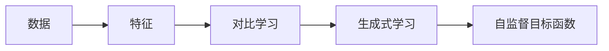
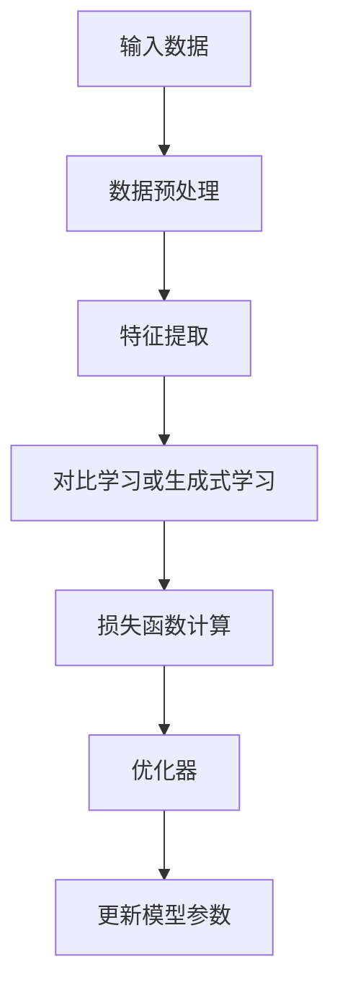

                 


# 自监督学习：减少AI Agent的标注数据依赖

> 关键词：自监督学习，AI Agent，数据标注，无监督学习，对比学习，生成式学习

> 摘要：自监督学习是一种新兴的人工智能技术，旨在减少AI Agent对标注数据的依赖。通过利用未标注数据中的结构信息，自监督学习能够在弱监督或无监督的环境中进行有效的特征学习和模型训练。本文将深入探讨自监督学习的核心原理、算法实现、系统架构以及实际应用，帮助读者理解如何在AI Agent开发中减少对标注数据的依赖。

---

## 第1章：自监督学习的背景与问题背景

### 1.1 自监督学习的定义与核心概念

自监督学习是一种结合了监督学习和无监督学习优点的机器学习范式。其核心思想是通过设计对比任务或生成任务，利用未标注数据中的内在结构信息来指导模型学习有用的特征表示。

- **自监督学习的定义**：自监督学习通过在未标注数据上构建对比任务或生成任务，引导模型学习数据的有用特征表示。其目标是通过无监督或弱监督的方式，减少对标注数据的依赖。

- **与监督学习的对比**：在监督学习中，模型需要依赖大量标注数据来训练，而自监督学习则通过利用未标注数据中的结构信息，减少对标注数据的依赖。

- **自监督学习的核心概念**：包括数据预处理、特征提取、对比学习、生成式学习等。

### 1.2 自监督学习的背景与问题背景

随着人工智能技术的快速发展，数据标注的成本和时间问题日益突出。标注高质量的数据集需要大量的人工投入，限制了AI Agent的广泛应用。自监督学习的提出为解决这一问题提供了新的思路。

- **数据标注的挑战**：标注数据需要专业知识和大量时间，成本高且耗时长。此外，标注错误可能会影响模型的性能。

- **自监督学习的提出与目标**：通过利用未标注数据中的结构信息，自监督学习能够在无监督或弱监督的环境中训练模型，减少对标注数据的依赖。

### 1.3 自监督学习的核心目标与边界

自监督学习的核心目标是通过未标注数据训练模型，提取数据的有用特征表示。其边界在于，虽然可以减少标注数据的依赖，但仍然需要一定的标注数据或任务定义来引导学习过程。

- **自监督学习的核心目标**：通过未标注数据学习数据的特征表示，减少对标注数据的依赖。

- **自监督学习的边界**：虽然可以减少标注数据的依赖，但需要一定的标注数据或任务定义来引导学习过程。

- **自监督学习的外延**：可以应用于图像、文本、语音等多种数据类型，适用于多种任务，如分类、聚类、生成等。

---

## 第2章：自监督学习的核心原理与概念联系

### 2.1 自监督学习的核心原理

自监督学习的核心原理在于通过构建对比任务或生成任务，利用未标注数据中的结构信息来引导模型学习有用的特征表示。

- **数据预处理与特征提取**：自监督学习通常需要对数据进行预处理，提取数据的特征表示。

- **对比学习与生成式学习**：对比学习通过构建对比任务，利用数据的相似性或差异性来训练模型；生成式学习则通过生成数据来训练模型。

- **数学模型与优化目标**：自监督学习的数学模型通常包括损失函数、优化目标等。

### 2.2 自监督学习的核心概念对比

- **监督学习与无监督学习的对比**：监督学习需要标注数据，无监督学习不需要标注数据。

- **自监督学习与半监督学习的对比**：半监督学习需要少量标注数据，自监督学习则通过构建任务来利用未标注数据。

- **自监督学习与强化学习的对比**：强化学习通过与环境交互获得奖励，自监督学习则通过利用数据的结构信息进行学习。

### 2.3 自监督学习的实体关系图



### 2.4 自监督学习的流程图



---

## 第3章：自监督学习的核心算法原理

### 3.1 对比学习算法

- **对比学习的基本原理**：通过构建对比任务，利用数据的相似性来训练模型。

- **对比学习的损失函数**：
  $$ L = -\log \text{sim}(x, x') + \log \text{sim}(x, \tilde{x'}) $$
  其中，$ \text{sim}(x, x') $ 表示输入样本 $x$ 和增强样本 $x'$ 的相似性，$ \tilde{x'} $ 表示负样本。

- **对比学习的流程图**：
  ```mermaid
  graph TD
      A[输入数据] --> B[数据增强]
      B --> C[特征提取]
      C --> D[对比损失计算]
      D --> E[优化器]
      E --> F[更新模型参数]
  ```

- **对比学习的Python代码示例**：
  ```python
  import torch
  def contrastive_loss(x, x_pos, x_neg, tau=0.1):
      x = torch.cat([x, x_pos, x_neg], dim=0)
      sim_pos = torch.cosine_similarity(x[:len(x)//2], x[len(x)//2:2*len(x)//2])
      sim_neg = torch.cosine_similarity(x[:len(x)//2], x[2*len(x)//2:])
      loss = -torch.mean(torch.log(torch.sigmoid(sim_pos / tau)) + torch.log(1 - torch.sigmoid(sim_neg / tau)))
      return loss
  ```

### 3.2 生成式学习算法

- **生成式学习的基本原理**：通过生成数据来训练模型。

- **生成式学习的数学模型**：
  $$ P(x) = \text{生成模型} $$
  $$ L = \text{生成模型的损失函数} $$

- **生成式学习的流程图**：
  ```mermaid
  graph TD
      A[输入数据] --> B[生成模型]
      B --> C[生成样本]
      C --> D[损失函数计算]
      D --> E[优化器]
      E --> F[更新模型参数]
  ```

---

## 第4章：系统分析与架构设计

### 4.1 系统架构设计

- **系统功能模块**：包括数据预处理模块、特征提取模块、对比学习模块、生成式学习模块等。

- **系统架构图**：
  ```mermaid
  graph LR
      A[数据预处理] --> B[特征提取]
      B --> C[对比学习或生成式学习]
      C --> D[损失函数计算]
      D --> E[优化器]
      E --> F[更新模型参数]
  ```

---

## 第5章：项目实战

### 5.1 环境配置

- **安装依赖**：安装PyTorch、numpy、matplotlib等。

### 5.2 核心实现

- **对比学习实现**：
  ```python
  import torch
  def contrastive_loss(x, x_pos, x_neg, tau=0.1):
      x = torch.cat([x, x_pos, x_neg], dim=0)
      sim_pos = torch.cosine_similarity(x[:len(x)//2], x[len(x)//2:2*len(x)//2])
      sim_neg = torch.cosine_similarity(x[:len(x)//2], x[2*len(x)//2:])
      loss = -torch.mean(torch.log(torch.sigmoid(sim_pos / tau)) + torch.log(1 - torch.sigmoid(sim_neg / tau)))
      return loss
  ```

---

## 第6章：最佳实践与小结

### 6.1 最佳实践

- **选择合适的自监督学习算法**：根据任务需求选择对比学习或生成式学习。

- **处理数据异构性**：通过数据增强、数据预处理等方法，提高模型的泛化能力。

### 6.2 小结

通过本文的介绍，读者可以深入了解自监督学习的核心原理、算法实现和系统架构。自监督学习作为一种新兴的人工智能技术，能够有效减少AI Agent对标注数据的依赖，为人工智能的发展提供了新的思路。

---

作者：AI天才研究院/AI Genius Institute & 禅与计算机程序设计艺术 /Zen And The Art of Computer Programming

