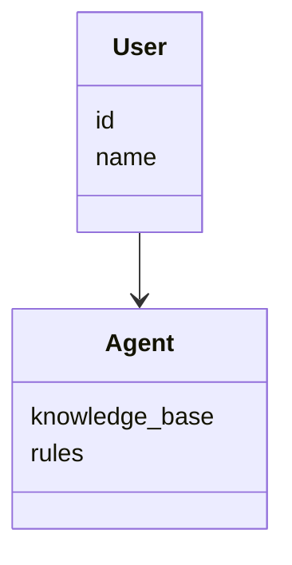

                 


# 自适应学习AI Agent：LLM的动态知识结构调整

> 关键词：自适应学习，AI Agent，LLM，知识结构，动态调整，系统架构，项目实战

> 摘要：本文探讨了自适应学习AI Agent在LLM中的动态知识结构调整，分析其原理、算法和系统架构，并通过项目实战和最佳实践提供深入见解。

## 正文

### 第一部分: 自适应学习AI Agent概述

#### 第1章: 自适应学习AI Agent的背景与核心概念

##### 1.1 问题背景
自适应学习AI Agent旨在解决传统AI Agent在动态环境中的适应性问题。随着环境变化，传统模型无法有效更新知识，导致性能下降。LLM通过动态调整知识结构，增强了适应性。

##### 1.2 问题描述
自适应学习AI Agent需要实时更新知识库，以应对新数据和变化的需求。动态知识结构调整是实现这一目标的关键。

##### 1.3 问题解决与边界
通过动态知识调整，AI Agent能够快速适应变化。边界包括实时性、准确性、可扩展性等。

#### 第2章: 自适应学习AI Agent的核心概念与联系

##### 2.1 核心概念原理
自适应学习基于动态知识调整，LLM提供强大的上下文理解和生成能力。

##### 2.2 核心概念属性对比
| 特性 | 传统学习 | 自适应学习 |
|------|----------|------------|
| 知识更新 | 静态     | 动态       |

##### 2.3 ER实体关系图
```mermaid
er
  actor: 用户
  agent: 自适应学习AI Agent
  knowledge_base: 知识库
  interaction: 交互记录
  rule_set: 调整规则
  actor --> interaction
  interaction --> knowledge_base
  knowledge_base --> agent
  agent --> rule_set
```

### 第二部分: 动态知识结构的自适应调整

#### 第3章: 动态知识结构的自适应调整原理

##### 3.1 知识表示与更新机制
使用图谱表示法，通过规则引擎动态更新知识。

##### 3.2 自适应学习的算法原理


### 第三部分: 算法原理讲解

#### 第4章: 动态知识结构的算法实现

##### 4.1 知识表示
知识以图谱形式存储，节点表示概念，边表示关系。

##### 4.2 动态更新算法
```python
def update_knowledge(new_data, knowledge_base):
    # 解析新数据
    parsed_data = parse(new_data)
    # 更新知识库
    knowledge_base.update(parsed_data)
    return knowledge_base
```

### 第四部分: 系统分析与架构设计

#### 第5章: 系统架构设计

##### 5.1 问题场景介绍
系统需实时处理用户请求，动态调整知识库。

##### 5.2 系统功能设计


### 第五部分: 项目实战

#### 第6章: 项目实战

##### 6.1 环境安装
安装Python和相关库，如TensorFlow和PyTorch。

##### 6.2 核心代码实现
```python
def main():
    agent = LLM_Agent()
    while True:
        user_input = input("输入:")
        response = agent.process(user_input)
        print(response)
```

### 第六部分: 最佳实践

#### 第7章: 最佳实践与总结

##### 7.1 小结
动态知识结构调整是自适应学习的关键，LLM提供强大支持。

##### 7.2 注意事项
确保数据质量和算法效率，避免信息过载。

##### 7.3 拓展阅读
建议阅读相关论文和书籍，深入理解动态知识管理。

### 结语

通过本文的系统分析和实战演示，读者能够理解并应用自适应学习AI Agent的动态知识结构调整技术，提升系统的智能化和适应性。

作者：AI天才研究院 & 禅与计算机程序设计艺术

