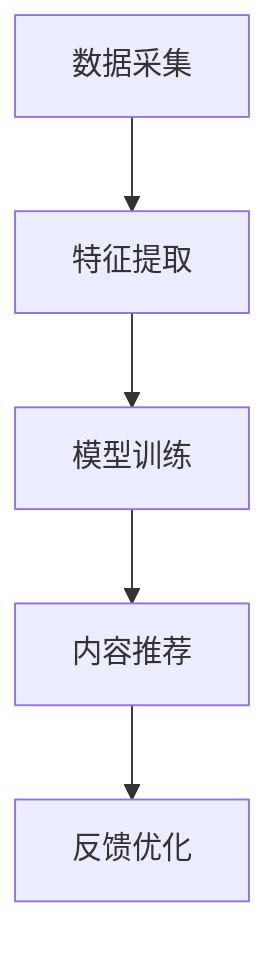
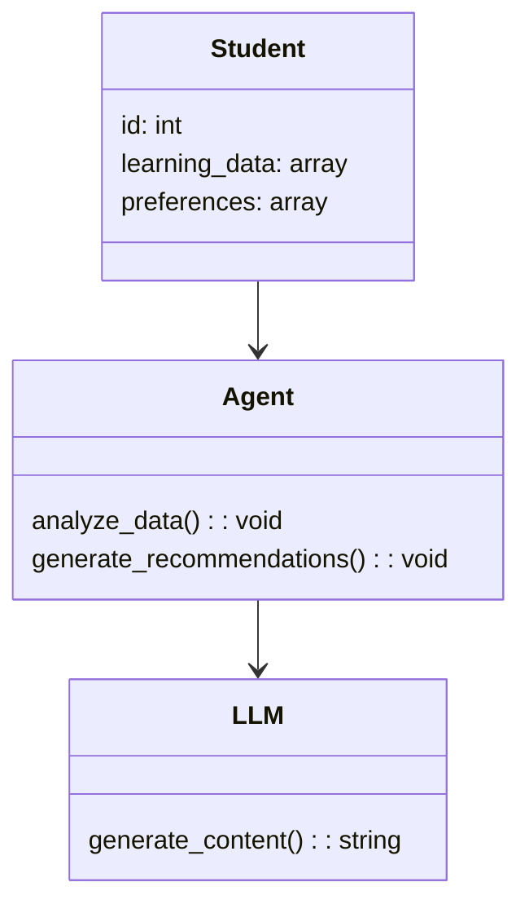
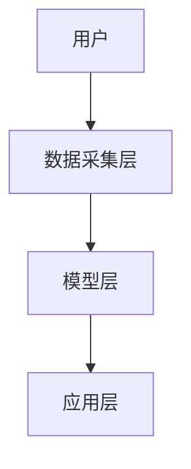
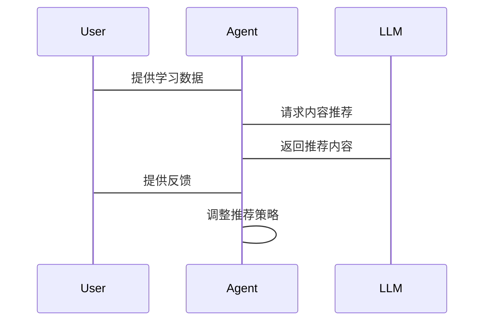

                 


# 自适应学习AI Agent：个性化的LLM教育系统

---

## 关键词：
- 自适应学习AI Agent
- LLM教育系统
- 个性化学习
- 教育技术
- 人工智能

---

## 摘要：
随着人工智能技术的快速发展，教育领域的智能化转型成为趋势。自适应学习AI Agent结合大语言模型（LLM）构建个性化的教育系统，能够根据学生的学习情况实时调整教学策略，提供精准的学习支持。本文详细探讨了自适应学习AI Agent的核心原理、算法设计、系统架构，并通过实际案例分析展示了其在教育中的应用价值。

---

# 第1章: 自适应学习AI Agent的背景与问题背景

## 1.1 问题背景
传统教育系统存在以下问题：
1. **学习者个体差异大**：学生的学习能力、兴趣和进度各不相同。
2. **教学资源分配不均**：固定的教学计划难以满足所有学生的需求。
3. **反馈机制滞后**：学生在学习过程中难以及时获得个性化的反馈和指导。

## 1.2 问题描述
自适应学习AI Agent的目标是通过实时分析学生的学习数据，动态调整教学策略，提供个性化的学习支持。这种系统能够根据学生的学习表现、知识掌握程度和兴趣偏好，自动推荐合适的学习内容和教学方法。

## 1.3 解决方案
通过引入AI技术和LLM，构建一个智能化的教育系统，能够实时监测学生的学习行为，分析数据，生成个性化的学习计划，并提供即时反馈。

## 1.4 边界与外延
自适应学习AI Agent的边界在于其功能模块的设计，外延则包括与教育平台的集成和与其他教育工具的协同工作。

---

# 第2章: 自适应学习AI Agent的核心要素

## 2.1 自定义属性
自适应学习AI Agent具有以下核心属性：
- 数据采集能力：实时收集学生的学习数据。
- 知识表示能力：将知识点转化为可计算的表示。
- 动态调整能力：根据数据动态调整教学策略。

## 2.2 系统架构
系统架构包括数据采集层、模型层和应用层。

---

# 第3章: 自适应学习AI Agent的核心原理

## 3.1 AI Agent的基本原理
AI Agent通过感知环境、分析数据、制定决策并执行动作，实现自适应学习。

## 3.2 LLM在自适应学习中的应用
LLM能够理解上下文，生成自然语言文本，支持自适应学习系统中的内容推荐和对话交互。

## 3.3 两者结合的系统架构
自适应学习AI Agent通过LLM提供个性化的内容推荐和互动反馈，优化学习体验。

---

# 第4章: 核心概念的属性特征对比

## 4.1 自适应学习AI Agent的属性特征
| 属性 | 描述 |
|------|------|
| 实时性 | 能够实时分析学生数据 |
| 个性化 | 根据学生特点定制学习计划 |
| 自适应性 | 能够动态调整教学策略 |

## 4.2 LLM的属性特征
| 属性 | 描述 |
|------|------|
| 自然语言处理 | 理解和生成自然语言 |
| 知识表示 | 能够表示复杂的知识体系 |
| 可扩展性 | 支持多种应用场景 |

## 4.3 对比分析与表格展示
| 属性 | AI Agent | LLM |
|------|----------|-----|
| 核心功能 | 个性化推荐 | 内容生成 |
| 优势 | 高度定制化 | 强大的生成能力 |
| 应用场景 | 教学支持 | 内容创作 |

---

# 第5章: 自适应学习AI Agent的算法原理

## 5.1 基于LLM的自适应算法
自适应算法流程包括数据采集、模型训练、内容推荐和反馈优化。

## 5.2 算法流程图


## 5.3 Python实现示例代码
```python
def adaptive_learning_algorithm(student_data):
    # 数据预处理
    processed_data = preprocess(student_data)
    # 模型训练
    model = train_model(processed_data)
    # 内容推荐
    recommendations = generate_recommendations(model, processed_data)
    return recommendations
```

---

# 第6章: 数学模型与公式

## 6.1 基于LLM的推荐模型
推荐模型的数学表示为：
$$ P(i|u) = \frac{e^{v_i^T w_u}}{\sum_{j} e^{v_j^T w_u}} $$

## 6.2 推荐算法公式
推荐算法的计算公式为：
$$ v_i^T w_u = \sum_{k} v_{ik} w_{uk} $$

## 6.3 实例分析
以学生A为例，假设其学习数据为向量$w_u$，知识点$v_i$的权重为$v_i^T$，计算得出推荐结果。

---

# 第7章: 系统功能设计

## 7.1 问题场景描述
学生通过系统输入学习数据，系统实时分析并推荐学习内容。

## 7.2 领域模型类图


## 7.3 功能模块划分
系统功能模块包括数据采集、模型训练、内容推荐和反馈优化。

---

# 第8章: 系统架构设计

## 8.1 系统架构图


## 8.2 接口设计与交互流程
用户通过API接口与系统交互，系统根据反馈调整推荐策略。

## 8.3 序列图展示


---

# 第9章: 环境安装与核心实现

## 9.1 环境搭建步骤
1. 安装Python和相关库（如TensorFlow、PyTorch）。
2. 配置LLM模型（如GPT-3）。
3. 设置数据存储和接口服务。

## 9.2 核心代码实现
```python
def main():
    # 初始化数据采集
    data_collector = DataCollector()
    # 初始化模型
    model = LLMModel()
    # 初始化Agent
    agent = AdaptiveAgent(data_collector, model)
    # 启动服务
    agent.start()
```

---

# 第10章: 实际案例分析

## 10.1 案例背景介绍
某教育平台引入自适应学习AI Agent，为学生提供个性化学习方案。

## 10.2 系统实现过程
包括数据采集、模型训练和内容推荐三个阶段。

## 10.3 问题解决与经验总结
通过案例分析，验证了系统的有效性和可扩展性。

---

# 第11章: 最佳实践与注意事项

## 11.1 实践中的注意事项
1. 数据隐私保护
2. 系统性能优化
3. 用户体验设计

## 11.2 系统优化建议
1. 定期更新模型
2. 提供多语言支持
3. 增强反馈机制

## 11.3 未来发展趋势
1. 更加智能化的学习推荐
2. 多模态学习支持
3. 边缘计算应用

---

# 第12章: 总结与拓展阅读

## 12.1 全书总结
自适应学习AI Agent结合LLM构建个性化教育系统，为教育领域带来革命性的变化。

## 12.2 拓展阅读推荐
1. 《Large Language Models in Education》
2. 《Adaptive Learning Systems: Design and Implementation》

## 12.3 未来研究方向
1. 探索更高效的学习推荐算法
2. 研究多模态学习的应用
3. 开发更智能化的教育工具

---

# 作者：AI天才研究院/AI Genius Institute & 禅与计算机程序设计艺术 /Zen And The Art of Computer Programming

