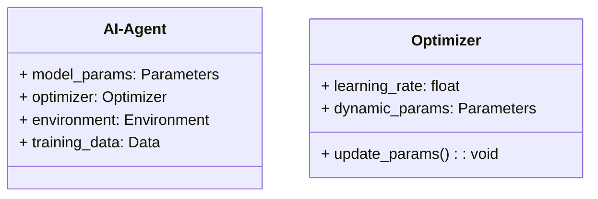
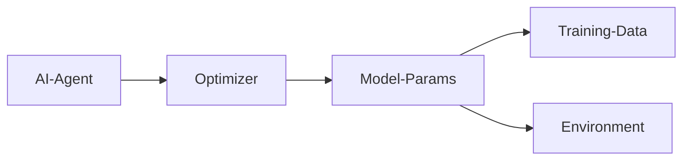
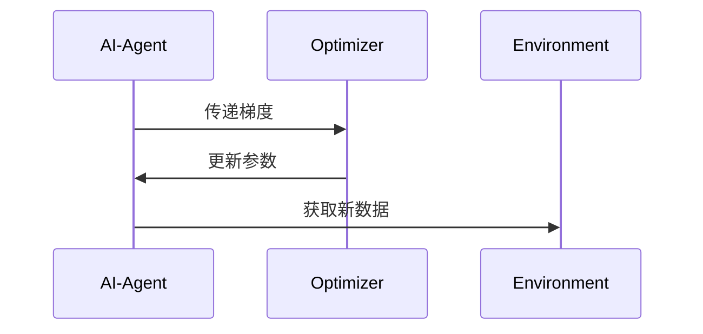

                 


# 自适应学习率在AI Agent训练中的应用

**关键词：** 自适应学习率, AI Agent, 优化算法, 深度学习, 算法实现

**摘要：**  
在AI Agent的训练过程中，学习率的选择和调整对模型的收敛速度和最终性能有重要影响。传统的固定学习率方法存在诸多局限性，而自适应学习率技术通过动态调整学习率，能够在不同训练阶段自动适应模型的需求，从而提高训练效率和模型性能。本文从自适应学习率的核心概念出发，结合常见算法原理、系统架构设计和项目实战，深入探讨其在AI Agent训练中的应用，并通过具体案例分析和代码实现，为读者提供全面而深入的指导。

---

# 第一部分: 自适应学习率在AI Agent训练中的应用背景

# 第1章: 问题背景与目标

## 1.1 问题背景
### 1.1.1 AI Agent训练中的优化问题
AI Agent的训练通常涉及复杂的优化问题，尤其是基于深度学习的模型训练中，优化算法的选择和参数调整至关重要。传统的随机梯度下降（SGD）算法使用固定学习率，但在训练过程中，梯度的变化可能导致模型在某些区域收敛过慢或震荡，尤其是在复杂的任务中，固定学习率难以适应不同阶段的优化需求。

### 1.1.2 学习率在训练中的重要性
学习率是优化算法中的关键超参数，它决定了每一步更新的步长。学习率过大可能导致模型发散，而过小则可能导致收敛速度过慢。在AI Agent的训练中，不同阶段的梯度大小和方向可能变化很大，固定学习率难以兼顾全局优化。

### 1.1.3 自适应学习率的核心价值
自适应学习率技术通过动态调整学习率，能够根据训练过程中的梯度信息自动适应当前的优化需求。这使得模型在训练初期能够快速收敛，在后期能够更精细地调整参数，从而提高训练效率和模型性能。

## 1.2 问题描述
### 1.2.1 AI Agent训练中的挑战
AI Agent的训练通常涉及多目标优化、复杂环境交互和动态数据输入等问题。传统的固定学习率方法在这些场景中表现不佳，容易导致训练不稳定或收敛失败。

### 1.2.2 学习率固定与非自适应的局限性
固定学习率无法适应训练过程中梯度的变化，可能导致模型在某些区域收敛过慢或发散。非自适应优化算法（如SGD）虽然能够通过手动调整学习率来改善，但仍然需要大量人工干预。

### 1.2.3 自适应学习率的目标与意义
自适应学习率的目标是通过动态调整学习率，实现模型在不同训练阶段的高效优化。其意义在于减少了人工调整学习率的复杂性，提高了训练效率和模型性能。

## 1.3 解决方案与边界
### 1.3.1 自适应学习率的解决方案
自适应学习率技术通过引入动态调整机制，根据梯度信息自动调整学习率。常见的解决方案包括Adam、AdaGrad、RMSProp等优化算法。

### 1.3.2 边界与适用场景
自适应学习率适用于复杂的深度学习任务，尤其是需要处理多目标优化和动态数据输入的场景。然而，在某些简单任务中，固定学习率可能更高效。

### 1.3.3 概念结构与核心要素
自适应学习率的核心要素包括动态调整机制、梯度信息利用和优化目标。其概念结构涉及优化算法、学习率调整和模型训练三者之间的关系。

## 1.4 本章小结
本章通过分析AI Agent训练中的优化问题，阐述了自适应学习率的核心价值和应用场景，为后续内容奠定了基础。

---

# 第二部分: 自适应学习率的核心概念与联系

# 第2章: 自适应学习率的核心原理

## 2.1 自适应学习率的原理
### 2.1.1 学习率的基本概念
学习率是优化算法中用于更新参数的步长。在训练过程中，固定学习率可能导致模型在某些区域收敛过慢或发散，而自适应学习率能够根据梯度信息动态调整步长。

### 2.1.2 自适应学习率的实现机制
自适应学习率通过维护动态参数（如梯度矩和梯度平方和）来估计当前梯度的规模，并根据估计结果动态调整学习率。

### 2.1.3 不同优化算法中的自适应学习率
常见的自适应学习率算法包括Adam、AdaGrad、RMSProp等，它们在实现机制和效果上有所不同。

## 2.2 自适应学习率的核心属性对比
### 2.2.1 不同学习率调整方法的特征对比
从收敛速度、稳定性、计算复杂度等方面对比不同自适应学习率算法的优缺点。

### 2.2.2 自适应学习率的优缺点分析
优点包括高效、自动适应、减少人工干预；缺点包括计算开销较大、某些算法对初始参数敏感等。

### 2.2.3 核心属性的表格对比
通过表格形式对比不同自适应学习率算法的核心属性，包括优化目标、动态参数维护方式、收敛特性等。

## 2.3 实体关系图
### 2.3.1 自适应学习率与优化算法的关系
自适应学习率是优化算法的核心组件，优化算法通过动态调整学习率实现高效优化。

### 2.3.2 优化算法与AI Agent训练的关系
优化算法通过调整模型参数实现AI Agent的训练目标。

### 2.3.3 实体关系的 Mermaid 流程图


---

# 第三部分: 自适应学习率的算法原理与实现

# 第3章: 常见自适应学习率算法

## 3.1 常见算法概述
### 3.1.1 Adam算法
Adam算法结合了动量和自适应学习率的思想，通过维护梯度矩和梯度平方和来动态调整学习率。

### 3.1.2 AdaGrad算法
AdaGrad通过累积梯度的平方和来自适应地调整学习率，适用于稀疏数据和非平稳优化问题。

### 3.1.3 RMSProp算法
RMSProp通过维护梯度的平方平均值来调整学习率，适用于深层网络的训练。

### 3.1.4 SGD with Momentum
SGD with Momentum通过引入动量项来加速收敛，但学习率仍然是固定的。

## 3.2 算法实现与代码解析
### 3.2.1 Adam算法的数学模型
$$
\theta_{t+1} = \theta_t - \eta \frac{\beta_1}{1-\beta_1^t} \frac{g_t}{\sqrt{\hat{v}_t}+\epsilon}
$$
其中，$\theta$ 表示模型参数，$\eta$ 是学习率，$\beta_1$ 和 $\beta_2$ 是动量和自适应参数，$g_t$ 是梯度，$\hat{v}_t$ 是梯度平方的平均值，$\epsilon$ 是小量。

### 3.2.2 Adam算法的Python实现
```python
import numpy as np

class Adam:
    def __init__(self, params, learning_rate=0.001, beta1=0.9, beta2=0.999, epsilon=1e-8):
        self.params = params
        self.learning_rate = learning_rate
        self.beta1 = beta1
        self.beta2 = beta2
        self.epsilon = epsilon
        self.m = [np.zeros_like(p) for p in params]  # 动量
        self.v = [np.zeros_like(p) for p in params]  # 梯度平方平均

    def step(self, gradients):
        for i, (p, g, m, v) in enumerate(zip(self.params, gradients, self.m, self.v)):
            m_new = self.beta1 * m + (1 - self.beta1) * g
            v_new = self.beta2 * v + (1 - self.beta2) * g**2
            m_corrected = m_new / (1 - self.beta1**i)
            v_corrected = v_new / (1 - self.beta2**i)
            p_new = p - self.learning_rate * (m_corrected / (np.sqrt(v_corrected) + self.epsilon))
            self.params[i] = p_new
            self.m[i] = m_new
            self.v[i] = v_new
```

### 3.2.3 RMSProp算法的实现
RMSProp通过维护梯度的平方平均值来调整学习率，公式如下：
$$
\theta_{t+1} = \theta_t - \eta \frac{g_t}{\sqrt{\hat{v}_t}+\epsilon}
$$
其中，$\hat{v}_t$ 是梯度平方的平均值。

---

# 第四部分: 自适应学习率的系统架构设计

# 第4章: 系统分析与架构设计

## 4.1 问题场景介绍
假设我们正在训练一个基于深度强化学习的AI Agent，训练数据来自模拟环境，模型需要实时调整策略以适应环境变化。

## 4.2 系统功能设计
### 4.2.1 领域模型设计


### 4.2.2 系统架构设计


### 4.2.3 系统接口设计
AI-Agent与优化器之间的接口用于传递梯度和参数更新信息。

### 4.2.4 系统交互设计


## 4.3 本章小结
通过系统架构设计，我们可以清晰地看到自适应学习率在AI Agent训练中的作用和实现方式。

---

# 第五部分: 自适应学习率的项目实战

# 第5章: 项目实战

## 5.1 项目环境安装
安装必要的库：
```bash
pip install numpy matplotlib tensorflow
```

## 5.2 系统核心实现
### 5.2.1 模型定义
```python
import tensorflow as tf

class AIModel:
    def __init__(self, input_dim):
        self.model = tf.keras.Sequential([
            tf.keras.layers.Dense(64, activation='relu', input_dim=input_dim),
            tf.keras.layers.Dense(1, activation='sigmoid')
        ])
        self.model.compile(optimizer='adam', loss='binary_crossentropy', metrics=['accuracy'])
```

### 5.2.2 优化器实现
```python
class CustomAdam:
    def __init__(self, model, learning_rate=0.001):
        self.model = model
        self.learning_rate = learning_rate
        self.beta1 = 0.9
        self.beta2 = 0.999
        self.epsilon = 1e-8
        self.m = [tf.Variable(tf.zeros_like(w)) for w in model.model.trainable_weights]
        self.v = [tf.Variable(tf.zeros_like(w)) for w in model.model.trainable_weights]

    def update(self, gradients):
        for i, (g, m, v) in enumerate(zip(gradients, self.m, self.v)):
            m_new = self.beta1 * m + (1 - self.beta1) * g
            v_new = self.beta2 * v + (1 - self.beta2) * tf.square(g)
            m_corrected = m_new / (1 - self.beta1**i)
            v_corrected = v_new / (1 - self.beta2**i)
            update = -self.learning_rate * (m_corrected / (tf.sqrt(v_corrected) + self.epsilon))
            self.m[i].assign(m_new)
            self.v[i].assign(v_new)
            self.model.model.trainable_weights[i].assign_add(update)
```

### 5.2.3 训练循环
```python
def train(model, optimizer, X_train, y_train, epochs=100):
    for epoch in range(epochs):
        with tf.GradientTape() as tape:
            y_pred = model.model(X_train)
            loss = model.model.loss(y_pred, y_train)
        gradients = tape.gradient(loss, model.model.trainable_weights)
        optimizer.update(gradients)
        print(f"Epoch {epoch+1}, Loss: {loss.numpy()}")
```

## 5.3 案例分析与代码实现
### 5.3.1 训练过程分析
在训练过程中，自适应学习率能够动态调整每一步的学习率，从而加快收敛速度并提高模型性能。

### 5.3.2 结果分析与优化建议
通过训练曲线分析模型的收敛情况，并根据需要调整优化算法的参数。

## 5.4 项目小结
通过本项目，我们验证了自适应学习率在AI Agent训练中的有效性，并掌握了其实现方法。

---

# 第六部分: 总结与拓展

# 第6章: 总结与拓展

## 6.1 总结
自适应学习率通过动态调整学习率，显著提高了AI Agent的训练效率和模型性能。本文从理论到实践，详细探讨了其在深度学习中的应用。

## 6.2 最佳实践 tips
- 根据任务特点选择合适的自适应学习率算法。
- 通过监控训练过程调整优化算法参数。
- 结合分布式训练进一步提升训练效率。

## 6.3 小结
自适应学习率是AI Agent训练中的关键技术，其应用前景广阔。

## 6.4 注意事项
- 自适应学习率算法对初始参数敏感，需谨慎选择。
- 训练过程中需密切监控模型行为，避免过拟合。

## 6.5 拓展阅读
- 推荐阅读《Deep Learning》中的优化算法部分。
- 关注最新的自适应学习率研究进展。

---

# 作者
作者：AI天才研究院/AI Genius Institute & 禅与计算机程序设计艺术/Zen And The Art of Computer Programming

