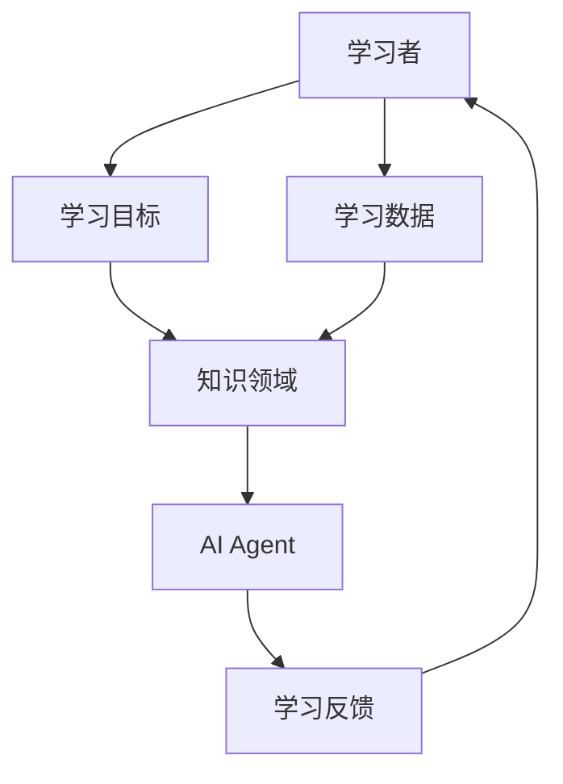
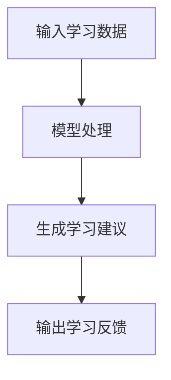
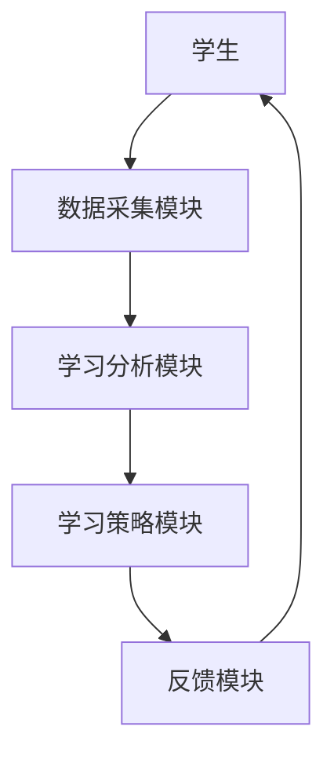

                 


# 自适应教育AI Agent：个性化LLM辅助学习系统

## 关键词：自适应教育，AI Agent，LLM，个性化学习，教育技术

## 摘要：  
随着人工智能技术的快速发展，教育领域正在经历一场深刻的变革。个性化学习的需求日益增长，而传统的教育模式往往难以满足每个学生的独特需求。本文将深入探讨自适应教育AI Agent的概念、原理及其在实际应用中的潜力。通过结合大语言模型（LLM）和自适应学习算法，我们能够为学生提供更加智能化、个性化的学习支持。文章从背景介绍、核心概念、算法原理、系统架构设计到实际案例分析，全面解析如何构建一个高效、智能的个性化LLM辅助学习系统。

---

# 第一部分：自适应教育AI Agent背景与核心概念

## 第1章：自适应教育AI Agent概述

### 1.1 问题背景与目标
#### 1.1.1 当前教育中的问题与挑战
现代教育系统面临以下主要问题：
- **个性化需求不足**：传统教育模式通常以教师为中心，难以满足每个学生的个性化学习需求。
- **学习效率低下**：学生在学习过程中可能因为知识点掌握不牢固或学习进度不一致，导致整体学习效率下降。
- **反馈延迟**：传统的作业批改和学习反馈通常需要较长时间，无法实时指导学生的学习过程。

#### 1.1.2 自适应学习的核心目标
自适应学习的目标是通过智能化的算法和技术，动态调整学习内容、进度和方式，以满足每个学生的个性化需求。具体目标包括：
- 提供个性化学习路径。
- 实时反馈学习进展。
- 自动调整学习难度。

#### 1.1.3 AI Agent在教育中的作用
AI Agent（智能代理）在教育中的作用主要体现在：
- **个性化推荐**：根据学生的学习情况，推荐适合的学习材料和练习题。
- **实时反馈**：通过分析学生的学习行为，提供即时的学习反馈。
- **学习规划**：帮助学生制定合理的学习计划，优化学习效率。

### 1.2 自适应教育AI Agent的定义与特点
#### 1.2.1 自适应教育AI Agent的定义
自适应教育AI Agent是一种基于人工智能技术的教育工具，能够根据学生的学习行为、知识掌握程度和学习风格，动态调整学习内容、进度和策略，以最大化学生的学习效果。

#### 1.2.2 自适应教育AI Agent的核心特点
- **个性化**：根据学生的特点和需求，提供定制化的学习方案。
- **实时性**：能够实时分析学生的学习行为，快速响应并提供反馈。
- **自适应性**：系统能够动态调整学习内容和策略，以适应学生的学习进度。

#### 1.2.3 自适应教育AI Agent与传统教育工具的对比

| 对比维度 | 自适应教育AI Agent | 传统教育工具 |
|----------|---------------------|--------------|
| 个性化 | 高度个性化 | 较低或无个性化 |
| 实时性 | 高 | 低或无实时性 |
| 互动性 | 高 | 较低互动性 |

### 1.3 问题解决思路与边界
#### 1.3.1 自适应学习的核心问题解决思路
自适应学习的核心问题是如何根据学生的学习数据，动态调整学习内容和策略。解决思路包括：
1. 收集学生的学习数据（如学习行为、成绩、反馈等）。
2. 分析数据，识别学生的知识掌握情况和学习需求。
3. 根据分析结果，动态调整学习内容和策略。

#### 1.3.2 边界与外延
- **边界**：自适应教育AI Agent的核心功能是提供个性化学习支持，不包括传统的教学内容设计。
- **外延**：可以与其他教育技术（如虚拟现实、增强现实）结合，提供更丰富的学习体验。

#### 1.3.3 核心要素组成分析
自适应教育AI Agent的核心要素包括：
- **学习者模型**：用于分析学生的学习行为和知识掌握情况。
- **学习内容库**：存储丰富的学习资源。
- **自适应算法**：用于动态调整学习内容和策略。

### 1.4 核心概念关系图


### 1.5 本章小结
本章介绍了自适应教育AI Agent的基本概念、核心目标和特点，并通过对比分析突出了其优势。同时，通过关系图展示了自适应教育AI Agent的核心要素及其相互关系。

---

## 第2章：自适应教育AI Agent的核心概念与联系

### 2.1 自适应教育AI Agent的核心原理
#### 2.1.1 自然语言处理（NLP）基础
自然语言处理是AI Agent理解学生输入（如文本、语音）并生成自然语言输出的核心技术。

#### 2.1.2 大语言模型（LLM）的基本原理
大语言模型（如GPT系列）通过深度学习技术，从海量数据中学习语言模式，能够生成与上下文相关的文本。

#### 2.1.3 自适应学习算法的核心原理
自适应学习算法通过分析学生的学习数据，动态调整学习内容和策略。

### 2.2 核心概念对比分析
#### 2.2.1 传统教育系统与自适应教育系统的对比
- **传统教育系统**：基于固定的教学计划，适用于大多数学生。
- **自适应教育系统**：基于学生个体需求，提供个性化学习支持。

#### 2.2.2 不同AI Agent模型的对比分析
| 对比维度 | 基于规则的AI Agent | 基于机器学习的AI Agent |
|----------|---------------------|-------------------------|
| 决策方式 | 基于预设规则 | 基于数据训练的模型 |
| 灵活性 | 较低 | 较高 |
| 学习能力 | 无 | 有 |

#### 2.2.3 LLM与其他教育技术的对比
| 对比维度 | LLM | 其他教育技术（如传统教学工具） |
|----------|-----|------------------------------|
| 个性化 | 高 | 低 |
| 实时性 | 高 | 低 |
| 交互性 | 高 | 低 |

### 2.3 实体关系图（Mermaid）


### 2.4 本章小结
本章详细分析了自适应教育AI Agent的核心原理，并通过对比分析突出了其优势。同时，通过实体关系图展示了系统的核心要素及其相互关系。

---

## 第3章：大语言模型（LLM）在自适应教育中的应用

### 3.1 LLM的基本原理
#### 3.1.1 Transformer模型的工作原理
Transformer模型通过自注意力机制，能够捕捉到输入中的长距离依赖关系。

#### 3.1.2 注意力机制的数学模型
注意力机制的数学公式如下：
$$
\text{Attention}(Q, K, V) = \text{softmax}\left(\frac{QK^T}{\sqrt{d_k}}\right)V
$$

其中，$Q$ 是查询向量，$K$ 是键向量，$V$ 是值向量，$d_k$ 是向量的维度。

#### 3.1.3 LLM的训练过程
LLM的训练过程包括以下步骤：
1. **数据预处理**：清洗数据，划分训练集、验证集和测试集。
2. **模型构建**：构建Transformer模型。
3. **损失函数定义**：使用交叉熵损失函数。
4. **优化器选择**：常用Adam优化器。
5. **模型训练**：通过反向传播优化模型参数。

### 3.2 LLM在自适应教育中的具体应用
#### 3.2.1 个性化学习内容生成
AI Agent可以根据学生的学习数据，生成适合其水平和兴趣的学习材料。

#### 3.2.2 学习效果评估与反馈
AI Agent可以通过分析学生的学习数据，评估其学习效果，并提供实时反馈。

#### 3.2.3 自动化学习路径规划
AI Agent可以根据学生的学习进度和知识掌握情况，自动调整学习路径。

### 3.3 算法流程图（Mermaid）


### 3.4 本章小结
本章详细介绍了大语言模型（LLM）的基本原理，并探讨了其在自适应教育中的具体应用。通过流程图展示了LLM在自适应学习中的工作流程。

---

## 第4章：系统分析与架构设计

### 4.1 问题场景介绍
本系统的目标是为学生提供个性化的学习支持，帮助学生高效地掌握知识。

### 4.2 系统功能设计
系统功能模块包括：
- **数据采集模块**：收集学生的学习数据。
- **学习分析模块**：分析学生的学习数据。
- **学习策略模块**：根据分析结果，制定学习策略。
- **反馈模块**：提供实时反馈。

### 4.3 系统架构设计
系统架构采用分层设计：
1. **数据层**：存储学生的学习数据。
2. **服务层**：提供数据处理和分析服务。
3. **应用层**：实现系统的功能模块。

### 4.4 系统接口设计
系统接口包括：
- **数据接口**：用于数据的输入和输出。
- **API接口**：用于与其他系统的交互。

### 4.5 系统交互流程图（Mermaid）


### 4.6 本章小结
本章详细分析了系统的功能设计和架构设计，并通过流程图展示了系统的交互流程。

---

## 第5章：项目实战

### 5.1 环境安装
安装Python和相关库（如TensorFlow、Keras）。

### 5.2 系统核心实现源代码
以下是一个简单的自适应学习算法的实现代码：
```python
def adaptive_learning_algorithm(student_data):
    # 分析学生数据
    knowledge_gap = identify_gaps(student_data)
    # 制定学习策略
    learning_strategy = create_strategy(knowledge_gap)
    # 提供反馈
    feedback = generate_feedback(knowledge_gap)
    return learning_strategy, feedback
```

### 5.3 代码应用解读与分析
上述代码通过分析学生的学习数据，识别知识缺口，并制定学习策略和提供反馈。

### 5.4 实际案例分析
以下是一个实际案例的分析：
1. **输入数据**：学生的学习数据。
2. **分析结果**：识别学生的知识缺口。
3. **输出结果**：制定学习策略和提供反馈。

### 5.5 本章小结
本章通过实际代码和案例分析，展示了如何实现自适应学习算法。

---

## 第6章：总结与展望

### 6.1 总结
本文详细介绍了自适应教育AI Agent的概念、原理和应用，并通过实际案例分析展示了其潜力。

### 6.2 展望
未来，自适应教育AI Agent将与更多教育技术结合，为学生提供更加智能化、个性化的学习支持。

---

## 作者：AI天才研究院/AI Genius Institute & 禅与计算机程序设计艺术 /Zen And The Art of Computer Programming

---

感谢您的阅读！希望本文能够为您提供有价值的信息和启发。

