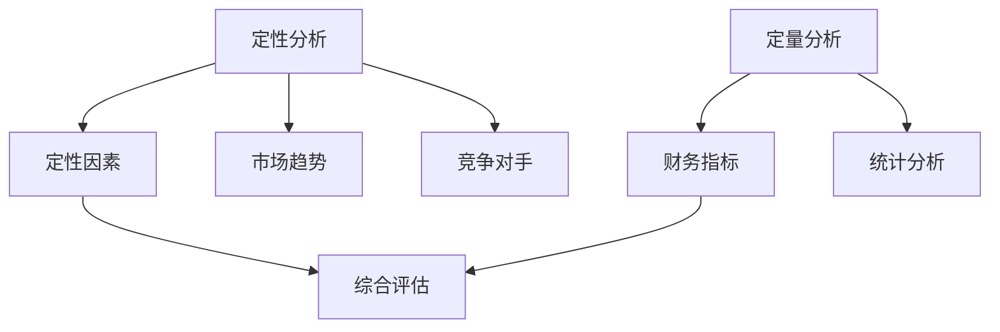
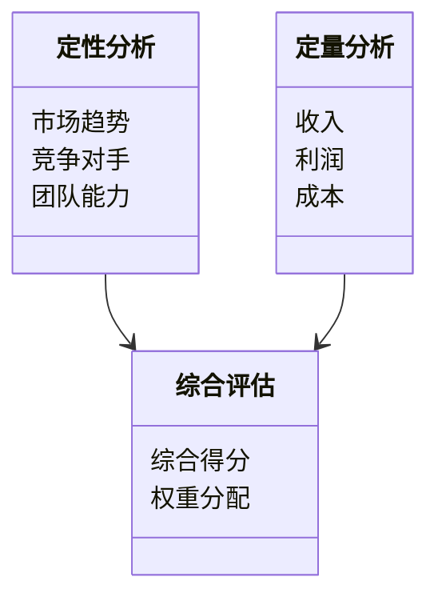
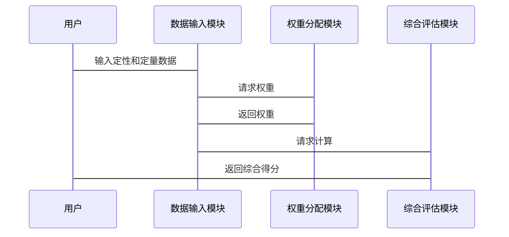

                 


# 芒格的"双轨分析"：定性和定量分析的结合

> **关键词**：双轨分析，定性分析，定量分析，芒格，投资决策，系统设计

> **摘要**：芒格的双轨分析是一种结合定性和定量分析的方法，旨在通过综合考虑非财务因素和财务指标来做出更明智的决策。本文详细介绍了双轨分析的背景、核心概念、算法原理、系统设计以及项目实战，帮助读者全面理解并掌握这一方法。

---

## 第1章 双轨分析的背景介绍

### 1.1 问题背景：定性和定量分析的局限性

在决策过程中，无论是投资、管理还是技术领域，分析方法的选择至关重要。传统的定性分析依赖于经验和主观判断，而定量分析则依赖于数据和模型。然而，单独使用其中一种方法往往存在局限性：

- **定性分析的局限性**：难以量化，主观性强，缺乏客观依据。
- **定量分析的局限性**：依赖数据的完整性和准确性，难以捕捉非数据因素。

### 1.2 问题描述：如何结合两者提高决策质量

芒格提出的双轨分析方法，旨在结合定性和定量分析的优势，克服各自的局限性。通过同时考虑非财务因素和财务指标，双轨分析能够提供更全面的决策支持。

### 1.3 双轨分析的核心概念

- **双轨分析**：一种结合定性和定量分析的方法，通过综合考虑多个维度的信息，提高决策的准确性和可靠性。
- **定性分析**：关注非财务因素，如市场趋势、竞争对手分析、团队能力等。
- **定量分析**：关注财务指标，如收入、利润、成本等。

---

## 第2章 定性分析与定量分析的核心概念

### 2.1 定性分析的原理与特点

#### 2.1.1 定性分析的定义

定性分析是指通过研究非财务因素，如市场趋势、竞争对手行为、客户反馈等，来评估项目的潜在风险和机会。

#### 2.1.2 定性分析的核心要素

- **市场分析**：研究市场规模、增长率、竞争对手等。
- **风险评估**：识别潜在风险并评估其影响。
- **团队能力**：分析团队的经验和能力是否符合项目需求。

#### 2.1.3 定性分析的优缺点

- **优点**：能够捕捉到数据之外的重要信息，提供更全面的视角。
- **缺点**：主观性强，难以量化，结果依赖分析者的判断力。

### 2.2 定量分析的原理与特点

#### 2.2.1 定量分析的定义

定量分析是通过收集和分析数据，使用数学模型和统计方法来评估项目的可行性和风险。

#### 2.2.2 定量分析的核心要素

- **财务指标**：如收入、利润、成本等。
- **数据分析**：通过统计方法分析数据，识别趋势和模式。
- **模型构建**：使用数学模型预测未来的结果。

#### 2.2.3 定量分析的优缺点

- **优点**：客观、可量化，结果具有较高的可信度。
- **缺点**：依赖数据的准确性和完整性，难以捕捉非数据因素。

### 2.3 定性与定量分析的联系与区别

#### 2.3.1 对比分析表格

| 属性            | 定性分析          | 定量分析          |
|-----------------|-------------------|-------------------|
| 数据类型         | 非数据           | 数据               |
| 方法             | 主观判断         | 统计分析           |
| 优缺点           | 全面但主观       | 客观但可能片面     |

#### 2.3.2 实体关系图（ER图）的Mermaid流程图



---

## 第3章 双轨分析的算法实现

### 3.1 算法原理概述

双轨分析的算法原理是通过同时考虑定性和定量因素，构建一个综合评估模型。以下是其实现步骤：

1. **数据收集**：收集定性和定量数据。
2. **权重分配**：根据重要性分配权重。
3. **综合评估**：计算综合得分。

### 3.2 算法的数学模型与公式

#### 3.2.1 数学模型的构建

综合得分公式如下：

$$
\text{综合得分} = \sum_{i=1}^{n} w_i \cdot x_i
$$

其中，$w_i$ 是第 $i$ 个因素的权重，$x_i$ 是第 $i$ 个因素的得分。

#### 3.2.2 关键公式推导

假设我们有 $m$ 个定性因素和 $n$ 个定量因素，综合得分公式可以扩展为：

$$
\text{综合得分} = \sum_{j=1}^{m} w_j \cdot x_j + \sum_{k=1}^{n} w_k \cdot y_k
$$

其中，$x_j$ 和 $y_k$ 分别是定性和定量因素的得分，$w_j$ 和 $w_k$ 是对应的权重。

### 3.3 算法的Python实现

#### 3.3.1 环境安装与配置

需要安装以下库：

- pandas
- numpy
- scikit-learn

#### 3.3.2 核心代码实现

```python
import pandas as pd
import numpy as np

def double轨分析(data, weights):
    qualitative = data['定性因素']
    quantitative = data['定量因素']
    qualitative_score = qualitative.dot(weights['定性权重'])
    quantitative_score = quantitative.dot(weights['定量权重'])
    total_score = qualitative_score + quantitative_score
    return total_score

# 示例数据
data = {
    '定性因素': [0.8, 0.6, 0.7],
    '定量因素': [0.9, 0.5, 0.8]
}
weights = {
    '定性权重': [0.3, 0.2, 0.5],
    '定量权重': [0.4, 0.3, 0.3]
}

结果 = double轨分析(data, weights)
print(结果)
```

---

## 第4章 双轨分析的系统设计

### 4.1 系统功能设计

#### 4.1.1 领域模型的Mermaid类图



#### 4.1.2 系统功能模块划分

- **数据输入模块**：接收定性和定量数据。
- **权重分配模块**：根据需求分配权重。
- **综合评估模块**：计算综合得分并输出结果。

### 4.2 系统架构设计

#### 4.2.1 系统架构的Mermaid架构图

```mermaid
container 双轨分析系统 {
    数据输入模块
    权重分配模块
    综合评估模块
}
```

### 4.3 系统接口设计

- **输入接口**：接收用户输入的定性和定量数据。
- **输出接口**：显示综合得分和分析结果。

### 4.4 系统交互设计

#### 4.4.1 交互流程的Mermaid序列图



---

## 第5章 双轨分析的项目实战

### 5.1 项目背景与目标

假设我们正在评估一个新产品的市场潜力，需要结合市场需求和财务指标进行分析。

### 5.2 核心代码实现

```python
import pandas as pd
import numpy as np

# 示例数据
data = {
    '市场需求': [0.8, 0.6, 0.7],
    '收入': [0.9, 0.5, 0.8]
}
weights = {
    '市场需求权重': [0.3, 0.2, 0.5],
    '收入权重': [0.4, 0.3, 0.3]
}

# 计算综合得分
def 计算综合得分(data, weights):
    定性得分 = data['市场需求'].dot(weights['市场需求权重'])
    定量得分 = data['收入'].dot(weights['收入权重'])
    return 定性得分 + 定量得分

结果 = 计算综合得分(data, weights)
print(结果)
```

### 5.3 项目小结

通过双轨分析，我们可以更全面地评估项目的可行性，结合定性和定量分析的优势，提高决策的准确性。

---

## 总结

芒格的双轨分析是一种结合定性和定量分析的方法，能够帮助我们更全面地做出决策。通过本文的介绍，读者可以理解双轨分析的核心概念、算法原理和系统设计，并通过项目实战掌握其应用方法。

---

**作者：AI天才研究院/AI Genius Institute & 禅与计算机程序设计艺术 /Zen And The Art of Computer Programming**

