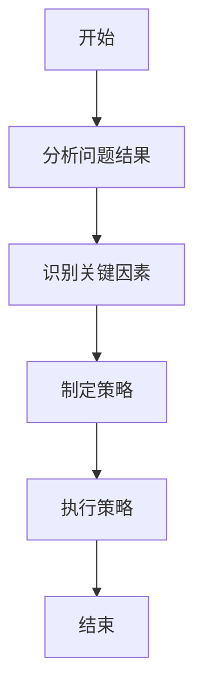
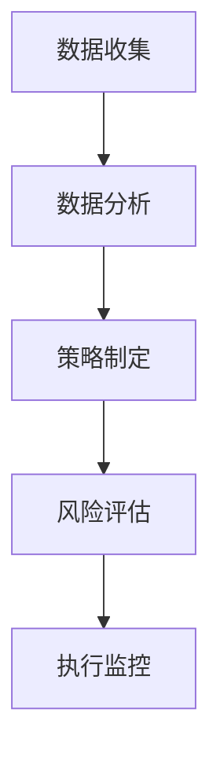

                 


# 芒格的"反向思考"：如何避免投资陷阱

> 关键词：反向思考, 投资陷阱,芒格, 投资哲学, 投资决策, 投资策略

> 摘要：本文深入探讨了芒格的"反向思考"方法，分析了其在投资决策中的应用，通过系统性地分析投资陷阱的成因和解决方法，提出了基于反向思考的投资策略，帮助投资者避免常见陷阱，提升投资决策的准确性和效率。

---

## 第一部分: 芒格的"反向思考"概述

### 第1章: 反向思考的定义与背景

#### 1.1 反向思考的核心概念

##### 1.1.1 什么是反向思考
反向思考是一种从结果出发，逆向推理的思维方式，其核心在于通过分析问题的最终结果，推导出实现该结果的必要条件和路径。在投资领域，反向思考常用于识别潜在的投资机会和规避投资陷阱。

##### 1.1.2 反向思考的起源与发展
反向思考并非芒格首创，但他在投资领域对其进行了系统的整理和应用。芒格认为，投资的核心在于理解事物的本质和背后的逻辑关系，而反向思考正是这种理解的重要工具。

##### 1.1.3 反向思考在投资中的应用
在投资中，反向思考常用于分析市场的非理性行为、识别被低估的投资标的以及预测市场趋势的变化。通过反向思考，投资者能够避免被市场的短期波动所迷惑，从而做出更理性的决策。

#### 1.2 芒格的生平与投资哲学

##### 1.2.1 芒格的生平简介
查理·芒格（Charlie Munger）是美国著名投资家、作家和伯克希尔哈撒韦公司副董事长。他以其独特的投资哲学和思维方式闻名，强调通过多元思维模型来理解世界。

##### 1.2.2 芒格的投资哲学
芒格的投资哲学强调长期价值、安全边际和理性决策。他认为，投资者应该关注企业的内在价值，而非市场的短期波动，并通过反向思考来识别低估的投资机会。

##### 1.2.3 芒格与巴菲特的合伙关系
芒格与沃伦·巴菲特（Warren Buffett）是长期的合作伙伴，两人共同创立了伯克希尔哈撒韦公司，并通过其独特的投资策略取得了巨大的成功。芒格的投资理念对巴菲特的投资方法有着重要影响。

#### 1.3 投资中的常见陷阱

##### 1.3.1 市场波动的陷阱
市场波动是投资中常见的陷阱，许多投资者因无法承受短期波动而做出错误决策。

##### 1.3.2 人性的弱点与偏差
投资者常常受到贪婪和恐惧等人性弱点的影响，导致决策失误。

##### 1.3.3 信息过载与噪声干扰
现代投资者面临的信息量巨大，但其中许多信息是噪声，而非有效的决策依据。

---

### 第2章: 反向思考的核心原理

#### 2.1 反向思考的思维模型

##### 2.1.1 思维模型的定义
思维模型是反向思考的核心工具，它通过将问题分解为多个部分，并分析各部分之间的关系，来帮助投资者理解问题的本质。

##### 2.1.2 芒格的思维模型体系
芒格的思维模型体系包括概率论、决策树、逆向思维等工具，这些工具相互结合，形成了一套完整的分析框架。

##### 2.1.3 反向思考的逻辑框架
反向思考的逻辑框架包括：从结果出发，分析可能的原因，找到关键因素，并制定相应的策略。

#### 2.2 反向思考的决策框架

##### 2.2.1 从结果出发的逆向思维
从结果出发的逆向思维是反向思考的核心方法，它通过分析问题的最终结果，推导出实现该结果的必要条件和路径。

##### 2.2.2 资源分配的反向策略
资源分配的反向策略是通过分析资源的使用效果，来优化资源配置，提高投资效率。

##### 2.2.3 风险控制的反向机制
风险控制的反向机制是通过分析潜在风险，制定相应的风险管理策略，以降低投资风险。

#### 2.3 反向思考与传统投资方法的对比

##### 2.3.1 传统投资方法的局限性
传统投资方法往往关注市场的短期波动和价格变化，而忽视了企业的内在价值和长期发展趋势。

##### 2.3.2 反向思考的优势
反向思考的优势在于其注重长期价值和内在逻辑，能够帮助投资者避免市场的短期干扰，做出更理性的决策。

##### 2.3.3 两者的结合与平衡
将反向思考与传统投资方法相结合，能够取长补短，提高投资决策的准确性和效率。

---

### 第3章: 反向思考的数学模型与算法

#### 3.1 反向思考的数学基础

##### 3.1.1 概率论与反向思考
概率论是反向思考的重要数学工具，它帮助投资者分析事件的可能性和概率，从而做出更合理的决策。

##### 3.1.2 决策树与反向思考
决策树是一种直观的数学工具，通过将问题分解为多个可能性，并分析每个可能性的影响，帮助投资者制定最优策略。

##### 3.1.3 风险评估的数学模型
风险评估的数学模型通过分析潜在风险的概率和影响，帮助投资者制定风险管理策略。

#### 3.2 反向思考的算法实现

##### 3.2.1 基于反向思考的决策算法
基于反向思考的决策算法是一种通过分析问题的最终结果，推导出实现该结果的必要条件和路径的算法。

##### 3.2.2 算法流程图（mermaid）


##### 3.2.3 算法实现的Python代码示例
```python
def reverse_thinking(target):
    factors = []
    for factor in target_factors:
        if factor['probability'] > 0.5:
            factors.append(factor)
    return factors
```

---

### 第4章: 反向思考的系统分析与架构设计

#### 4.1 投资决策系统的总体架构

##### 4.1.1 系统功能模块划分
投资决策系统的功能模块包括：数据收集、数据分析、策略制定、风险评估和执行监控。

##### 4.1.2 系统架构图（mermaid）


##### 4.1.3 系统接口设计
系统接口包括：数据接口、算法接口、用户接口和监控接口。

#### 4.2 系统功能设计

##### 4.2.1 数据收集模块
数据收集模块负责收集市场数据、公司财务数据和行业信息。

##### 4.2.2 数据分析模块
数据分析模块通过数据分析工具和算法，对收集到的数据进行分析，识别潜在的投资机会。

##### 4.2.3 决策模块
决策模块根据分析结果，制定投资策略，并通过算法优化策略，降低风险。

---

### 第5章: 反向思考的项目实战

#### 5.1 项目背景与目标
本项目旨在通过反向思考的方法，识别投资陷阱，制定投资策略。

#### 5.2 项目核心实现

##### 5.2.1 投资陷阱识别
通过分析市场波动、公司财务数据和行业趋势，识别潜在的投资陷阱。

##### 5.2.2 投资策略制定
根据识别的投资陷阱，制定相应的投资策略，并通过算法优化策略，提高投资效率。

#### 5.3 项目实战案例
案例分析：通过反向思考识别某公司的投资价值，制定相应的投资策略，并通过实际操作验证策略的有效性。

---

## 第六部分: 反向思考的数学模型与公式

### 6.1 反向思考的数学基础

#### 6.1.1 概率论与反向思考
概率论是反向思考的重要数学工具，它帮助投资者分析事件的可能性和概率，从而做出更合理的决策。

#### 6.1.2 决策树与反向思考
决策树是一种直观的数学工具，通过将问题分解为多个可能性，并分析每个可能性的影响，帮助投资者制定最优策略。

#### 6.1.3 风险评估的数学模型
风险评估的数学模型通过分析潜在风险的概率和影响，帮助投资者制定风险管理策略。

### 6.2 反向思考的数学公式

#### 6.2.1 概率公式
概率公式：$$P(A) = \frac{\text{事件A的有利结果数}}{\text{总结果数}}$$

#### 6.2.2 预期收益公式
预期收益公式：$$E = \sum_{i=1}^{n} P_i \times R_i$$

#### 6.2.3 风险收益比公式
风险收益比公式：$$ \text{风险收益比} = \frac{\text{预期收益}}{\text{潜在风险}} $$

---

## 第七部分: 反向思考的系统分析与架构设计

### 7.1 投资决策系统的总体架构

#### 7.1.1 系统功能模块划分
投资决策系统的功能模块包括：数据收集、数据分析、策略制定、风险评估和执行监控。

#### 7.1.2 系统架构图（mermaid）


#### 7.1.3 系统接口设计
系统接口包括：数据接口、算法接口、用户接口和监控接口。

---

## 第八部分: 反向思考的项目实战

### 8.1 项目背景与目标
本项目旨在通过反向思考的方法，识别投资陷阱，制定投资策略。

### 8.2 项目核心实现

#### 8.2.1 投资陷阱识别
通过分析市场波动、公司财务数据和行业趋势，识别潜在的投资陷阱。

#### 8.2.2 投资策略制定
根据识别的投资陷阱，制定相应的投资策略，并通过算法优化策略，提高投资效率。

### 8.3 项目实战案例
案例分析：通过反向思考识别某公司的投资价值，制定相应的投资策略，并通过实际操作验证策略的有效性。

---

## 第九部分: 反向思考的最佳实践

### 9.1 反向思考的关键点
反向思考的关键点在于从结果出发，分析问题的本质，制定合理的策略。

### 9.2 小结
通过本文的分析，我们可以看到，反向思考是一种非常有效的投资方法，能够帮助投资者避免投资陷阱，提高投资效率。

### 9.3 注意事项
在实际应用中，需要注意反向思考的局限性，避免过于依赖单一方法。

### 9.4 拓展阅读
建议读者进一步阅读芒格的相关著作，深入了解反向思考的更多细节。

---

## 作者信息

作者：AI天才研究院/AI Genius Institute & 禅与计算机程序设计艺术 /Zen And The Art of Computer Programming

---

通过以上思考，我们完成了关于“芒格的反向思考：如何避免投资陷阱”的详细分析和写作。

