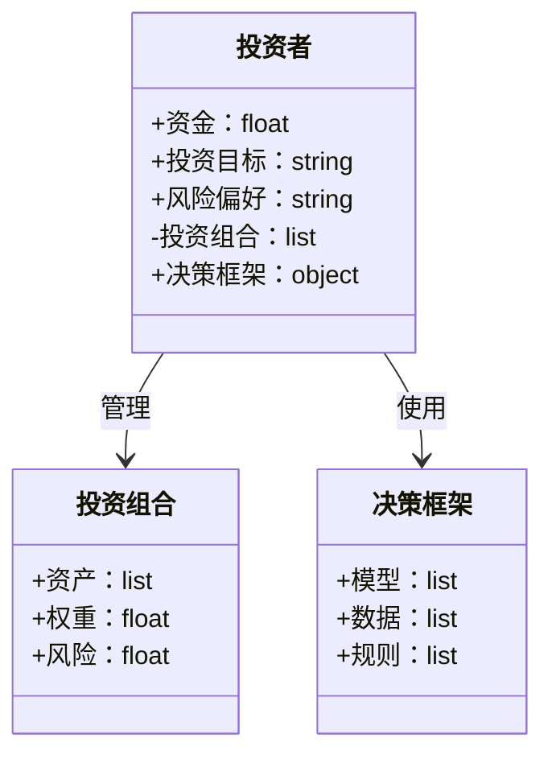
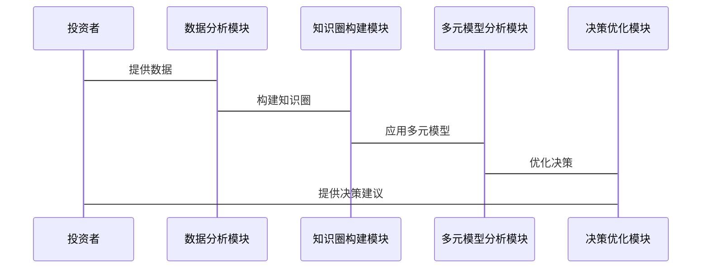

                 


# 芒格的"地图思维"：构建全面的投资框架

## 关键词：芒格，地图思维，投资框架，系统思维，决策模型，思维模型

## 摘要：芒格的“地图思维”是一种通过构建多元思维模型来优化投资决策的方法。本文将从核心概念、算法原理、系统架构、项目实战等多方面详细阐述“地图思维”的构建过程，帮助读者建立全面的投资框架。

---

## 第一章：芒格的“地图思维”概述

### 1.1 “地图思维”的核心概念

#### 1.1.1 投资中的“地图思维”是什么
“地图思维”是芒格提出的一种投资方法，强调通过构建多元思维模型来理解和分析问题。它类似于绘制地图，通过多个视角和模型来捕捉问题的本质。

#### 1.1.2 “地图思维”的重要性
在投资决策中，单一的视角往往会导致片面判断。通过“地图思维”，投资者能够综合多个领域的知识，降低决策风险，提高决策质量。

#### 1.1.3 “地图思维”与其他投资方法的区别
传统的投资方法通常依赖单一模型或经验，而“地图思维”强调多模型的结合与协同，注重全局性和系统性。

### 1.2 芒格的多元思维模型

#### 1.2.1 多元思维模型的定义
多元思维模型是指将多个领域的基本原理和规律整合起来，形成一个综合的分析框架。

#### 1.2.2 多元思维模型的特点
- **多样性**：涵盖多个学科和领域。
- **互补性**：各模型之间相互补充，形成完整的认知体系。
- **动态性**：根据实际情况不断调整和优化。

#### 1.2.3 多元思维模型与“地图思维”的关系
“地图思维”是多元思维模型的应用方式，通过将多个模型整合起来，形成一个完整的认知框架。

### 1.3 “地图思维”在投资中的应用

#### 1.3.1 投资中的知识圈构建
投资者需要构建一个广泛的知识圈，涵盖经济学、心理学、统计学等领域，为决策提供多维度支持。

#### 1.3.2 思维模型的分类与特点
- **经济模型**：如供需关系、成本曲线。
- **心理学模型**：如行为偏差、认知偏差。
- **统计模型**：如回归分析、概率计算。

#### 1.3.3 决策框架的构建与优化
通过整合多元思维模型，构建一个完整的决策框架，确保投资决策的全面性和科学性。

### 1.4 本章小结

---

## 第二章：芒格“地图思维”的核心概念与联系

### 2.1 知识圈与思维模型

#### 2.1.1 知识圈的构建
投资者需要不断扩展知识圈，涵盖多个领域，形成多维度的认知基础。

#### 2.1.2 思维模型的分类
- **基础模型**：如经济学、心理学的基本原理。
- **高级模型**：如系统思维、复杂性理论。

#### 2.1.3 知识圈与思维模型的关系
知识圈为思维模型提供基础，思维模型则帮助投资者更好地理解和分析问题。

### 2.2 决策框架的构建

#### 2.2.1 决策框架的定义
决策框架是指通过整合多元思维模型，形成一套完整的决策流程和方法。

#### 2.2.2 决策框架的核心要素
- **信息收集**：全面收集相关数据。
- **模型分析**：应用多元模型进行分析。
- **决策优化**：根据分析结果优化决策。

#### 2.2.3 决策框架的优化与调整
根据实际情况不断优化和调整决策框架，确保其适应性和有效性。

### 2.3 系统思维与“地图思维”

#### 2.3.1 系统思维的定义
系统思维是指从整体出发，分析问题的各个部分及其相互关系。

#### 2.3.2 系统思维与“地图思维”的联系
“地图思维”是一种系统思维的应用方式，通过整合多个模型，形成系统的认知框架。

#### 2.3.3 系统思维在投资中的应用
通过系统思维，投资者能够更好地识别系统性风险，制定长期投资策略。

### 2.4 本章小结

---

## 第三章：芒格“地图思维”的算法原理

### 3.1 系统思维模型的构建

#### 3.1.1 系统思维模型的定义
系统思维模型是指通过系统的方法，构建一个多模型的分析框架。

#### 3.1.2 系统思维模型的构建步骤
1. **明确目标**：确定分析的目标和范围。
2. **收集数据**：全面收集相关数据。
3. **选择模型**：根据问题选择合适的模型。
4. **整合模型**：将多个模型整合起来，形成系统化的分析框架。
5. **验证与优化**：验证模型的有效性，并进行优化。

#### 3.1.3 系统思维模型的优化方法
- **动态调整**：根据实际情况不断调整模型。
- **模型迭代**：通过多次迭代优化模型。

### 3.2 多元思维模型的分类与应用

#### 3.2.1 多元思维模型的分类
- **基础模型**：如经济学模型、心理学模型。
- **高级模型**：如系统模型、复杂性模型。

#### 3.2.2 多元思维模型的应用
通过应用多元模型，投资者能够从多个角度分析问题，避免单一视角的局限性。

### 3.3 算法实现与优化

#### 3.3.1 算法实现
通过编写代码，实现多元思维模型的分析和优化。

#### 3.3.2 算法优化
根据实际应用效果，不断优化算法，提高分析效率和准确性。

### 3.4 本章小结

---

## 第四章：系统分析与架构设计

### 4.1 问题场景介绍

#### 4.1.1 投资决策中的系统分析
通过系统分析，投资者能够更好地理解市场动态和风险因素。

### 4.2 系统功能设计

#### 4.2.1 领域模型（mermaid 类图）


#### 4.2.2 系统架构（mermaid 架构图）
```mermaid
architecturalDiagram
    节点 投资者 {
        组件 投资决策模块
        组件 数据分析模块
        组件 风险评估模块
    }
    节点 系统 {
        组件 知识圈构建模块
        组件 多元模型分析模块
        组件 决策优化模块
    }
    投资者 --> 系统: 使用
    系统 --> 数据源: 获取数据
```

### 4.3 系统接口设计

#### 4.3.1 系统接口
- **输入接口**：接收投资者的输入数据。
- **输出接口**：输出分析结果和决策建议。

### 4.4 系统交互（mermaid 序列图）



### 4.5 本章小结

---

## 第五章：项目实战

### 5.1 环境安装

#### 5.1.1 环境要求
- Python 3.8+
- Jupyter Notebook
- 必要的库（如numpy、pandas）

### 5.2 系统核心实现源代码

#### 5.2.1 投资组合分析代码

```python
import numpy as np
import pandas as pd

def calculate_return(prices):
    returns = []
    for i in range(1, len(prices)):
        returns.append(prices[i] / prices[i-1])
    return pd.Series(returns)
```

#### 5.2.2 风险评估代码

```python
def calculate_risk(returns):
    return np.std(returns)
```

#### 5.2.3 多元模型应用代码

```python
def apply_models(data, models):
    results = []
    for model in models:
        results.append(model.predict(data))
    return results
```

### 5.3 代码应用解读与分析

#### 5.3.1 投资组合分析
通过代码计算投资组合的收益和风险，为决策提供数据支持。

#### 5.3.2 风险评估
利用统计模型评估投资组合的风险，帮助投资者做出更明智的决策。

### 5.4 案例分析与详细讲解

#### 5.4.1 案例分析
以实际投资案例为例，展示如何应用多元思维模型进行分析和决策。

#### 5.4.2 详细讲解
从数据收集、模型选择到最终决策，详细讲解每一步的操作和原理。

### 5.5 本章小结

---

## 第六章：总结与最佳实践

### 6.1 总结

#### 6.1.1 核心内容回顾
通过构建多元思维模型，投资者能够更好地理解和分析市场，做出更明智的决策。

### 6.2 最佳实践 tips

#### 6.2.1 小结
- 多元思维模型是“地图思维”的核心。
- 系统分析和优化是投资成功的关键。

#### 6.2.2 注意事项
- 定期更新知识圈和模型。
- 避免过度依赖单一模型。
- 保持谨慎和理性，避免盲目跟风。

#### 6.2.3 拓展阅读
- 《穷查理宝典》
- 《投资学原理》

### 6.3 本章小结

---

## 作者：AI天才研究院/AI Genius Institute & 禅与计算机程序设计艺术 /Zen And The Art of Computer Programming

---

通过以上结构，本文详细阐述了芒格的“地图思维”在投资中的应用，从核心概念到算法实现，再到系统设计和项目实战，为读者构建了一个全面的投资框架。希望读者能够通过本文，掌握“地图思维”的精髓，优化自己的投资决策。

