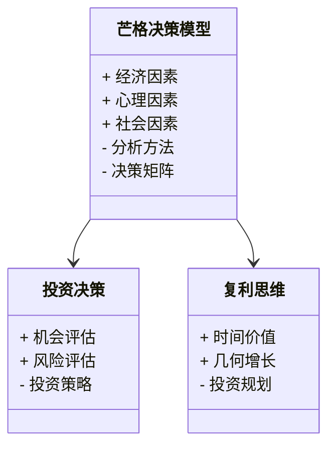
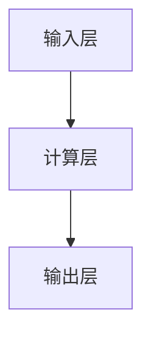
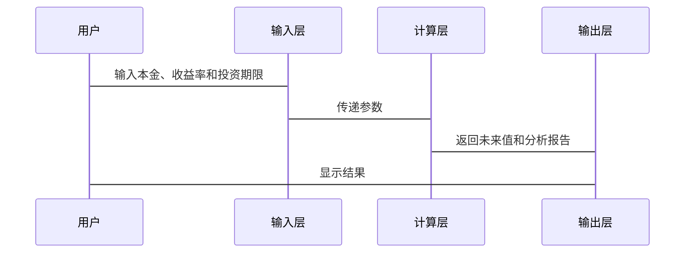
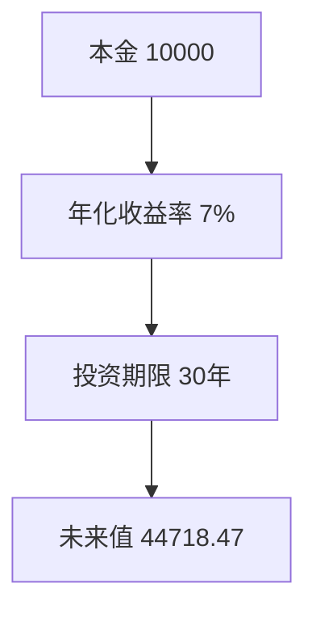

                 


# 芒格的"复利思维"在长期投资中的应用

---

## 关键词：芒格，复利思维，长期投资，投资策略，决策模型

---

## 摘要：  
芒格的"复利思维"是一种将时间和决策相结合的投资哲学，强调通过长期积累和正确决策实现财富的几何级增长。本文从复利思维的核心概念出发，结合芒格的投资理念，分析其在长期投资中的应用，并通过系统架构设计、项目实战和最佳实践，帮助读者深入理解如何将复利思维融入投资决策中。

---

## 第1章: 复利思维的核心概念与背景介绍

### 1.1 复利思维的定义与特征  
复利思维是一种通过时间和复利效应实现财富积累的投资理念。其核心特征包括：  
- **时间价值**：复利效应随时间增长而加速。  
- **几何增长**：财富以指数形式增长，而非线性增长。  
- **积累效应**：通过不断 reinvest，收益滚雪球式增长。  

### 1.2 复利思维在投资中的重要性  
复利思维在投资中具有以下重要作用：  
- **财富倍增**：通过复利效应，财富可以实现几何级增长。  
- **风险管理**：复利思维强调长期稳健的投资策略，降低短期波动的影响。  
- **决策优化**：复利思维帮助投资者在决策中考虑长期的复利效应，避免短期行为。  

### 1.3 芒格的生平与投资理念  
芒格是巴菲特的合作伙伴，其投资理念以价值投资和长期持有为核心。芒格强调：  
- **安全边际**：在投资中，确保本金安全是首要任务。  
- **逆向思维**：通过寻找市场的非共识性机会实现超额收益。  
- **复利效应**：芒格认为，复利思维是实现长期财富增长的核心驱动力。  

---

## 第2章: 复利思维的核心概念与数学模型

### 2.1 复利的数学模型  
复利的计算公式为：  
$$ A = P \times (1 + r)^n $$  
其中，$A$ 是终值，$P$ 是本金，$r$ 是年化收益率，$n$ 是投资年数。  

#### 2.1.1 复利与简单利息的对比  
简单利息公式为：  
$$ A = P \times (1 + r \times n) $$  
复利与简单利息的区别在于，复利计算的是本金和之前累计的利息之和，而简单利息仅计算本金的利息。  

### 2.2 复利因子与现值因子  
- **复利因子**：用于计算未来值的系数，公式为：  
$$ (1 + r)^n $$  
- **现值因子**：用于计算当前值的系数，公式为：  
$$ \frac{1}{(1 + r)^n} $$  

#### 对比表格：  

| 项目 | 复利因子 | 现值因子 |
|------|----------|----------|
| 公式 | $(1 + r)^n$ | $\frac{1}{(1 + r)^n}$ |
| 作用 | 计算未来值 | 计算当前值 |

### 2.3 复利的几何增长与时间价值  
- **几何增长**：复利效应导致财富以指数形式增长。  
- **时间价值**：时间越长，复利效应越显著，财富增长越快。  

#### 图1：复利增长的流程图  
```mermaid
graph TD
    A[本金 P] --> B[第一年收益 P \times r]
    B --> C[本金 + 利息 = P + P \times r]
    C --> D[第二年收益 (P + P \times r) \times r]
    D --> E[本金 + 利息 = (P + P \times r) + (P + P \times r) \times r]
    E --> F[... 以此类推]
```

---

## 第3章: 芒格的决策模型与复利思维

### 3.1 芒格的决策模型  
芒格的决策模型包括以下关键点：  
- **" inversion"原则**：芒格强调从反面思考问题，寻找市场的非共识性机会。  
- **决策框架**：芒格通过分析经济、心理和社会因素，制定投资决策。  
- **决策矩阵**：芒格将决策分为四个象限，优先考虑高价值低风险的选项。  

### 3.2 复利思维在决策中的应用  
- **投资决策**：复利思维帮助投资者选择具有长期增长潜力的资产。  
- **风险管理**：通过复利思维，投资者可以更好地评估风险对长期收益的影响。  
- **长期规划**：复利思维帮助投资者制定长期的投资计划，确保财富的持续增长。  

#### 图2：芒格决策模型的类图  


---

## 第4章: 复利思维的系统分析与架构设计

### 4.1 系统架构设计  
复利思维的系统架构包括以下部分：  
- **输入层**：用户输入本金、收益率和投资期限。  
- **计算层**：计算复利效应，生成未来值。  
- **输出层**：显示投资结果和分析报告。  

#### 图3：系统架构图  


### 4.2 系统接口设计  
- **复利计算接口**：用于计算未来值。  
- **风险评估接口**：用于评估投资风险。  

### 4.3 系统交互设计  
#### 图4：交互序列图  


---

## 第5章: 项目实战

### 5.1 投资组合优化问题  
假设我们需要优化一个投资组合，目标是在给定的风险下实现最大收益。  

#### 5.1.1 环境配置  
安装 Python 和必要的库（如 numpy 和 matplotlib）。  

#### 5.1.2 核心代码实现  
```python
import numpy as np
import matplotlib.pyplot as plt

def compound_interest(P, r, n, t):
    return P * (1 + r) ** t

# 示例计算
P = 10000
r = 0.07
t = 30
A = compound_interest(P, r, 0, t)
print(f"未来值：{A:.2f}")
```

#### 5.1.3 图表展示  


#### 图5：投资组合优化的交互序列图  


---

## 第6章: 最佳实践与小结

### 6.1 最佳实践  
- **长期持有**：复利思维强调长期持有，避免频繁交易。  
- **分散投资**：通过分散投资降低风险，同时享受复利效应。  
- **持续学习**：不断学习和优化投资策略，提升复利效应。  

### 6.2 小结  
芒格的复利思维是一种将时间和决策相结合的投资哲学，其核心在于通过长期积累和正确决策实现财富的几何级增长。本文通过系统分析和项目实战，帮助读者深入理解复利思维在长期投资中的应用，并提供了实用的投资策略和最佳实践。

---

## 附录: 扩展阅读

- 《芒格投资哲学》  
- 《复利的奥秘》  
- 《巴菲特的复利思维》  

---

## 作者：AI天才研究院/AI Genius Institute & 禅与计算机程序设计艺术 /Zen And The Art of Computer Programming

