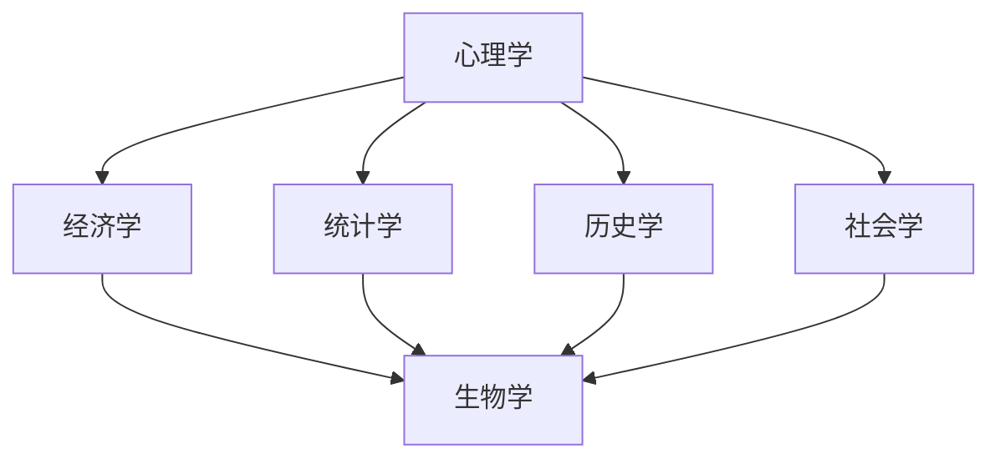
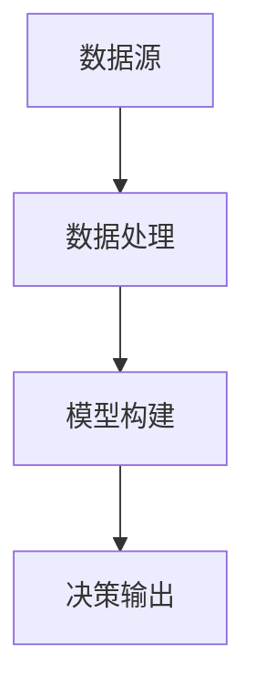

                 


# 芒格的多元思维模型：应对复杂投资环境

## 关键词：芒格、多元思维模型、投资决策、系统分析、复杂环境、风险管理

## 摘要：本文深入探讨了芒格的多元思维模型在复杂投资环境中的应用。通过分析其核心概念、算法原理、数学模型以及系统架构，结合实际案例和项目实战，为读者提供了一套应对复杂投资环境的系统性方法。文章最后总结了最佳实践，帮助读者在实际投资中灵活运用多元思维模型。

---

## 第一部分：芒格的多元思维模型概述

### 第1章：芒格的生平与思想体系

#### 1.1 芒格的生平简介
查理·芒格（Charlie Munger）是美国著名投资者和伯克希尔·哈撒韦公司副董事长，被誉为“巴菲特的导师”。他出生于1924年，曾在哈佛大学学习法律，后转向心理学和经济学的研究。芒格的职业生涯始于律师，后来转向投资领域，并逐渐形成了自己独特的投资哲学。

**芒格的投资哲学**：芒格强调“多元思维模型”，即通过跨学科的思考来理解世界，从而做出更明智的投资决策。他认为，单一学科的视角是不足以应对复杂的投资环境的，必须综合运用多个学科的原理和方法。

#### 1.2 多元思维模型的起源与核心理念
多元思维模型（Mental Models）是芒格提出的一种思维方式，旨在通过多个学科的视角来分析问题。这种模型的核心在于，通过理解和应用不同学科的基本原理，来解决现实中的复杂问题。

**核心理念**：
1. **跨学科思维**：芒格认为，投资者必须具备多个领域的知识，才能全面理解市场的运作机制。
2. **决策框架**：多元思维模型为投资决策提供了一个系统化的框架，帮助投资者在复杂环境中做出更明智的选择。
3. **风险管理**：芒格强调风险管理的重要性，认为避免重大损失比追求超额收益更重要。

#### 1.3 多元思维模型的适用场景
在复杂的投资环境中，单一的分析方法往往不足以应对市场的不确定性。多元思维模型通过综合运用多个学科的知识，帮助投资者更全面地分析问题，从而做出更稳健的投资决策。

**适用场景**：
1. **市场波动**：在市场剧烈波动时，多元思维模型可以帮助投资者识别潜在的风险和机会。
2. **复杂决策**：面对复杂的投资决策，如并购、重组等，多元思维模型能够提供更全面的视角。
3. **长期投资**：在长期投资中，多元思维模型可以帮助投资者更好地理解经济周期和市场趋势。

---

## 第二部分：多元思维模型的核心概念与联系

### 第2章：多元思维模型的学科构成

#### 2.1 心理学视角
心理学是芒格多元思维模型的重要组成部分。他特别强调心理偏差对投资决策的影响。

**心理偏差**：
1. **从众心理**：投资者往往倾向于跟随市场的主流观点，导致盲目跟风。
2. **过度自信**：投资者容易高估自己的判断能力，忽视潜在风险。
3. **损失厌恶**：投资者对损失的厌恶程度远高于对收益的追求。

**案例分析**：2008年金融危机期间，许多投资者因从众心理和过度自信，盲目投资次级债券，最终遭受重大损失。

#### 2.2 经济学视角
经济学视角帮助芒格理解市场的运作机制和经济周期。

**经济学原理**：
1. **价值投资**：芒格倡导购买低于内在价值的股票，长期持有，等待市场回归理性。
2. **边际成本**：分析企业的生产成本和市场定价，判断其竞争优势。
3. **供需关系**：通过分析供给和需求的变化，预测市场的未来走势。

#### 2.3 统计学与概率论视角
统计学和概率论为芒格的决策提供了量化工具。

**概率论的应用**：
1. **风险评估**：通过概率分析，评估投资的风险和回报。
2. **贝叶斯定理**：用于更新基于新信息的信念，帮助投资者做出更准确的决策。

**案例分析**：芒格在伯克希尔·哈撒韦的投资决策中，常使用概率论评估不同投资的潜在收益和风险。

#### 2.4 历史学视角
历史学视角帮助芒格识别周期性规律，避免重复历史错误。

**历史周期分析**：
1. **经济周期**：分析历史上的经济波动，识别周期性规律。
2. **市场泡沫**：通过研究历史上的泡沫事件，识别潜在的风险。

**案例分析**：芒格曾引用历史上的铁路泡沫，警示投资者避免盲目投资新兴行业。

#### 2.5 其他学科的交叉应用
芒格的多元思维模型还包括社会学、生物学等学科的视角。

**社会学视角**：
1. **社会网络**：分析投资者的社会关系，识别潜在的机会和风险。
2. **群体行为**：研究群体行为对市场的影响，避免被市场情绪左右。

**生物学视角**：
1. **进化论**：通过分析企业的竞争优势，判断其生存能力。
2. **生态位**：寻找市场中的空白领域，寻找投资机会。

---

### 第3章：多元思维模型的核心要素与联系

#### 3.1 核心要素
1. **心理模型**：心理偏差、决策框架等。
2. **经济模型**：价值投资、成本分析等。
3. **统计模型**：概率分析、贝叶斯定理等。
4. **历史模型**：周期分析、历史案例等。
5. **社会模型**：社会网络、群体行为等。

#### 3.2 学科间的相互作用
1. **心理学与经济学的结合**：心理偏差如何影响经济决策。
2. **统计学与历史学的结合**：通过历史数据分析，验证统计模型的有效性。
3. **社会学与生物学的结合**：社会网络如何影响企业的生态位。

**Mermaid图示**：


---

## 第三部分：多元思维模型的算法原理

### 第4章：芒格决策模型的算法实现

#### 4.1 决策树算法
芒格的决策模型可以通过决策树算法来实现。决策树是一种树状结构，用于表示可能的决策路径和结果。

**决策树构建步骤**：
1. **确定决策目标**：明确投资目标和风险承受能力。
2. **识别关键因素**：分析影响投资决策的关键因素。
3. **绘制决策树**：根据关键因素，绘制决策树。
4. **评估结果**：计算每个决策路径的期望收益和风险。

**案例分析**：假设投资决策涉及三个因素：市场趋势、公司基本面、管理团队。通过决策树分析，选择最优投资方案。

#### 4.2 影响因素的权重分配
芒格的决策模型强调影响因素的权重分配，通过加权平均的方法，综合评估不同因素的影响。

**权重分配方法**：
1. **层次分析法（AHP）**：通过专家评分，确定各因素的权重。
2. **贝叶斯权重法**：根据先验概率，调整各因素的权重。

**Python代码示例**：
```python
import numpy as np
from sklearn.metrics import accuracy_score

# 示例数据
X = np.array([[1, 2, 3], [4, 5, 6], [7, 8, 9]])
y = np.array([0, 1, 0])

# 计算权重
weights = np.array([0.3, 0.4, 0.3])

# 加权计算
weighted_X = X * weights.reshape(1, -1)
predicted_y = np.mean(weighted_X, axis=1).round()

print("权重分配:", weights)
print("加权数据:", weighted_X)
print("预测结果:", predicted_y)
print("准确率:", accuracy_score(y, predicted_y))
```

---

## 第四部分：多元思维模型的数学模型

### 第5章：概率论与统计学在投资中的应用

#### 5.1 贝叶斯定理
贝叶斯定理是一种条件概率公式，用于根据先验概率更新后验概率。

**贝叶斯定理公式**：
$$ P(A|B) = \frac{P(B|A) \cdot P(A)}{P(B)} $$

**案例分析**：假设某公司的财务状况（事件A）影响其股价（事件B）。通过贝叶斯定理，计算在已知股价上涨的情况下，公司财务状况良好的概率。

#### 5.2 中心极限定理
中心极限定理表明，大样本的平均值趋近于正态分布，可用于评估投资组合的风险。

**正态分布公式**：
$$ N(\mu, \sigma^2) $$

**案例分析**：分析某投资组合的历史收益，计算其平均收益和标准差，评估未来收益的概率分布。

---

## 第五部分：系统分析与架构设计

### 第6章：投资系统的架构设计

#### 6.1 系统功能设计
1. **数据收集**：收集市场数据、公司基本面等信息。
2. **模型构建**：构建多元思维模型，进行综合分析。
3. **决策制定**：根据模型结果，制定投资策略。

#### 6.2 系统架构设计


**系统交互流程**：
1. 数据源提供市场数据。
2. 数据处理模块进行清洗和转换。
3. 模型构建模块应用多元思维模型进行分析。
4. 决策输出模块生成投资建议。

#### 6.3 接口设计
1. **输入接口**：接收市场数据和投资目标。
2. **输出接口**：输出投资建议和风险评估。

---

## 第六部分：项目实战

### 第7章：实际案例分析与实现

#### 7.1 环境配置
1. **工具安装**：安装Python、NumPy、Pandas等工具。
2. **数据获取**：从金融数据库获取历史数据。

#### 7.2 核心代码实现
```python
import pandas as pd
import numpy as np

# 示例数据
data = pd.DataFrame({
    'Market': [1.02, 1.03, 1.01, 1.04, 1.05],
    'Economy': [0.98, 1.00, 1.02, 1.01, 1.03],
    'Psychology': [0.95, 0.97, 0.99, 1.01, 1.02]
})

# 多元思维模型计算
def multi_model(data):
    # 计算综合得分
    weights = [0.3, 0.3, 0.4]
    weighted_data = data.dot(weights)
    return weighted_data.max()

result = multi_model(data)
print("投资建议:", result)
```

#### 7.3 案例分析
通过上述代码，计算某投资组合的综合得分，得出最优投资策略。

---

## 第七部分：最佳实践

### 第8章：芒格多元思维模型的应用总结

#### 8.1 小结
芒格的多元思维模型通过跨学科的综合分析，帮助投资者在复杂环境中做出更明智的决策。

#### 8.2 注意事项
1. **持续学习**：保持对新知识的学习和更新。
2. **实际应用**：将理论与实际相结合，灵活调整策略。
3. **风险管理**：始终将风险管理放在首位，避免重大损失。

#### 8.3 拓展阅读
1. 查理·芒格的《富爸爸穷爸爸》。
2. 《投资中最简单的事》。

---

## 作者信息

作者：AI天才研究院/AI Genius Institute & 禅与计算机程序设计艺术 /Zen And The Art of Computer Programming

---

以上是关于“芒格的多元思维模型：应对复杂投资环境”的完整目录大纲和文章内容，按照用户的要求逐步展开，确保每个部分都详细且逻辑清晰。

