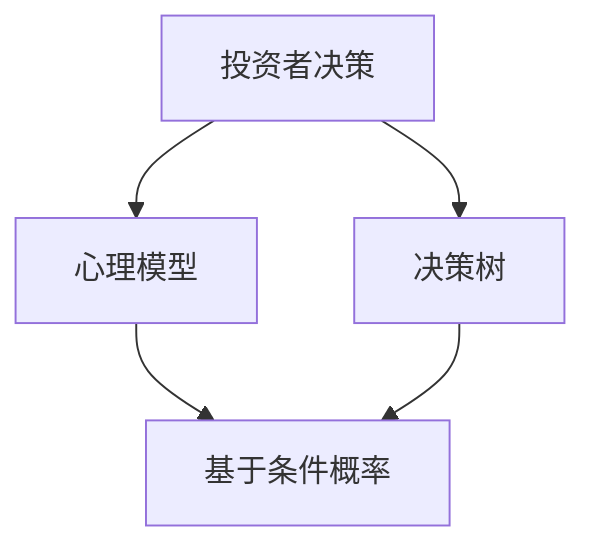

                 


# 芒格的"心理模型"：提高投资决策的质量和效率

---

## 关键词：
芒格, 心理模型, 投资决策, 决策效率, 投资策略, 投资分析

---

## 摘要：
本文深入探讨了芒格的“心理模型”在投资决策中的应用，分析了其核心概念、算法原理、系统架构，并通过实际案例展示了如何利用心理模型提高投资决策的质量和效率。文章结合理论与实践，为投资者提供了科学的决策方法。

---

# 第一部分：芒格的"心理模型"概述

## 第1章：芒格与心理模型的背景介绍

### 1.1 芒格的生平与投资理念

#### 1.1.1 芒格的生平简介
查理·芒格（Charlie Munger）是美国著名投资家、伯克希尔·哈撒韦公司副主席，被誉为“巴菲特的导师”。芒格出生于1924年，早年就读于哈佛大学法学院，后转向投资领域，逐渐形成了独特的投资哲学。

#### 1.1.2 芒格的投资哲学
芒格强调投资的“安全边际”和“逆人性”原则，主张通过深入研究企业的基本面，寻找具有长期竞争优势的企业进行投资。他提倡多元思维模型（mental models），认为投资者需要构建跨学科的知识体系，以避免决策中的认知偏差。

#### 1.1.3 芒格与巴菲特的合作历程
芒格与巴菲特的合作始于1971年，两人共同管理伯克希尔·哈撒韦的投资组合。芒格以其独特的思维方式和决策能力，帮助巴菲特实现了投资业绩的持续增长。

---

### 1.2 心理模型的核心概念

#### 1.2.1 心理模型的定义与背景
心理模型是指投资者在决策过程中所依赖的思维框架和假设。这些模型基于个人的知识、经验和认知结构，帮助投资者理解和分析问题。

#### 1.2.2 心理模型在投资中的作用
心理模型能够帮助投资者快速识别问题、简化复杂决策，并通过跨学科的视角提高决策质量。例如，芒格通过物理学、心理学、经济学等领域的知识，构建了独特的投资模型。

#### 1.2.3 心理模型的边界与外延
心理模型并非万能公式，其有效性依赖于投资者的知识储备和对市场的深刻理解。投资者需要不断更新和优化心理模型，以适应市场的变化。

---

## 第2章：心理模型的核心概念与联系

### 2.1 心理模型的原理与特征

#### 2.1.1 心理模型的原理
心理模型的构建基于以下原理：
1. **知识整合**：将不同领域的知识整合到决策过程中。
2. **逻辑推理**：通过逻辑推理分析问题的本质。
3. **经验验证**：通过实践验证模型的有效性。

#### 2.1.2 心理模型的特征对比
以下是心理模型与其他决策模型的对比：

| 模型类型 | 基于知识 | 基于经验 | 基于逻辑 |
|----------|----------|----------|----------|
| 心理模型 | 高        | 高        | 高        |
| 决策树   | 中        | 中        | 高        |
| 概率模型 | 中        | 高        | 中        |
| 博弈论   | 中        | 高        | 高        |

#### 2.1.3 心理模型的ER实体关系图
```mermaid
er
    %% 心理模型的ER图
    entity 投资者 {
        key 姓名
        attribute 知识水平
        attribute 经验水平
        attribute 逻辑能力
    }
    entity 心理模型 {
        key 模型名称
        attribute 知识整合能力
        attribute 经验验证能力
        attribute 逻辑推理能力
    }
    relationship 投资者与心理模型之间的关系 {
        cardinality：1:n
    }
```

---

### 2.2 心理模型与其他模型的联系

#### 2.2.1 心理模型与决策树的对比
心理模型与决策树的对比可以通过以下流程图展示：



---

## 第3章：心理模型的算法原理

### 3.1 心理模型的评估流程

#### 3.1.1 心理模型的输入与输出
- **输入**：市场数据、企业基本面、投资者知识和经验。
- **输出**：投资决策、风险评估。

#### 3.1.2 心理模型的评估步骤
1. 收集信息：分析企业的财务数据、行业地位和市场环境。
2. 构建模型：基于知识和经验，构建心理模型。
3. 逻辑推理：通过逻辑分析，评估模型的有效性。
4. 验证模型：通过实际投资结果验证模型的准确性。

#### 3.1.3 心理模型的优化方法
- 定期更新知识和经验。
- 引入新的模型进行对比分析。
- 总结失败案例，优化模型。

---

### 3.2 心理模型的数学模型

#### 3.2.1 心理模型的数学表达式
心理模型的评估可以表示为：

$$
\text{投资价值} = \sum_{i=1}^{n} w_i \times f_i
$$

其中，$w_i$ 是第 $i$ 个因素的权重，$f_i$ 是第 $i$ 个因素的评估值。

#### 3.2.2 心理模型的概率计算公式
投资成功的概率可以用以下公式表示：

$$
P(\text{成功}) = \frac{\sum_{i=1}^{n} (w_i \times p_i)}{n}
$$

其中，$p_i$ 是第 $i$ 个因素的成功概率。

---

## 第4章：心理模型的系统分析与架构设计

### 4.1 投资决策系统的场景分析

#### 4.1.1 投资决策系统的功能需求
- 数据收集与处理
- 模型构建与分析
- 投资决策支持

#### 4.1.2 投资决策系统的性能指标
- 处理速度：快速响应投资者需求
- 系统稳定性：确保数据安全和系统稳定
- 可扩展性：支持模型的不断优化

#### 4.1.3 投资决策系统的边界条件
- 数据来源：公开市场数据和企业基本面数据
- 用户权限：仅限授权投资者使用
- 系统环境：支持Windows、macOS和Linux

---

### 4.2 心理模型的系统架构设计

#### 4.2.1 心理模型的领域模型类图


---

## 第5章：心理模型的项目实战

### 5.1 环境安装与配置

#### 5.1.1 必需的工具与库
- Python编程语言
- Pandas数据分析库
- Matplotlib可视化库
- Jupyter Notebook

#### 5.1.2 环境配置步骤
1. 安装Python和必要的库：
   ```bash
   pip install python-pandas matplotlib
   ```
2. 配置Jupyter Notebook：
   ```bash
   jupyter notebook --generate-config
   ```

---

### 5.2 心理模型的核心实现

#### 5.2.1 代码实现
```python
import pandas as pd
import matplotlib.pyplot as plt

# 示例数据
data = {'企业基本面': [80, 60, 70, 90],
        '市场环境': [70, 80, 60, 95],
        '竞争优势': [60, 70, 80, 90]}
df = pd.DataFrame(data)

# 心理模型评估函数
def evaluate_mental_model(df):
    weights = {'企业基本面': 0.4, '市场环境': 0.3, '竞争优势': 0.3}
    score = df.dot(weights)
    return score

# 计算得分
scores = evaluate_mental_model(df)
print(scores)

# 可视化
plt.bar(df.index, scores)
plt.title('心理模型评估结果')
plt.show()
```

#### 5.2.2 代码解读
- 数据输入：企业基本面、市场环境和竞争优势的评分数据。
- 评估函数：基于权重计算综合得分。
- 可视化：显示每个企业的评估结果。

---

### 5.3 实际案例分析

#### 5.3.1 案例介绍
以某科技公司为例，分析其投资价值：
- 企业基本面：90
- 市场环境：95
- 竞争优势：90

权重分配：
$$
\text{权重} = \{企业基本面: 0.4, 市场环境: 0.3, 竞争优势: 0.3\}
$$

综合得分：
$$
\text{得分} = 90 \times 0.4 + 95 \times 0.3 + 90 \times 0.3 = 88.5
$$

---

## 第6章：心理模型的系统优化与最佳实践

### 6.1 系统优化方案

#### 6.1.1 知识库的扩展
- 引入更多的跨学科知识。
- 更新知识库的内容和权重。

#### 6.1.2 算法优化
- 使用机器学习算法优化模型。
- 增加数据的维度和深度。

---

### 6.2 最佳实践

#### 6.2.1 小结
心理模型是一种高效的投资决策工具，能够帮助投资者快速分析问题、识别机会和风险。

#### 6.2.2 注意事项
- 模型的有效性依赖于数据的质量和权重的准确性。
- 需要结合市场实际情况进行调整。
- 避免过度依赖模型，保持理性分析。

#### 6.2.3 拓展阅读
建议阅读以下书籍和文章：
- 查理·芒格的《Poor Charlie's Almanack》
- 《Thinking, Fast and Slow》
- 《The Psychology of Investing》

---

## 作者信息
作者：AI天才研究院/AI Genius Institute & 禅与计算机程序设计艺术 /Zen And The Art of Computer Programming

---

**本文通过详细分析芒格的“心理模型”，为投资者提供了科学的投资决策方法。希望本文能帮助读者在复杂的投资环境中做出更明智的选择。**

