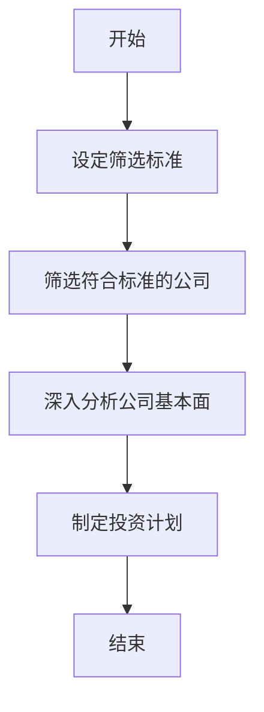

                 


# 芮格的"最低标准"原则在选股中的应用

## 关键词：芒格，投资原则，选股，最低标准，股票分析

## 摘要：  
本文详细探讨了芒格的“最低标准”原则在选股中的应用，从理论基础到实际操作，结合具体案例，分析了该原则的核心要素、选股策略及实际应用中的挑战。文章通过详细分析财务指标、行业地位、竞争优势等关键因素，为投资者提供了一套系统化的选股方法，帮助读者在投资决策中更好地应用芒格的理念。

---

## 第一章：芒格及其投资理念

### 1.1 芮格的生平简介  
查理·芒格（Charlie Munger）是美国著名投资者、伯克希尔·哈撒韦公司副董事长。他不仅是沃伦·巴菲特（Warren Buffett）的重要合作伙伴，也是价值投资领域的权威之一。芒格的投资理念强调理性思维、安全边际和长期价值，他的“最低标准”原则是其投资体系的核心之一。

### 1.2 “最低标准”原则的定义  
“最低标准”原则是指在选股时，投资者必须设定一套严格的基本标准，只有符合这些标准的公司才能被纳入投资范围。这些标准通常包括财务健康、行业地位、竞争优势、管理团队等多个方面。

### 1.3 投资中的“最低标准”原则的重要性  
- **避免低效投资**：通过设定最低标准，投资者可以避免投资于那些基本面不佳或风险过高的公司。  
- **提升决策效率**：筛选标准可以帮助投资者快速排除不符合条件的公司，专注于优质标的。  
- **长期价值导向**：芒格的最低标准注重企业的长期可持续性和竞争优势，而非短期市场波动。

---

## 第二章：芒格“最低标准”原则的核心要素

### 2.1 财务健康状况  
- **净利润与盈利能力**：公司是否具备持续盈利的能力？常用的指标包括净利润率、ROE（净资产收益率）等。  
- **负债情况与偿债能力**：公司是否存在过高的负债？通过资产负债率、流动比率等指标评估。  
- **现金流与财务稳定性**：健康的现金流是公司长期发展的基础，自由现金流是衡量财务健康的重要指标。

### 2.2 行业地位与竞争优势  
- **行业龙头企业的识别**：选择行业龙头公司，因为它们通常具备更强的市场地位和议价能力。  
- **核心竞争力与市场壁垒**：公司是否具备独特的竞争优势？例如技术壁垒、品牌优势等。  
- **行业周期性与风险评估**：分析行业周期性，选择处于上升周期的行业，避免周期性过强的行业。

### 2.3 管理团队与治理结构  
- **高管团队的能力与稳定性**：管理层是否具备经验和能力？公司治理是否透明？  
- **股东权益与利益保护**：公司是否注重股东权益，是否有合理的分红政策？

### 2.4 企业成长性与可持续性  
- **收入与利润的持续增长**：选择收入和利润持续增长的公司。  
- **创新能力与研发投入**：公司是否具备持续创新能力？研发投入占收入的比例是一个重要指标。  
- **可持续发展与社会责任**：企业是否注重可持续发展，是否有社会责任感？

---

## 第三章：芒格“最低标准”原则在选股中的应用策略

### 3.1 确定选股标准  
- **设定核心筛选指标**：根据芒格的原则，列出财务、行业、管理和成长性等方面的核心指标。  
- **制定行业与公司规模的筛选清单**：明确行业范围和公司规模（如大中型企业）。  
- **评估公司的长期价值与成长潜力**：结合财务数据和行业前景，评估公司是否具备长期增长潜力。

### 3.2 构建投资组合  
- **分散投资与风险控制**：避免过度集中于单一行业或公司，降低投资风险。  
- **确定投资比例与权重**：根据公司的质量和行业分布，合理分配投资比例。  
- **定期复盘与调整策略**：定期评估投资组合的表现，根据市场变化和公司基本面调整持仓。

---

## 第四章：案例分析与实际操作

### 4.1 理论与实践结合的案例  
- **案例：苹果公司**  
  - **公司基本面分析**：苹果具备强大的财务实力和盈利能力，ROE长期保持在较高水平。  
  - **竞争优势与市场地位**：苹果在科技行业具备强大的品牌影响力和技术创新能力。  
  - **成长潜力**：公司在智能设备和软件服务领域持续增长，具备长期投资价值。

### 4.2 实际操作步骤  
- **第一步：筛选符合最低标准的公司**：根据财务、行业和管理等方面的标准，筛选出符合条件的公司。  
- **第二步：深入分析公司基本面**：进一步研究公司的财务数据、管理层和行业前景。  
- **第三步：制定投资计划**：根据分析结果，制定具体的投资策略和比例。

---

## 第五章：芒格“最低标准”原则的局限性与挑战

### 5.1 该原则的局限性  
- **新兴行业的适应性**：对于新兴行业，传统的财务指标可能无法完全反映公司的潜力。  
- **短期市场波动的影响**：虽然芒格强调长期投资，但短期市场波动可能会影响投资组合的表现。

### 5.2 应对挑战的策略  
- **动态调整筛选标准**：根据市场变化和行业趋势，适当调整筛选标准。  
- **结合其他投资策略**：将“最低标准”原则与其他投资策略结合，如趋势投资或事件驱动策略。

---

## 第六章：芒格“最低标准”原则的实战指南

### 6.1 工具与资源的使用  
- **财务报表分析工具**：使用Excel或专业的财务分析软件，对公司的财务数据进行深入分析。  
- **行业分析报告**：参考行业研究报告，了解行业趋势和竞争格局。  
- **数据可视化工具**：使用图表和可视化工具，帮助更好地理解数据和趋势。

### 6.2 长期投资计划的制定  
- **设定投资目标**：明确投资目标和风险承受能力。  
- **制定投资计划**：根据筛选结果，制定长期投资计划，并定期评估和调整。

---

## 附录

### A. 芮格“最低标准”原则的核心指标表  
| 指标类别 | 具体指标 | 解释 |
|----------|----------|------|
| 财务健康 | 净利润、ROE、现金流 | 评估公司的盈利能力与财务稳定性 |
| 行业地位 | 市场占有率、行业排名 | 评估公司在行业中的地位 |
| 竞争优势 | 技术壁垒、品牌影响力 | 评估公司的竞争优势 |

### B. 股票筛选流程图  


### C. 股票分析的Python代码示例  
```python
import pandas as pd

# 假设我们有一个包含财务数据的DataFrame df
# 筛选ROE > 15% 且净利润同比增长 > 10% 的公司
df[df['ROE (%)'] > 15 & df['Net Profit Growth (%)'] > 10]
```

### D. 参考文献  
1. 芮格：《穷查理宝典》  
2. 巴菲特：《巴菲特致股东的信》  
3. 投资分析相关学术文献

---

## 作者：AI天才研究院 & 禅与计算机程序设计艺术  
本文由AI天才研究院联合禅与计算机程序设计艺术团队共同撰写，转载请注明出处。

