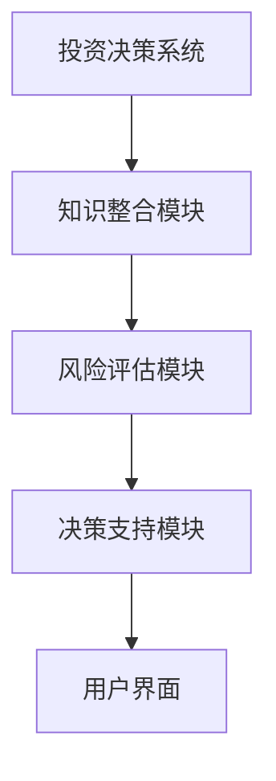
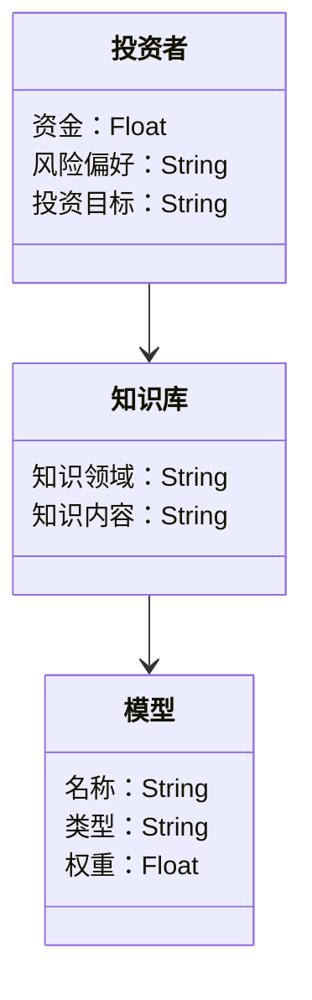

                 


# 芒格的跨界思维：将不同领域的知识应用于投资决策

**关键词：**芒格思维模型、跨界思维、投资决策、多元思维模型、知识整合、决策算法

**摘要：**  
芒格的跨界思维是一种将不同领域的知识整合到投资决策中的方法，通过多元思维模型的构建与应用，投资者能够更全面地理解和评估投资机会。本文从芒格的思维模式出发，详细解析其跨界思维的核心概念、算法原理、数学模型、系统架构，并通过实际案例分析其在投资决策中的应用，最后总结跨界思维的优势与注意事项，为投资者提供一份全面的实践指南。

---

## 第一章：芒格的思维模式与跨界思维的定义

### 1.1 芒格的思维模式

#### 1.1.1 多元思维模型
芒格的多元思维模型是其思想的核心，它强调通过多个学科的视角来分析问题。例如，物理学中的能量守恒定律、心理学中的行为偏差、经济学中的市场规律等，都可以帮助投资者更好地理解市场动态。

#### 1.1.2 决策框架
芒格的决策框架包括以下步骤：
1. 确定目标：明确投资的核心目标。
2. 知识整合：将多个领域的知识整合到决策中。
3. 风险评估：通过多维度分析潜在风险。
4. 决策执行：基于整合后的信息做出最终决策。

#### 1.1.3 思维方式对投资的影响
芒格的思维方式帮助投资者避免了单一学科的局限性，能够从多个角度发现潜在的机会和风险，从而做出更合理的投资决策。

### 1.2 跨界思维的定义

#### 1.2.1 核心概念
跨界思维是指将不同领域的知识、方法和经验整合到一个特定领域（如投资）中，以实现更优化的结果。

#### 1.2.2 特点
- **跨学科性**：整合多个学科的知识。
- **系统性**：注重知识之间的关联性。
- **动态性**：能够根据实际情况调整知识的权重。

#### 1.2.3 与传统思维的对比
传统的投资分析通常依赖单一学科的方法（如财务指标分析），而跨界思维强调多维度的综合分析。

### 1.3 跨界思维在投资中的重要性

#### 1.3.1 如何帮助投资者
跨界思维能够帮助投资者发现潜在的投资机会，避免单一视角的局限性。

#### 1.3.2 应用场景
- 评估企业价值时，结合经济学和心理学的视角。
- 分析市场趋势时，结合社会学和物理学的模型。

#### 1.3.3 对投资结果的影响
跨界思维能够帮助投资者做出更全面的决策，降低因单一视角导致的误判风险。

---

## 第二章：芒格的多元思维模型

### 2.1 多元思维模型的核心要素

#### 2.1.1 知识的跨界整合
通过将物理学、心理学、经济学等领域的知识整合到投资分析中，投资者能够更全面地评估企业的价值。

#### 2.1.2 知识的深度与广度
- **深度**：深入理解某个领域的核心原理。
- **广度**：广泛涉猎多个领域的知识。

#### 2.1.3 知识的动态更新
随着市场环境的变化，投资者需要不断更新和调整其知识模型。

### 2.2 多元思维模型的分类

#### 2.2.1 数学模型
- 概率论：用于评估投资的不确定性。
- 统计学：用于分析市场数据。

#### 2.2.2 心理学模型
- 行为偏差：理解投资者的心理行为。
- 认知偏差：避免决策中的认知错误。

#### 2.2.3 经济学模型
- 市场均衡：分析市场供需关系。
- 成本收益分析：评估投资的可行性。

#### 2.2.4 历史学模型
- 历史周期：分析市场的周期性变化。
- 先例研究：借鉴历史案例进行决策。

### 2.3 多元思维模型的相互关系

#### 2.3.1 模型之间的关联性
- 数学模型为分析提供工具，心理学模型解释投资者行为，经济学模型分析市场规律。

#### 2.3.2 模型的优先级
根据具体情况，某些模型可能更适用于特定问题。

#### 2.3.3 模型的局限性
每个模型都有其适用范围和局限性，需要综合考虑。

---

## 第三章：跨界思维的算法原理

### 3.1 跨界知识整合算法

#### 3.1.1 知识的分类与整合
将不同领域的知识分为核心知识和辅助知识，然后根据其重要性进行整合。

#### 3.1.2 知识的权重分配
根据知识对投资决策的影响程度，为其分配权重。

#### 3.1.3 知识的动态调整
随着市场变化，定期调整知识的权重和优先级。

### 3.2 跨界决策算法

#### 3.2.1 决策目标的设定
明确投资目标，例如追求稳定收益或高增长。

#### 3.2.2 决策规则的制定
根据多元思维模型，制定具体的决策规则。

#### 3.2.3 决策结果的验证
通过实际数据验证算法的有效性。

---

## 第四章：数学模型与公式

### 4.1 数学框架的建立

#### 4.1.1 投资回报的数学表达
$$ \text{投资回报} = \sum_{i=1}^{n} w_i \times x_i $$
其中，$w_i$ 是第 $i$ 个模型的权重，$x_i$ 是模型的输出值。

#### 4.1.2 风险评估公式
$$ \text{风险} = \sum_{i=1}^{m} p_i \times r_i $$
其中，$p_i$ 是第 $i$ 种风险发生的概率，$r_i$ 是风险的影响程度。

---

## 第五章：系统分析与架构设计

### 5.1 问题场景介绍

#### 5.1.1 投资决策系统的功能需求
- 知识整合模块：整合多个领域的知识。
- 风险评估模块：评估投资风险。
- 决策支持模块：提供决策建议。

#### 5.1.2 系统架构设计
使用 Mermaid 绘制系统架构图：



### 5.2 领域模型设计

#### 5.2.1 领域模型的 Mermaid 类图


---

## 第六章：项目实战

### 6.1 环境安装

#### 6.1.1 安装 Python 环境
使用 Anaconda 或 Pyenv 安装 Python 3.8 或更高版本。

#### 6.1.2 安装依赖库
安装必要的库，例如 NumPy、Pandas、Matplotlib 等。

### 6.2 核心代码实现

#### 6.2.1 知识整合模块
```python
def integrate_knowledge(models):
    # models 是一个包含模型字典的列表
    total = 0
    for model in models:
        total += model['weight'] * model['value']
    return total
```

#### 6.2.2 风险评估模块
```python
def assess_risk(models):
    risk = 0
    for model in models:
        risk += model['probability'] * model['impact']
    return risk
```

### 6.3 实际案例分析

#### 6.3.1 案例背景
假设我们要评估一家科技公司的投资价值。

#### 6.3.2 数据分析
使用多元思维模型，整合财务数据、市场趋势、技术专利等信息。

---

## 第七章：总结与注意事项

### 7.1 总结

#### 7.1.1 芒格思维模型的优势
- 综合性强。
- 知识覆盖面广。
- 避免单一视角的局限性。

### 7.1.2 注意事项
- 知识的深度与广度需要平衡。
- 避免过度简化模型。
- 定期更新知识库。

### 7.1.3 拓展阅读
- 《Poor Charlie's Almanack》
- 《The Psychology of Investing》

---

**作者：AI天才研究院/AI Genius Institute & 禅与计算机程序设计艺术 /Zen And The Art of Computer Programming**

