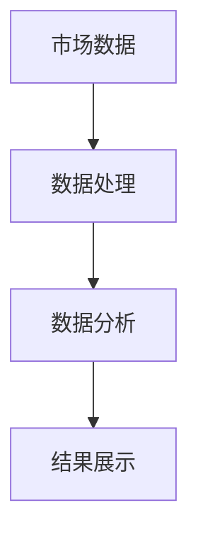
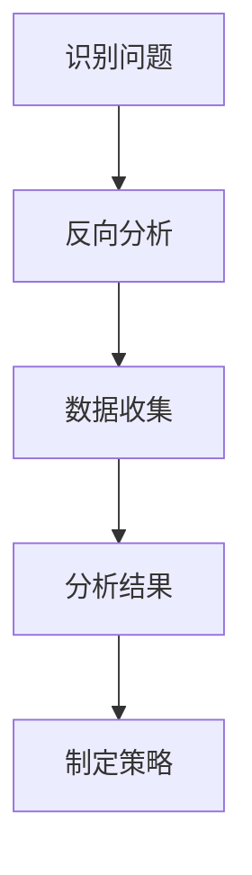
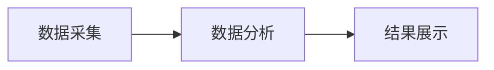
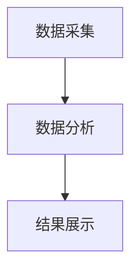
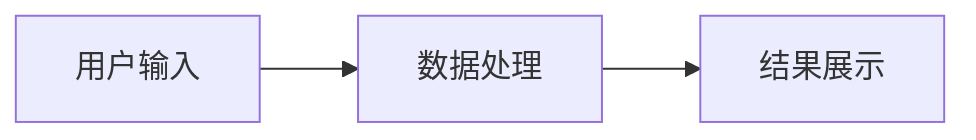

                 

# 芒格的"逆向思考"在市场分析中的应用

## 关键词：逆向思考, 市场分析, 芒格, 投资策略, 数据分析

## 摘要：本文详细探讨了芒格的逆向思考方法在市场分析中的应用，通过理论与实践相结合的方式，分析了逆向思考的核心概念、算法原理、系统架构设计以及在项目中的具体应用。文章结合实际案例，展示了逆向思考如何帮助分析者从反面发现问题，制定有效的投资策略。

---

## 第一部分: 芒格的"逆向思考"概述

### 第1章: 逆向思考的定义与背景

#### 1.1 逆向思考的定义
- **逆向思考**是指从问题的反面出发，寻找解决方案的一种思维方式。
- 与传统正向思考不同，逆向思考强调从结果出发，反推原因，寻找机会或风险。
- 芒格的逆向思考在投资领域尤其重要，他强调通过寻找市场的弱点和不合理之处来发现投资机会。

#### 1.2 逆向思考的核心要素
- **问题背景**：逆向思考适用于市场分析中的多个方面，包括竞争分析、消费者行为分析等。
- **问题解决**：通过反向分析，发现市场中的潜在机会或风险。
- **边界与外延**：逆向思考不仅限于市场分析，还可以扩展到其他领域，如风险管理、战略制定等。

#### 1.3 逆向思考与正向思考的对比
| 对比维度 | 正向思考 | 逆向思考 |
|----------|----------|----------|
| 思维方式 | 从原因到结果 | 从结果到原因 |
| 适用场景 | 寻找机会 | 发现潜在风险 |
| 分析深度 | 表面分析 | 深度挖掘 |

### 第2章: 逆向思考的核心原理

#### 2.1 逆向思考的逻辑框架
- **基本原理**：逆向思考通过反向分析问题，寻找潜在的机会或风险。
- **逻辑框架**：从目标出发，分析可能的路径和障碍，找到解决问题的关键点。

#### 2.2 逆向思考的数学模型
- **贝叶斯定理**：用于概率推理，帮助分析市场变化的可能性。
$$ P(A|B) = \frac{P(B|A)P(A)}{P(B)} $$
- **决策树模型**：通过绘制决策树，分析不同决策路径的可能性和结果。

#### 2.3 逆向思考的系统架构
- **系统功能设计**：
  1. 数据收集模块：收集市场数据，包括竞争对手信息、消费者行为等。
  2. 数据分析模块：对数据进行处理和分析，寻找市场中的潜在机会。
  3. 结果展示模块：将分析结果以可视化形式呈现，便于决策者理解。

- **系统架构图**：

### 第3章: 逆向思考在市场分析中的应用

#### 3.1 逆向思考的应用场景
- **竞争分析**：通过分析竞争对手的弱点，寻找市场机会。
- **消费者行为分析**：通过分析消费者的反常行为，发现市场潜在需求。

#### 3.2 逆向思考的具体步骤
1. **问题识别**：识别市场中的潜在问题或机会。
2. **反向分析**：从结果出发，分析可能的原因和路径。
3. **数据收集与分析**：收集相关数据，验证分析结果。
4. **制定策略**：根据分析结果，制定相应的投资策略。

#### 3.3 逆向思考的流程图

### 第4章: 逆向思考的系统架构设计

#### 4.1 系统功能模块划分
- 数据采集模块：负责收集市场数据，包括竞争对手信息、消费者行为等。
- 数据分析模块：对收集到的数据进行处理和分析，寻找市场中的潜在机会。
- 结果展示模块：将分析结果以图表形式展示，便于决策者理解。

#### 4.2 系统架构图

#### 4.3 系统接口设计
- 数据接口：与数据源进行数据交互，确保数据的准确性和及时性。
- 用户接口：提供友好的用户界面，方便用户进行数据输入和结果查看。

### 第5章: 逆向思考的算法实现

#### 5.1 算法原理
- **逆向思考算法**：通过反向分析问题，寻找解决方案的关键点。
- **数学模型**：结合概率论和统计学，建立数学模型，分析市场变化的可能性。

#### 5.2 算法优化
- **数据预处理**：对数据进行清洗和转换，确保数据质量。
- **模型优化**：通过调整模型参数，提高分析的准确性和效率。

### 第6章: 逆向思考的项目实战

#### 6.1 项目背景与目标
- **项目背景**：某公司希望通过逆向思考方法，分析竞争对手的市场策略，寻找市场机会。
- **项目目标**：制定有效的市场进入策略，抢占竞争对手的市场份额。

#### 6.2 项目实施过程
1. **数据收集**：收集竞争对手的市场数据，包括产品信息、销售数据、消费者评价等。
2. **数据分析**：使用逆向思考方法，分析竞争对手的市场策略，寻找市场中的潜在机会。
3. **模型验证**：通过数据验证分析结果，确保分析的准确性和可靠性。

#### 6.3 项目成果与总结
- **项目成果**：通过逆向思考分析，发现了竞争对手市场策略中的弱点，制定出有效的市场进入策略。
- **项目总结**：逆向思考方法在市场分析中具有重要的应用价值，能够帮助分析者发现潜在机会。

### 第7章: 逆向思考的最佳实践

#### 7.1 逆向思考的实践技巧
- **思维训练**：通过不断练习，提高逆向思考的能力。
- **案例分析**：学习经典的逆向思考案例，总结经验教训。
- **注意事项**：在实际应用中，需要注意数据的准确性和分析的深度，避免片面结论。

#### 7.2 逆向思考的案例分析
- **经典案例**：某公司在逆向思考的帮助下，成功发现竞争对手的市场策略漏洞，制定出有效的市场进入策略。

---

## 第二部分: 逆向思考在系统架构设计中的应用

### 第8章: 系统功能设计

#### 8.1 功能模块划分
- 数据采集模块：负责收集市场数据，包括竞争对手信息、消费者行为等。
- 数据分析模块：对收集到的数据进行处理和分析，寻找市场中的潜在机会。
- 结果展示模块：将分析结果以图表形式展示，便于决策者理解。

#### 8.2 功能流程图

### 第9章: 系统架构设计

#### 9.1 架构总体设计
- 采用分层架构，将系统划分为数据采集层、数据处理层和结果展示层。
- 使用微服务架构，提高系统的可扩展性和可维护性。

#### 9.2 架构优化
- 通过优化数据处理流程，提高系统的处理效率。
- 使用分布式架构，提升系统的并发处理能力。

### 第10章: 系统接口设计

#### 10.1 数据接口设计
- 数据接口设计：定义数据的输入输出格式，确保数据的准确性和一致性。

#### 10.2 用户接口设计
- 用户接口设计：提供友好的用户界面，方便用户进行数据输入和结果查看。

### 第11章: 系统交互设计

#### 11.1 交互流程图

---

## 第三部分: 逆向思考的算法实现

### 第12章: 算法原理

#### 12.1 算法基本原理
- 逆向思考算法：通过反向分析问题，寻找解决方案的关键点。

#### 12.2 算法实现步骤
1. **数据收集**：收集市场数据，包括竞争对手信息、消费者行为等。
2. **数据处理**：对数据进行清洗和转换，确保数据质量。
3. **数据分析**：使用逆向思考方法，分析市场中的潜在机会。
4. **结果展示**：将分析结果以可视化形式呈现，便于决策者理解。

### 第13章: 算法优化

#### 13.1 数据预处理
- 数据预处理：对数据进行清洗和转换，确保数据质量。

#### 13.2 模型优化
- 模型优化：通过调整模型参数，提高分析的准确性和效率。

---

## 结语

通过以上分析，可以看出逆向思考在市场分析中的应用具有重要的价值。它不仅能够帮助分析者发现市场中的潜在机会，还能够有效地制定投资策略。未来，随着技术的不断发展，逆向思考的应用将会更加广泛，帮助企业在激烈的市场竞争中占据优势。

---

## 作者：AI天才研究院 & 禅与计算机程序设计艺术

---

通过以上思考过程，我们详细探讨了芒格的逆向思考在市场分析中的应用，从理论到实践，层层递进，确保读者能够全面掌握逆向思考的核心概念和实际应用。

