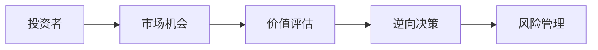
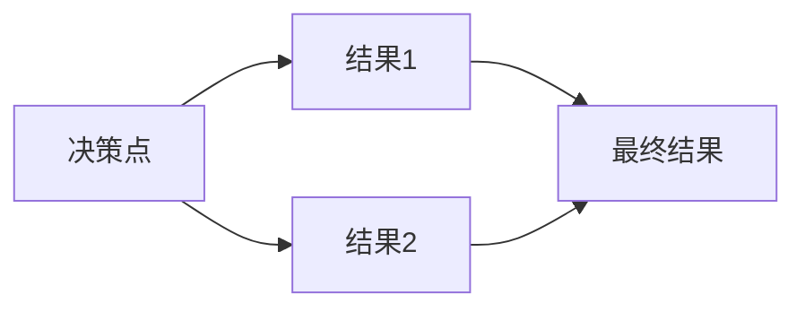
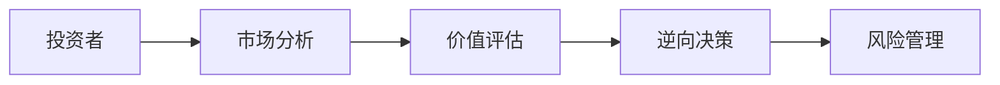

                 

# 芒格的"颠倒思考"：在投资中应用逆向思维

> 关键词：逆向思维，芒格，投资策略，风险管理，价值投资，决策模型

> 摘要：本文深入探讨了芒格的“颠倒思考”理念，分析其在投资中的应用。通过逆向思维，投资者能够识别被低估的机会，管理风险，并制定有效的投资策略。文章结合理论与实践，详细阐述了逆向思维的核心概念、算法原理、系统设计以及实际案例，帮助读者掌握这一投资方法。

---

## 目录大纲

### 第一部分: 芒格的"颠倒思考"与逆向思维的背景

#### 第1章: 逆向思维的定义与芒格的思考方式

- 1.1 逆向思维的定义与特点
  - 1.1.1 逆向思维的定义
  - 1.1.2 逆向思维的特点
  - 1.1.3 逆向思维与传统思维的对比

- 1.2 芒格的"颠倒思考"理念
  - 1.2.1 芒格的背景与投资哲学
  - 1.2.2 "颠倒思考"的核心思想
  - 1.2.3 芒格"颠倒思考"的应用案例

- 1.3 投资中的问题背景
  - 1.3.1 投资中的常见问题与挑战
  - 1.3.2 传统投资思维的局限性
  - 1.3.3 逆向思维在投资中的潜在优势

---

### 第二部分: 逆向思维的核心概念与联系

#### 第2章: 逆向思维的核心概念原理

- 2.1 核心概念分析
  - 2.1.1 逆向思维的原理
  - 2.1.2 投资中的逆向决策模型
  - 2.1.3 逆向思维与概率论的关系

- 2.2 核心概念属性对比表格
  | 概念       | 传统思维             | 逆向思维             |
  |------------|----------------------|----------------------|
  | 决策方式   | 正向推导             | 倒向推理             |
  | 风险管理   | 避免风险             | 寻找风险中的机会     |
  | 投资策略   | 追求高增长            | 寻找被低估的价值      |

- 2.3 实体关系图（Mermaid）

---

### 第三部分: 逆向思维的算法原理与数学模型

#### 第3章: 逆向思维的算法原理

- 3.1 算法原理分析
  - 3.1.1 逆向思维的逻辑框架
  - 3.1.2 逆向思维的数学模型

- 3.2 概率论与逆向思维的关系
  - 3.2.1 概率论在逆向思维中的应用
  - 3.2.2 期望值与逆向决策的关系

- 3.3 决策树分析（Mermaid）

---

### 第四部分: 逆向思维的系统分析与架构设计

#### 第4章: 投资决策系统的架构设计

- 4.1 系统功能设计
  - 4.1.1 系统目标
  - 4.1.2 功能模块划分

- 4.2 系统架构设计（Mermaid）

- 4.3 系统接口设计
  - 4.3.1 输入接口
  - 4.3.2 输出接口

- 4.4 系统交互流程（Mermaid）

---

### 第五部分: 逆向思维的项目实战与案例分析

#### 第5章: 逆向思维在投资中的实战应用

- 5.1 项目背景与目标
  - 5.1.1 项目背景
  - 5.1.2 项目目标

- 5.2 项目核心实现
  - 5.2.1 逆向思维的应用
  - 5.2.2 投资决策系统的实现

- 5.3 实际案例分析
  - 5.3.1 案例背景
  - 5.3.2 案例分析
  - 5.3.3 案例总结

---

### 第六部分: 逆向思维的最佳实践与小结

#### 第6章: 逆向思维的最佳实践

- 6.1 小结
  - 6.1.1 逆向思维的核心要点
  - 6.1.2 逆向思维的优势与局限

- 6.2 注意事项
  - 6.2.1 逆向思维的应用场景
  - 6.2.2 逆向思维的潜在风险

- 6.3 拓展阅读
  - 6.3.1 相关书籍推荐
  - 6.3.2 相关文章推荐

---

### 作者信息

作者：AI天才研究院/AI Genius Institute & 禅与计算机程序设计艺术 /Zen And The Art of Computer Programming

