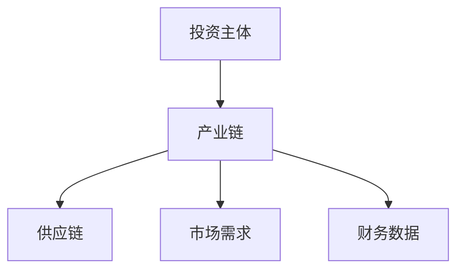
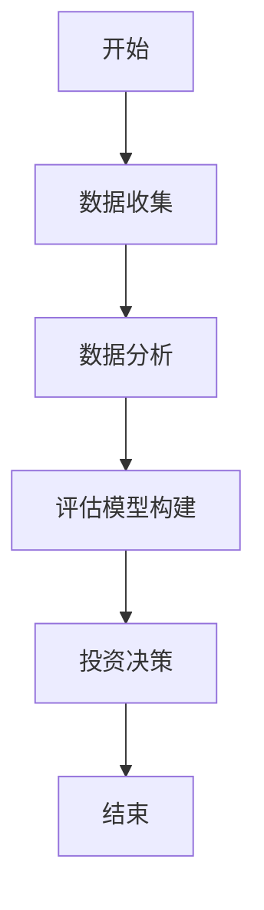
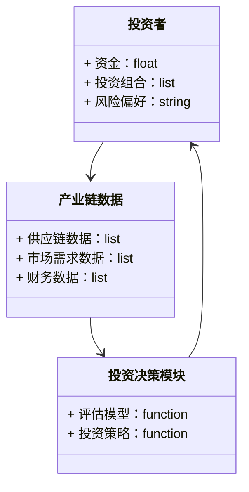
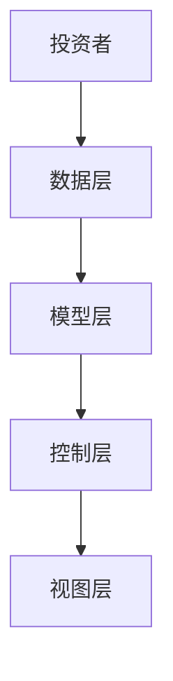

                 


# 菲利普·费雪的产业链投资策略

> 关键词：菲利普·费雪，产业链投资，价值投资，投资策略，成长股，财务分析

> 摘要：本文深入分析菲利普·费雪的产业链投资策略，探讨其核心理念、数学模型、系统架构及实战应用。通过背景介绍、核心概念解析、算法原理阐述、系统设计、项目实战和最佳实践，全面解析如何运用菲利普·费雪的投资策略进行产业链分析与投资决策。

---

## 第一部分: 背景介绍

### 第1章: 投资策略的演变与菲利普·费雪的贡献

#### 1.1 投资策略的演变历程

投资策略的演变是一个从简单到复杂、从经验驱动到数据驱动的过程。传统投资理论强调市场有效性，认为投资者无法通过基本面分析获得超额收益。然而，现代投资组合理论（MPT）提出通过分散投资降低风险，但并未解决如何选择优质资产的核心问题。价值投资的崛起为投资者提供了新的思路，而菲利普·费雪正是这一领域的先驱。

#### 1.2 菲利普·费雪的生平与投资理念

菲利普·费雪（Philip Fisher）是价值投资的鼻祖，他提出了“成长股投资”的理念，强调长期投资和深入研究公司基本面。费雪认为，投资者应选择具有持续增长潜力的公司，并长期持有，而非频繁交易。

#### 1.3 产业链投资的基本概念

产业链投资是指从产业链的角度分析企业，关注企业在产业链中的位置、上下游关系以及行业竞争格局。通过分析产业链的结构，投资者可以更好地判断企业的盈利能力和成长潜力。

---

### 第2章: 产业链投资的核心概念与联系

#### 2.1 核心概念原理

产业链投资的核心在于分析企业的产业链位置、上下游关系以及行业趋势。通过研究产业链的结构，投资者可以识别行业中的龙头公司，并判断其投资价值。

#### 2.2 概念属性特征对比表格

以下是产业链投资与传统投资的主要区别：

| 概念                | 产业链投资               | 传统投资               |
|---------------------|--------------------------|------------------------|
| 投资视角            | 产业链整体与企业位置      | 单一资产与市场波动     |
| 分析方法            | 结构化分析与关联性研究    | 市场情绪与技术分析      |
| 投资策略            | 长期持有与产业链优化      | 短期交易与市场套利      |

#### 2.3 ER实体关系图（Mermaid）



---

## 第二部分: 产业链投资的算法原理与数学模型

### 第3章: 产业链投资的算法原理

#### 3.1 投资评估算法流程（Mermaid）



#### 3.2 投资评估模型的数学公式

##### 3.2.1 财务指标评估公式

$$ ROE = \frac{\text{净利润}}{\text{平均股东权益}} $$

$$ PE = \frac{\text{股价}}{\text{每股收益}} $$

##### 3.2.2 产业链价值评估公式

$$ V = \sum_{i=1}^{n} w_i \times v_i $$

其中，\( w_i \) 是第 \( i \) 个要素的权重，\( v_i \) 是第 \( i \) 个要素的评估值。

---

### 第4章: 产业链投资的系统分析与架构设计

#### 4.1 系统功能设计（Mermaid）



#### 4.2 系统架构设计（Mermaid）



---

## 第三部分: 项目实战与应用

### 第5章: 项目实战

#### 5.1 环境安装

为了进行产业链投资分析，需要安装以下工具：

- Python编程语言
- 数据分析库（Pandas, NumPy）
- 数据可视化库（Matplotlib, Seaborn）
- 产业链数据源（如东方财富、Yahoo Finance）

#### 5.2 核心实现源代码

以下是基于菲利普·费雪投资策略的Python代码示例：

```python
import pandas as pd
import numpy as np

# 示例数据：假设我们有一个公司的财务数据和产业链信息
data = {
    '公司名称': ['公司A', '公司B', '公司C'],
    '收入': [100, 200, 150],
    '净利润': [20, 30, 25],
    'ROE': [0.1, 0.15, 0.12]
}

df = pd.DataFrame(data)

# 计算PE值
df['PE'] = df['股价'] / df['每股收益']

# 找出ROE最高的公司
top_company = df[df['ROE'] == df['ROE'].max()]['公司名称'].values[0]

print(f"投资建议：选择{top_company}作为投资标的")
```

#### 5.3 案例分析

以科技行业为例，分析苹果公司的产业链投资价值：

1. **数据收集**：收集苹果公司的财务数据、供应链信息和市场需求数据。
2. **数据分析**：计算苹果的ROE、PE等指标。
3. **投资决策**：基于菲利普·费雪的成长股理念，判断苹果是否具备长期增长潜力。

---

## 第四部分: 最佳实践与总结

### 第6章: 最佳实践

#### 6.1 投资策略的关键点

- **长期持有**：避免频繁交易，耐心等待企业成长。
- **分散投资**：降低单一投资的风险。
- **持续学习**：关注行业动态，及时调整投资策略。

#### 6.2 小结与注意事项

- **小结**：菲利普·费雪的产业链投资策略强调深入分析企业基本面，关注产业链结构，选择具备长期增长潜力的公司。
- **注意事项**：投资者应结合市场环境和企业实际情况，灵活调整投资策略。

---

## 结语

菲利普·费雪的产业链投资策略为投资者提供了科学的分析框架和投资方法。通过深入分析产业链结构和企业基本面，投资者可以更好地识别优质投资标的，并制定长期的投资计划。

作者：AI天才研究院/AI Genius Institute & 禅与计算机程序设计艺术 /Zen And The Art of Computer Programming

