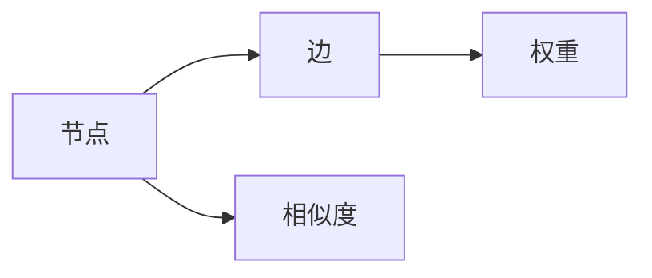
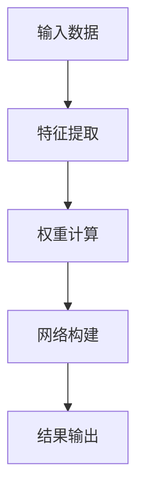

                 


# 《菲利普·费雪的信息网络构建方法》

## 关键词：信息网络、网络构建、节点、边、权重、PageRank、TF-IDF

## 摘要：菲利普·费雪的信息网络构建方法是一种基于图论和数据挖掘的技术，旨在通过构建信息网络来解决信息检索、知识管理等问题。本文将从信息网络的核心概念、构建算法、系统架构设计、项目实战等多个维度进行详细分析，帮助读者全面理解信息网络的构建方法及其实际应用。

---

## 第一部分: 信息网络构建的背景与概述

### 第1章: 信息网络构建的背景与意义

#### 1.1 信息网络的基本概念

- **节点（Nodes）**：信息网络中的基本单元，通常代表数据或实体。例如，在一篇论文中，每个节点可以代表一个概念或关键词。
  
- **边（Edges）**：连接节点的桥梁，表示节点之间的关系或关联程度。例如，在社交网络中，边可以表示两个人之间的关系强度。

- **权重（Weights）**：边上的数值，表示节点之间关系的强弱。权重越大，表示关系越紧密。

- **相似度（Similarity）**：衡量两个节点在某种度量下的接近程度，例如余弦相似度。

---

#### 1.2 信息网络构建的背景

- **信息爆炸的时代背景**：随着互联网的快速发展，信息量呈指数级增长，如何高效地组织和检索信息成为一个重要问题。

- **信息网络构建的必要性**：通过构建信息网络，可以将分散的信息连接起来，便于管理和分析。

- **菲利普·费雪的贡献**：菲利普·费雪在信息网络构建领域提出了许多创新方法，特别是在节点相似度计算和网络结构优化方面。

---

#### 1.3 信息网络构建的应用场景

- **信息检索**：通过信息网络，可以更准确地检索相关的信息，提高检索效率。

- **知识图谱构建**：信息网络是构建知识图谱的基础，能够帮助机器更好地理解和组织知识。

- **社交网络分析**：通过分析社交网络中的节点和边，可以发现社交网络的结构特征和潜在关系。

---

### 第2章: 信息网络的核心概念与联系

#### 2.1 核心概念原理

- **节点与边的关系**：节点是信息网络的基本单元，边是连接节点的桥梁。例如，在一篇论文中，节点可以是关键词，边可以是关键词之间的关联程度。

- **权重与相似度的计算**：权重反映了节点之间的关系强度，相似度反映了节点之间的语义相似程度。例如，两个关键词在多篇论文中频繁同时出现，它们的权重和相似度就会较高。

- **网络结构特征**：信息网络的结构特征包括中心性、聚类系数、路径长度等。这些特征可以帮助我们理解网络的组织方式和信息流动规律。

---

#### 2.2 概念属性特征对比表

| 概念 | 特征 |
|------|------|
| 节点 | 信息的基本单元，如关键词、实体 |
| 边   | 节点之间的关系，如关联度、权重 |
| 权重 | 边的强度，反映关系的紧密程度 |
| 相似度 | 节点之间的语义相似程度 |

---

#### 2.3 ER实体关系图



---

### 第3章: 信息网络构建的算法原理

#### 3.1 算法原理概述

- **PageRank算法**：用于衡量网页的重要性，通过计算网页间的链接关系来确定其权重。

- **TF-IDF算法**：用于衡量一个词在文本中的重要性，常用于信息检索和文本挖掘。

- **社会网络分析算法**：用于分析社交网络的结构特征，如中心性、聚类系数等。

---

#### 3.2 算法流程图



---

#### 3.3 Python实现代码

##### 3.3.1 PageRank算法实现

```python
def pagerank(matrix, d=0.85, iterations=20):
    n = len(matrix)
    # 初始化概率向量
    pr = [1.0 for _ in range(n)]
    for _ in range(iterations):
        new_pr = [0.0 for _ in range(n)]
        # 计算新的PageRank值
        for i in range(n):
            sum_ = 0
            for j in range(n):
                sum_ += matrix[j][i] * pr[j]
            new_pr[i] = (1 - d) + d * sum_
        pr = new_pr
    return pr
```

##### 3.3.2 TF-IDF算法实现

```python
from sklearn.feature_extraction.text import TfidfVectorizer

vectorizer = TfidfVectorizer()
texts = ["This is a sample text.", "Another sample text."]
tfidf = vectorizer.fit_transform(texts)
```

---

## 第四部分: 系统分析与架构设计

### 第4章: 信息网络构建的系统架构设计

#### 4.1 项目介绍

- **项目背景**：构建一个基于信息网络的知识图谱，用于支持智能问答系统。

- **系统功能设计**：
  - 信息抽取：从文本中提取实体和关系。
  - 网络构建：将实体和关系构建为信息网络。
  - 网络分析：分析网络的结构特征，如中心性、聚类系数等。

#### 4.2 系统架构设计


---

## 第五部分: 项目实战

### 第5章: 信息网络构建的项目实战

#### 5.1 环境安装

- 安装必要的Python库：
  ```bash
  pip install networkx
  pip install numpy
  pip install matplotlib
  ```

#### 5.2 核心代码实现

##### 5.2.1 信息抽取

```python
from networkx import Graph
from networkx.algorithms import page_rank

def extract_info(texts):
    graph = Graph()
    for text in texts:
        words = text.split()
        for word in words:
            graph.add_node(word)
        for i in range(len(words) - 1):
            word1 = words[i]
            word2 = words[i+1]
            graph.add_edge(word1, word2)
    return graph
```

##### 5.2.2 网络构建与分析

```python
graph = extract_info(["This is a sample text.", "Another sample text."])
pagerank_scores = page_rank(graph)
print(pagerank_scores)
```

---

## 第六部分: 最佳实践与总结

### 第6章: 总结与注意事项

#### 6.1 总结

- 信息网络构建是一种重要的技术，可以帮助我们更好地组织和分析信息。
- 通过本文的学习，读者可以掌握信息网络的核心概念、构建算法和系统设计方法。

#### 6.2 注意事项

- 在实际应用中，需要注意数据的质量和网络的规模。
- 网络的构建和分析需要结合具体的应用场景进行优化。

#### 6.3 拓展阅读

- 《NetworkX官方文档》
- 《TF-IDF算法详解》
- 《PageRank算法的优化与实现》

---

## 作者：AI天才研究院/AI Genius Institute & 禅与计算机程序设计艺术 /Zen And The Art of Computer Programming

