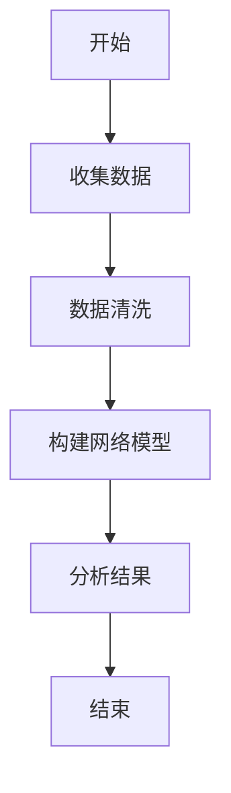
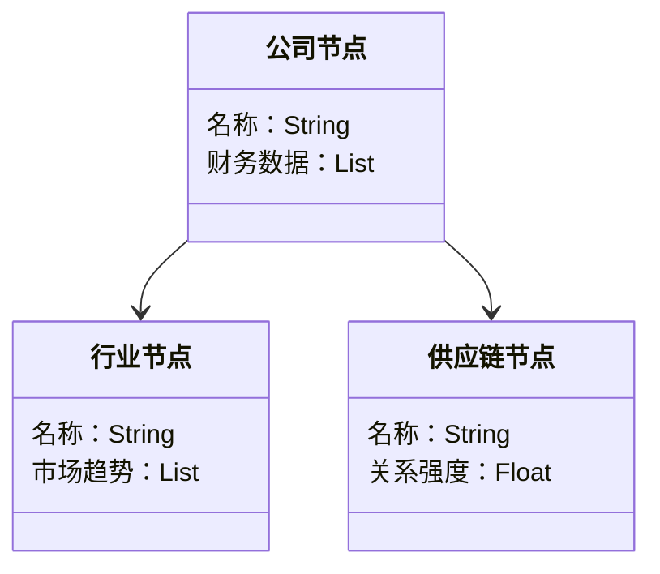
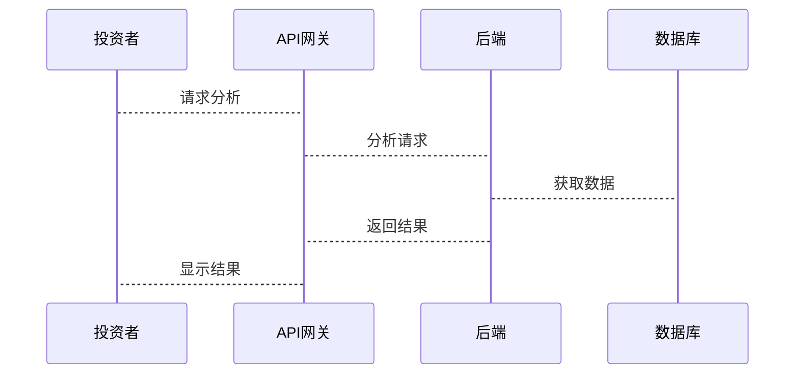

                 


# 菲利普·费雪的信息网络：如何建立投资情报系统

> 关键词：信息网络，投资情报系统，菲利普·费雪，算法原理，系统架构

> 摘要：本文详细探讨了菲利普·费雪的信息网络理论，分析了如何通过构建信息网络来建立投资情报系统。文章从背景介绍、核心概念、算法原理、系统架构到项目实战，全面阐述了投资情报系统的构建过程，并提供了详细的数学模型和系统设计。

---

## 第一部分：背景介绍

### 第1章：信息网络与投资情报系统概述

#### 1.1 信息网络的定义与核心概念

##### 1.1.1 信息网络的定义
信息网络是指通过节点和边构成的图结构，用于表示信息之间的关系。在投资领域，信息网络用于分析公司、行业、市场等之间的关联性。

##### 1.1.2 信息网络的核心要素
信息网络由节点、边和权重组成。节点代表信息主体（如公司），边代表信息之间的关系（如供应链），权重表示关系的强度。

##### 1.1.3 投资情报系统的定义与特点
投资情报系统是通过收集、分析和利用信息网络中的数据，辅助投资者做出决策的系统。其特点是实时性、动态性和智能化。

#### 1.2 菲利普·费雪的信息网络理论

##### 1.2.1 菲利普·费雪投资理论的背景
菲利普·费雪是价值投资的先驱，强调通过深入研究企业的基本面来发现投资机会。

##### 1.2.2 信息网络在投资决策中的作用
信息网络帮助投资者发现潜在的投资机会，评估企业的竞争优势，预测市场趋势。

##### 1.2.3 菲利普·费雪方法的核心要素
包括深入的企业研究、信息网络的构建、持续的信息更新和动态调整。

#### 1.3 信息网络与投资情报系统的联系

##### 1.3.1 信息网络如何支持投资决策
通过分析信息网络中的节点关系，投资者可以识别行业趋势和潜在风险。

##### 1.3.2 投资情报系统的构建逻辑
从数据收集、信息整理到模型构建，最终形成决策支持系统。

##### 1.3.3 信息网络与投资情报系统的区别与联系
信息网络是投资情报系统的底层结构，投资情报系统是基于信息网络的高级应用。

---

## 第二部分：核心概念与联系

### 第2章：信息网络的核心概念与联系

#### 2.1 核心概念原理

##### 2.1.1 信息网络的构成要素
节点：代表信息主体（如公司、行业）；边：代表信息之间的关系（如供应链）；权重：表示关系的强度。

##### 2.1.2 投资情报系统的功能模块
数据收集模块：从多种来源获取信息；分析模块：对数据进行处理和建模；决策支持模块：提供投资建议。

##### 2.1.3 信息网络与投资决策的交互机制
信息网络通过分析节点关系，辅助投资者做出决策。

#### 2.2 核心概念属性特征对比表

##### 2.2.1 信息网络与传统投资方法的对比
| 特性       | 信息网络          | 传统投资方法      |
|------------|-------------------|-------------------|
| 数据来源   | 多样化数据源       | 单一数据源         |
| 分析方法   | 网络分析           | 财务分析           |
| 决策依据   | 关系网络           | 财务指标           |

##### 2.2.2 不同信息源的特征分析
- 公开数据：如财务报表、新闻报道；
- 非公开数据：如内部文档、行业报告；
- 社交媒体数据：如市场情绪分析。

##### 2.2.3 信息网络的动态调整机制
信息网络需要定期更新节点和边，以反映最新的市场动态。

#### 2.3 ER实体关系图架构

```mermaid
er
  title 投资情报系统的ER图

  公司节点
  投资者节点
  行业节点
  供应链节点

  公司节点 -- 关联关系 --> 行业节点
  公司节点 -- 供应链关系 --> 供应链节点
  投资者节点 -- 投资关系 --> 公司节点
```

---

## 第三部分：算法原理

### 第3章：信息网络的算法原理

#### 3.1 算法原理概述

##### 3.1.1 信息网络的构建算法
信息网络的构建包括数据收集、数据清洗、数据建模和可视化。

##### 3.1.2 投资情报系统的优化算法
通过优化算法（如遗传算法）来提升投资决策的准确性。

##### 3.1.3 算法的数学模型与公式
$$ W = \sum_{i=1}^{n} w_i $$，其中$W$是总权重，$w_i$是各边的权重。

#### 3.2 算法流程图



#### 3.3 算法的数学模型与公式

##### 3.3.1 信息网络的权重计算公式
$$ w_{ij} = \frac{count_{ij}}{total_{i}} $$，其中$w_{ij}$是节点$i$和$j$之间的权重，$count_{ij}$是边的出现次数，$total_{i}$是节点$i$的总边数。

##### 3.3.2 投资情报系统的评估指标
- 准确率：正确预测的比例；
- 召回率：发现实际相关节点的比例；
- F1值：准确率和召回率的调和平均。

---

## 第四部分：系统分析与架构设计

### 第4章：信息网络的系统分析与架构设计

#### 4.1 问题场景介绍

##### 4.1.1 投资情报系统的应用场景
- 股票投资：分析公司的供应链和市场关系；
- 风险评估：识别潜在风险点；
- 投资组合优化：通过网络分析优化资产配置。

#### 4.2 系统功能设计

##### 4.2.1 领域模型的Mermaid类图



#### 4.3 系统架构设计

##### 4.3.1 系统架构图


#### 4.4 系统接口设计

##### 4.4.1 接口描述
- 数据接口：用于获取实时数据；
- 分析接口：用于运行网络分析算法；
- 结果接口：用于返回分析结果。

#### 4.5 系统交互流程图



---

## 第五部分：项目实战

### 第5章：信息网络的项目实战

#### 5.1 项目介绍

##### 5.1.1 项目目标
构建一个基于菲利普·费雪理论的信息网络，辅助投资者做出决策。

##### 5.1.2 项目需求
- 数据收集：获取目标公司的财务数据、行业趋势；
- 数据处理：清洗和整理数据；
- 网络构建：构建公司、行业和供应链的关系网络；
- 可视化：展示网络结构并分析潜在风险。

#### 5.2 核心实现

##### 5.2.1 环境安装
安装必要的Python库：
```bash
pip install networkx matplotlib pandas
```

##### 5.2.2 核心代码实现

```python
import networkx as nx
import matplotlib.pyplot as plt

# 创建公司节点
G = nx.Graph()
G.add_nodes_from(["CompanyA", "CompanyB", "IndustryA", "SupplyChainA"])

# 添加边
G.add_edges_from([("CompanyA", "IndustryA"), ("CompanyA", "SupplyChainA")])

# 可视化
nx.draw(G, with_labels=True, edge_color="b", node_color="r")
plt.show()
```

##### 5.2.3 代码应用解读
上述代码创建了一个简单的信息网络，展示了公司与其所在行业和供应链的关系。实际应用中，需要添加更多节点和边，并进行权重计算。

#### 5.3 案例分析

##### 5.3.1 投资者视角的案例分析
通过分析目标公司的供应链关系，识别潜在的供应风险。

##### 5.3.2 行业专家视角的案例分析
通过行业网络分析，识别行业趋势和竞争格局。

##### 5.3.3 技术实现视角的案例分析
通过算法优化，提升网络分析的准确性和效率。

#### 5.4 项目小结

##### 5.4.1 项目总结
通过构建信息网络，投资者可以更全面地分析投资目标，做出更明智的决策。

##### 5.4.2 项目经验
在实际操作中，需要注意数据的多样性和质量，以及算法的优化和调整。

---

## 第六部分：最佳实践

### 第6章：最佳实践与小结

#### 6.1 最佳实践

##### 6.1.1 系统维护
定期更新数据和模型，确保系统的准确性和时效性。

##### 6.1.2 动态调整
根据市场变化和投资目标，动态调整信息网络的结构和权重。

##### 6.1.3 注意事项
- 数据隐私和安全；
- 算法的可解释性和透明性；
- 系统的稳定性和可靠性。

#### 6.2 小结

##### 6.2.1 知识回顾
通过构建信息网络，投资者可以更好地理解市场动态和企业关系。

##### 6.2.2 经验总结
信息网络的应用需要结合理论和实践，注重数据的质量和算法的优化。

##### 6.2.3 未来展望
随着人工智能和大数据技术的发展，信息网络在投资领域的应用将更加广泛和深入。

---

## 作者信息

作者：AI天才研究院/AI Genius Institute & 禅与计算机程序设计艺术 /Zen And The Art of Computer Programming

---

希望这篇文章能够帮助读者理解如何通过菲利普·费雪的信息网络理论，建立高效的投资情报系统。文章从理论到实践，详细阐述了信息网络的构建过程，提供了丰富的案例和代码示例，帮助读者逐步掌握投资情报系统的构建方法。

