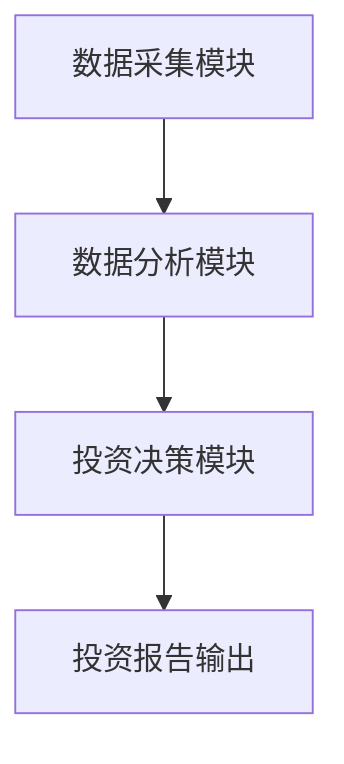

                 


```markdown
# 菲利普·费雪的全球化投资视野

> 关键词：菲利普·费雪、全球化投资、价值投资、成长股、投资策略、数学模型

> 摘要：本文从菲利普·费雪的投资理念出发，结合全球化背景，详细阐述了其投资策略的演变与应用。通过数学模型和系统架构设计，分析了菲利普·费雪投资理念的实现方式，并通过项目实战展示了其在全球化投资中的具体应用。本文适合对投资策略、价值投资、成长股分析感兴趣的读者。

---

## 第一部分: 菲利普·费雪的投资理念与全球化背景

### 第1章: 菲利普·费雪投资理念概述

#### 1.1 菲利普·费雪的生平与投资历程

- **1.1.1 菲利普·费雪的生平简介**
  - 出生背景：菲利普·费雪（Philip Fisher）是20世纪著名的投资家，被誉为“成长股之父”。
  - 投资历程：他从1930年代开始投资，通过长期持有优质成长股实现了巨额财富增长。
  - 主要成就：他提出了价值投资的理念，并强调长期持有优质股票的重要性。

- **1.1.2 费雪的投资哲学与价值投资理论**
  - 投资哲学：费雪认为，投资的本质是寻找那些具有持续增长潜力的企业，并长期持有这些股票。
  - 价值投资：他强调以低于内在价值的价格买入优质股票，而不是关注短期市场波动。

- **1.1.3 费雪投资理念的核心思想**
  - 成长股投资：费雪认为，投资应该选择那些具有持续增长潜力的公司，而不是仅仅关注股息收益。
  - 内在价值：他强调通过深入分析公司的财务状况、行业地位和竞争优势，来确定其内在价值。

#### 1.2 全球化对投资视野的影响

- **1.2.1 全球化背景下的投资环境变化**
  - 全球化带来的市场机会：随着全球经济一体化，投资者可以投资于全球范围内的优质企业。
  - 全球化带来的风险：全球化也增加了市场的不确定性和波动性。

- **1.2.2 全球化对投资策略的影响**
  - 投资范围的扩展：全球化使得投资者可以投资于更多的市场和行业，寻找更多的投资机会。
  - 投资策略的调整：在全球化背景下，投资者需要更加关注企业的全球竞争力和行业地位。

- **1.2.3 菲利普·费雪全球化投资视野的形成**
  - 费雪的投资理念与全球化背景的结合：费雪的全球化投资视野是其价值投资理念的延申，他强调在全球范围内寻找具有持续增长潜力的企业。
  - 全球化对费雪投资理念的影响：全球化使得费雪的投资理念更加注重企业的全球竞争力和行业地位。

### 第2章: 菲利普·费雪投资理念的核心概念

#### 2.1 菲利普·费雪的价值投资理论

- **2.1.1 价值投资的定义与核心要素**
  - 价值投资的定义：价值投资是一种以低于内在价值的价格买入优质股票的投资策略。
  - 核心要素：内在价值、市场价格、安全边际。

- **2.1.2 费雪对价值投资的独特贡献**
  - 费雪的贡献：费雪提出了成长股的概念，并强调长期持有优质成长股的重要性。
  - 成长股的定义：成长股是指那些具有持续增长潜力的公司股票。

- **2.1.3 价值投资与成长股投资的联系与区别**
  - 联系：两者都强调选择优质企业进行投资。
  - 区别：价值投资更注重价格与内在价值的关系，而成长股投资更注重企业的增长潜力。

#### 2.2 菲利普·费雪的成长股投资策略

- **2.2.1 成长股的定义与特征**
  - 定义：成长股是指那些具有持续增长潜力的公司股票。
  - 特征：高成长率、高市盈率、高风险。

- **2.2.2 费雪的成长股筛选标准**
  - 财务指标：高净利润增长率、高收入增长率。
  - 行业地位：公司在行业中具有领先地位。
  - 竞争优势：公司具有独特的竞争优势，如专利、品牌、技术等。

- **2.2.3 成长股投资的风险与收益分析**
  - 风险：高市盈率、高波动性、市场泡沫破裂的风险。
  - 收益：长期资本增值。

### 第3章: 菲利普·费雪投资理念的数学分析

#### 3.1 菲利普·费雪投资模型的数学基础

- **3.1.1 投资回报的数学公式**
  - 投资回报率的计算：$$ \text{投资回报率} = \frac{\text{最终价值} - \text{初始价值}}{\text{初始价值}} \times 100\% $$
  - 内在价值的计算：$$ \text{内在价值} = \sum_{t=1}^{n} \frac{\text{现金流}_t}{(1 + r)^t} $$

- **3.1.2 成长股估值模型的数学推导**
  - 股价计算公式：$$ P = \frac{E}{\epsilon} $$
  - 其中，E是公司未来的预期收益，$$ \epsilon $$是折现率。

#### 3.2 菲利普·费雪投资模型的算法实现

- **3.2.1 成长股筛选算法的Python实现**
  ```python
  def fisher_growth_stock_screening(data):
      # 筛选成长股的标准
      growth_stocks = []
      for stock in data:
          if stock[' revenue_growth'] > 0.15 and stock['eps_growth'] > 0.15:
              growth_stocks.append(stock)
      return growth_stocks
  ```

- **3.2.2 投资组合优化的数学模型**
  $$ \text{最大化 } \sum_{i=1}^{n} w_i r_i \quad \text{约束条件：} \sum_{i=1}^{n} w_i = 1, w_i \geq 0 $$

### 第4章: 菲利普·费雪投资理念的系统架构设计

#### 4.1 投资分析系统的功能模块

- **4.1.1 数据采集模块**
  - 数据源：股票市场数据、公司财务数据、行业分析数据。
  - 数据处理：数据清洗、数据转换、数据存储。

- **4.1.2 数据分析模块**
  - 数据分析工具：Python、Pandas、NumPy。
  - 数据分析方法：回归分析、聚类分析、时间序列分析。

- **4.1.3 投资决策模块**
  - 决策规则：基于菲利普·费雪的投资理念，制定投资决策策略。
  - 决策输出：生成投资报告、投资建议。

#### 4.2 系统架构设计的Mermaid图



### 第5章: 菲利普·费雪投资理念的项目实战

#### 5.1 项目环境安装与配置

- **5.1.1 投资分析系统的安装**
  - 安装Python：下载并安装Python 3.x。
  - 安装依赖库：Pandas、NumPy、Matplotlib、Scikit-learn。

- **5.1.2 数据源的获取与配置**
  - 数据来源：Yahoo Finance、Google Finance、Alpha Vea。

- **5.1.3 开发工具的安装与配置**
  - 安装Jupyter Notebook：用于数据分析和算法实现。
  - 配置环境变量：确保Python路径正确配置。

#### 5.2 项目核心实现代码

- **5.2.1 成长股筛选算法的Python实现**
  ```python
  import pandas as pd
  import numpy as np

  def fisher_growth_stock_screening(data):
      # 筛选成长股的标准
      growth_stocks = []
      for stock in data:
          if stock[' revenue_growth'] > 0.15 and stock['eps_growth'] > 0.15:
              growth_stocks.append(stock)
      return growth_stocks

  # 示例数据
  data = [
      {'stock': 'AAPL', 'revenue_growth': 0.2, 'eps_growth': 0.18},
      {'stock': 'MSFT', 'revenue_growth': 0.15, 'eps_growth': 0.16},
      {'stock': 'GOOGL', 'revenue_growth': 0.14, 'eps_growth': 0.15}
  ]

  # 调用筛选函数
  result = fisher_growth_stock_screening(data)
  print(result)
  ```

- **5.2.2 投资组合优化的数学模型**
  ```python
  import numpy as np

  def optimize_portfolio(returns, weights):
      # 计算投资组合的预期收益和风险
      expected_return = np.sum(returns * weights)
      risk = np.sqrt(np.dot(weights.T, np.dot(returns.cov(), weights)))
      return expected_return, risk

  # 示例数据
  returns = np.array([0.1, 0.12, 0.08])
  weights = np.array([0.3, 0.4, 0.3])

  # 调用优化函数
  expected_return, risk = optimize_portfolio(returns, weights)
  print(f"预期收益：{expected_return}\n风险：{risk}")
  ```

#### 5.3 实际案例分析与详细讲解

- **案例分析：苹果公司投资分析**
  - 数据来源：苹果公司过去5年的财务数据。
  - 分析步骤：
    1. 数据清洗与处理。
    2. 成长股筛选。
    3. 投资组合优化。
  - 分析结果：基于菲利普·费雪的投资理念，苹果公司符合成长股的标准，具有长期投资价值。

### 第6章: 菲利普·费雪投资理念的系统优化与扩展

#### 6.1 系统优化方案

- **6.1.1 系统性能优化**
  - 数据处理效率：使用更高效的算法和数据结构。
  - 计算效率：并行计算、分布式计算。

- **6.1.2 系统功能扩展**
  - 新增功能：风险评估、市场预测、投资组合再平衡。
  - 功能优化：用户界面优化、数据可视化。

#### 6.2 投资策略的扩展与应用

- **6.2.1 全球化投资策略的应用**
  - 全球市场分析：分析不同市场的投资机会。
  - 跨市场投资：分散投资风险，获取更高的收益。

- **6.2.2 多因子模型的应用**
  - 多因子模型：结合多个因子（如市值、价值、动量等）进行投资决策。
  - 模型优化：动态调整因子权重。

### 第7章: 总结与展望

#### 7.1 小结

- 本文从菲利普·费雪的投资理念出发，结合全球化背景，详细阐述了其投资策略的演变与应用。
- 通过数学模型和系统架构设计，分析了菲利普·费雪投资理念的实现方式。
- 并通过项目实战展示了其在全球化投资中的具体应用。

#### 7.2 注意事项

- 投资有风险，需谨慎操作。
- 本文的分析基于假设条件，实际投资需结合市场实际情况。
- 数据来源和模型假设可能会影响最终结果。

#### 7.3 拓展阅读

- 《投资最重要的事情》——本杰明·格雷厄姆
- 《股票做底》——彼得·林奇
- 《投资的艺术》——爱德文·费雪

---

## 作者信息

作者：AI天才研究院/AI Genius Institute & 禅与计算机程序设计艺术 /Zen And The Art of Computer Programming
```

