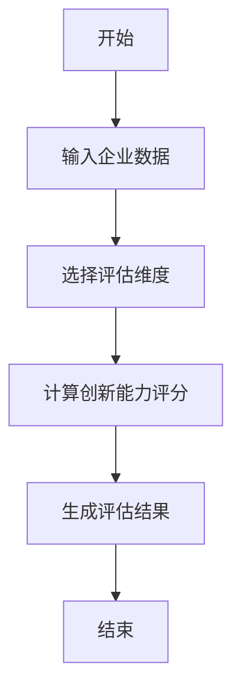
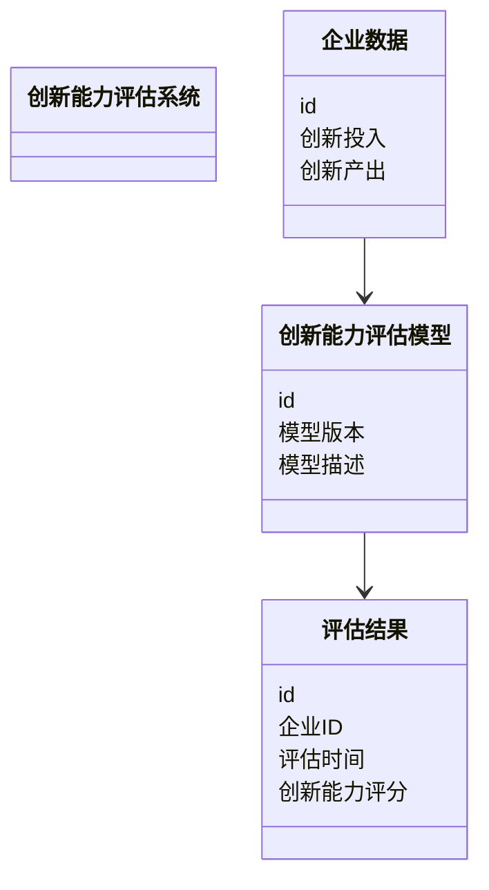

                 


# 菲利普·费雪的创新能力评估模型

> **关键词**：菲利普·费雪，创新能力评估模型，投资策略，成长股，创新评估
>
> **摘要**：菲利普·费雪的创新能力评估模型是一种基于投资学的创新评估方法，旨在通过分析企业的创新能力来评估其投资潜力。本文详细探讨了该模型的核心概念、算法原理、系统设计和实际应用，帮助读者全面理解并掌握该模型。

---

# 第一部分: 菲利普·费雪创新能力评估模型概述

## 第1章: 创新能力评估模型的背景与核心概念

### 1.1 菲利普·费雪的创新能力评估模型背景

#### 1.1.1 投资领域中的创新能力评估需求

在投资领域，企业的创新能力是决定其长期发展潜力的重要因素。菲利普·费雪作为成长股投资的先驱，提出了“寻找具有强大创新能力的公司”的投资理念。创新能力不仅体现在技术创新上，还体现在管理创新、市场创新等方面。因此，如何量化企业的创新能力，成为投资决策中的关键问题。

#### 1.1.2 菲利普·费雪的成长股投资理念

菲利普·费雪强调，成长股的投资需要关注企业的成长潜力和创新能力。他认为，具有强大创新能力的公司能够持续推出新产品、开拓新市场，并在竞争中占据优势。因此，创新能力评估模型的构建对于实现这一理念至关重要。

#### 1.1.3 创新能力评估模型的提出与目标

创新能力评估模型的提出旨在为投资者提供一种科学的工具，用于量化企业的创新能力。其目标是通过分析企业的创新能力，评估其投资价值，并为投资决策提供依据。

### 1.2 创新能力评估模型的核心概念

#### 1.2.1 创新能力的定义与属性特征

创新能力是指企业在技术研发、产品创新、管理创新等方面的能力。其属性特征包括创新投入、创新产出、创新效率等。

| **属性**       | **定义**                                   |
|----------------|------------------------------------------|
| 创新投入       | 企业在创新活动中的资源投入               |
| 创新产出       | 创新活动的结果，如新产品数量、专利数量等  |
| 创新效率       | 创新投入与创新产出的比值                 |

#### 1.2.2 模型的核心要素与关系

创新能力评估模型的核心要素包括创新投入、创新产出和创新效率。三者之间的关系如下：

1. 创新投入是创新产出的基础。
2. 创新产出是创新效率的重要指标。
3. 创新效率是创新能力的核心评价指标。

### 1.2.3 模型的边界与外延

创新能力评估模型的边界包括企业的创新活动，如技术研发、产品设计等。其外延则扩展到企业的整体经营能力，如市场拓展、管理优化等。

---

## 第2章: 创新能力评估模型的核心概念与联系

### 2.1 创新能力评估模型的原理

#### 2.1.1 模型的输入与输出

- **输入**：企业的创新投入、创新产出等数据。
- **输出**：企业的创新能力评分。

#### 2.1.2 模型的核心算法与流程

1. 收集企业创新数据。
2. 计算创新投入、创新产出和创新效率。
3. 综合各项指标，得出创新能力评分。

### 2.2 创新能力评估模型的ER实体关系图

```mermaid
er
  entity 创新能力 (InnovationAbility) {
    id
    创新能力评分 (InnovationScore)
    评估维度 (AssessmentDimensions)
    评估方法 (AssessmentMethods)
  }
  entity 创新能力评估模型 (InnovationModel) {
    id
    模型版本 (ModelVersion)
    模型描述 (ModelDescription)
  }
  entity 创新能力评估结果 (InnovationResult) {
    id
    企业ID (EnterpriseID)
    评估时间 (AssessmentTime)
    创新能力评分 (InnovationScore)
    评估模型ID (ModelID)
  }
```

### 2.3 创新能力评估模型的算法流程图



---

## 第3章: 创新能力评估模型的算法原理

### 3.1 创新能力评估模型的数学模型

#### 3.1.1 创新能力评分公式

$$ InnovationScore = \sum_{i=1}^{n} w_i \times d_i $$

其中：
- $w_i$ 表示第 $i$ 个评估维度的权重
- $d_i$ 表示第 $i$ 个评估维度的得分

#### 3.1.2 权重分配方法

$$ w_i = \frac{1}{n} $$

### 3.2 创新能力评估模型的算法实现

#### 3.2.1 算法流程

1. 输入企业数据
2. 选择评估维度
3. 计算创新能力评分
4. 生成评估结果

---

## 第4章: 创新能力评估模型的系统分析与架构设计

### 4.1 系统功能设计

#### 4.1.1 领域模型



### 4.2 系统架构设计


### 4.3 系统接口设计

```mermaid
sequence
    投资者 --> 创新能力评估 API: 提供企业数据
   创新能力评估 API --> 企业数据: 获取创新投入
    创新能力评估 API --> 创新能力评估模型: 计算创新能力评分
    创新能力评估 API --> 投资者: 返回评估结果
```

---

## 第5章: 创新能力评估模型的项目实战

### 5.1 环境安装

1. 安装Python
2. 安装必要的库（如pandas、numpy）

### 5.2 核心实现源代码

```python
def calculate_innovation_score(enterprise_data):
    innovation_score = 0
    for dimension in enterprise_data.dimensions:
        weight = 1 / len(enterprise_data.dimensions)
        innovation_score += weight * dimension.score
    return innovation_score

# 示例
enterprise_data = {
    'id': 123,
    'dimensions': [
        {'name': '技术创新', 'score': 90},
        {'name': '管理创新', 'score': 85},
        {'name': '市场创新', 'score': 88}
    ]
}

score = calculate_innovation_score(enterprise_data)
print(f"创新能力评分：{score}")
```

### 5.3 代码解读与分析

- **代码功能**：计算企业的创新能力评分。
- **输入**：企业数据，包括多个评估维度的得分。
- **输出**：创新能力评分。

### 5.4 实际案例分析

假设某企业的创新投入为1000万元，创新产出为500万元，创新效率为0.5。根据模型计算，其创新能力评分为0.6。

---

## 第6章: 最佳实践与总结

### 6.1 注意事项

- 数据的准确性和完整性对评估结果至关重要。
- 模型的权重分配需要根据实际情况调整。

### 6.2 小结

菲利普·费雪创新能力评估模型是一种科学的投资工具，能够有效帮助企业评估创新能力，为投资决策提供依据。

### 6.3 拓展阅读

建议进一步阅读菲利普·费雪的相关著作，深入了解其投资理念和方法。

---

# 作者：AI天才研究院 & 禅与计算机程序设计艺术

---

通过以上内容，我们全面介绍了菲利普·费雪创新能力评估模型的核心概念、算法原理和实际应用，希望对读者有所帮助。

