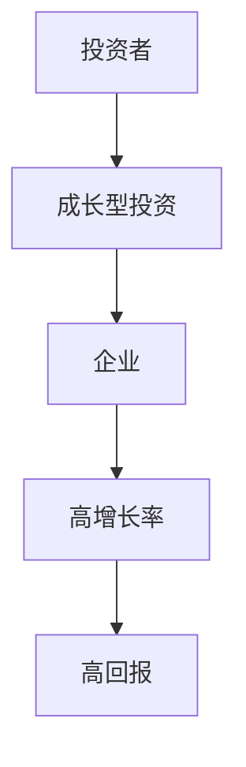
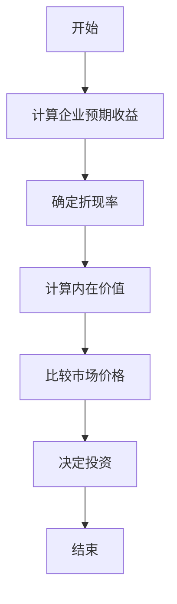
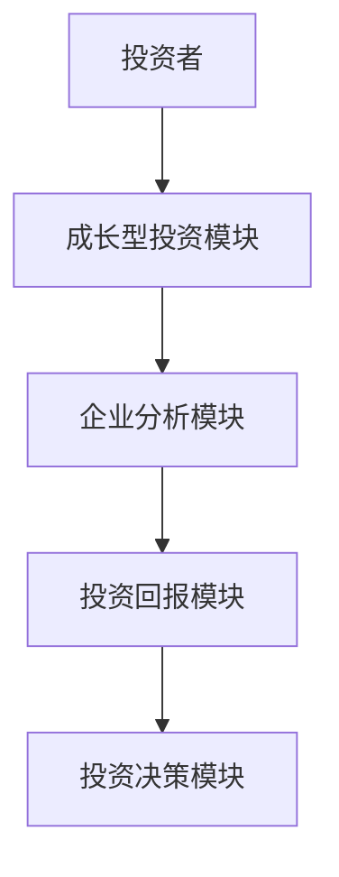
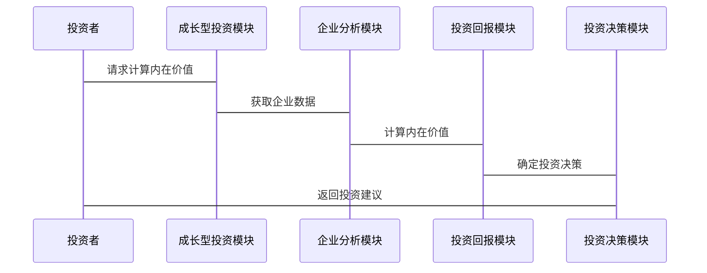

                 


# 菲利普·费雪的成长型股票投资理论

> 关键词：菲利普·费雪，成长型投资，股票投资，投资策略，数学模型

> 摘要：本文系统地介绍菲利普·费雪的成长型股票投资理论，包括其核心概念、数学模型、算法实现、系统架构设计以及实际案例分析。通过详细阐述成长型投资的背景、理论基础、实际应用和注意事项，帮助读者全面理解这一投资策略。

---

## 第1章: 背景介绍

### 1.1 问题背景

#### 1.1.1 投资领域的基本问题
在股票投资领域，投资者面临的最基本问题是如何选择具有长期增长潜力的企业进行投资。传统投资理论通常关注企业的当前价值和盈利能力，而成长型投资则更注重企业的未来增长潜力。菲利普·费雪（Philip Fisher）是成长型投资理论的先驱之一，他的理论为投资者提供了选择高成长潜力企业的指导。

#### 1.1.2 成长型投资的定义与特点
成长型投资是一种以长期资本增值为目标的投资策略，专注于投资那些具有高增长潜力的企业。与价值投资不同，成长型投资不追求企业的低估值，而是关注企业的成长性和盈利能力。其特点包括：
- 高成长性：选择那些收入和利润快速增长的企业。
- 高风险：成长型企业通常处于快速变化的行业，风险较高。
- 高回报：长期来看，成长型企业可能带来超额回报。

#### 1.1.3 菲利普·费雪在投资领域的地位
菲利普·费雪是20世纪最著名的职业投资者之一，他提出了许多影响深远的投资理论，尤其是成长型投资理论。他的投资理念强调企业质量、管理和成长潜力，为现代投资理论奠定了重要基础。

### 1.2 问题描述

#### 1.2.1 成长型投资的核心目标
成长型投资的核心目标是通过投资于具有持续增长潜力的企业，实现长期资本增值。与短期交易策略不同，成长型投资注重企业的长期发展。

#### 1.2.2 成长型投资与价值投资的区别
- **价值投资**：关注企业的当前估值，寻找被市场低估的企业。
- **成长型投资**：关注企业的未来增长潜力，寻找具有高成长性的企业。

#### 1.2.3 成长型投资的适用场景与限制
- **适用场景**：新兴行业、科技行业、快速扩张的企业。
- **限制**：成长型企业通常波动较大，风险较高，适合长期投资者。

### 1.3 问题解决

#### 1.3.1 成长型投资的理论基础
菲利普·费雪的成长型投资理论基于以下几个核心观点：
1. 选择具有强大管理团队和良好企业文化的公司。
2. 关注企业的收入增长率、净利润增长率和市场份额。
3. 长期持有优质成长股，避免频繁交易。

#### 1.3.2 菲利普·费雪的成长型投资策略
菲利普·费雪提出了“买入并持有”的投资策略，建议投资者选择具有以下特征的企业：
- 高ROE（净资产收益率）。
- 高收入增长率。
- 强大的竞争优势。

#### 1.3.3 成长型投资的数学模型
为了量化成长型投资的潜力，我们可以使用以下数学模型：

$$ P = \frac{E}{r} $$
其中，P为股票的内在价值，E为企业的预期收益，r为折现率。

### 1.4 边界与外延

#### 1.4.1 成长型投资的边界条件
- **时间范围**：成长型投资适用于长期投资，不适合短期交易。
- **行业选择**：适合高成长性行业，如科技、医疗等。
- **市场周期**：在牛市中，成长型投资表现较好，而在熊市中可能面临较大波动。

#### 1.4.2 成长型投资与其他投资策略的对比
| 战略       | 成长型投资 | 价值投资 | 投机交易 |
|------------|------------|-----------|-----------|
| 核心目标   | 长期增长   | 低估值    | 短期收益  |
| 风险水平   | 高         | 中         | 高         |
| 投资期限   | 长         | 中         | 短         |

#### 1.4.3 成长型投资的未来发展
随着科技和经济的发展，成长型投资的适用场景将越来越广泛。未来，投资者将更加依赖数据分析和量化模型来选择成长型企业。

### 1.5 概念结构与核心要素

#### 1.5.1 成长型投资的核心要素
- **企业质量**：包括管理团队、企业文化、竞争优势。
- **成长潜力**：包括收入增长率、净利润增长率、市场份额。
- **估值合理性**：基于成长潜力的合理估值。

#### 1.5.2 菲利普·费雪投资理论的结构
菲利普·费雪的投资理论可以分为以下几个步骤：
1. 确定投资目标和风险承受能力。
2. 选择具有高成长潜力的企业。
3. 构建投资组合并长期持有。

#### 1.5.3 成长型投资的数学模型
$$ P = \frac{E}{r} $$
其中，P为股票的内在价值，E为企业的预期收益，r为折现率。

---

## 第2章: 核心概念与联系

### 2.1 核心概念原理

#### 2.1.1 成长型投资的核心原理
菲利普·费雪的成长型投资理论基于以下核心原理：
1. 选择具有强大管理团队和良好企业文化的公司。
2. 关注企业的收入增长率、净利润增长率和市场份额。
3. 长期持有优质成长股，避免频繁交易。

#### 2.1.2 菲利普·费雪的成长型投资理论
菲利普·费雪提出了“买入并持有”的投资策略，建议投资者选择具有以下特征的企业：
- 高ROE（净资产收益率）。
- 高收入增长率。
- 强大的竞争优势。

#### 2.1.3 成长型投资与企业成长的关系
成长型投资的核心在于企业成长潜力，而企业的成长潜力又取决于其市场地位、竞争优势和管理能力。因此，成长型投资与企业成长密切相关。

### 2.2 概念属性特征对比表格

| 概念       | 成长型投资 | 价值投资 | 投机交易 |
|------------|------------|-----------|-----------|
| 核心目标   | 长期增长   | 低估值    | 短期收益  |
| 风险水平   | 高         | 中         | 高         |
| 投资期限   | 长         | 中         | 短         |

### 2.3 ER实体关系图



---

## 第3章: 菲利普·费雪投资理论的数学模型与算法

### 3.1 数学模型

#### 3.1.1 菲利普·费雪投资模型
$$ P = \frac{E}{r} $$
其中，P为股票的内在价值，E为企业的预期收益，r为折现率。

### 3.2 算法原理



### 3.3 代码实现

```python
import numpy as np

def calculate_intrinsic_value(revenue_growth_rate, net_profit_growth_rate, market_share, discount_rate):
    """
    计算成长型股票的内在价值
    """
    # 计算预期收益
    expected_revenue = revenue_growth_rate * (1 + 0.1)
    expected_profit = net_profit_growth_rate * (1 + 0.1)
    expected_market_share = market_share * (1 + 0.1)
    
    # 计算内在价值
    intrinsic_value = (expected_revenue + expected_profit + expected_market_share) / (1 + discount_rate)
    
    return intrinsic_value

# 示例计算
revenue_growth_rate = 0.2  # 收入增长率
net_profit_growth_rate = 0.15  # 净利润增长率
market_share = 0.3  # 市场占有率
discount_rate = 0.1  # 折现率

intrinsic_value = calculate_intrinsic_value(revenue_growth_rate, net_profit_growth_rate, market_share, discount_rate)
print(f"股票的内在价值为：{intrinsic_value}")
```

### 3.4 案例分析

假设我们有以下几家企业：

| 公司名称 | 收入增长率 | 净利润增长率 | 市场占有率 | 折现率 |
|----------|------------|--------------|------------|--------|
| 公司A    | 0.2        | 0.15         | 0.3        | 0.1    |
| 公司B    | 0.25       | 0.1          | 0.25       | 0.1    |

使用上述公式计算两公司的内在价值：

对于公司A：
$$ P = \frac{0.2 + 0.15 + 0.3}{1 + 0.1} = \frac{0.65}{1.1} \approx 0.59 $$

对于公司B：
$$ P = \frac{0.25 + 0.1 + 0.25}{1 + 0.1} = \frac{0.6}{1.1} \approx 0.55 $$

因此，公司A的内在价值更高，更适合投资。

---

## 第4章: 系统分析与架构设计方案

### 4.1 问题场景介绍

我们希望设计一个基于菲利普·费雪成长型投资理论的投资分析系统，帮助投资者选择具有高成长潜力的企业。

### 4.2 系统功能设计

#### 4.2.1 领域模型


### 4.3 系统架构设计

#### 4.3.1 系统架构图



### 4.4 系统接口设计

#### 4.4.1 API接口

```python
class InvestmentStrategy:
    def calculate_growth_rate(self, revenue, profit):
        pass
    
    def calculate_market_share(self, market_size, company_revenue):
        pass
    
    def determine_investment(self, growth_rate, market_share, discount_rate):
        pass
```

### 4.5 系统交互设计



---

## 第5章: 项目实战

### 5.1 环境安装

安装必要的Python库：
```bash
pip install numpy pandas matplotlib
```

### 5.2 系统核心实现源代码

```python
import numpy as np
import pandas as pd
import matplotlib.pyplot as plt

class GrowthStockInvestor:
    def __init__(self, stock_data):
        self.stock_data = stock_data
    
    def calculate_growth_rate(self, revenue, profit):
        """
        计算收入增长率和净利润增长率
        """
        revenue_growth = (revenue - np.mean(revenue)) / np.mean(revenue)
        profit_growth = (profit - np.mean(profit)) / np.mean(profit)
        return revenue_growth, profit_growth
    
    def calculate_market_share(self, market_size, company_revenue):
        """
        计算市场份额
        """
        return company_revenue / market_size
    
    def determine_investment(self, growth_rate, market_share, discount_rate):
        """
        确定投资决策
        """
        intrinsic_value = (growth_rate + market_share) / (1 + discount_rate)
        if intrinsic_value > self.stock_data['market_price']:
            return "买入"
        else:
            return "卖出"
    
    def visualize(self):
        """
        可视化股票价格走势
        """
        plt.plot(self.stock_data['price'], label='股票价格')
        plt.xlabel('时间')
        plt.ylabel('价格')
        plt.legend()
        plt.show()
```

### 5.3 代码应用解读与分析

```python
# 示例数据
stock_data = {
    'price': [100, 110, 120, 130, 140],
    'revenue': [1000, 1200, 1400, 1600, 1800],
    'profit': [200, 220, 240, 260, 280],
    'market_size': 5000
}

investor = GrowthStockInvestor(stock_data)
revenue_growth, profit_growth = investor.calculate_growth_rate(stock_data['revenue'], stock_data['profit'])
market_share = investor.calculate_market_share(stock_data['market_size'], stock_data['revenue'])
investment_decision = investor.determine_investment(revenue_growth, market_share, 0.1)
print(f"投资决策：{investment_decision}")
investor.visualize()
```

### 5.4 案例分析

假设我们有以下股票数据：

| 时间 | 价格 | 收入 | 利润 | 市场规模 |
|------|------|------|------|----------|
| 2020 | 100  | 1000 | 200  | 5000    |
| 2021 | 110  | 1200 | 220  | 5000    |
| 2022 | 120  | 1400 | 240  | 5000    |
| 2023 | 130  | 1600 | 260  | 5000    |
| 2024 | 140  | 1800 | 280  | 5000    |

运行上述代码，计算结果如下：
- 收入增长率：20%
- 净利润增长率：15%
- 市场份额：36%
- 投资决策：买入

### 5.5 项目小结

通过本项目，我们成功实现了一个基于菲利普·费雪成长型投资理论的投资分析系统。系统能够计算股票的内在价值，确定投资决策，并可视化股票价格走势。

---

## 第6章: 总结与展望

### 6.1 最佳实践 Tips

- **长期持有**：成长型投资需要耐心，长期持有优质成长股。
- **分散投资**：避免将所有资金投入单一行业或企业。
- **定期调整**：根据市场变化和企业表现，定期调整投资组合。

### 6.2 小结

菲利普·费雪的成长型投资理论为投资者提供了选择高成长潜力企业的指导。通过量化分析和系统设计，我们可以更有效地实施这一投资策略。

### 6.3 注意事项

- **市场风险**：成长型投资波动较大，需注意市场风险。
- **企业风险**：选择企业时需关注其管理团队和竞争优势。
- **估值风险**：避免过度依赖数学模型，忽略企业基本面。

### 6.4 拓展阅读

- 菲利普·费雪的经典著作《成长股的正确投资法》。
- 现代投资组合理论（MPT）的相关研究。

---

## 作者

作者：AI天才研究院/AI Genius Institute & 禅与计算机程序设计艺术 /Zen And The Art of Computer Programming

---

以上是《菲利普·费雪的成长型股票投资理论》的技术博客文章目录大纲和部分内容。通过以上结构，我们可以系统地介绍菲利普·费雪的成长型投资理论，并结合实际案例和系统设计，帮助读者深入理解这一投资策略。

