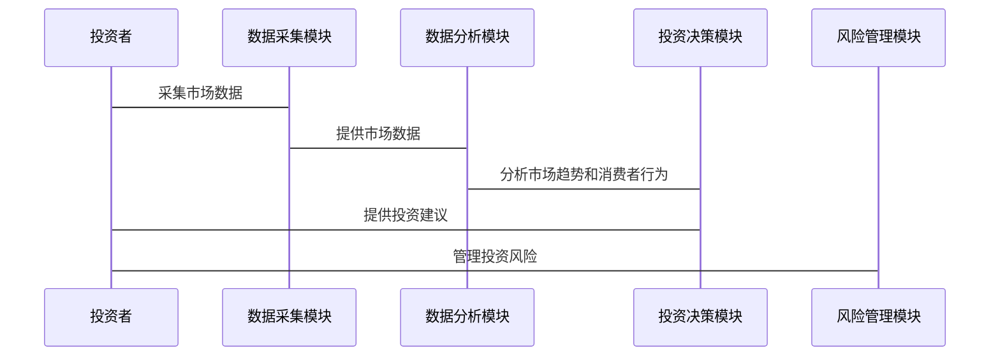

                 


# 菲利普·费雪的消费者行为研究在投资中的应用

> 关键词：消费者行为研究，投资策略，菲利普·费雪，价值投资，市场分析，投资决策

> 摘要：菲利普·费雪是价值投资的倡导者，他提出的消费者行为研究方法为投资决策提供了重要的理论依据。本文通过分析消费者行为的核心概念、投资策略的构建、数据分析与建模、系统设计与实现，以及实际案例的剖析，详细阐述了菲利普·费雪的消费者行为研究在投资中的应用。文章结合理论与实践，提出了基于消费者行为分析的投资策略，并通过具体案例和系统设计展示了其实际应用价值。

---

## 第一部分：背景介绍

### 第1章：消费者行为研究的背景与意义

#### 1.1 消费者行为的定义与核心概念

消费者行为是指消费者在购买、使用和 disposing 商品或服务的过程中表现出的各种行为模式。这些行为受到消费者需求、偏好、心理因素和外部环境的影响。消费者行为的核心要素包括：

- **需求**：消费者对商品或服务的需求程度。
- **决策过程**：消费者从需求识别到购买的决策流程。
- **心理因素**：消费者的认知、情感和动机对决策的影响。

#### 1.2 菲利普·费雪的消费者行为研究

菲利普·费雪（Philip Fisher）是价值投资的鼻祖之一，他提出了“购买一家优秀企业的股票，并长期持有”的投资理念。他认为，投资者应该关注企业的基本面，尤其是消费者的购买行为，因为这直接影响企业的收入和利润。费雪的研究方法注重对企业未来增长潜力的评估，而非单纯依赖历史数据。

#### 1.3 投资中的消费者行为研究背景

在现代投资环境中，消费者行为研究的重要性日益凸显。随着市场竞争的加剧，企业能否满足消费者需求直接影响其市场表现。投资者通过分析消费者行为，可以更好地评估企业的盈利能力、市场地位和成长潜力。

---

## 第二部分：消费者行为的核心概念与分析框架

### 第2章：消费者行为的核心概念与属性

#### 2.1 消费者需求与决策过程

消费者的需求可以分为基本需求和高层次需求。基本需求包括衣、食、住等，而高层次需求则包括娱乐、教育和健康等。消费者决策过程通常包括以下几个阶段：

1. **需求识别**：消费者意识到自己需要某种产品或服务。
2. **信息收集**：消费者通过广告、口碑和市场调研等方式获取信息。
3. **评估与选择**：消费者对比不同产品或服务，选择性价比最高的选项。
4. **购买决策**：消费者完成购买。
5. **使用与反馈**：消费者使用产品或服务，并提供反馈。

#### 2.2 消费者行为的属性对比分析

为了更好地理解消费者行为，我们可以从以下几个方面进行对比分析：

- **需求弹性**：不同产品的需求弹性不同，例如生活必需品的需求弹性较低，而奢侈品的需求弹性较高。
- **消费者偏好**：不同消费者对产品的偏好不同，这影响他们的购买决策。
- **消费者心理**：消费者的心理因素，如信任、品牌忠诚度等，也会影响其购买行为。

#### 2.3 消费者行为的ER实体关系图

为了更好地分析消费者行为，我们可以构建一个ER实体关系图，如下所示：

```mermaid
erDiagram
    consumer {
        id
        name
        age
        gender
        income
    }
    product {
        id
        name
        price
        category
    }
    purchase {
        id
        purchase_date
        quantity
        total_price
        consumer_id
        product_id
    }
    consumer--|{many}|purchase
    product--|{many}|purchase
```

这个图展示了消费者、产品和购买行为之间的关系。通过分析这些关系，投资者可以更好地理解消费者的行为模式。

---

## 第三部分：消费者行为研究的数学模型

### 第3章：消费者行为研究的数学模型

为了量化消费者行为的影响，我们可以构建一些数学模型。以下是一个基于消费者需求和市场反应的简单模型：

$$
\text{需求量} = \beta_0 + \beta_1 \times \text{价格} + \beta_2 \times \text{广告支出} + \epsilon
$$

其中，$\beta_0$ 是截距项，$\beta_1$ 和 $\beta_2$ 是回归系数，$\epsilon$ 是误差项。

通过回归分析，我们可以评估价格和广告支出对需求量的影响。例如，如果 $\beta_1$ 为负数，说明价格越高，需求量越低。

---

## 第四部分：投资策略的构建与实现

### 第4章：投资策略的构建

#### 4.1 投资策略的核心原则

菲利普·费雪的投资策略强调长期持有优质股票。优质企业的标准包括：

1. 高ROE（净资产收益率）。
2. 强大的管理团队。
3. 持续的创新能力和市场适应能力。

#### 4.2 投资策略的实现步骤

1. **市场分析**：通过分析市场趋势和消费者行为，选择具有增长潜力的行业。
2. **企业评估**：评估企业的财务状况、管理团队和市场地位。
3. **投资决策**：根据评估结果，选择优质企业进行投资。
4. **风险管理**：通过分散投资和定期调整投资组合，降低风险。

#### 4.3 投资策略的系统设计

为了实现投资策略，我们可以设计一个基于消费者行为分析的投资系统，如下所示：



这个系统通过模块化设计，帮助投资者更好地进行投资决策。

---

## 第五部分：案例分析与实战应用

### 第5章：案例分析

#### 5.1 案例背景

假设我们分析一家零售企业的消费者行为，评估其投资价值。

#### 5.2 数据分析

通过收集消费者的行为数据，包括购买频率、产品偏好和价格敏感性，我们可以评估这家企业的市场表现。

#### 5.3 投资决策

根据分析结果，如果这家企业具有较高的ROE和良好的市场前景，我们可以建议投资者长期持有其股票。

---

## 第六部分：总结与展望

### 第6章：总结与展望

#### 6.1 总结

菲利普·费雪的消费者行为研究为投资决策提供了重要的理论依据。通过分析消费者行为，投资者可以更好地评估企业的市场表现和成长潜力。

#### 6.2 展望

未来，随着大数据和人工智能技术的发展，消费者行为分析在投资中的应用将更加广泛和深入。投资者可以通过更精确的数据分析和模型构建，提高投资决策的科学性和有效性。

---

## 作者简介

作者：AI天才研究院/AI Genius Institute & 禅与计算机程序设计艺术 /Zen And The Art of Computer Programming

---

这篇文章通过理论分析和实践案例，详细阐述了菲利普·费雪的消费者行为研究在投资中的应用。希望对读者在投资决策中提供有价值的参考和启发。

