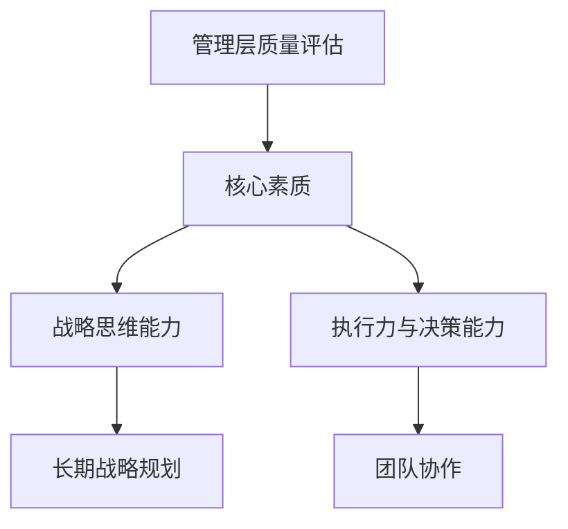
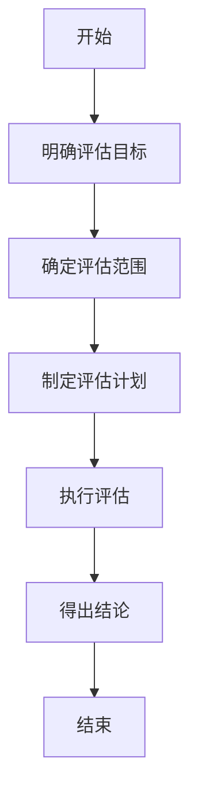
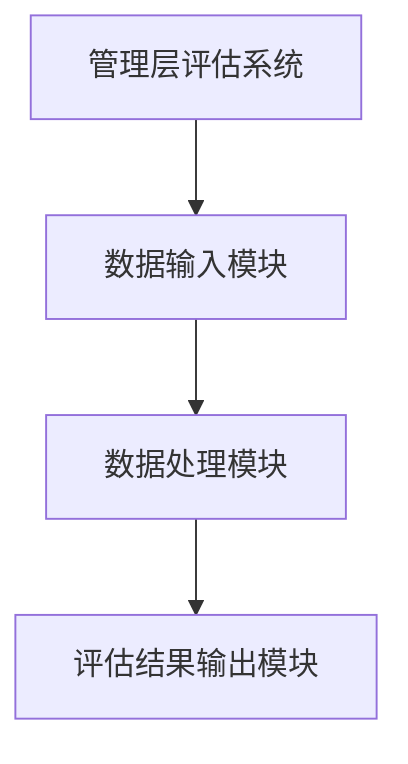

                 


# 菲利普·费雪的管理层质量评估标准

> 关键词：菲利普·费雪、管理层质量评估、投资决策、管理评估框架、管理评估标准

> 摘要：本文详细探讨了菲利普·费雪提出的管理层质量评估标准，分析了其在投资决策中的重要性，以及如何通过系统化的评估方法来确定管理层的质量。文章从管理层的核心素质、战略思维能力、执行力与决策能力等方面展开，结合实际案例和系统架构设计，提供了全面的评估框架和实施步骤。

---

## 第1章: 管理层质量评估的重要性

### 1.1 管理层质量评估的背景与意义

在投资领域，管理层的质量是决定企业长期发展和价值增长的关键因素。菲利普·费雪作为一名投资大师，深刻认识到管理层在企业成功中的核心作用。管理层不仅需要具备专业的知识和技能，还需要具备战略眼光和执行力。本文将从管理层的质量评估标准出发，分析其对投资决策的影响。

---

## 第2章: 菲利普·费雪的管理评估标准

### 2.1 菲利普·费雪的管理评估框架

菲利普·费雪提出了一个全面的管理评估框架，包括管理层的核心素质、战略思维能力和执行力与决策能力。以下是一个简化的评估框架图：



---

## 第3章: 管理层质量评估的维度与指标

### 3.1 管理层的道德与诚信

道德与诚信是管理层质量评估的重要维度。以下是一个对比表格：

| 维度       | 核心指标               |
|------------|------------------------|
| 道德与诚信 | 遵守职业道德             |
|            | 无虚假陈述             |
|            | 透明的管理风格         |

---

## 第4章: 管理层质量评估的实施步骤

### 4.1 确定评估目标与范围

在进行管理层质量评估时，首先需要明确评估的目标和范围。以下是一个流程图：



---

## 第5章: 管理层质量评估的数学模型

### 5.1 管理层质量评估的数学模型

菲利普·费雪的管理层质量评估可以通过加权评分系统来实现。以下是一个评分模型：

$$
\text{综合评分} = \sum (\text{权重}_i \times \text{评分}_i)
$$

其中，权重_i 是每个评估维度的权重，评分_i 是该维度的具体评分。

---

## 第6章: 管理层质量评估的系统架构设计

### 6.1 系统功能设计

以下是一个系统架构图：



---

## 第7章: 项目实战与案例分析

### 7.1 环境安装与配置

为了实现管理层质量评估系统，首先需要安装Python和相关库：

```bash
pip install numpy pandas matplotlib
```

---

## 第8章: 最佳实践与注意事项

### 8.1 管理层质量评估的注意事项

在实际应用中，需要注意以下几点：
- 数据的准确性和完整性
- 评估模型的适用性
- 结果的解释和应用

---

## 第9章: 小结与总结

本文详细探讨了菲利普·费雪提出的管理层质量评估标准，分析了其在投资决策中的重要性，并通过系统化的评估方法提供了全面的评估框架。通过实际案例和系统架构设计，为读者提供了实用的参考和指导。

---

**作者：AI天才研究院/AI Genius Institute & 禅与计算机程序设计艺术 /Zen And The Art of Computer Programming**

