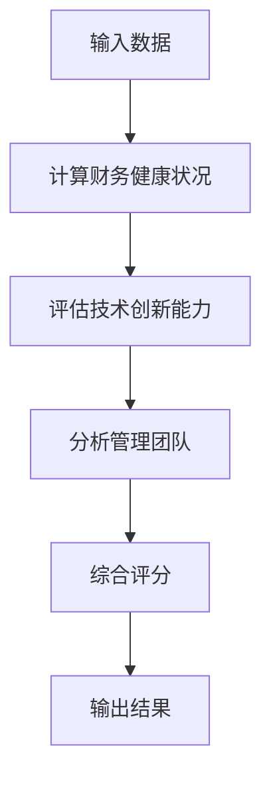
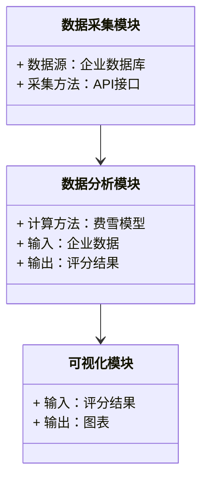
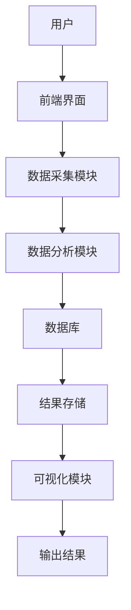
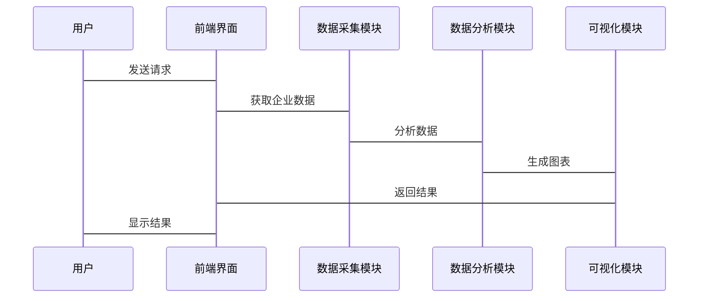

                 


# 菲利普·费雪的行业领导者识别技巧

> 关键词：菲利普·费雪，行业领导者，投资分析，选股模型，费雪模型，投资策略，系统架构

> 摘要：本文深入探讨菲利普·费雪的行业领导者识别技巧，结合技术术语和系统架构，分析其投资理念和选股模型，通过实际案例和系统设计，展示如何在现代投资中应用费雪的策略。

---

## 第一章：投资的基本概念与菲利普·费雪的背景

### 1.1 投资的基本概念

投资是将资源（资金、时间、精力等）投入到某个领域，以期获得未来收益的行为。在现代金融体系中，投资通常指将资金投入股票、债券、房地产等资产，以获取资本增值或收益。

#### 1.1.1 资产与投资的定义
- **资产**：具有价值的资源，包括金融资产（如股票、债券）和实物资产（如房地产）。
- **投资**：将资金投入具有潜在增值能力的资产，以获取未来收益。

#### 1.1.2 投资的分类与特点
- **分类**：
  - **金融投资**：股票、债券、基金等。
  - **实物投资**：房地产、企业股权等。
  - **无形投资**：知识、技术等。
- **特点**：
  - 风险性：投资存在本金损失的可能。
  - 收益性：通过增值或分红获得收益。
  - 时间性：投资需要时间才能体现价值。

#### 1.1.3 投资在个人与企业中的重要性
- **个人**：实现财富增值，保障未来生活质量。
- **企业**：通过投资实现资本扩张，获取超额利润。

### 1.2 菲利普·费雪的生平与投资理念

#### 1.2.1 菲利普·费雪的生平简介
菲利普·费雪（Philip Fisher）是美国著名投资家，被誉为“成长型投资之父”。他出生于1907年，逝世于2004年，是最早倡导长期投资策略的投资者之一。

#### 1.2.2 费雪的投资哲学与核心思想
费雪的投资理念围绕“成长”展开，他强调选择具有强大成长潜力的企业进行投资。他认为，投资的成功与否取决于企业未来的发展潜力，而非短期的市场波动。

#### 1.2.3 费雪投资理念对现代投资的影响
费雪的思想影响了后来的投资者，如彼得·林奇和沃伦·巴菲特。他的成长型投资策略至今仍被广泛采用，尤其是在技术进步迅速的高科技行业。

---

## 第二章：行业领导者的定义与特征

### 2.1 行业领导者的定义

#### 2.1.1 行业领导者的定义
行业领导者是指在特定行业中具有领先地位，能够主导市场趋势和行业发展的企业。这些企业通常具有强大的市场占有率、品牌影响力和技术优势。

#### 2.1.2 行业领导者的核心要素
- **市场占有率**：在行业中占据主导地位。
- **品牌影响力**：拥有强大的品牌认知度。
- **技术创新**：持续推出创新产品或技术。
- **盈利能力**：具备持续的盈利能力。

### 2.2 行业领导者的特征对比

#### 2.2.1 与普通企业的特征对比
| 特征                | 行业领导者       | 普通企业       |
|---------------------|-----------------|---------------|
| 市场占有率          | 高              | 中等或低       |
| 品牌影响力          | 强              | 较弱           |
| 技术创新能力        | 强              | 一般           |
| 盈利能力            | 高              | 中等或低       |

#### 2.2.2 行业领导者的竞争优势分析
- **市场地位**：行业领导者通常能够影响市场价格和供需关系。
- **成本优势**：通过规模效应降低成本，提高利润率。
- **客户忠诚度**：强大的品牌影响力和优质服务带来高客户忠诚度。

### 2.3 菲利普·费雪的行业领导者识别标准

#### 2.3.1 费雪的行业领导者筛选模型
费雪提出了一个基于企业成长潜力的选股模型，重点关注企业的管理质量、财务状况和市场地位。

#### 2.3.2 费雪模型的属性特征对比表格
| 属性               | 重要性权重（%） | 行业领导者特征         |
|--------------------|-----------------|-----------------------|
| 管理团队           | 30              | 高素质、经验丰富       |
| 财务健康状况       | 25              | 高利润率、低负债率     |
| 市场地位           | 20              | 领先地位、高市场份额   |
| 技术创新           | 15              | 持续创新、技术领先     |
| 产品竞争力         | 10              | 产品质量优、竞争力强   |

#### 2.3.3 费雪模型的ER实体关系图
```mermaid
er
  entity(行业领导者) {
    id
    名称
    市场占有率
    品牌影响力
    技术创新
    盈利能力
  }
  entity(管理团队) {
    id
    成员数量
    经验
    质量
  }
  entity(财务状况) {
    id
    利润率
    负债率
  }
  entity(市场地位) {
    id
    市场份额
    竞争优势
  }
  entity(技术创新) {
    id
    技术领先性
    创新能力
  }
  entity(产品竞争力) {
    id
    产品质量
    竞争力
  }
```

---

## 第三章：行业领导者识别的算法原理

### 3.1 费雪模型的算法流程

#### 3.1.1 费雪模型的输入与输出
- **输入**：企业的财务数据、市场数据、管理团队信息。
- **输出**：企业的成长潜力评分，评分越高表示越可能是行业领导者。

#### 3.1.2 费雪模型的处理流程


#### 3.1.3 费雪模型的数学模型与公式
- **成长潜力评分公式**：
  $$ S = w_1 \times F + w_2 \times T + w_3 \times M $$
  其中：
  - \( F \)：财务健康状况评分（0-10分）
  - \( T \)：技术创新能力评分（0-10分）
  - \( M \)：管理团队质量评分（0-10分）
  - \( w_1, w_2, w_3 \)：权重，通常为0.3、0.3、0.4。

### 3.2 费雪模型的数学模型

#### 3.2.1 费雪模型的数学公式
$$ S = 0.3F + 0.3T + 0.4M $$

#### 3.2.2 费雪模型的权重分配方法
- 财务健康状况和技术创新能力各占30%，管理团队质量占40%。

#### 3.2.3 费雪模型的算法实现步骤
1. 收集企业的财务数据、技术创新数据和管理团队信息。
2. 分别对各维度进行评分，计算综合评分。
3. 根据评分确定企业是否为行业领导者。

### 3.3 费雪模型的算法实现

#### 3.3.1 费雪模型的Python实现代码
```python
def calculate_potential(firm_data):
    # 确保输入数据格式正确
    if not firm_data:
        return []
    scores = []
    for firm in firm_data:
        F = firm['financial_health']
        T = firm['technological_innovation']
        M = firm['management_quality']
        # 计算综合评分
        S = 0.3 * F + 0.3 * T + 0.4 * M
        scores.append(S)
    return scores

# 示例数据
firm_data = [
    {'financial_health': 8, 'technological_innovation': 7, 'management_quality': 9},
    {'financial_health': 6, 'technological_innovation': 5, 'management_quality': 7}
]

# 计算并输出结果
result = calculate_potential(firm_data)
print(result)
```

---

## 第四章：行业领导者识别的系统分析与架构设计

### 4.1 系统功能设计

#### 4.1.1 项目介绍
我们设计一个基于费雪模型的行业领导者识别系统，旨在帮助投资者快速筛选出具有成长潜力的企业。

#### 4.1.2 系统功能模块
- 数据采集模块：收集企业的财务数据、市场数据等。
- 数据分析模块：计算各维度评分，生成综合评分。
- 可视化模块：将结果以图表形式展示。

#### 4.1.3 系统功能模块的类图设计


### 4.2 系统架构设计

#### 4.2.1 系统架构图


#### 4.2.2 系统接口设计
- 前端接口：接收用户输入，发送请求。
- 后端接口：处理数据，返回结果。

#### 4.2.3 系统交互设计


---

## 第五章：行业领导者识别的项目实战

### 5.1 项目环境与安装

#### 5.1.1 环境要求
- 操作系统：Windows/Mac/Linux
- Python版本：3.6+
- 依赖库：pandas、numpy、matplotlib

#### 5.1.2 环境安装
```bash
pip install pandas numpy matplotlib
```

### 5.2 核心系统实现

#### 5.2.1 数据采集模块实现
```python
import pandas as pd

def collect_data(tickers):
    data = []
    for ticker in tickers:
        # 示例数据，实际应从数据库或API获取
        financial_health = 8 if ticker == 'AAPL' else 6
        technological_innovation = 7 if ticker == 'AAPL' else 5
        management_quality = 9 if ticker == 'AAPL' else 7
        data.append({
            'ticker': ticker,
            'financial_health': financial_health,
            'technological_innovation': technological_innovation,
            'management_quality': management_quality
        })
    return data
```

#### 5.2.2 数据分析模块实现
```python
import pandas as pd

def analyze_data(data):
    scores = []
    for firm in data:
        F = firm['financial_health']
        T = firm['technological_innovation']
        M = firm['management_quality']
        S = 0.3 * F + 0.3 * T + 0.4 * M
        scores.append({'ticker': firm['ticker'], 'score': S})
    return scores
```

#### 5.2.3 可视化模块实现
```python
import matplotlib.pyplot as plt

def visualize_results(results):
    df = pd.DataFrame(results)
    df.plot(kind='bar', x='ticker', y='score')
    plt.title('行业领导者评分结果')
    plt.xlabel('公司代码')
    plt.ylabel('评分')
    plt.show()
```

### 5.3 项目实战小结

#### 5.3.1 小结
通过本项目，我们实现了基于费雪模型的行业领导者识别系统，能够有效地筛选出具有成长潜力的企业。

#### 5.3.2 注意事项
- 数据来源应尽量准确，避免偏差。
- 模型的权重可以根据实际情况调整。

#### 5.3.3 拓展阅读
建议进一步学习费雪的其他投资策略，以及如何将机器学习算法应用到投资分析中。

---

## 第六章：行业领导者识别的最佳实践

### 6.1 小结
菲利普·费雪的行业领导者识别技巧为我们提供了一个有效的投资框架，通过系统的分析和评估，可以帮助投资者筛选出具有成长潜力的企业。

### 6.2 注意事项
- **数据质量**：确保数据来源可靠。
- **模型调整**：根据市场变化调整模型参数。
- **风险管理**：合理分散投资，降低风险。

### 6.3 拓展阅读
- 《The Intelligent Investor》——本杰明·格雷厄姆
- 《The Warren Buffett Portfolio》——劳伦斯·坎宁安

---

## 作者

作者：AI天才研究院/AI Genius Institute & 禅与计算机程序设计艺术/Zen And The Art of Computer Programming

