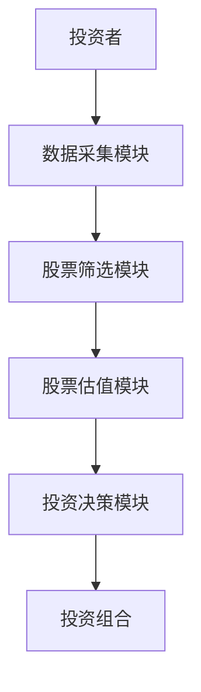
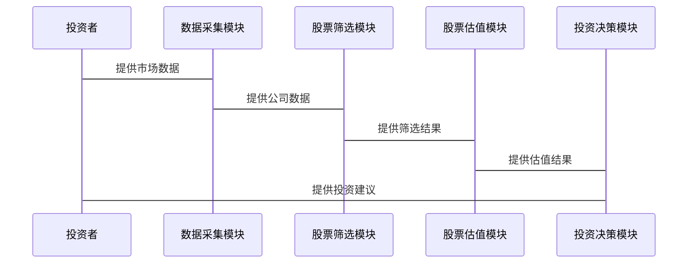

                 


# 菲利普·费雪：成长型股票投资的先驱

> 关键词：菲利普·费雪，成长型投资，股票投资，投资哲学，数学模型，股票估值

> 摘要：菲利普·费雪是成长型股票投资的先驱，他的投资理念和方法对现代投资理论产生了深远影响。本文将详细介绍菲利普·费雪的成长型投资理念，分析其核心概念、算法和数学模型，并通过实际案例展示其在投资决策中的应用。

---

# 第一部分: 菲利普·费雪与成长型投资的背景

## 第1章: 菲利普·费雪及其投资理念

### 1.1 菲利普·费雪的生平与成就

菲利普·费雪（Philip Fisher）是一位传奇的股票投资者和投资理论家，出生于1903年，去世于2004年。他在投资领域的主要贡献在于成长型股票投资策略的提出和实践。费雪的职业生涯始于1930年代，他最初在纽约证券交易所工作，后来成为了一名独立的股票分析师和投资顾问。

### 1.2 成长型投资的定义与特点

成长型投资是一种以长期资本增值为目标的投资策略，重点关注那些具有持续增长潜力的公司。与价值型投资不同，成长型投资更注重公司的成长性和未来的盈利潜力，而非当前的市场价格是否被低估。

### 1.3 菲利普·费雪的投资哲学

菲利普·费雪的投资哲学的核心是“购买好公司，然后长期持有”。他认为，投资的最终目标是找到那些具有强大竞争优势、稳定的管理层和持续增长潜力的公司，并且在合理的价格范围内买入这些股票，长期持有，等待其价值增长。

### 1.4 菲利普·费雪的投资策略

菲利普·费雪的投资策略主要包括以下几个方面：
- **股票筛选**：选择那些具有强大竞争优势、稳定的管理层和持续增长潜力的公司。
- **股票估值**：通过分析公司的财务状况、盈利能力和发展前景，确定股票的内在价值。
- **投资组合管理**：分散投资，定期评估投资组合的表现，并根据市场变化进行调整。

---

## 第2章: 成长型投资的核心概念与联系

### 2.1 成长型投资的原理

成长型投资的原理在于通过投资于那些具有持续增长潜力的公司，从而实现资本的长期增值。这种投资策略的核心在于对公司未来盈利能力的预测和评估。

### 2.2 成长型投资的核心要素

- **盈利能力**：公司的盈利能力是衡量其成长潜力的重要指标。菲利普·费雪认为，盈利能力强的公司更有可能在未来实现持续增长。
- **成长性**：公司的成长性是指其在未来一段时间内实现收入和利润增长的能力。菲利普·费雪特别关注那些具有高成长性的公司。
- **估值合理性**：虽然成长型投资更注重公司的成长潜力，但合理的估值仍然是投资决策的重要因素。

### 2.3 成长型投资与价值型投资的对比

| 投资策略 | 成长型投资 | 价值型投资 |
|----------|------------|------------|
| 投资目标 | 寻找具有高成长潜力的公司 | 寻找被市场低估的公司 |
| 估值方法 | 更注重未来盈利潜力 | 更注重当前市场价格与内在价值的对比 |
| 投资风险 | 风险较高，因为高成长公司通常估值较高 | 风险相对较低，因为注重估值的合理性 |

---

## 第3章: 菲利普·费雪的成长型投资算法

### 3.1 成长型投资的筛选算法

菲利普·费雪的成长型投资筛选算法主要包括以下几个步骤：
1. **确定投资目标**：明确投资目标，例如寻找具有高成长潜力的科技公司。
2. **筛选初步候选公司**：通过财务指标（如ROE、净利润增长率等）筛选出具有高成长潜力的公司。
3. **深入分析候选公司**：对公司进行深入分析，包括管理层稳定性、行业地位、竞争优势等。
4. **评估公司估值**：通过市盈率、市净率等指标评估公司的估值是否合理。
5. **做出投资决策**：根据分析结果，决定是否买入该公司的股票。

### 3.2 成长型投资的估值算法

菲利普·费雪在股票估值方面提出了许多重要的方法和公式，以下是一些常用的估值指标：

#### 1. 市盈率（P/E）

市盈率是衡量股票估值的重要指标，公式为：
$$ P/E = \frac{\text{股价}}{\text{每股净利润}} $$

#### 2. 市净率（P/B）

市净率是衡量股票估值的另一个重要指标，公式为：
$$ P/B = \frac{\text{股价}}{\text{每股净资产}} $$

#### 3. 市盈率增长比（PEG）

PEG是衡量股票估值的另一种方法，公式为：
$$ PEG = \frac{P/E}{\text{净利润增长率}} $$

---

## 第4章: 成长型投资的数学模型与公式

### 4.1 成长型投资的核心公式

菲利普·费雪的成长型投资策略中，以下是一些核心的数学公式：

#### 1. 股票内在价值公式

股票的内在价值可以通过以下公式进行估算：
$$ \text{内在价值} = \frac{\text{净利润}}{\text{资本成本} - \text{增长率}} $$

#### 2. 股票成长性评估公式

股票的成长性可以通过以下公式进行评估：
$$ \text{成长性} = \frac{\text{净利润增长率} - \text{行业平均增长率}}{\text{标准差}} $$

#### 3. 股票估值公式

股票的合理估值可以通过以下公式进行估算：
$$ \text{合理估值} = \text{内在价值} \times \text{安全边际} $$

---

## 第5章: 成长型投资的系统分析与架构设计

### 5.1 问题场景介绍

成长型投资的核心问题是如何在众多股票中筛选出具有高成长潜力的公司，并对其进行合理的估值。

### 5.2 系统功能设计

- **数据采集**：从市场数据源获取公司财务数据、行业信息等。
- **股票筛选**：根据成长型投资的筛选标准，筛选出符合条件的公司。
- **股票估值**：根据公司财务数据和市场数据，计算股票的内在价值和合理估值。
- **投资决策**：根据筛选和估值结果，做出投资决策。

### 5.3 系统架构设计

以下是成长型投资系统的架构图：



### 5.4 系统接口设计

- **输入接口**：接收市场数据、公司财务数据等。
- **输出接口**：输出筛选结果、估值结果和投资建议。

### 5.5 系统交互序列图

以下是成长型投资系统的交互序列图：



---

## 第6章: 成长型投资的项目实战

### 6.1 环境安装

为了进行成长型投资的实战分析，我们需要安装以下工具和环境：
- 数据分析工具：Python、Pandas、NumPy
- 绘图工具：Matplotlib、Seaborn
- 量化分析工具：Pymongo、MongoDB

### 6.2 核心实现源代码

以下是成长型投资筛选算法的Python代码示例：

```python
import pandas as pd

# 数据加载
df = pd.read_csv('stocks.csv')

# 股票筛选标准
growth_stocks = df[df['净利润增长率'] > 15]

# 股票估值计算
growth_stocks['PEG'] = growth_stocks['市盈率'] / growth_stocks['净利润增长率']

# 投资决策
growth_stocks['投资建议'] = '买入'  # 根据实际分析结果调整
```

### 6.3 实际案例分析

以科技行业为例，我们可以通过以下步骤进行成长型投资的分析：

1. **数据采集**：收集科技行业的公司财务数据和市场数据。
2. **股票筛选**：筛选出那些净利润增长率超过15%的公司。
3. **股票估值**：计算这些公司的PEG，并选择PEG小于1的公司。
4. **投资决策**：根据筛选和估值结果，决定是否买入这些公司的股票。

### 6.4 项目小结

通过实际案例分析，我们可以看到，菲利普·费雪的成长型投资策略在实际操作中具有很强的指导意义。通过合理的筛选和估值，我们可以找到具有高成长潜力的公司，并实现资本的长期增值。

---

## 第7章: 最佳实践 tips、小结、注意事项、拓展阅读

### 7.1 小结

菲利普·费雪的成长型投资理念为我们提供了一种全新的投资思路。通过关注公司的成长性和合理估值，我们可以找到那些具有高成长潜力的公司，并通过长期持有实现资本的增值。

### 7.2 注意事项

- **风险控制**：成长型投资虽然具有较高的增长潜力，但也伴随着较高的风险。投资者需要做好风险控制，分散投资，避免过度集中。
- **持续学习**：投资市场是不断变化的，投资者需要不断学习和更新自己的知识，以应对市场的变化。
- **长期视角**：成长型投资需要长期的视角，投资者需要耐心等待，不要因为短期的波动而做出错误的决策。

### 7.3 拓展阅读

- 《股票投资成功之路》（ Philip Fisher）
- 《投资学》（教材）

---

作者：AI天才研究院/AI Genius Institute & 禅与计算机程序设计艺术 /Zen And The Art of Computer Programming

