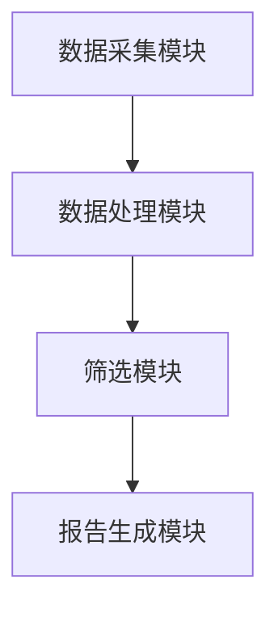

                 


# 菲利普费雪的成长股选择标准

## 关键词：成长股投资，菲利普·费雪，价值投资，股票分析，投资策略

## 摘要：菲利普·费雪是成长股投资的鼻祖，他提出了一套基于公司成长性和盈利能力的选择标准。本文详细解析了费雪的成长股选择标准，包括盈利能力分析、成长性分析、数学模型构建、系统设计与实现，以及实际案例分析。通过本文，读者将了解如何基于费雪的理论筛选出具备长期增长潜力的优秀成长股。

---

## 第1章: 成长股投资的背景与意义

### 1.1 投资的基本概念

#### 1.1.1 投资的定义与分类

投资是指将资金投入某个项目或资产，以期获得未来收益的行为。根据投资对象的不同，可以将投资分为以下几类：

- **股票投资**：通过购买公司股份，成为公司股东，分享公司收益。
- **债券投资**：购买公司或政府发行的债券，获得固定利息收入。
- **房地产投资**：通过购买房地产资产，获取租金收入或资本增值。
- **其他投资**：包括艺术品、黄金等。

#### 1.1.2 成长股投资的兴起与发展

成长股投资是一种以公司未来增长潜力为核心的投资策略。20世纪初，传统投资方法主要关注于股票的短期价格波动，而菲利普·费雪的出现，将投资视角从短期价格波动转向长期公司价值增长。

费雪的成长股投资理念在20世纪中期逐渐兴起，尤其是在20世纪60年代至70年代，成长股投资成为美股市场的重要投资策略之一。

#### 1.1.3 菲利普·费雪在投资领域的贡献

菲利普·费雪是成长股投资的奠基人，他提出了“成长股”的概念，并强调投资者应关注公司的长期盈利能力、成长性和管理团队的质量。他的投资理念对现代投资理论的发展产生了深远影响。

---

### 1.2 股票市场的基本运作

#### 1.2.1 股票市场的功能与结构

股票市场是企业融资和投资者进行股票买卖的场所。股票市场的功能包括：

- **融资功能**：帮助企业筹集资金。
- **价格发现功能**：通过供需关系确定股票价格。
- **流动性功能**：为投资者提供买卖股票的渠道。

#### 1.2.2 股票的价值评估方法

股票的价值可以通过以下方法进行评估：

- **基本面分析**：分析公司的财务报表、盈利能力、成长性等。
- **技术分析**：通过股票价格和成交量的变化预测未来价格走势。
- **行业分析**：研究行业发展趋势和竞争格局。

#### 1.2.3 成长股与价值股的区别

- **成长股**：指那些具有较高成长潜力的公司股票，通常市盈率较高，但未来盈利增长预期强劲。
- **价值股**：指那些市场价格低于其内在价值的公司股票，通常市盈率较低，但具有稳定的盈利能力。

---

## 第2章: 菲利普·费雪的投资理念

### 2.1 菲利普·费雪的成长股定义

#### 2.1.1 成长股的定义与特征

菲利普·费雪认为，成长股是指那些能够持续增长，且年收益增长率高于平均水平的公司股票。这些公司通常处于高速发展的行业，具有强大的市场竞争力和创新能力。

#### 2.1.2 成长股与周期股的区别

- **成长股**：不受经济周期影响，具有持续增长潜力。
- **周期股**：收益随经济周期波动，通常在经济繁荣时表现良好，经济衰退时表现不佳。

#### 2.1.3 成长股的投资价值

成长股的投资价值体现在其未来的盈利增长潜力。通过投资成长股，投资者可以分享公司成长的成果，实现资产的长期增值。

---

### 2.2 菲利普·费雪的投资哲学

#### 2.2.1 长期投资与价值发现

费雪强调长期投资的重要性，认为短期价格波动不应影响长期投资决策。投资者应关注公司的内在价值，而不是短期市场价格波动。

#### 2.2.2 股东权益最大化

费雪认为，投资者应关注公司的股东权益最大化。通过投资于那些能够持续创造股东价值的公司，投资者可以获得长期收益。

#### 2.2.3 风险控制与收益平衡

在投资过程中，风险控制是不可忽视的一部分。费雪建议投资者通过分散投资、关注公司基本面等方式，降低投资风险，实现收益与风险的平衡。

---

## 第3章: 盈利能力分析

### 3.1 盈利能力的定义与衡量指标

#### 3.1.1 净利润与每股收益

- **净利润**：公司扣除所有费用后的最终利润，是衡量公司盈利能力的重要指标。
- **每股收益（EPS）**：净利润除以公司总股本，是衡量公司每股盈利能力的指标。

#### 3.1.2 营业利润率与净利润率

- **营业利润率**：净利润与营业收入的比率，反映公司主营业务的盈利能力。
- **净利润率**：净利润与营业收入的比率，衡量公司整体盈利能力。

#### 3.1.3 盈利能力与成长性的关系

盈利能力是成长性的基础。只有具备稳定且较高的盈利能力，公司才有可能实现持续的成长。

---

### 3.2 菲利普·费雪对盈利能力的要求

#### 3.2.1 盈利能力的持续性

费雪要求公司必须具有持续的盈利能力，即净利润率和营业利润率应保持稳定或逐步提高。

#### 3.2.2 盈利能力的稳定性

盈利能力的稳定性是衡量公司质量的重要指标。公司应避免因短期波动导致盈利能力下降。

#### 3.2.3 盈利能力的行业对比

在分析公司盈利能力时，应将其与行业平均水平进行对比，以判断公司的盈利能力是否具有竞争力。

---

## 第4章: 成长性分析

### 4.1 成长性的定义与衡量指标

#### 4.1.1 收入增长率与净利润增长率

- **收入增长率**：公司营业收入的增长速度，反映公司业务扩展能力。
- **净利润增长率**：公司净利润的增长速度，反映公司盈利能力的提升。

#### 4.1.2 营业收入与净利润的复合增长率

复合增长率是衡量公司收入和利润增长的重要指标，通常用于长期趋势分析。

#### 4.1.3 成长性的可持续性

公司成长性的可持续性是投资的关键因素。投资者应关注公司未来几年的成长潜力，而不仅仅是过去的表现。

---

### 4.2 菲利普·费雪对成长性的要求

#### 4.2.1 成长性的持续性

费雪要求公司具有持续的成长性，即收入和净利润应保持稳定增长。

#### 4.2.2 成长性的稳定性

公司成长的稳定性是投资的重要考虑因素。公司应避免因短期市场波动导致成长性下降。

#### 4.2.3 成长性的行业对比

在分析公司成长性时，应将其与行业平均水平进行对比，以判断公司的成长性是否具有竞争力。

---

## 第5章: 数学模型与算法原理

### 5.1 成长股选择的数学模型

为了量化菲利普·费雪的成长股选择标准，我们可以构建一个数学模型，综合考虑公司的盈利能力、成长性和其他重要因素。

#### 5.1.1 指标权重分配

根据经验，我们可以将盈利能力、成长性、管理团队质量、行业地位等因素赋予不同的权重。例如：

- 盈利能力：权重为30%
- 成长性：权重为40%
- 管理团队质量：权重为15%
- 行业地位：权重为15%

#### 5.1.2 计算公式

综合评分公式为：

$$
\text{综合评分} = 0.3 \times \text{盈利能力} + 0.4 \times \text{成长性} + 0.15 \times \text{管理团队质量} + 0.15 \times \text{行业地位}
$$

---

### 5.2 算法原理讲解

#### 5.2.1 数据输入

首先，我们需要收集目标公司的财务数据，包括营业收入、净利润、成长率等。

#### 5.2.2 指标计算

根据收集的数据，计算各项指标的得分，例如：

$$
\text{盈利能力得分} = \frac{\text{公司净利润率} - \text{行业平均净利润率}}{\text{行业净利润率波动范围}} \times 100
$$

#### 5.2.3 综合评分计算

将各项指标得分按照权重进行加权计算，得出综合评分。

#### 5.2.4 筛选标准

根据综合评分，筛选出得分高于行业平均水平的公司作为成长股。

---

## 第6章: 系统分析与架构设计

### 6.1 问题场景介绍

为了实现基于菲利普·费雪标准的自动化投资决策，我们可以设计一个成长股筛选系统。

#### 6.1.1 系统目标

- 自动化筛选成长股。
- 提供投资建议和风险提示。

#### 6.1.2 系统功能模块

- 数据采集模块：从数据库中获取公司财务数据。
- 筛选模块：根据评分标准筛选出符合条件的股票。
- 报告生成模块：生成投资报告，提供投资建议。

#### 6.1.3 系统架构图



---

## 第7章: 项目实战

### 7.1 环境安装

为了实现成长股筛选系统，我们需要安装以下工具：

- Python 3.x
- pandas库
- numpy库
- matplotlib库

#### 7.1.1 安装步骤

```bash
pip install pandas numpy matplotlib
```

---

### 7.2 系统核心实现

#### 7.2.1 核心代码实现

```python
import pandas as pd
import numpy as np

# 示例数据
data = {
    '公司名称': ['A公司', 'B公司', 'C公司'],
    '营业收入': [100, 150, 120],
    '净利润': [20, 30, 25],
    '成长率': [0.2, 0.3, 0.25]
}

df = pd.DataFrame(data)

# 计算盈利能力得分
df['盈利能力得分'] = df['净利润'] / df['营业收入'] * 100

# 计算成长性得分
df['成长性得分'] = df['成长率'] * 100

# 综合评分
df['综合评分'] = 0.3 * df['盈利能力得分'] + 0.4 * df['成长性得分']

print(df)
```

#### 7.2.2 代码解读

- **数据采集**：从数据库中获取公司财务数据。
- **数据处理**：计算各项指标得分。
- **综合评分**：根据权重计算综合评分。
- **结果输出**：筛选出评分高于行业平均水平的公司。

---

### 7.3 实际案例分析

以某行业为例，假设行业平均净利润率为12%，成长率为15%。我们可以通过代码计算出综合评分，并筛选出评分高于行业平均水平的公司。

---

## 第8章: 最佳实践

### 8.1 投资策略

- **长期投资**：避免频繁交易，降低交易成本。
- **分散投资**：通过投资多个成长股，降低风险。
- **定期复盘**：定期检查投资组合，调整投资策略。

### 8.2 风险管理

- **设定止损线**：当股价跌破一定价位时，及时卖出。
- **关注公司基本面**：定期跟踪公司财务数据和行业动态。

### 8.3 持续学习

- **阅读经典书籍**：如《股票作手回忆录》、《巴菲特的智慧》。
- **参加投资培训**：提升投资知识和技能。

---

## 作者：AI天才研究院/AI Genius Institute & 禅与计算机程序设计艺术 /Zen And The Art of Computer Programming

---

通过本文的详细讲解，读者可以全面了解菲利普·费雪的成长股选择标准，并将其应用于实际投资中。希望本文能为投资者提供有价值的参考，帮助他们在成长股投资中实现长期收益。

