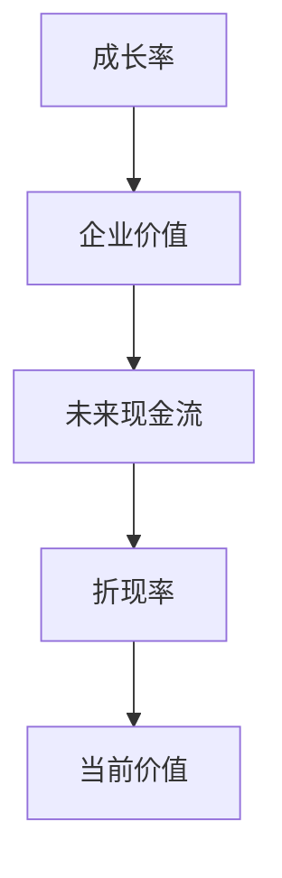
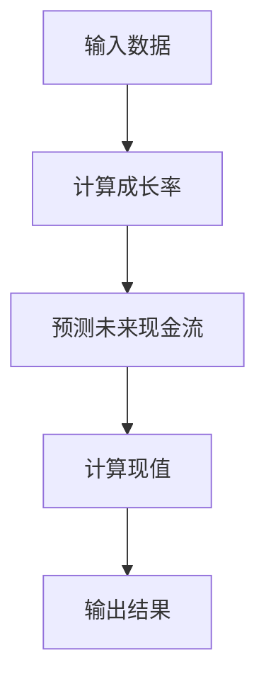
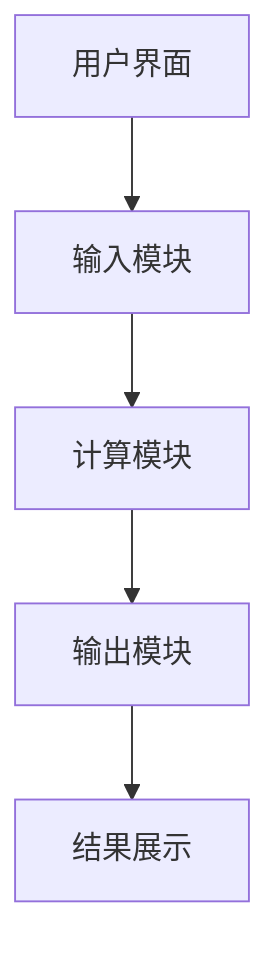
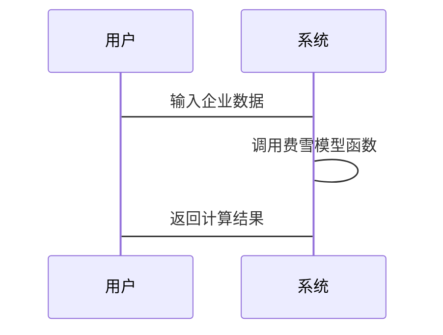

                 


# 菲利普·费雪的未来增长预测

---

## 关键词：菲利普·费雪、投资理论、增长预测、模型分析、算法实现、系统设计

---

## 摘要：菲利普·费雪是投资界的重要人物，提出了成长股投资理论，强调通过分析企业的成长率和未来现金流来预测其增长潜力。本文详细解析了费雪投资模型的核心概念、算法原理及其在现代投资分析中的应用，结合技术方法进行深入探讨，为投资者提供科学的分析工具。

---

## 第一部分: 菲利普·费雪投资理论基础

### 第1章: 菲利普·费雪与未来增长预测概述

#### 1.1 菲利普·费雪的背景与投资理念

菲利普·费雪（Philip Fisher）是20世纪美国著名的投资学家，被誉为“成长股投资之父”。他于1934年出版的《共同股如何选择与操作》一书中，提出了成长股投资理论，强调长期投资和对公司基本面的深入分析。费雪认为，投资的目的是寻找那些能够持续增长的企业，并通过长期持有实现财富增长。

#### 1.2 未来增长预测的定义与意义

未来增长预测是指通过分析企业的财务数据、市场环境和行业趋势，预测其未来收益和价值的过程。在投资领域，准确的增长预测能够帮助投资者识别高增长潜力的企业，从而做出更明智的投资决策。费雪的增长预测方法强调对企业成长率的分析，认为成长率是衡量企业增长潜力的重要指标。

#### 1.3 费雪投资理论的核心要素

1. **成长股的定义与特征**：成长股是指那些具有持续增长潜力，且增长率高于行业平均水平的企业股票。
2. **费雪的“十倍股”概念**：费雪认为，真正优秀的成长股能够在较长的时间内实现收益的十倍增长，这样的企业往往具有强大的竞争优势和市场地位。
3. **费雪投资模型的构成**：费雪模型基于企业的成长率、未来现金流和折现率，计算企业未来价值。

#### 1.4 费雪理论的应用范围

1. **股票投资中的应用**：通过分析企业的成长率和未来现金流，识别具有高增长潜力的股票。
2. **企业估值中的应用**：利用费雪模型对企业进行估值，评估其内在价值。
3. **经济周期中的应用**：在不同经济周期下，调整成长率和折现率的假设，以适应市场变化。

#### 1.5 本章小结

本章介绍了菲利普·费雪的投资理论及其在未来增长预测中的应用。费雪的成长股投资理念强调对企业基本面的深入分析，通过预测企业的未来增长潜力，帮助投资者做出更明智的投资决策。

---

## 第二部分: 费雪投资模型的核心概念

### 第2章: 费雪投资模型的原理与结构

#### 2.1 费雪投资模型的原理

1. **模型的基本假设**：企业的未来现金流可以通过其成长率和行业地位预测。
2. **模型的输入变量**：包括当前现金流、成长率、折现率和预测期。
3. **模型的输出结果**：计算出的企业未来价值和内在估值。

#### 2.2 费雪模型的核心概念与联系

1. **成长率与估值的关系**：成长率越高，企业未来价值越大，但同时也需要考虑折现率的影响。
2. **费雪模型的ER实体关系图**



3. **概念属性特征对比表格**

| 概念    | 属性                 | 特征对比                   |
|---------|----------------------|---------------------------|
| 成长率  | 预测期               | 高成长率对应高估值         |
| 未来现金流 | 预测期               | 与企业盈利能力和行业地位相关 |
| 折现率   | 风险因素             | 高风险对应高折现率         |

#### 2.3 费雪模型的数学公式与推导

1. **成长率的计算公式**

$$ 成长率 = \frac{未来现金流 - 当前现金流}{当前现金流} $$

2. **费雪模型的总价值公式**

$$ 总价值 = \sum_{t=1}^{n} \frac{未来现金流_t}{(1 + r)^t} $$

其中，\( r \) 为折现率，\( n \) 为预测期。

#### 2.4 本章小结

本章详细介绍了费雪投资模型的原理及其核心概念，通过ER实体关系图和数学公式，展示了模型的内在逻辑和计算方法。

---

## 第三部分: 费雪模型的算法与实现

### 第3章: 费雪模型的算法原理

#### 3.1 费雪模型的算法流程

1. **数据输入**：收集企业的当前现金流、成长率和折现率。
2. **成长率计算**：根据历史数据和行业趋势，预测企业的未来成长率。
3. **未来现金流预测**：基于成长率和行业地位，预测企业未来的现金流。
4. **价值评估**：使用费雪模型公式计算企业未来价值。

#### 3.2 费雪模型的算法实现



#### 3.3 费雪模型的Python实现

```python
def fisher_model(future_cash_flows, discount_rate):
    present_value = 0
    for t in range(len(future_cash_flows)):
        present_value += future_cash_flows[t] / (1 + discount_rate)**t
    return present_value

# 示例数据
future_cash_flows = [100, 150, 200, 250]
discount_rate = 0.1

# 调用函数计算现值
present_value = fisher_model(future_cash_flows, discount_rate)
print("现值为：", present_value)
```

#### 3.4 本章小结

本章详细讲解了费雪模型的算法原理，并通过Python代码实现，展示了如何通过编程方法计算企业未来价值。

---

## 第四部分: 费雪模型的系统分析与架构设计

### 第4章: 费雪模型的系统分析与架构设计方案

#### 4.1 问题场景介绍

在现代投资分析中，费雪模型被广泛应用于企业估值和投资决策。然而，传统的手工计算方法效率低下，难以应对大量数据的处理需求。

#### 4.2 系统功能设计

1. **输入模块**：用户输入企业当前现金流、成长率和折现率。
2. **计算模块**：基于费雪模型公式计算企业未来价值。
3. **输出模块**：显示计算结果和可视化图表。

#### 4.3 系统架构设计



#### 4.4 系统接口设计

1. **输入接口**：用户输入企业数据。
2. **计算接口**：调用费雪模型函数进行计算。
3. **输出接口**：展示计算结果和图表。

#### 4.5 系统交互设计



#### 4.6 本章小结

本章通过系统分析和架构设计，展示了如何将费雪模型应用于现代投资分析系统中，提高了计算效率和准确性。

---

## 第五部分: 项目实战

### 第5章: 费雪模型的项目实战

#### 5.1 环境安装

1. 安装Python和必要的库（如NumPy、Pandas）。
2. 安装Jupyter Notebook用于代码编写和测试。

#### 5.2 系统核心实现源代码

```python
import numpy as np
import pandas as pd

def calculate_fisher_model(future_cash_flows, discount_rate):
    present_value = 0
    for t in range(len(future_cash_flows)):
        present_value += future_cash_flows[t] / (1 + discount_rate)**t
    return present_value

# 示例数据
future_cash_flows = np.array([100, 150, 200, 250])
discount_rate = 0.1

# 调用函数计算现值
present_value = calculate_fisher_model(future_cash_flows, discount_rate)
print("现值为：", present_value)

# 可视化图表
import matplotlib.pyplot as plt
plt.plot(range(len(future_cash_flows)), future_cash_flows)
plt.title('未来现金流预测图')
plt.xlabel('时间（年）')
plt.ylabel('现金流（万元）')
plt.show()
```

#### 5.3 代码应用解读与分析

1. **代码功能**：计算企业未来现金流的现值，并生成可视化图表。
2. **代码实现**：通过Python代码实现费雪模型的计算，并使用Matplotlib绘制现金流预测图。
3. **结果分析**：现值计算结果为企业的未来价值，图表展示了现金流的增长趋势。

#### 5.4 实际案例分析

假设某企业的未来现金流预测为[100, 150, 200, 250]万元，折现率为10%。使用费雪模型计算其现值：

$$ \text{现值} = \frac{100}{1.1} + \frac{150}{1.1^2} + \frac{200}{1.1^3} + \frac{250}{1.1^4} $$

计算结果为现值约为 423.18 万元。

#### 5.5 项目小结

本章通过实际案例分析，展示了费雪模型在投资分析中的应用，帮助投资者更好地理解模型的实际操作和结果解读。

---

## 第六部分: 最佳实践与小结

### 第6章: 最佳实践与小结

#### 6.1 最佳实践 tips

1. 在实际投资中，结合多种模型进行综合分析，以提高预测的准确性。
2. 定期更新数据和模型参数，以适应市场变化。
3. 通过技术手段提高计算效率，如使用Python和数据可视化工具。

#### 6.2 小结

菲利普·费雪的未来增长预测方法为我们提供了一个有效的投资分析工具。通过结合技术方法和系统设计，我们可以更好地应用费雪模型，实现更精准的投资决策。

---

## 作者：AI天才研究院/AI Genius Institute & 禅与计算机程序设计艺术 /Zen And The Art of Computer Programming

---

**本文基于菲利普·费雪的投资理论，结合技术方法，详细解析了未来增长预测的核心概念、算法实现和系统设计，为投资者提供了科学的分析工具。通过实际案例分析，帮助读者更好地理解和应用费雪模型。**

