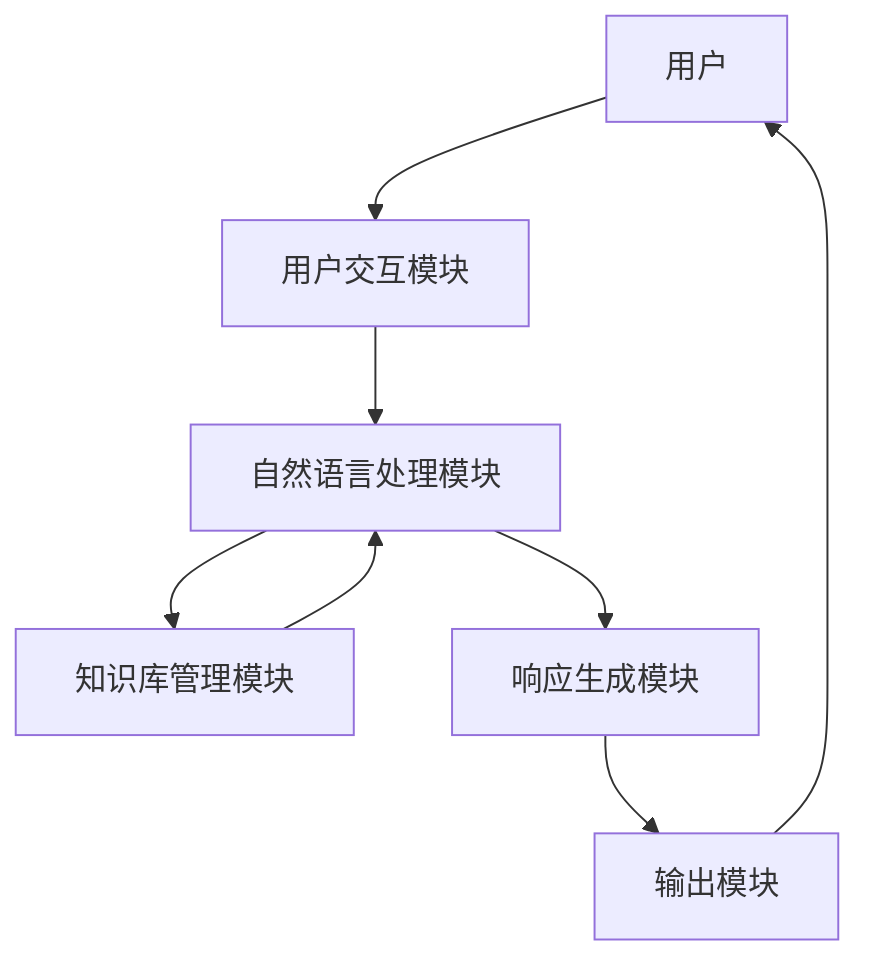
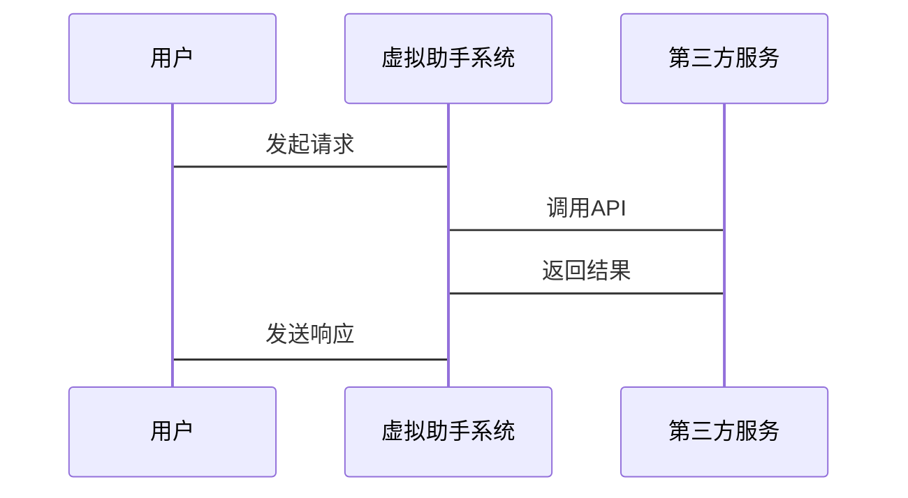

                 


# 虚拟助手 AI Agent：打造基于 LLM 的数字人

> 关键词：虚拟助手, AI Agent, 大语言模型, 数字人, 自然语言处理, 人工智能, 人机交互

> 摘要：随着人工智能技术的快速发展，虚拟助手和数字人逐渐成为人机交互的重要形式。本文将深入探讨基于大语言模型（LLM）的虚拟助手 AI Agent 的设计与实现，涵盖其背景、核心概念、技术原理、系统架构、项目实战以及未来发展趋势。

---

## 第一部分：背景与概念

### 第1章：虚拟助手与数字人概述

#### 1.1 虚拟助手的定义与背景
- **什么是虚拟助手**  
  虚拟助手是一种基于人工智能技术的交互系统，能够通过自然语言处理（NLP）技术与用户进行对话，帮助用户完成各种任务，如信息查询、任务执行、娱乐互动等。

- **虚拟助手的发展历程**  
  从简单的规则驱动系统到基于机器学习的智能助手，虚拟助手经历了多个阶段的发展。近年来，随着大语言模型（LLM）的兴起，虚拟助手的功能和性能得到了显著提升。

- **虚拟助手的应用场景**  
  虚拟助手广泛应用于智能家居、移动设备、企业服务、教育、医疗等领域。它们可以提供个性化的服务，提升用户体验和效率。

#### 1.2 大语言模型（LLM）与数字人
- **大语言模型的基本概念**  
  大语言模型（LLM）是指在大规模数据上训练的深度学习模型，能够理解和生成人类语言。这些模型通常基于Transformer架构，具有强大的上下文理解和生成能力。

- **数字人的定义与分类**  
  数字人是指通过计算机技术生成的虚拟人物，可以具备人类的外貌、声音和行为特征。数字人可以分为虚拟助手、虚拟偶像、虚拟员工等类型。

- **LLM 在数字人中的作用**  
  大语言模型为数字人提供了强大的语言理解和生成能力，使其能够与用户进行自然的对话，提供个性化的服务。

#### 1.3 虚拟助手与数字人的关系
- **虚拟助手的功能特点**  
  虚拟助手通常以对话形式提供服务，注重实用性和功能性。

- **数字人的技术优势**  
  数字人结合了语言理解和视觉呈现，具备更强的交互性和沉浸感。

- **两者的结合与发展趋势**  
  随着技术的进步，虚拟助手和数字人将更加融合，形成更强大的人机交互系统。

---

## 第二部分：大语言模型（LLM）的核心原理

### 第2章：大语言模型（LLM）的基本原理

#### 2.1 大语言模型的神经网络基础
- **神经网络的基本结构**  
  神经网络由输入层、隐藏层和输出层组成，通过多层非线性变换实现对数据的特征提取。

- **Transformer 模型的原理**  
  Transformer模型由编码器和解码器组成，编码器负责将输入序列映射到一个潜在空间，解码器则根据编码结果生成输出序列。

- **注意力机制的作用**  
  注意力机制帮助模型关注输入序列中的重要部分，提升模型的上下文理解和生成能力。

#### 2.2 大语言模型的训练过程
- **数据预处理**  
  数据预处理包括分词、去除停用词、数据清洗等步骤，确保输入数据的质量。

- **模型训练的数学公式**  
  大语言模型的训练目标是最小化预测的损失函数，常用交叉熵损失函数：

  $$ \mathcal{L} = -\sum_{i=1}^{n} \log p(y_i|x_i) $$

  其中，$p(y_i|x_i)$ 是条件概率，表示在输入 $x_i$ 下输出 $y_i$ 的概率。

- **损失函数与优化方法**  
  常用的优化方法包括随机梯度下降（SGD）和Adam优化器，通过不断更新模型参数来最小化损失函数。

#### 2.3 大语言模型的应用特点
- **多任务学习能力**  
  大语言模型可以通过微调适应多种任务，如文本生成、问答系统、文本分类等。

- **模型的可扩展性**  
  大语言模型可以通过增加参数量或优化架构进一步提升性能。

- **模型的局限性与改进方向**  
  大语言模型存在计算资源消耗大、生成结果不可控等问题，未来需要通过小样本学习、可解释性增强等方法进行改进。

---

## 第三部分：虚拟助手 AI Agent 的系统架构

### 第3章：虚拟助手系统的架构设计

#### 3.1 系统功能模块划分
- **用户交互模块**  
  用户通过文本或语音输入与虚拟助手进行交互，模块负责接收输入并将其传递给自然语言处理模块。

- **自然语言处理模块**  
  该模块负责解析用户输入的意图，并生成相应的响应。常用技术包括意图识别、实体抽取和对话管理。

- **知识库管理模块**  
  知识库管理模块负责存储和管理与任务相关的知识，如FAQ、产品信息等，为虚拟助手提供支持。

#### 3.2 系统架构设计



#### 3.3 系统接口设计
- **输入接口**  
  用户通过文本或语音输入与系统交互。

- **输出接口**  
  系统通过文本或语音输出响应，或调用第三方服务（如API）完成任务。

#### 3.4 系统交互流程


---

## 第四部分：项目实战与案例分析

### 第4章：项目实战：搭建基于 LLM 的虚拟助手

#### 4.1 环境搭建
- 安装必要的工具和库，如Python、TensorFlow、Keras等。

#### 4.2 系统核心实现
- 实现自然语言处理模块，包括意图识别和实体抽取。
- 设计知识库管理模块，存储和管理相关知识。

#### 4.3 代码示例

```python
import tensorflow as tf
from tensorflow.keras import layers

# 模型定义
class VirtualAssistantModel(tf.keras.Model):
    def __init__(self, vocab_size, embedding_dim, hidden_dim):
        super(VirtualAssistantModel, self).__init__()
        self.embedding = layers.Embedding(vocab_size, embedding_dim)
        self.rnn = layers.GRU(hidden_dim)
        self.dense = layers.Dense(1, activation='sigmoid')

    def call(self, x, states=None):
        embedded = self.embedding(x)
        output, states = self.rnn(embedded, initial_state=states)
        output = self.dense(output)
        return output, states

# 模型训练
model = VirtualAssistantModel(vocab_size=10000, embedding_dim=100, hidden_dim=50)
model.compile(optimizer='adam', loss='binary_crossentropy', metrics=['accuracy'])
model.fit(X_train, y_train, epochs=10, batch_size=32)
```

#### 4.4 案例分析
- 智能客服案例：通过虚拟助手实现客户咨询和问题解决。
- 教育辅助案例：虚拟助手帮助学生解答学习中的问题。

---

## 第五部分：未来趋势与总结

### 第5章：未来发展趋势
- **技术方向**  
  多模态模型、边缘计算、实时推理等。

- **挑战与机遇**  
  数据隐私、伦理问题、计算资源消耗等。

---

## 附录

### 附录A：工具与库安装指南
- Python
- TensorFlow
- Keras
- Mermaid
- LaTeX

### 附录B：API 文档
- 第三方服务 API 接口说明

### 附录C：参考文献
- 推荐的书籍和论文

---

作者：AI天才研究院/AI Genius Institute & 禅与计算机程序设计艺术/Zen And The Art of Computer Programming

