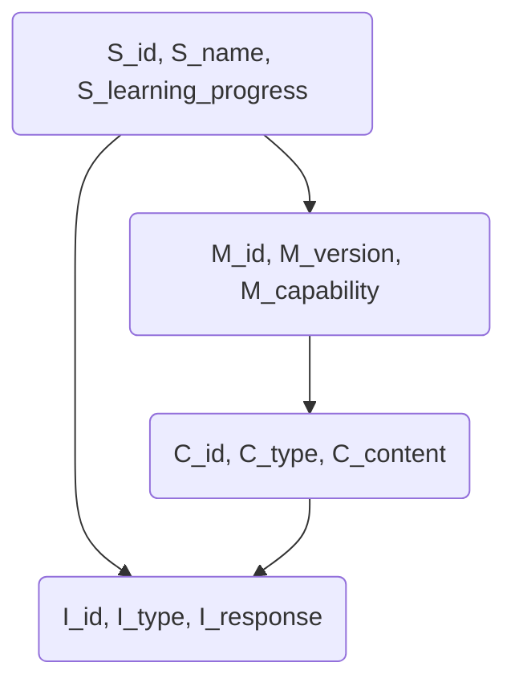
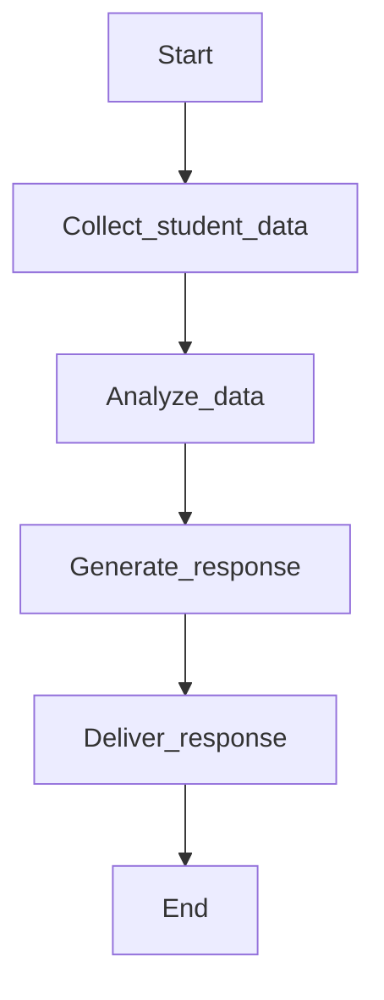
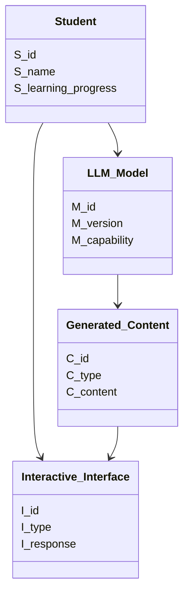
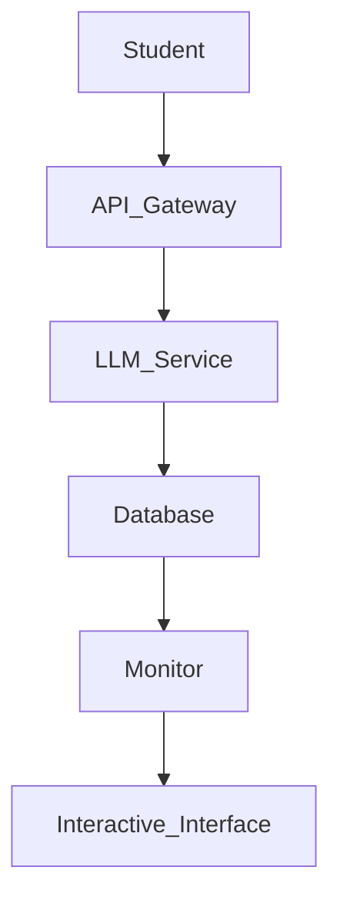
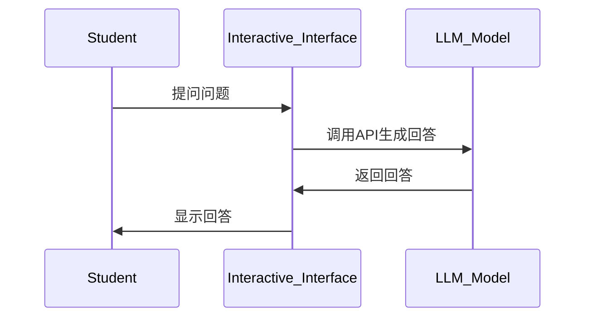

                 


# 虚拟教师 AI Agent：LLM 驱动的个性化教育系统

## 关键词：虚拟教师，LLM，个性化教育，教育系统，AI Agent

## 摘要：  
本文探讨了虚拟教师AI Agent如何通过大语言模型（LLM）实现个性化教育系统。文章从背景、核心概念、算法原理、系统架构到项目实战，全面解析了虚拟教师AI Agent的技术细节和实现方法，展示了其在教育领域的应用潜力。

---

## 第一部分: 虚拟教师AI Agent与LLM驱动的个性化教育系统背景

## 第1章: 虚拟教师AI Agent与LLM驱动的个性化教育系统概述

### 1.1 问题背景与问题描述

#### 1.1.1 传统教育系统的问题与挑战  
传统教育系统面临资源分配不均、教师精力有限、学生个性化需求难以满足等问题。大规模的班级教学难以兼顾每位学生的学习特点和进度。

#### 1.1.2 虚拟教师AI Agent的定义与目标  
虚拟教师AI Agent是一种基于AI技术的教育辅助工具，旨在为每位学生提供个性化的教学服务。其目标是通过智能化手段，解决传统教育中的资源分配和个性化教学难题。

#### 1.1.3 LLM在教育系统中的应用价值  
大语言模型（LLM）具有强大的自然语言处理能力，能够理解上下文、生成回答、提供反馈。将其应用于教育系统，可以实现个性化的教学内容生成、实时答疑、学习进度跟踪等功能。

---

### 1.2 问题解决与边界外延

#### 1.2.1 虚拟教师AI Agent的核心问题解决  
通过LLM技术，虚拟教师AI Agent可以实现以下功能：  
- 根据学生的学习情况生成个性化教学内容。  
- 提供实时答疑和学习建议。  
- 自动评估学生的学习成果并给予反馈。

#### 1.2.2 系统边界与功能外延  
虚拟教师AI Agent的功能边界包括：  
- 学生信息收集与分析。  
- 个性化教学内容生成。  
- 学习过程监控与反馈。  
功能外延则可能包括与实际学校的系统集成，以及与其他教育工具的协同工作。

#### 1.2.3 核心概念与核心要素组成  
系统的核心要素包括：  
- 学生数据：包括学习进度、兴趣爱好、知识水平等。  
- 教学内容：基于LLM生成的个性化教学材料。  
- AI算法：用于分析数据并生成响应的模型。  
- 交互界面：学生与系统互动的媒介。

---

## 第2章: 虚拟教师AI Agent的核心概念与联系

### 2.1 核心概念原理

#### 2.1.1 虚拟教师AI Agent的工作原理  
虚拟教师AI Agent通过收集学生的学习数据，利用LLM生成符合学生需求的教学内容，并通过交互界面与学生互动，实时调整教学策略。

#### 2.1.2 LLM在教育系统中的应用机制  
LLM通过自然语言处理技术，理解学生的问题并生成相应的回答。同时，模型可以分析学生的学习轨迹，预测其学习难点，提供针对性建议。

#### 2.1.3 系统的核心要素与关系  
- **学生数据**：输入数据流，用于生成个性化教学内容。  
- **LLM模型**：核心处理单元，负责理解和生成内容。  
- **交互界面**：用户与系统的桥梁，支持多种输入输出方式。  

---

### 2.2 核心概念属性特征对比

#### 2.2.1 虚拟教师AI Agent与传统教育系统对比  
| **特征**         | **虚拟教师AI Agent**          | **传统教育系统**          |  
|-------------------|--------------------------------|--------------------------|  
| 教学资源分配     | 高度个性化，按需分配          | 批量分配，资源有限        |  
| 教学效率         | 高，支持24/7服务            | 受限于教师工作时间        |  
| 学生参与度       | 高，互动性强                | 可能较低，学生被动接受      |  

#### 2.2.2 系统功能与实现方式对比  
| **功能**         | **基于LLM的实现方式**         | **传统实现方式**          |  
|-------------------|-------------------------------|--------------------------|  
| 个性化教学       | 利用模型生成定制化内容        | 教师手动准备               |  
| 实时答疑         | AI自动回答学生问题          | 教师线下答疑              |  

---

### 2.3 ER实体关系图



---

## 第3章: 虚拟教师AI Agent的算法原理讲解

### 3.1 算法原理概述

#### 3.1.1 虚拟教师AI Agent的算法选择  
虚拟教师AI Agent主要基于大语言模型（如GPT-3/4）进行开发，结合监督微调和强化学习策略优化模型性能。

---

### 3.2 算法流程图



---

### 3.3 算法实现的Python源代码

```python
import openai

def generate_response(prompt):
    # 初始化OpenAI客户端
    client = openai.Client()
    # 调用API生成回答
    response = client.chat.completions.create(
        model="gpt-4",
        messages=[{
            "role": "user",
            "content": prompt
        }]
    )
    return response.choices[0].message.content

# 示例：生成学习建议
prompt = "我需要学习代数，有什么好的方法吗？"
response = generate_response(prompt)
print(response)
```

---

### 3.4 算法实现的数学模型

#### 3.4.1 LLM训练的数学模型

$$ \text{损失函数} = -\sum_{i=1}^{n} \log P(w_i | w_{<i}) $$

其中，$w_i$ 表示第$i$个词，$P(w_i | w_{<i})$ 是在前面词的情况下生成词$w_i$的概率。

#### 3.4.2 优化器

$$ \text{Adam优化器} = \text{Adam}(f, \theta, \alpha, \beta_1, \beta_2, \epsilon) $$

其中，$\theta$ 表示模型参数，$\alpha$ 表示学习率，$\beta_1, \beta_2$ 分别表示动量和自适应学习率的参数。

---

## 第4章: 虚拟教师AI Agent的数学模型与公式

### 4.1 数学模型概述

#### 4.1.1 虚拟教师AI Agent的数学模型  
模型主要基于Transformer架构，通过自注意力机制和前馈网络生成响应。

#### 4.1.2 LLM驱动的数学模型  
模型的损失函数通常采用交叉熵损失函数：

$$ \mathcal{L} = -\frac{1}{N}\sum_{i=1}^{N} \log p(y_i|x_i) $$

其中，$N$ 是样本数量，$p(y_i|x_i)$ 是在输入$x_i$下输出$y_i$的概率。

---

### 4.2 数学公式与详细讲解

#### 4.2.1 虚拟教师AI Agent的数学公式  
在生成回答时，模型的输出概率分布由以下公式决定：

$$ P(y|x) = \text{softmax}(QK^T/V) $$

其中，$Q$ 是查询向量，$K$ 是键向量，$V$ 是值向量，$V$ 的维度与输出空间一致。

---

## 第5章: 系统分析与架构设计方案

### 5.1 系统功能设计

#### 5.1.1 领域模型



---

### 5.2 系统架构设计



---

### 5.3 接口设计

```json
{
    "action": "generate_content",
    "params": {
        "student_id": "123",
        "topic": "数学基础"
    }
}
```

---

### 5.4 交互设计



---

## 第6章: 项目实战

### 6.1 环境安装

```bash
pip install openai
```

---

### 6.2 系统核心实现源代码

```python
import openai

def setup():
    import openai
    openai.api_key = "your_api_key"

def generate_learning_plan(topic):
    prompt = f"生成关于{topic}的学习计划。"
    response = openai.ChatCompletion.create(
        model="gpt-4",
        messages=[{
            "role": "user",
            "content": prompt
        }]
    )
    return response.choices[0].message.content

if __name__ == "__main__":
    setup()
    print(generate_learning_plan("数学"))
```

---

### 6.3 代码解读与分析

- **setup()**：配置OpenAI API密钥。
- **generate_learning_plan()**：根据主题生成学习计划。
- **main()**：调用函数并打印结果。

---

### 6.4 案例分析

假设学生选择学习“编程基础”，系统会生成以下学习计划：

1. **变量与数据类型**：完成基础练习题。
2. **流程控制**：完成条件语句练习。
3. **函数与模块**：学习函数定义并完成项目。

---

### 6.5 项目小结

通过实际案例，展示了虚拟教师AI Agent在个性化教育中的应用潜力。系统能够根据学生需求生成学习计划，并通过交互式界面提供实时反馈。

---

## 第7章: 最佳实践与注意事项

### 7.1 最佳实践 Tips

- **数据隐私**：确保学生数据的安全性和隐私性。  
- **模型优化**：定期更新模型，提升生成内容的质量。  
- **用户体验**：优化交互界面，提升用户体验。  

---

## 第8章: 小结

本文详细介绍了虚拟教师AI Agent及其在个性化教育系统中的应用。通过理论分析和实际案例，展示了如何利用LLM技术实现智能化、个性化的教育服务。

---

## 第9章: 注意事项

- 确保系统稳定性，避免服务中断。  
- 定期进行系统维护和更新。  
- 遵守相关法律法规，保护用户隐私。  

---

## 第10章: 拓展阅读

- 探索更多AI技术在教育中的应用。  
- 研究最新的LLM模型及其改进方法。  
- 关注教育领域的技术发展趋势。  

---

## 作者：AI天才研究院/AI Genius Institute & 禅与计算机程序设计艺术 /Zen And The Art of Computer Programming

