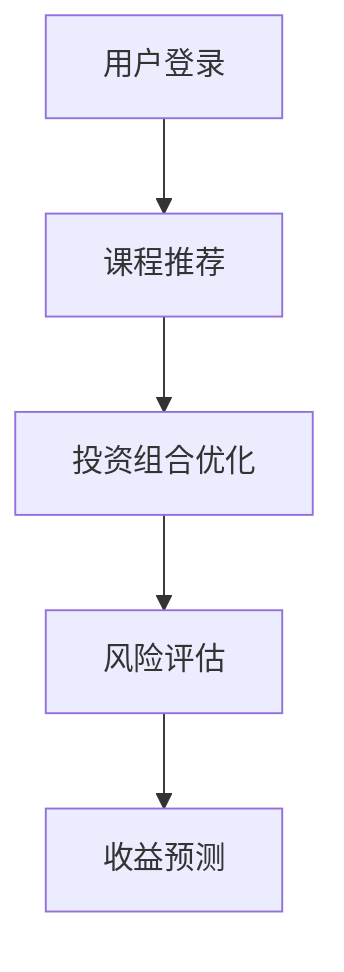
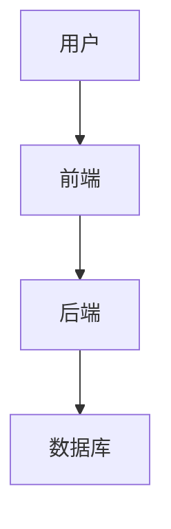

                 


# 融合AI技术的新一代投资理财教育平台

> 关键词：AI技术，投资理财，教育平台，机器学习，自然语言处理，投资策略

> 摘要：本文详细探讨了如何将AI技术应用于投资理财教育领域，提出了新一代投资理财教育平台的设计理念与实现方案。通过分析AI技术在投资理财教育中的核心应用，包括机器学习、自然语言处理等技术，结合具体的数学模型与算法原理，展示了如何构建一个智能化、个性化的投资理财教育平台。本文还通过实际案例分析，详细讲解了系统的实现过程，并对未来的发展趋势进行了展望。

---

# 第一部分: 融合AI技术的新一代投资理财教育平台概述

# 第1章: 投资理财教育的数字化转型

## 1.1 传统投资理财教育的局限性

### 1.1.1 传统教育模式的不足
传统的投资理财教育模式主要依赖于讲师的讲解和教材的内容，学习者需要手动记录和分析大量的数据，这种方式效率低下，且难以满足个性化学习的需求。

### 1.1.2 学习者需求的变化
随着互联网的普及和用户需求的多样化，学习者对投资理财教育的要求越来越高，不仅需要理论知识，还需要实践指导和个性化建议。

### 1.1.3 技术驱动教育变革
AI技术的快速发展为投资理财教育带来了新的机遇，通过智能化工具和数据分析，可以为学习者提供更加精准和个性化的学习体验。

## 1.2 AI技术在投资理财教育中的应用背景

### 1.2.1 AI技术的发展与投资理财的结合
AI技术在投资理财领域的应用日益广泛，从数据处理、策略优化到风险评估，AI技术正在改变传统的投资方式。

### 1.2.2 数据驱动的投资理财教育
通过AI技术，可以将海量的投资数据进行分析和挖掘，提取有价值的信息，为学习者提供数据驱动的投资建议。

### 1.2.3 用户个性化学习需求的提升
AI技术可以帮助教育平台更好地理解用户需求，提供个性化的学习路径和内容推荐。

## 1.3 融合AI技术的新一代投资理财教育平台的核心优势

### 1.3.1 提供个性化学习路径
通过AI技术分析用户的学习习惯和需求，平台可以为每个用户制定个性化的学习计划。

### 1.3.2 实现智能化知识推送
AI技术可以根据用户的兴趣和需求，实时推送相关的投资理财知识，帮助用户高效学习。

### 1.3.3 数据驱动的教育效果评估
通过AI技术，平台可以实时跟踪用户的学习效果，并根据数据反馈优化教学策略。

## 1.4 本章小结
本章主要介绍了传统投资理财教育的局限性，以及AI技术在投资理财教育中的应用背景。通过分析AI技术的优势，提出了融合AI技术的新一代投资理财教育平台的核心设计理念。

---

# 第2章: AI技术在投资理财教育中的核心应用

## 2.1 机器学习在投资理财中的应用

### 2.1.1 机器学习的基本概念
机器学习是一种通过数据训练模型，使其能够从数据中学习并做出预测的技术。

### 2.1.2 机器学习在投资理财中的具体应用
- **风险评估**：通过机器学习模型分析投资组合的风险。
- **收益预测**：利用机器学习算法预测股票的走势。
- **客户画像**：通过机器学习识别用户的消费习惯和投资偏好。

### 2.1.3 机器学习模型的选择与优化
在选择机器学习模型时，需要考虑数据的特性和任务的类型，例如线性回归适合线性关系，而随机森林适合非线性关系。

## 2.2 自然语言处理在投资理财教育中的应用

### 2.2.1 自然语言处理的基本原理
自然语言处理（NLP）是通过计算机理解、处理和生成人类语言的技术。

### 2.2.2 智能问答系统在投资理财教育中的应用
通过NLP技术，可以构建智能问答系统，为用户提供实时的投资理财咨询。

### 2.2.3 文本情感分析在投资理财中的应用
通过分析新闻、评论等文本的情感，帮助投资者识别市场情绪，做出投资决策。

## 2.3 图神经网络在投资理财中的应用

### 2.3.1 图神经网络的基本概念
图神经网络是一种处理图结构数据的深度学习方法。

### 2.3.2 投资理财知识图谱的构建
通过图神经网络，可以构建投资理财的知识图谱，帮助用户更好地理解和应用知识。

### 2.3.3 图神经网络在投资理财中的具体应用
- **知识关联**：通过图神经网络，可以发现不同知识点之间的关联。
- **推荐系统**：基于知识图谱的推荐系统可以为用户提供更精准的投资建议。

## 2.4 本章小结
本章详细介绍了AI技术在投资理财教育中的核心应用，包括机器学习、自然语言处理和图神经网络等技术，并通过具体案例展示了这些技术的应用场景。

---

# 第3章: 投资理财教育中的数学模型与算法原理

## 3.1 线性回归模型

### 3.1.1 线性回归的基本原理
线性回归是一种用于预测目标变量与一个或多个解释变量之间关系的统计方法。

### 3.1.2 线性回归在投资理财中的应用
- **风险评估**：通过线性回归模型分析投资组合的风险。
- **收益预测**：利用线性回归预测股票的未来走势。

### 3.1.3 线性回归的优缺点
- **优点**：简单易懂，计算速度快。
- **缺点**：只能处理线性关系，对复杂关系的建模能力有限。

## 3.2 支持向量机模型

### 3.2.1 支持向量机的基本原理
支持向量机（SVM）是一种监督学习算法，主要用于分类和回归问题。

### 3.2.2 支持向量机在投资理财中的应用
- **分类问题**：通过SVM可以将股票分为上涨、下跌和持平三类。
- **回归问题**：利用SVM预测股票的未来价格。

### 3.2.3 支持向量机的优缺点
- **优点**：适合小规模数据，分类精度高。
- **缺点**：对高维数据的处理能力较弱。

## 3.3 随机森林模型

### 3.3.1 随机森林的基本原理
随机森林是一种基于树的集成学习方法，通过组合多个决策树的结果来提高模型的准确性和鲁棒性。

### 3.3.2 随机森林在投资理财中的应用
- **风险评估**：通过随机森林模型评估投资组合的风险。
- **客户画像**：利用随机森林识别客户的消费习惯和投资偏好。

### 3.3.3 随机森林的优缺点
- **优点**：适合处理高维数据，模型鲁棒性好。
- **缺点**：计算复杂度高，难以解释。

## 3.4 算法原理的数学模型与公式

### 3.4.1 线性回归的数学公式
$$ y = \beta_0 + \beta_1x + \epsilon $$

### 3.4.2 支持向量机的数学公式
$$ \text{最大化} \sum_{i=1}^n \xi_i $$

### 3.4.3 随机森林的数学模型
随机森林通过组合多个决策树的结果，利用投票或平均的方式进行预测。

## 3.5 本章小结
本章详细介绍了投资理财教育中常用的数学模型与算法原理，包括线性回归、支持向量机和随机森林等，并通过具体公式和应用场景展示了这些模型的实现方法。

---

# 第4章: 系统设计与实现

## 4.1 系统功能设计

### 4.1.1 系统功能模块划分
- **用户模块**：用户注册、登录、个人信息管理。
- **课程模块**：课程推荐、课程学习、课程评价。
- **投资工具模块**：投资组合优化、风险评估、收益预测。

### 4.1.2 系统功能流程图


## 4.2 系统架构设计

### 4.2.1 系统架构图


### 4.2.2 系统接口设计
- **API接口**：提供RESTful API接口，供前端调用。
- **数据接口**：与第三方数据源对接，获取实时投资数据。

## 4.3 系统实现

### 4.3.1 环境配置
```bash
# 安装Python依赖
pip install flask
pip install numpy
pip install pandas
pip install scikit-learn
```

### 4.3.2 核心代码实现
```python
from sklearn.linear_model import LinearRegression
from sklearn.svm import SVC
from sklearn.ensemble import RandomForestClassifier

# 线性回归模型
lr = LinearRegression()
lr.fit(X_train, y_train)
y_pred = lr.predict(X_test)

# 支持向量机模型
svm = SVC()
svm.fit(X_train, y_train)
y_pred = svm.predict(X_test)

# 随机森林模型
rf = RandomForestClassifier()
rf.fit(X_train, y_train)
y_pred = rf.predict(X_test)
```

## 4.4 本章小结
本章详细介绍了投资理财教育平台的系统设计与实现，包括功能设计、架构设计和核心代码实现，并通过具体的代码示例展示了系统的实现过程。

---

# 第5章: 项目实战

## 5.1 环境配置

### 5.1.1 安装Python依赖
```bash
pip install jupyterlab
pip install numpy
pip install pandas
pip install scikit-learn
pip install matplotlib
```

## 5.2 数据收集与预处理

### 5.2.1 数据来源
- **股票数据**：从Yahoo Finance获取历史数据。
- **新闻数据**：从新闻网站获取文本数据。

### 5.2.2 数据预处理
```python
import pandas as pd
import numpy as np

# 数据加载
data = pd.read_csv('data.csv')

# 数据清洗
data.dropna(inplace=True)
data = data[~data['volume'].isin([0])]

# 数据标准化
from sklearn.preprocessing import StandardScaler
scaler = StandardScaler()
data_scaled = scaler.fit_transform(data)
```

## 5.3 模型训练与优化

### 5.3.1 线性回归模型训练
```python
from sklearn.linear_model import LinearRegression
from sklearn.metrics import mean_squared_error

# 模型训练
model = LinearRegression()
model.fit(X_train, y_train)

# 模型预测
y_pred = model.predict(X_test)

# 模型评估
mse = mean_squared_error(y_test, y_pred)
print('均方误差:', mse)
```

### 5.3.2 模型优化
```python
from sklearn.model_selection import GridSearchCV

# 参数设置
param_grid = {'alpha': [0.1, 1, 10, 100]}

# 网格搜索
grid_search = GridSearchCV(LinearRegression(), param_grid)
grid_search.fit(X_train, y_train)

# 最优参数
best_params = grid_search.best_params_
print('最优参数:', best_params)
```

## 5.4 系统实现与测试

### 5.4.1 系统实现
```python
from flask import Flask, request, jsonify

app = Flask(__name__)

@app.route('/predict', methods=['POST'])
def predict():
    data = request.json['data']
    # 数据预处理
    # 模型预测
    return jsonify({'result': 'success'})

if __name__ == '__main__':
    app.run(debug=True)
```

### 5.4.2 系统测试
```python
import requests

response = requests.post('http://localhost:5000/predict', json={'data': data})
print(response.json())
```

## 5.5 实际案例分析

### 5.5.1 案例背景
以股票价格预测为例，利用线性回归模型进行预测。

### 5.5.2 数据分析
```python
import matplotlib.pyplot as plt

plt.plot(y_test, label='真实值')
plt.plot(y_pred, label='预测值')
plt.xlabel('时间')
plt.ylabel('价格')
plt.legend()
plt.show()
```

### 5.5.3 案例总结
通过实际案例分析，验证了线性回归模型在股票价格预测中的有效性。

## 5.6 本章小结
本章通过实际案例分析，详细讲解了如何将AI技术应用于投资理财教育平台的建设，从数据收集到模型训练，再到系统实现，展示了整个过程的具体步骤。

---

# 第6章: 未来展望与挑战

## 6.1 AI技术的前沿发展

### 6.1.1 大语言模型（LLM）在投资理财中的应用
大语言模型可以用于生成投资报告、进行市场分析等。

### 6.1.2 图神经网络的进一步发展
图神经网络在投资理财中的应用将更加广泛，例如构建更复杂的知识图谱。

## 6.2 智能投资理财教育的挑战

### 6.2.1 数据隐私与安全问题
投资理财平台需要处理大量的用户数据，数据隐私和安全问题不容忽视。

### 6.2.2 模型的可解释性问题
复杂的AI模型往往缺乏可解释性，这在投资理财领域尤为重要。

## 6.3 投资理财教育的未来趋势

### 6.3.1 个性化学习的进一步深化
通过AI技术，投资理财教育将更加个性化，学习者可以根据自己的需求定制学习计划。

### 6.3.2 多模态数据的融合应用
未来，投资理财教育将更加注重多模态数据的融合，例如结合文本、图像、语音等多种数据源。

## 6.4 本章小结
本章展望了AI技术在投资理财教育中的未来发展方向，并分析了当前面临的主要挑战，为读者提供了对未来发展的思考。

---

# 作者：AI天才研究院/AI Genius Institute & 禅与计算机程序设计艺术 /Zen And The Art of Computer Programming

