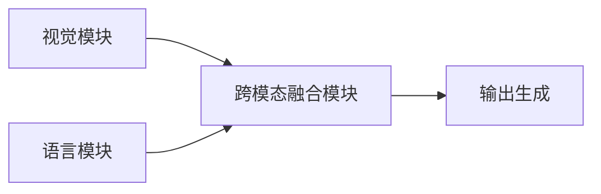
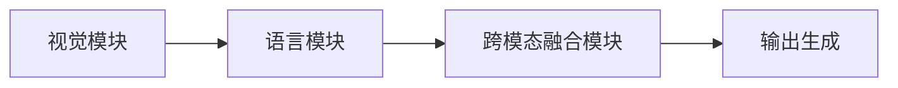
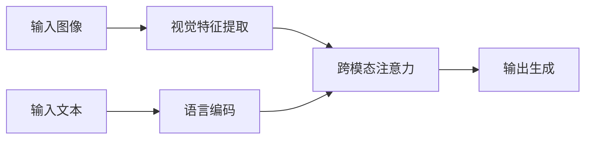
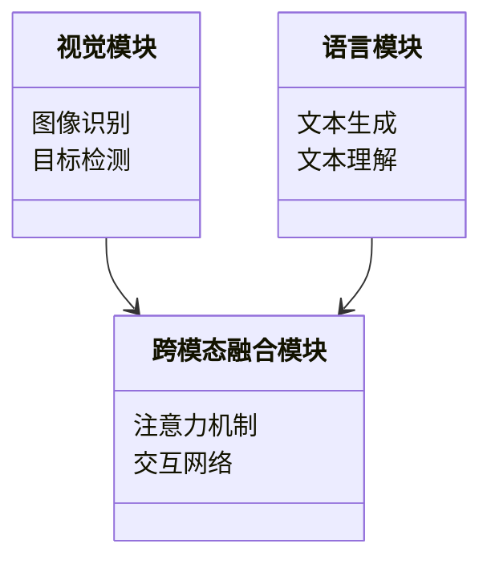
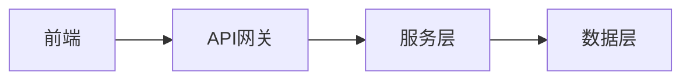
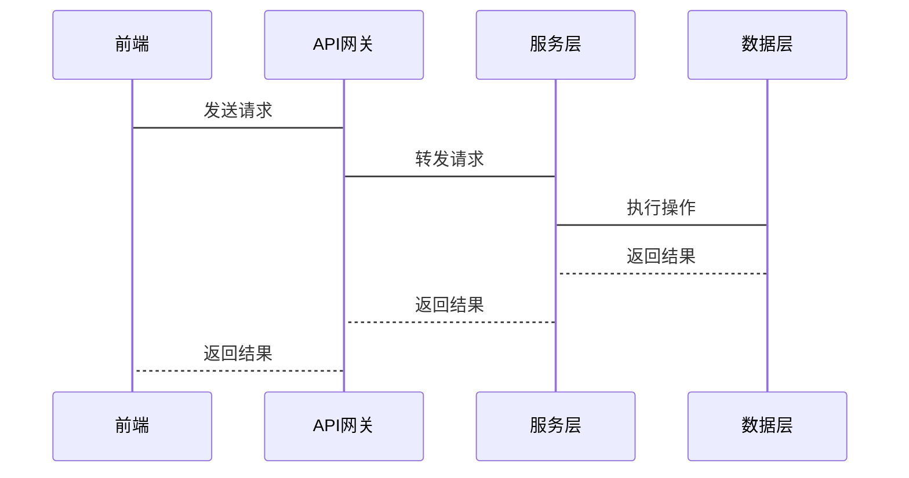

                 


# 视觉-语言AI Agent：整合LLM与图像理解

> 关键词：视觉-语言AI Agent，LLM，图像理解，跨模态融合，人工智能，深度学习

> 摘要：本文详细探讨了视觉-语言AI Agent的构建过程，整合大语言模型（LLM）与图像理解技术，分析其核心概念、算法原理、系统架构及项目实战。通过理论与实践结合，深入解析跨模态融合的关键技术与应用场景。

---

# 第1章: 视觉-语言AI Agent概述

## 1.1 问题背景与描述
### 1.1.1 当前AI技术的发展现状
近年来，人工智能技术飞速发展，尤其是在视觉和语言处理领域，取得了显著成果。然而，单一模态的AI系统在实际应用中面临诸多限制，难以应对复杂的现实场景。例如，图像识别系统无法理解上下文语境，而大语言模型（LLM）在处理视觉信息时也显得力不从心。

### 1.1.2 视觉与语言理解的结合需求
现实世界中的信息往往是多模态的，单一模态的处理难以满足实际需求。例如，在医疗领域，医生需要结合医学影像和病历文本进行诊断；在零售行业，商家需要通过商品图像和顾客评论进行推荐。这些场景都需要视觉与语言的协同处理。

### 1.1.3 视觉-语言AI Agent的目标与意义
视觉-语言AI Agent的目标是整合视觉和语言处理能力，实现跨模态的信息理解和生成。通过结合图像理解和文本生成，AI Agent能够更全面地感知和处理复杂场景，为用户提供更智能的服务。

### 1.1.4 解决方案与边界分析
视觉-语言AI Agent的核心解决方案是通过跨模态融合技术，将视觉特征与语言信息进行交互和协同。其边界包括但不限于图像处理、文本生成、跨模态交互等核心功能。

## 1.2 核心概念与结构
### 1.2.1 视觉-语言AI Agent的概念组成
视觉-语言AI Agent由视觉模块、语言模块和跨模态融合模块组成。视觉模块负责图像的特征提取和理解，语言模块负责文本的生成和理解，跨模态融合模块负责两者之间的交互和协同。

### 1.2.2 核心要素与关系分析
- **视觉模块**：图像识别、目标检测、图像分割等技术。
- **语言模块**：大语言模型（LLM）、文本生成、文本理解等技术。
- **跨模态融合模块**：注意力机制、交互网络等技术。

### 1.2.3 概念结构图展示


## 1.3 本章小结
本章介绍了视觉-语言AI Agent的核心概念，包括其背景、目标、核心要素及其结构。通过跨模态融合，AI Agent能够更好地理解和处理多模态信息，为实际应用提供了新的可能性。

---

# 第2章: 视觉与语言理解的整合

## 2.1 视觉理解的核心原理
### 2.1.1 图像识别与目标检测
图像识别通过分类模型识别图像中的物体，目标检测则进一步定位物体的位置。

### 2.1.2 图像分割与场景理解
图像分割将图像划分为多个区域，场景理解则是对整个场景进行语义分析。

### 2.1.3 视觉特征提取方法
常用的视觉特征提取方法包括CNN、Transformer等。

## 2.2 语言模型的核心原理
### 2.2.1 大语言模型（LLM）的基本原理
LLM通过大规模数据训练，掌握了丰富的语言知识和模式。

### 2.2.2 LLM的文本生成机制
基于自回归或Transformer架构，LLM能够生成连贯的文本。

### 2.2.3 LLM的理解与推理能力
通过上下文分析，LLM能够理解文本中的语义和逻辑关系。

## 2.3 视觉与语言的结合方式
### 2.3.1 基于视觉特征的文本生成
根据图像内容生成描述性文本。

### 2.3.2 基于语言上下文的视觉推理
根据文本描述生成或理解图像内容。

### 2.3.3 跨模态交互机制
通过注意力机制实现视觉和语言信息的交互。

## 2.4 核心概念对比与联系
### 2.4.1 视觉与语言理解的对比分析
- 视觉理解依赖于图像的空间信息。
- 语言理解依赖于文本的语义信息。
- 两者的结合能够互补信息，提升整体理解能力。

### 2.4.2 跨模态整合的优缺点
- **优点**：提升信息处理的全面性和准确性。
- **缺点**：增加了计算复杂度和数据处理难度。

### 2.4.3 实体关系图展示


---

# 第3章: 视觉-语言AI Agent的算法原理

## 3.1 算法整体流程
### 3.1.1 输入处理与特征提取
输入图像经过视觉模块提取特征，文本输入经过语言模块编码。

### 3.1.2 跨模态融合与交互
通过注意力机制实现视觉和语言特征的交互。

### 3.1.3 输出生成与优化
根据融合后的特征生成最终的输出，如文本描述或图像生成。

## 3.2 关键算法解析
### 3.2.1 视觉特征提取算法
- **CNN**：用于提取图像的空间特征。
- **Transformer**：用于提取图像的全局上下文信息。

### 3.2.2 语言模型的编码与解码机制
- **编码器**：将输入文本编码为向量表示。
- **解码器**：根据编码结果生成输出文本。

### 3.2.3 跨模态注意力机制
通过自注意力机制，实现视觉和语言特征之间的交互。

## 3.3 算法流程图展示


## 3.4 数学模型与公式
### 3.4.1 视觉特征提取的数学表达
$$ V = f_{vision}(I) $$
其中，$I$是输入图像，$f_{vision}$是视觉特征提取函数。

### 3.4.2 语言编码的数学表达
$$ T = f_{language}(T_{input}) $$
其中，$T_{input}$是输入文本，$f_{language}$是语言编码函数。

### 3.4.3 跨模态注意力机制
$$ A = \text{Attention}(V, T) $$
注意力机制将视觉和语言特征进行加权融合。

---

# 第4章: 视觉-语言AI Agent的系统架构设计

## 4.1 系统功能设计
### 4.1.1 领域模型设计
- **视觉模块**：图像识别、目标检测。
- **语言模块**：文本生成、文本理解。
- **跨模态融合模块**：注意力机制、交互网络。

### 4.1.2 领域模型展示


## 4.2 系统架构设计
### 4.2.1 系统架构图展示


### 4.2.2 系统接口设计
- **输入接口**：接收图像和文本输入。
- **输出接口**：生成文本描述或图像生成。

### 4.2.3 系统交互展示


---

# 第5章: 项目实战

## 5.1 环境安装
### 5.1.1 安装Python
```bash
python --version
```

### 5.1.2 安装依赖
```bash
pip install numpy matplotlib tensorflow
```

## 5.2 系统核心实现源代码
### 5.2.1 视觉模块代码
```python
import tensorflow as tf
from tensorflow.keras import layers

def visual_module(image):
    model = tf.keras.Sequential([
        layers.Conv2D(32, (3,3), activation='relu'),
        layers.MaxPooling2D((2,2)),
        layers.Flatten(),
        layers.Dense(64, activation='relu')
    ])
    return model(image)
```

### 5.2.2 语言模块代码
```python
def language_module(text):
    model = tf.keras.Sequential([
        layers.Embedding(1000, 64),
        layers.LSTM(64, return_sequences=True),
        layers.Dense(64, activation='relu')
    ])
    return model(text)
```

### 5.2.3 跨模态融合代码
```python
def cross_modal_fusion(visual_features, language_features):
    attention = layers.Attention()
    fused_features = attention([visual_features, language_features])
    return fused_features
```

## 5.3 代码应用解读与分析
通过上述代码，我们可以实现视觉模块、语言模块和跨模态融合模块的搭建。视觉模块负责图像特征提取，语言模块负责文本编码，跨模态融合模块实现两者的信息交互。

## 5.4 实际案例分析
### 5.4.1 案例1：图像描述生成
输入一张图片，生成对应的描述文本。

### 5.4.2 案例2：文本驱动的图像生成
根据输入文本生成对应的图像。

## 5.5 项目小结
通过项目实战，我们验证了视觉-语言AI Agent的可行性，同时积累了实际开发经验。

---

# 第6章: 最佳实践与小结

## 6.1 小结
视觉-语言AI Agent通过整合视觉和语言处理能力，实现了跨模态的信息理解和生成。

## 6.2 注意事项
- 数据质量：跨模态数据需要多样化和高质量。
- 计算资源：跨模态处理需要较高的计算资源。
- 模型优化：需要不断优化模型结构和参数。

## 6.3 拓展阅读
- 《Attention Is All You Need》
- 《Vision-Language Pre-Training: Scaling to 1 Trillion Tokens》

---

# 作者

作者：AI天才研究院/AI Genius Institute & 禅与计算机程序设计艺术 /Zen And The Art of Computer Programming

