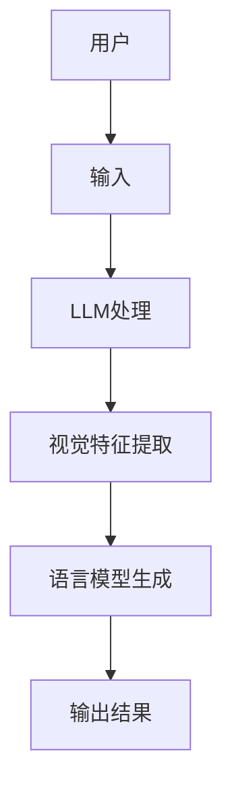
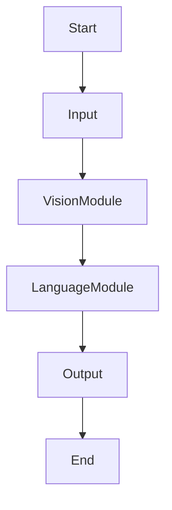
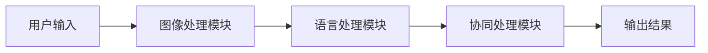
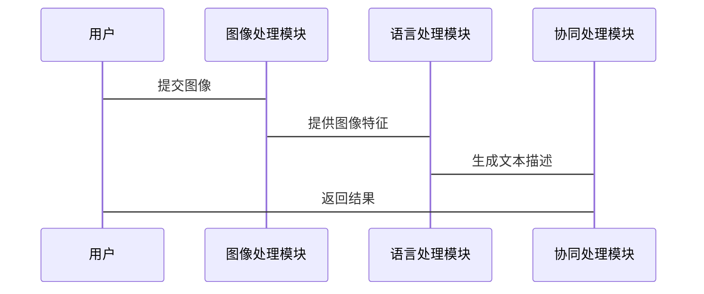

                 


# 视觉-语言协同AI Agent：LLM与计算机视觉的深度融合

## 关键词：
- 视觉-语言协同
- 大语言模型（LLM）
- 计算机视觉
- 多模态AI
- 深度融合

## 摘要：
本文详细探讨了视觉-语言协同AI Agent的构建，重点分析了大语言模型（LLM）与计算机视觉技术的深度融合。文章从背景介绍出发，逐步深入讲解核心概念、算法原理、系统架构设计，并通过实际案例展示技术应用。通过分析，我们揭示了视觉与语言协同的优势，及其在多模态任务中的广泛应用前景。

---

## 第一部分：背景介绍

### 第1章：视觉-语言协同AI Agent的背景与现状

#### 1.1 问题背景
- **当前AI技术的发展趋势**：人工智能（AI）正朝着多模态方向发展，单一模态的模型逐渐难以满足复杂场景的需求。
- **多模态交互的需求增长**：用户期望AI能够理解并处理多种输入形式，如图像、文本、语音等，这推动了视觉-语言协同技术的发展。
- **LLM与计算机视觉的结合潜力**：大语言模型具备强大的语言理解和生成能力，而计算机视觉技术擅长处理图像数据，两者的结合为多模态任务提供了新可能。

#### 1.2 问题描述
- **视觉-语言协同的核心问题**：如何实现图像与文本信息的无缝融合，提升AI的理解和生成能力。
- **当前技术的局限性**：传统方法往往将视觉和语言任务分开处理，缺乏协同优化。
- **应用场景中的具体挑战**：在实际应用中，数据异构性、模型训练复杂性以及实时性需求等问题亟待解决。

#### 1.3 问题解决方法
- **多模态模型的基本思路**：将图像和文本特征共同输入模型，通过联合优化提升任务性能。
- **LLM与CV协同的实现策略**：利用LLM生成文本描述，结合CV提取图像特征，构建联合表示。
- **技术融合的关键点**：统一特征表示、跨模态注意力机制、多任务学习。

#### 1.4 边界与外延
- **技术边界**：视觉-语言协同主要关注图像与文本的交互，不涉及其他模态如语音。
- **应用场景的外延**：从图像描述生成、图像问答扩展到图像编辑、视频理解等。
- **相关领域的联系**：与自然语言处理（NLP）、计算机视觉（CV）、机器学习等密切相关。

#### 1.5 核心要素组成
- **多模态数据处理**：如何有效提取和融合图像与文本特征。
- **模型协同机制**：设计协同模块，实现跨模态信息的交互与融合。
- **应用场景适配**：根据不同任务需求调整模型结构和训练策略。

---

## 第二部分：核心概念与联系

### 第2章：视觉-语言协同的基本原理

#### 2.1 核心概念原理
- **多模态数据的表示方法**：通过模态编码器分别提取图像和文本特征，再进行联合表示。
- **LLM的理解与生成能力**：利用LLM生成丰富的文本描述，帮助模型理解图像内容。
- **计算机视觉的特征提取**：使用CNN等模型提取图像的高层次特征，捕捉关键信息。

#### 2.2 概念属性对比表格
| 属性       | LLM（语言模型）       | CV（视觉模型）       |
|------------|-----------------------|-----------------------|
| 输入形式    | 文本                   | 图像                   |
| 输出形式    | 文本、摘要             | 特征向量、标签         |
| 主要任务    | 语言理解与生成         | 图像识别、目标检测     |
| 模型优势    | 强大的语言理解能力     | 高效的图像特征提取     |
| 协同方式    | 生成描述辅助CV任务     | 提供特征支持LLM生成     |

#### 2.3 ER实体关系图


---

## 第三部分：算法原理讲解

### 第3章：视觉-语言协同模型的算法流程

#### 3.1 算法流程图


#### 3.2 数学模型与公式
- **模型的损失函数**：
  $$ L = \lambda_1 L_{\text{vision}} + \lambda_2 L_{\text{language}} $$
  其中，$\lambda_1$和$\lambda_2$是权重系数，用于平衡视觉和语言任务的损失。
  
- **跨模态注意力机制**：
  $$ \text{Attention}(Q, K, V) = \text{softmax}\left(\frac{QK^T}{\sqrt{d_k}}\right)V $$
  其中，$Q$和$K$是查询和键，$V$是值，$d_k$是维度。

#### 3.3 详细算法步骤
1. 输入图像和文本数据。
2. 使用视觉模型提取图像特征。
3. 利用语言模型生成文本描述。
4. 结合图像和文本特征，进行联合表示。
5. 训练模型，优化损失函数。
6. 输出最终结果。

---

## 第四部分：系统分析与架构设计

### 第4章：系统架构设计与实现

#### 4.1 问题场景介绍
- **目标**：构建一个能够理解图像内容并生成相关文本描述的AI系统。
- **应用场景**：图像描述生成、图像问答系统等。

#### 4.2 系统功能设计
- **模块划分**：
  - 图像处理模块：负责图像的输入、预处理和特征提取。
  - 语言处理模块：负责文本的生成和理解。
  - 协同处理模块：整合图像和文本信息，生成最终结果。

#### 4.3 系统架构设计


#### 4.4 系统接口设计
- **输入接口**：接收图像和文本输入。
- **输出接口**：返回图像描述或相关答案。
- **数据接口**：处理特征向量和文本信息。

#### 4.5 系统交互流程


---

## 第五部分：项目实战

### 第5章：项目实现与案例分析

#### 5.1 环境安装
- **工具安装**：Python、PyTorch、transformers库。
- **依赖管理**：使用pip安装必要的库。

#### 5.2 核心实现代码
```python
import torch
from transformers import AutoTokenizer, AutoModel
import torch.nn as nn

class VisualLanguageModel(nn.Module):
    def __init__(self, vision_model, language_model):
        super().__init__()
        self.vision_model = vision_model
        self.language_model = language_model
        self.classifier = nn.Linear(vision_model.output_dim + language_model.output_dim, 1)
    
    def forward(self, input_image, input_text):
        vision_features = self.vision_model(input_image)
        language_features = self.language_model(input_text)
        combined_features = torch.cat((vision_features, language_features), dim=-1)
        output = self.classifier(combined_features)
        return output
```

#### 5.3 案例分析
- **图像描述生成**：输入一张图片，模型生成相应的描述文本。
- **图像问答系统**：用户提问关于图像内容，模型根据图像和上下文生成回答。

#### 5.4 项目小结
- **项目总结**：通过项目实战，验证了视觉-语言协同模型的有效性。
- **经验分享**：模型训练的关键在于数据质量、特征提取的有效性和损失函数的设计。

---

## 第六部分：最佳实践与扩展

### 第6章：技术总结与展望

#### 6.1 最佳实践 tips
- 数据预处理：确保图像和文本数据的对齐和一致性。
- 模型优化：使用预训练模型，结合数据增强提升性能。
- 实时性优化：通过模型剪枝和量化降低计算成本。

#### 6.2 小结
- 视觉-语言协同技术为多模态任务提供了强大的工具，未来有望在更多领域得到应用。

#### 6.3 注意事项
- 数据隐私：确保处理的数据符合隐私保护法规。
- 计算资源：训练深度模型需要充足的计算资源。
- 模型泛化：避免过拟合特定数据集，提升模型的泛化能力。

#### 6.4 拓展阅读
- 推荐阅读相关论文和书籍，深入理解多模态模型的最新进展。

---

## 结语
视觉-语言协同AI Agent的构建是一个复杂而有趣的过程，需要结合大语言模型和计算机视觉技术的最新成果。通过本文的系统介绍，我们希望读者能够对这一领域有更深入的理解，并在实际应用中灵活运用这些技术。

---

## 作者信息
作者：AI天才研究院/AI Genius Institute  
联系邮箱：contact@aicreativity.com  
个人网站：https://www.zenofprogramming.com  
社交媒体：知乎、微博、微信公众号（请搜索“禅与计算机程序设计艺术”）

---

感谢您的阅读！如需进一步探讨或获取代码示例，请随时联系！

