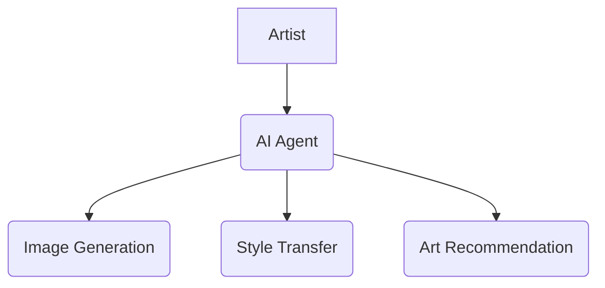
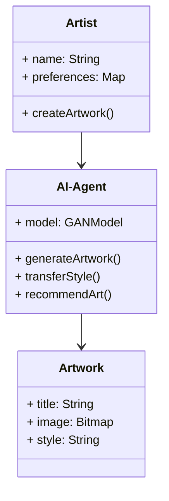
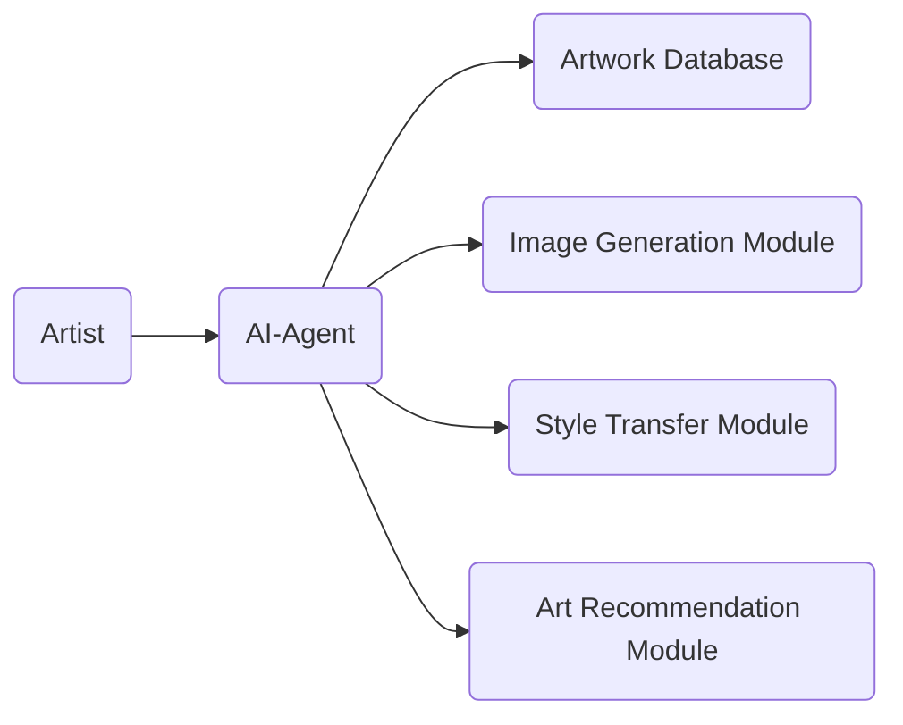
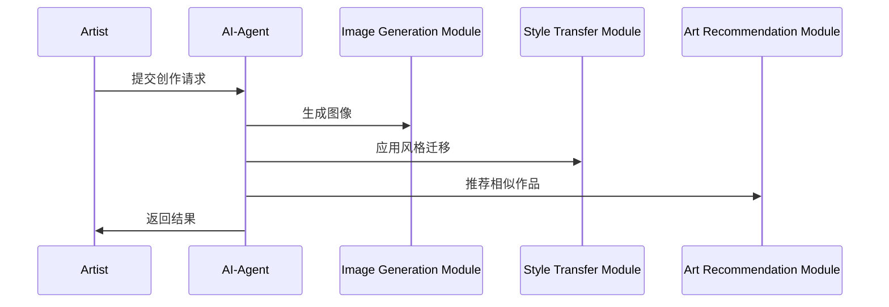

                 


# 视觉艺术领域的AI Agent创作工具

---

## 关键词

- AI Agent
- 视觉艺术
- 创作工具
- 算法原理
- 系统架构

---

## 摘要

本文详细探讨了AI Agent在视觉艺术领域的创作工具的设计与实现。通过分析AI Agent的核心概念、算法原理以及系统架构，结合实际项目案例，展示了如何利用AI技术赋能视觉艺术创作。文章从背景介绍到项目实战，层层深入，为读者提供了一套完整的AI Agent创作工具解决方案。

---

## 正文

---

### 第一部分：背景介绍

#### 第1章：AI Agent与视觉艺术的背景

##### 1.1 AI Agent的基本概念

- **1.1.1 AI Agent的定义与特点**
  - AI Agent（人工智能代理）是一种能够感知环境并采取行动以实现目标的智能实体。
  - 特点包括自主性、反应性、目标导向性和社会性。
  
- **1.1.2 AI Agent在视觉艺术中的应用背景**
  - 随着深度学习技术的快速发展，AI Agent在艺术创作中的应用逐渐增多。
  - 视觉艺术领域需要智能化工具来提升创作效率和多样性。

- **1.1.3 视觉艺术领域的核心问题与挑战**
  - 如何将AI技术与艺术创作结合，保持作品的创意性和独特性。
  - 解决视觉艺术创作中的复杂性和不确定性。

##### 1.2 视觉艺术与AI的结合

- **1.2.1 视觉艺术的定义与核心要素**
  - 视觉艺术包括绘画、雕塑、摄影等多种形式，核心要素包括构图、色彩、光影等。
  
- **1.2.2 AI技术在视觉艺术中的潜力**
  - AI可以辅助艺术家进行创意设计、风格迁移和图像生成。
  - 提供个性化推荐，帮助艺术家探索新的艺术风格。

- **1.2.3 当前视觉艺术领域的技术现状**
  - 基于深度学习的图像生成技术（如GAN）在艺术创作中的应用日益广泛。
  - AI工具已成为艺术家创作的重要辅助工具。

##### 1.3 AI Agent创作工具的发展趋势

- **1.3.1 AI在艺术创作中的应用现状**
  - 基于GAN的图像生成工具（如MidJourney、DALL-E）已成为主流。
  - AI驱动的艺术推荐系统开始普及。

- **1.3.2 AI Agent在视觉艺术领域的创新方向**
  - 结合增强学习（RL）实现更复杂的艺术创作。
  - 实现多模态交互，支持用户通过语言、图像等多种方式指导创作。

- **1.3.3 未来视觉艺术创作工具的发展趋势**
  - 更加智能化和个性化，能够理解用户的创作意图。
  - 跨领域融合，如结合AR/VR技术提供沉浸式创作体验。

---

### 第二部分：核心概念与联系

#### 第2章：AI Agent与视觉艺术的核心概念

##### 2.1 AI Agent的原理与特征

- **2.1.1 AI Agent的核心原理**
  - 感知环境：通过传感器或数据接口获取环境信息。
  - 采取行动：基于感知信息，执行预设或学习得来的策略。
  
- **2.1.2 AI Agent的特征对比**

| 特性         | AI Agent                          | 传统软件系统                     |
|--------------|------------------------------------|----------------------------------|
| 自主性       | 高                                 | 低                               |
| 反应性       | 高                                 | 低                               |
| 目标导向性   | 高                                 | 低                               |
| 社会性       | 高                                 | 低                               |

- **2.1.3 AI Agent的实体关系图**



##### 2.2 视觉艺术的创作过程与AI的结合

- **2.2.1 视觉艺术创作的核心流程**
  1. 确定创作主题。
  2. 设计构图和色彩方案。
  3. 执行创作步骤。
  4. 调整和优化作品。

- **2.2.2 AI在视觉艺术创作中的角色**
  - 作为辅助工具，帮助艺术家生成灵感。
  - 提供技术手段，实现复杂的艺术效果。

- **2.2.3 AI Agent在视觉艺术中的具体应用**
  - 生成图像：基于文本描述生成艺术图像。
  - 风格迁移：将一种艺术风格应用到另一幅图像上。
  - 艺术推荐：根据用户偏好推荐艺术作品。

---

### 第三部分：算法原理

#### 第3章：AI Agent的算法实现

##### 3.1 基于GAN的图像生成算法

- **3.1.1 GAN的基本原理**
  - GAN由生成器和判别器组成，通过对抗训练优化生成图像的质量。
  - 生成器的目标是生成能够欺骗判别器的图像，判别器的目标是区分真实图像和生成图像。

- **3.1.2 GAN的数学模型**

```mermaid
graph LR
    GAN[GAN Model] --> Generator[生成器]
    GAN --> Discriminator[判别器]
    Generator --> X[输入噪声]
    Generator --> D_X[生成图像]
    Discriminator --> D_X[输入图像]
    Discriminator --> Y[P(D_X为真实图像的概率)]
```

- **3.1.3 GAN的Python实现示例**

```python
import torch
import torch.nn as nn

class Generator(nn.Module):
    def __init__(self, latent_dim=100, img_size=128):
        super(Generator, self).__init__()
        self.latent_dim = latent_dim
        self.img_size = img_size
        self.model = nn.Sequential(
            nn.ConvTranspose2d(latent_dim, 512, 4, 1, 0),
            nn.BatchNorm2d(512),
            nn.ReLU(True),
            nn.ConvTranspose2d(512, 256, 4, 2, 1),
            nn.BatchNorm2d(256),
            nn.ReLU(True),
            nn.ConvTranspose2d(256, 128, 4, 2, 1),
            nn.BatchNorm2d(128),
            nn.ReLU(True),
            nn.ConvTranspose2d(128, 3, 4, 2, 1),
            nn.Sigmoid()
        )
    
    def forward(self, x):
        return self.model(x)

class Discriminator(nn.Module):
    def __init__(self):
        super(Discriminator, self).__init__()
        self.model = nn.Sequential(
            nn.Conv2d(3, 128, 3, 2, 1),
            nn.LeakyReLU(0.2),
            nn.Conv2d(128, 256, 3, 2, 1),
            nn.LeakyReLU(0.2),
            nn.Conv2d(256, 512, 3, 2, 1),
            nn.LeakyReLU(0.2),
            nn.Conv2d(512, 1, kernel_size=3, stride=1),
            nn.Sigmoid()
        )
    
    def forward(self, x):
        return self.model(x)

# 示例训练代码
latent_dim = 100
img_size = 128
generator = Generator(latent_dim, img_size)
discriminator = Discriminator()
criterion = nn.BCELoss()
optimizer_G = torch.optim.Adam(generator.parameters(), lr=0.0002)
optimizer_D = torch.optim.Adam(discriminator.parameters(), lr=0.0002)
```

- **3.1.4 GAN的训练过程**
  - 生成器和判别器交替训练。
  - 判别器损失函数：$\mathcal{L}_D = -\mathbb{E}_{x \sim p_{data}}[\log D(x)] - \mathbb{E}_{z \sim p_z}[\log(1 - D(G(z)))]$
  - 生成器损失函数：$\mathcal{L}_G = -\mathbb{E}_{z \sim p_z}[\log D(G(z))]$

---

### 第四部分：系统分析与架构设计

#### 第4章：AI Agent创作工具的系统架构

##### 4.1 项目介绍

- **4.1.1 项目目标**
  - 开发一个基于AI Agent的视觉艺术创作工具，支持图像生成、风格迁移和艺术推荐功能。

##### 4.2 系统功能设计

- **4.2.1 领域模型类图**



- **4.2.2 系统架构设计**



- **4.2.3 系统接口设计**
  - 用户接口：艺术家通过图形界面输入创作需求。
  - API接口：与其他系统（如数据库）交互。

- **4.2.4 系统交互流程**



---

### 第五部分：项目实战

#### 第5章：AI Agent创作工具的实现

##### 5.1 环境安装

- **5.1.1 安装Python和依赖库**
  ```bash
  pip install torch
  pip install numpy
  pip install matplotlib
  ```

##### 5.2 系统核心实现

- **5.2.1 生成器和判别器的实现**
  ```python
  import torch
  import torch.nn as nn

  class Generator(nn.Module):
      def __init__(self, ...):
          # 初始化生成器网络
          pass

      def forward(self, x):
          return self.model(x)

  class Discriminator(nn.Module):
      def __init__(self, ...):
          # 初始化判别器网络
          pass

      def forward(self, x):
          return self.model(x)
  ```

- **5.2.2 训练过程实现**
  ```python
  def traingan(generator, discriminator, optimizer_g, optimizer_d, criterion, epochs=100):
      for epoch in range(epochs):
          for _ in range(num_batches):
              # 判别器训练
              optimizer_d.zero_grad()
              real_data = ...
              fake_data = generator(z).detach()
              loss_d = criterion(discriminator(real_data), real_label) + criterion(discriminator(fake_data), fake_label)
              loss_d.backward()
              optimizer_d.step()

              # 生成器训练
              optimizer_g.zero_grad()
              loss_g = criterion(discriminator(generator(z)), real_label)
              loss_g.backward()
              optimizer_g.step()
  ```

##### 5.3 案例分析

- **5.3.1 图像生成案例**
  - 输入文本描述“一只飞翔的天鹅”。
  - 生成器生成对应的图像。
  
- **5.3.2 风格迁移案例**
  - 将梵高的风格应用到一张风景照片上。
  - 输出风格迁移后的图像。

##### 5.4 项目总结

- **5.4.1 实现成果**
  - 成功开发了一个基于GAN的AI Agent创作工具，支持图像生成和风格迁移功能。
  
- **5.4.2 项目经验**
  - 算法调参和模型优化是关键。
  - 界面设计和用户体验需要重点关注。

---

### 第六部分：最佳实践

#### 第6章：总结与展望

##### 6.1 总结

- 本文详细介绍了AI Agent在视觉艺术领域的创作工具的设计与实现。
- 通过理论分析和实践案例，展示了如何利用AI技术赋能艺术创作。

##### 6.2 小结

- AI Agent创作工具为艺术家提供了强大的技术支持。
- 未来的创作工具将更加智能化和个性化。

##### 6.3 注意事项

- 在实际应用中，需注意模型的泛化能力和创作的多样性。
- 避免过度依赖AI，保持艺术创作的独特性和创意性。

##### 6.4 拓展阅读

- 推荐阅读《生成对抗网络（GANs）：从原理到应用》。
- 推荐学习PyTorch框架，深入理解深度学习模型的实现。

---

## 作者

作者：AI天才研究院/AI Genius Institute & 禅与计算机程序设计艺术 /Zen And The Art of Computer Programming

