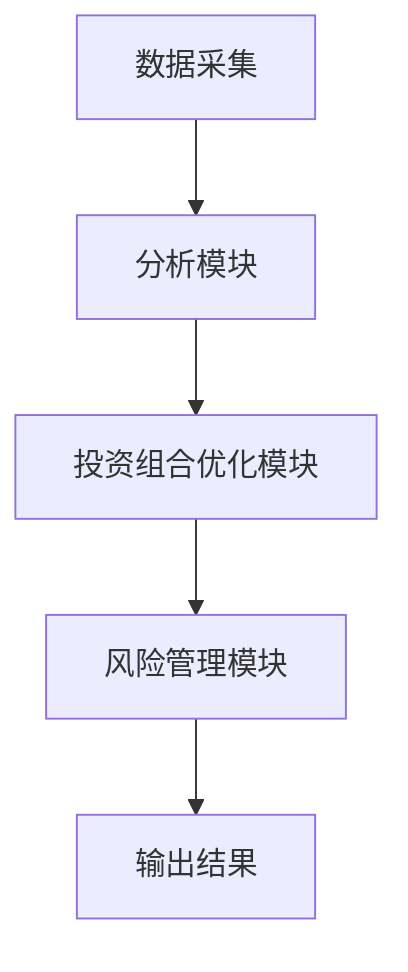

                 

# 詹姆斯·奥肖内西的价值投资组合管理：平衡风险与回报

## 关键词
价值投资、投资组合管理、风险管理、风险调整、组合优化

## 摘要
本文将深入探讨詹姆斯·奥肖内西的价值投资理念，分析其在投资组合管理中的应用。通过结合技术分析与基本面分析，阐述如何平衡风险与回报。文章将从价值投资的基本概念、投资组合管理的核心策略、风险管理的数学模型、系统架构设计以及实际案例分析等方面展开讨论，为读者提供一个全面而深入的视角。

---

## 第一部分: 价值投资的基本概念

### 第1章: 价值投资的定义与历史发展

#### 1.1 价值投资的起源与发展
- 价值投资的概念最早可以追溯到20世纪20年代，本杰明·格雷厄姆和戴维·多德是这一理念的奠基人。
- 詹姆斯·奥肖内西在继承传统价值投资理念的基础上，结合现代金融理论，提出了更为系统化的投资组合管理方法。

#### 1.2 价值投资的核心理念
- **安全边际**：买入价格低于内在价值，以降低投资风险。
- **长期视角**：关注企业的长期盈利能力，而非短期价格波动。
- **逆向思维**：在市场恐慌时寻找机会，在市场狂热时保持冷静。

#### 1.3 价值投资与传统投资的区别
| 特性                | 价值投资                   | 传统投资                   |
|---------------------|-----------------------------|-----------------------------|
| 投资目标            | 寻找被低估的企业             | 追求短期收益或趋势          |
| 风险偏好            | 低风险偏好                  | 高风险偏好                  |
| 投资期限            | 长期投资                    | 短期或中期投资              |

### 第2章: 投资组合管理的基本原理

#### 2.1 投资组合管理的定义
投资组合管理是通过科学的方法构建和调整投资组合，以实现既定的收益目标，同时控制风险。

#### 2.2 投资组合管理的目标
- 最大化收益
- 最小化风险
- 确保资产配置的合理性

#### 2.3 投资组合管理的步骤
1. 确定投资目标和风险承受能力。
2. 进行资产配置，选择优质标的。
3. 定期监控和调整组合。
4. 风险管理与再平衡。

---

## 第二部分: 价值投资的核心策略

### 第3章: 基本面分析

#### 3.1 财务报表分析
- 利润表：关注收入、利润和成本。
- 资产负债表：分析资产、负债和所有者权益。
- 现金流量表：评估企业现金流健康状况。

#### 3.2 行业分析与竞争优势
- 行业分析：研究行业的生命周期、竞争格局和政策环境。
- 竞争优势：分析企业的核心竞争力，如成本优势、技术优势等。

#### 3.3 安全边际的计算
$$ \text{安全边际} = \text{内在价值} - \text{市场价格} $$

### 第4章: 安全边际与价值陷阱

#### 4.1 安全边际的重要性
- 安全边际是价值投资的核心理念，通过买入价格低于内在价值的资产，降低投资风险。

#### 4.2 价值陷阱的识别
- 价值陷阱的特征：低市盈率、高市净率，但缺乏竞争优势。
- 如何避免：深入分析企业基本面，避免被表面的低估值迷惑。

---

## 第三部分: 投资组合的风险管理

### 第5章: 风险的度量与管理

#### 5.1 风险的分类
| 风险类型            | 描述                       |
|---------------------|---------------------------|
| 市场风险            | 市场波动导致的资产价格变化   |
| 信用风险            | 债务人违约风险             |
| 流动性风险          | 资产难以快速变现的风险      |
| 操作风险          | 操作失误导致的损失          |

#### 5.2 风险调整后的投资组合
- 使用现代投资组合理论（MPT）构建风险调整后的组合。

### 第6章: 风险管理的数学模型

#### 6.1 均值-方差优化
$$ \text{方差} = \sigma^2 = \sum_{i=1}^{n} w_i^2 \sigma_i^2 + 2 \sum_{i=1}^{n} \sum_{j=1}^{n} w_i w_j \sigma_{ij} $$

#### 6.2 最小化风险的数学表达
$$ \min_w \sigma^2 \quad \text{subject to} \quad \sum_{i=1}^{n} w_i = 1 $$

---

## 第四部分: 价值投资组合的系统架构

### 第7章: 系统功能设计

#### 7.1 系统功能模块
- 数据采集模块：收集市场数据。
- 分析模块：进行基本面和技术分析。
- 投资组合优化模块：构建和调整投资组合。
- 风险管理模块：监控和控制风险。

#### 7.2 系统架构设计

### 第8章: 系统接口设计

#### 8.1 数据接口
- API接口：用于数据的获取和传输。

#### 8.2 交互界面
- 用户界面：方便用户进行操作和监控。

---

## 第五部分: 价值投资组合的实战分析

### 第9章: 实战案例分析

#### 9.1 投资标的筛选
- 选择具有竞争优势的低估企业。

#### 9.2 投资组合的构建
- 根据风险承受能力进行资产配置。

#### 9.3 动态调整与再平衡
- 定期监控市场变化，进行必要的调整。

---

## 第六部分: 价值投资的未来与总结

### 第10章: 价值投资的未来趋势

#### 10.1 技术进步对投资的影响
- 大数据和人工智能在投资中的应用。

#### 10.2 ESG投资的兴起
- 环境、社会和治理因素在投资中的重要性日益增加。

### 第11章: 总结与展望

#### 11.1 总结
- 价值投资是一种长期有效的策略，通过基本面分析和风险控制，可以在市场中实现稳健的回报。

#### 11.2 展望
- 随着技术的进步，价值投资将更加精准和高效。

---

## 作者：AI天才研究院/AI Genius Institute & 禅与计算机程序设计艺术 /Zen And The Art of Computer Programming

