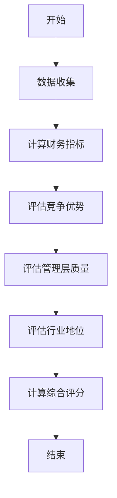
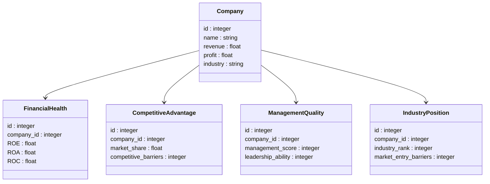
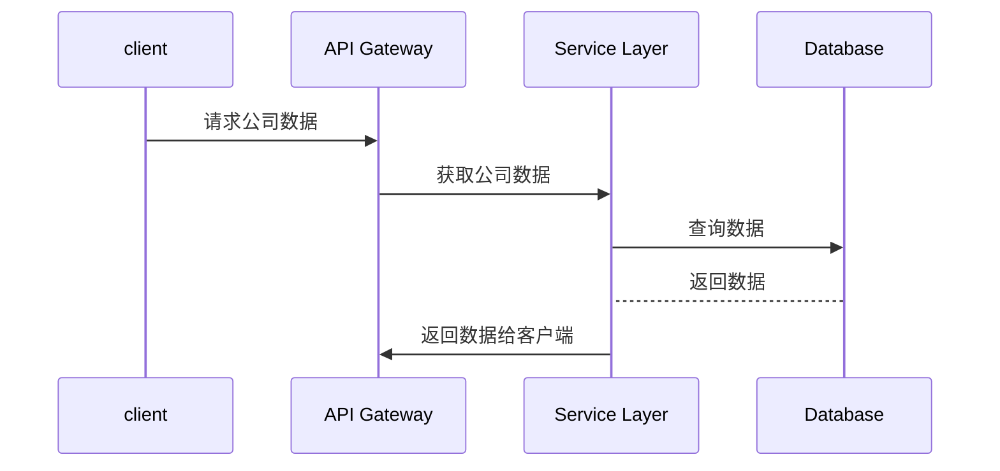

                 


# 詹姆斯·奥肖内西的价值投资者的质量筛选

> 关键词：价值投资，质量筛选，财务指标，竞争优势，管理层评估

> 摘要：本文探讨詹姆斯·奥肖内西的价值投资理念，重点分析质量筛选在投资决策中的作用。通过详细阐述质量筛选的标准、算法和系统设计，结合实际案例，提供实践指导。

---

# 第一部分: 价值投资与质量筛选的背景与基础

## 第1章: 价值投资与质量筛选概述

### 1.1 价值投资的核心理念

- **价值投资的起源与发展**
  - 由本杰明·格雷厄姆和戴维·多德提出，强调以内在价值为导向进行投资。
  - 詹姆斯·奥肖内西在其基础上，进一步发展质量筛选的方法。

- **价值投资的核心原则**
  - 购买价格低于内在价值。
  - 长期投资，避免短期波动。

- **质量筛选的重要性**
  - 质量筛选帮助识别具有持续竞争优势和良好财务状况的企业。

### 1.2 质量筛选的定义与目标

- **定义**
  - 通过一系列标准筛选出具有长期竞争优势和财务健康的企业。

- **目标**
  - 降低投资风险，提高投资回报率。

### 1.3 质量筛选的核心要素

- **财务健康状况**
  - 关键指标：ROE、ROA、ROCE等。

- **竞争优势**
  - 包括成本优势、品牌优势等。

- **管理层质量**
  - 管理层的诚信和能力是企业长期成功的关键。

- **行业地位**
  - 行业中的领导地位有助于企业长期发展。

### 1.4 质量筛选的边界与外延

- **适用范围**
  - 适用于所有行业，但对不同行业标准略有调整。

- **局限性**
  - 不能完全预测市场波动，仅能筛选出潜在优质企业。

---

# 第二部分: 质量筛选的核心概念与联系

## 第2章: 质量筛选的核心要素分析

### 2.1 财务健康状况分析

- **财务指标分析**
  - 净利润、营收、负债等。

- **评估标准**
  - 利润率高，负债低，现金流稳定。

### 2.2 竞争优势分析

- **定义与分类**
  - 成本优势、品牌优势等。

- **评估方法**
  - 市场占有率，竞争对手分析。

### 2.3 管理层质量分析

- **诚信与能力**
  - 管理层过往业绩和决策能力。

- **决策稳定性**
  - 管理层在市场波动中的应对策略。

### 2.4 行业地位分析

- **行业周期分析**
  - 行业处于成长期还是成熟期。

- **竞争格局分析**
  - 行业集中度和市场进入壁垒。

## 第3章: 质量筛选的核心概念与联系

### 3.1 核心概念原理

- **数学模型**
  - 通过加权评分系统，综合评估各项指标。

### 3.2 核心概念属性特征对比表格

| 核心概念 | 财务健康状况 | 竞争优势 | 管理层质量 | 行业地位 |
|----------|--------------|----------|------------|----------|
| 定义     | 公司财务状况的健康程度 | 公司在市场中的竞争优势 | 管理层的诚信与能力 | 公司在行业中的地位 |
| 评估标准 | 财务指标（ROE, ROA, ROC | 市场占有率，竞争对手分析 | 管理层的业绩和决策 | 市场地位，行业集中度 |

### 3.3 ER实体关系图

```mermaid
erDiagram
    company[公司] {
        <<Company>>
        +id : integer
        +name : string
        +revenue : float
        +profit : float
        +industry : string
    }
    financial_health[财务健康状况] {
        <<FinancialHealth>>
        +id : integer
        +company_id : integer
        +roar : float
        +roe : float
        +debt : float
    }
    competitive_advantage[竞争优势] {
        <<CompetitiveAdvantage>>
        +id : integer
        +company_id : integer
        +market_share : float
        +competitive_barriers : integer
    }
    management_quality[管理层质量] {
        <<ManagementQuality>>
        +id : integer
        +company_id : integer
        +management_score : integer
        +leadership_ability : integer
    }
    industry_position[行业地位] {
        <<IndustryPosition>>
        +id : integer
        +company_id : integer
        +industry_rank : integer
        +market_entry_barriers : integer
    }
    company --> financial_health
    company --> competitive_advantage
    company --> management_quality
    company --> industry_position
```

---

# 第三部分: 质量筛选的算法与系统设计

## 第4章: 质量筛选的算法原理

### 4.1 算法流程



### 4.2 Python实现

```python
def calculate_financial_health(revenue, profit, debt):
    roar = profit / revenue
    roe = profit / debt
    roc = revenue / debt
    return (roar + roe + roc) / 3

def assess_competitive_advantage(market_share, competitive_barriers):
    return (market_share + competitive_barriers) / 2

def evaluate_management(management_score, leadership_ability):
    return (management_score + leadership_ability) / 2

def assess_industry_position(industry_rank, market_entry_barriers):
    return (industry_rank + market_entry_barriers) / 2

def quality_screening(revenue, profit, debt, market_share, competitive_barriers, management_score, leadership_ability, industry_rank, market_entry_barriers):
    financial = calculate_financial_health(revenue, profit, debt)
    competitive = assess_competitive_advantage(market_share, competitive_barriers)
    management = evaluate_management(management_score, leadership_ability)
    industry = assess_industry_position(industry_rank, market_entry_barriers)
    total_score = (financial + competitive + management + industry) / 4
    return total_score

# 示例
revenue = 1000000
profit = 200000
debt = 500000
market_share = 30
competitive_barriers = 25
management_score = 85
leadership_ability = 90
industry_rank = 2
market_entry_barriers = 3

score = quality_screening(revenue, profit, debt, market_share, competitive_barriers, management_score, leadership_ability, industry_rank, market_entry_barriers)
print(f"质量筛选评分：{score}")
```

### 4.3 数学模型与公式

- **财务健康评分公式**
  $$ financial\_score = \frac{ROE + ROA + ROC}{3} $$
  
- **竞争优势评分公式**
  $$ competitive\_score = \frac{market\_share + competitive\_barriers}{2} $$

---

# 第四部分: 系统分析与架构设计

## 第5章: 系统功能设计

### 5.1 领域模型



### 5.2 系统架构设计

```mermaid
client --> API Gateway
API Gateway --> Service Layer
Service Layer --> Database
client <-->> Database
```

### 5.3 系统接口设计

- **API接口**
  - GET /companies/{id}/financial_health
  - POST /companies/screening

### 5.4 系统交互流程



---

# 第五部分: 项目实战与总结

## 第6章: 项目实战

### 6.1 环境安装

- 安装Python和相关库（如pandas, numpy）。

### 6.2 核心实现

```python
import pandas as pd
import numpy as np

def main():
    data = pd.read_csv('companies.csv')
    data['quality_score'] = data.apply(lambda row: quality_screening(row['revenue'], row['profit'], row['debt'], row['market_share'], row['competitive_barriers'], row['management_score'], row['leadership_ability'], row['industry_rank'], row['market_entry_barriers']), axis=1)
    data.to_csv('screened_companies.csv', index=False)

if __name__ == "__main__":
    main()
```

### 6.3 实际案例分析

- 分析某行业前三名公司的数据，计算质量评分，选出最优投资标的。

## 第7章: 总结

### 7.1 关键点回顾

- 质量筛选的核心在于财务健康、竞争优势、管理层质量和行业地位的综合评估。

### 7.2 最佳实践 tips

- 长期投资，避免短期波动。
- 定期评估和调整投资组合。
- 持续学习和更新筛选标准。

### 7.3 注意事项

- 数据的准确性和及时性。
- 算法的适应性和灵活性。

### 7.4 拓展阅读

- 格雷厄姆的《证券分析》
- 哈佛大学的金融课程

---

# 结语

詹姆斯·奥肖内西的质量筛选方法为价值投资者提供了科学的决策工具。通过系统的分析和实践，投资者可以更有效地识别优质企业，提高投资收益。

---

# 作者：AI天才研究院 & 禅与计算机程序设计艺术

