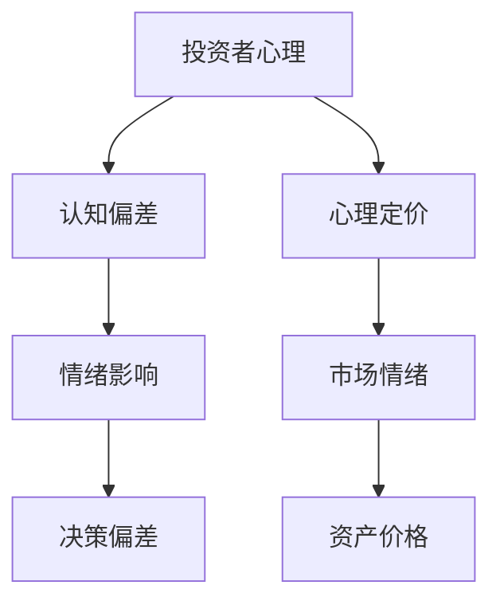

                 


# 《詹姆斯·蒙蒂尔的价值投资心理学》

---

## 关键词

- 价值投资心理学
- 行为金融学
- 投资者心理
- 心理定价
- 投资决策算法

---

## 摘要

本文深入探讨了詹姆斯·蒙蒂尔的价值投资心理学，结合心理学和投资学的理论，分析了投资者心理如何影响投资决策。文章从心理学基础出发，介绍了价值投资的核心概念，包括认知偏差、情绪影响和心理账户理论。通过行为金融学的视角，文章详细讲解了心理定价与市场情绪的关系，以及如何利用心理定价进行投资。此外，本文还分析了价值评估与心理定价的结合，并提出了基于心理定价的投资策略。通过算法和数学模型的详细阐述，文章展示了如何将心理学原理应用于投资决策。最后，本文总结了价值投资心理学的核心观点，并提供了实际的投资策略建议。

---

# 第一部分: 价值投资心理学背景与基础

## 第1章: 价值投资心理学概述

### 1.1 心理学与投资的关系

#### 1.1.1 心理学基础

心理学是研究人类行为和思维的科学。在投资领域，心理学帮助我们理解投资者如何做出决策。例如，认知偏差和情绪波动是影响投资决策的重要因素。

- **认知偏差**：投资者可能会因为过度自信或确认偏差而做出错误决策。
- **情绪影响**：恐惧和贪婪等情绪会导致投资者在市场波动中做出非理性决策。

#### 1.1.2 投资与心理学的结合点

- **行为金融学**：研究投资者心理和行为对金融市场的影响。
- **心理账户**：投资者如何在心理上划分和管理资金。
- **情绪周期**：市场参与者的情绪波动如何影响资产价格。

#### 1.1.3 价值投资的核心理念

- **长期视角**：关注企业的内在价值，而非短期价格波动。
- **安全边际**：买入价格低于内在价值，以降低风险。
- **逆向思维**：在市场恐慌时买入，在市场狂热时卖出。

---

### 1.2 价值投资的基本概念

#### 1.2.1 价值投资的定义

价值投资是一种投资策略，旨在通过识别市场价格与内在价值的差异，长期持有优质资产以获得超额收益。

- **内在价值**：资产在未来现金流的现值。
- **市场价格**：资产在市场上的交易价格。

#### 1.2.2 价值投资的核心原则

- **买入便宜货**：购买价格低于内在价值的资产。
- **长期持有**：避免频繁交易，减少成本和错误决策。
- **关注基本面**：分析企业的财务状况、行业地位和竞争优势。

#### 1.2.3 价值投资与其它投资策略的对比

| 投资策略 | 核心思想 | 优点 | 缺点 |
|----------|----------|------|------|
| 价值投资 | 寻找价格低于内在价值的资产 | 高收益、低风险 | 需要深入研究、周期长 |
| 技术分析 | 通过价格和成交量预测未来走势 | 短期收益、操作灵活 | 易受市场情绪影响、风险高 |

---

## 第2章: 价值投资心理学的核心理论

### 2.1 行为金融学基础

#### 2.1.1 行为金融学的定义

行为金融学是研究投资者心理和行为对金融市场的影响的学科。它与传统金融学不同，后者假设投资者是理性的。

- **传统金融学**：假设投资者理性，市场有效。
- **行为金融学**：考虑投资者心理和行为，市场可能存在非理性。

#### 2.1.2 行为金融学与传统金融学的区别

| 方面 | 传统金融学 | 行为金融学 |
|------|------------|------------|
| 基础假设 | 理性投资者 | 非理性投资者 |
| 市场有效性 | 有效市场 | 无效市场 |
| 研究方法 | 数学模型 | 心理实验 |

#### 2.1.3 行为金融学的核心理论

- **前景理论**：投资者对损失和收益的敏感程度不同，倾向于避免损失。
- **后悔理论**：投资者做出决策后，可能会因结果不如预期而后悔。

---

### 2.2 心理账户理论

#### 2.2.1 心理账户的定义

心理账户是投资者在大脑中对资金进行分类和管理的方式。例如，投资者可能会将资金分为“投机”和“稳健”账户。

- **心理账户的分类**：投机账户、稳健账户、短期账户、长期账户。
- **心理账户的影响**：投资者可能因为心理账户的划分而做出非理性决策。

#### 2.2.2 心理账户对投资决策的影响

- **过度交易**：投资者可能频繁交易以满足不同心理账户的需求。
- **决策偏差**：投资者可能因心理账户而忽视整体投资策略。

#### 2.2.3 心理账户与价值投资的关系

- **心理账户的划分**：价值投资者通常会将资金分为长期投资和短期备用资金。
- **心理账户的影响**：价值投资者需要避免因心理账户的划分而做出短期决策。

---

### 2.3 投资者情绪周期

#### 2.3.1 投资者情绪的周期性

投资者情绪通常呈现周期性波动，从乐观到悲观，再到乐观。

- **乐观阶段**：投资者信心高涨，市场成交量增加。
- **悲观阶段**：投资者失去信心，市场成交量下降。

#### 2.3.2 情绪周期对市场的影响

- **市场泡沫**：乐观情绪导致资产价格过高，形成泡沫。
- **市场恐慌**：悲观情绪导致资产价格暴跌，形成恐慌性抛售。

#### 2.3.3 如何应对情绪周期

- **逆向思维**：在市场悲观时买入，在市场乐观时卖出。
- **纪律性**：坚持长期投资策略，避免被短期情绪左右。

---

## 第3章: 价值评估与心理定价

### 3.1 价值评估的基本方法

#### 3.1.1 市盈率法

市盈率法是通过比较企业的市盈率与行业平均水平，判断企业是否被低估或高估。

- **公式**：市盈率 = 股价 / 每股收益（EPS）。
- **应用**：如果企业的市盈率低于行业平均水平，可能被低估。

#### 3.1.2 市净率法

市净率法是通过比较企业的市净率与行业平均水平，判断企业是否被低估或高估。

- **公式**：市净率 = 股价 / 每股净资产（BPS）。
- **应用**：如果企业的市净率低于行业平均水平，可能被低估。

#### 3.1.3 现金流折现法

现金流折现法是通过将企业未来现金流折现，计算其内在价值。

- **公式**：内在价值 = Σ（未来现金流 / (1 + r)^t）。
- **应用**：如果市场价格低于内在价值，企业可能被低估。

---

### 3.2 心理定价与市场情绪

#### 3.2.1 心理定价的定义

心理定价是投资者根据心理账户和情绪判断价格高低的过程。

- **心理定价的影响**：投资者可能因情绪波动而高估或低估价格。

#### 3.2.2 市场情绪对定价的影响

- **乐观情绪**：投资者高估资产价值，推高市场价格。
- **悲观情绪**：投资者低估资产价值，压低市场价格。

#### 3.2.3 如何利用心理定价进行投资

- **识别市场情绪**：通过市场成交量和价格走势判断市场情绪。
- **逆向投资**：在市场悲观时买入，在市场乐观时卖出。

---

### 3.3 价值陷阱与心理偏差

#### 3.3.1 价值陷阱的定义

价值陷阱是表面上看似便宜，但实际情况可能不佳的资产。

- **价值陷阱的特点**：低市盈率、低市净率，但企业盈利能力下降。

#### 3.3.2 心理偏差导致的误判

- **确认偏差**：投资者倾向于寻找支持自己观点的信息，忽略相反证据。
- **过度自信**：投资者可能过高估计自己的判断能力。

#### 3.3.3 如何识别和避免价值陷阱

- **深入研究**：分析企业的财务状况、行业地位和竞争优势。
- **避免情绪化决策**：基于理性分析做出投资决策。

---

## 第4章: 投资决策的心理算法

### 4.1 投资决策模型

#### 4.1.1 理性决策模型

理性决策模型假设投资者基于理性分析做出决策。

- **步骤**：
  1. 收集信息。
  2. 分析信息。
  3. 评估选项。
  4. 做出决策。

#### 4.1.2 情感决策模型

情感决策模型假设投资者基于情绪和直觉做出决策。

- **步骤**：
  1. 感受市场情绪。
  2. 做出快速决策。
  3. 事后分析。

#### 4.1.3 综合决策模型

综合决策模型结合理性分析和情感因素，做出更优决策。

- **步骤**：
  1. 理性分析。
  2. 情感判断。
  3. 综合决策。

---

### 4.2 心理定价与投资策略

#### 4.2.1 基于心理定价的投资策略

- **策略一**：在市场恐慌时买入低估资产。
- **策略二**：在市场狂热时卖出高估资产。

---

## 第5章: 系统分析与架构设计

### 5.1 价值投资心理系统的架构设计

#### 5.1.1 系统架构图



#### 5.1.2 系统功能模块

- **认知偏差分析模块**：识别投资者的认知偏差。
- **情绪影响分析模块**：评估市场情绪对价格的影响。
- **决策支持模块**：提供基于心理定价的投资建议。

---

## 第6章: 项目实战

### 6.1 投资组合优化案例

#### 6.1.1 项目目标

构建一个基于心理定价的投资组合，实现长期收益最大化。

#### 6.1.2 实现步骤

1. 数据收集：收集资产的历史价格和财务数据。
2. 价值评估：使用市盈率、市净率和现金流折现法评估内在价值。
3. 心理定价：判断市场价格与内在价值的差异。
4. 投资决策：在市场价格低于内在价值时买入，在市场价格高于内在价值时卖出。

#### 6.1.3 Python代码实现

```python
import pandas as pd
import numpy as np

# 数据收集
prices = pd.read_csv('stock_prices.csv')
financials = pd.read_csv('stock_financials.csv')

# 价值评估
def calculate_intrinsic_value(financials, discount_rate):
    # 计算自由现金流
    fcf = financials['free_cash_flow']
    # 计算折现因子
    discount_factor = 1 / (1 + discount_rate)
    # 计算内在价值
    intrinsic_value = sum(fcf * discount_factor**t for t in range(len(fcf)))
    return intrinsic_value

# 心理定价
def is_undervalued(price, intrinsic_value, margin=0.2):
    return price < intrinsic_value * (1 - margin)

# 投资决策
def investment_decision(prices, financials, discount_rate):
    decisions = []
    for i in range(len(prices)):
        iv = calculate_intrinsic_value(financials.iloc[i], discount_rate)
        if is_undervalued(prices.iloc[i], iv):
            decisions.append('Buy')
        else:
            decisions.append('Sell')
    return decisions

# 示例
discount_rate = 0.1
decisions = investment_decision(prices, financials, discount_rate)
print(decisions)
```

#### 6.1.4 代码解读与分析

- **数据收集**：从CSV文件中读取股票价格和财务数据。
- **价值评估**：使用现金流折现法计算内在价值。
- **心理定价**：判断市场价格是否低于内在价值的一定折扣率。
- **投资决策**：根据心理定价结果，做出买入或卖出决策。

---

## 第7章: 总结与建议

### 7.1 总结

价值投资心理学结合了心理学和投资学的理论，帮助投资者理解心理因素对投资决策的影响。通过识别认知偏差、情绪影响和心理定价，投资者可以做出更理性的决策。

### 7.2 最佳实践 tips

- **深入研究**：在投资前，对企业和市场进行深入研究。
- **长期视角**：关注企业的内在价值，避免短期波动。
- **逆向思维**：在市场悲观时买入，在市场乐观时卖出。

### 7.3 注意事项

- **避免情绪化决策**：不要因市场情绪而做出冲动决策。
- **持续学习**：保持对市场和企业的关注，及时调整投资策略。

### 7.4 拓展阅读

- 《The Intelligent Investor》 by Benjamin Graham
- 《Thinking, Fast and Slow》 by Daniel Kahneman

---

## 作者

作者：AI天才研究院/AI Genius Institute & 禅与计算机程序设计艺术/Zen And The Art of Computer Programming

---

以上是基于用户提供的《詹姆斯·蒙蒂尔的价值投资心理学》的目录大纲，展开成一篇完整的博客文章的结构。希望这篇博客能够为读者提供有价值的投资心理学知识，并帮助他们在实际投资中做出更理性的决策。

