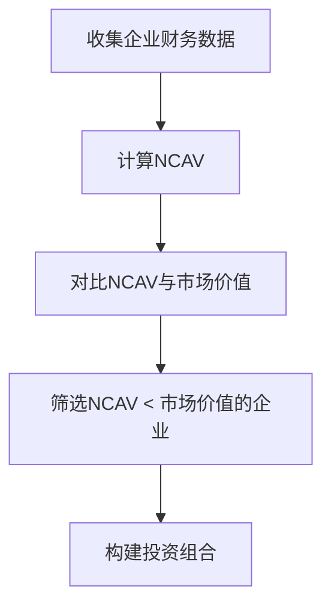
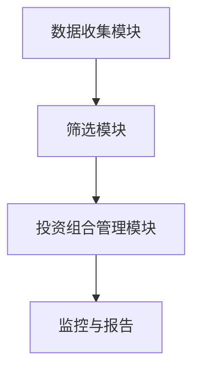

                 


# 净净流动资产价值投资：极端安全边际

---

## 关键词
- 净净流动资产（NCAV）
- 价值投资
- 蒙蒂尔
- 极端安全边际
- 资产评估
- 投资策略

---

## 摘要
本文深入探讨了詹姆斯·蒙蒂尔提出的净净流动资产（NCAV）价值投资策略，重点分析其核心原理、数学模型、系统架构以及实际应用。通过案例分析和代码实现，帮助读者理解如何利用NCAV寻找被低估的企业，构建安全的投资组合。

---

# 第一部分: 净净流动资产价值投资的背景与核心概念

## 第1章: 净净流动资产价值投资的背景与定义

### 1.1 净净流动资产价值投资的背景
#### 1.1.1 价值投资的历史与发展
价值投资是一种长期投资策略，强调以低于公允价值的价格购买优质资产。传统价值投资通常关注市盈率（P/E）和市净率（P/B）等指标，但这些方法在市场波动剧烈时可能失效。蒙蒂尔提出NCAV，为投资者提供了一种更安全的投资边际。

#### 1.1.2 净净流动资产价值投资的提出
净净流动资产（NCAV）由詹姆斯·蒙蒂尔提出，定义为：
$$NCAV = \frac{\text{流动资产} - \text{非流动资产}}{\text{流动负债}}$$
其中，流动资产包括现金、应收账款和存货，非流动资产包括长期股权投资和固定资产。

#### 1.1.3 蒙蒂尔的贡献与研究方法
蒙蒂尔通过分析数千家企业的财务数据，发现当NCAV远低于市场价值时，企业具有较高的投资价值。他的研究方法强调极端安全边际，即在市场恐慌时寻找被严重低估的企业。

---

### 1.2 净净流动资产价值投资的定义
#### 1.2.1 净流动资产的定义与计算
净流动资产是指企业的流动资产减去流动负债。流动资产包括现金、应收账款和存货，流动负债包括应付账款、短期债务等。

#### 1.2.2 净净流动资产的定义与公式
NCAV是净流动资产与流动负债的比值：
$$NCAV = \frac{\text{流动资产} - \text{非流动资产}}{\text{流动负债}}$$
当NCAV远小于1时，企业可能被市场低估。

#### 1.2.3 净净流动资产与市场价值的对比
NCAV与市场价值的对比是判断企业是否被低估的关键。当NCAV < 市场价值时，企业可能具有投资价值。

---

## 第2章: 净净流动资产价值投资与其他投资策略的对比

### 2.1 传统价值投资的优缺点
#### 2.1.1 基于市盈率的估值方法
市盈率（P/E）是股价与每股收益的比值。优点是简单易懂，缺点是无法反映企业的资产质量。

#### 2.1.2 基于市净率的估值方法
市净率（P/B）是股价与每股净资产的比值。优点是反映企业资产价值，缺点是无法反映企业的盈利能力。

#### 2.1.3 基于股息率的估值方法
股息率是股息与股价的比值。优点是反映企业的分红能力，缺点是无法反映企业的成长性。

---

### 2.2 净净流动资产价值投资的独特性
#### 2.2.1 突出流动性与资产质量
NCAV强调流动资产的质量和流动性，确保企业在短期内的偿债能力。

#### 2.2.2 强调极端安全边际
蒙蒂尔提出在市场恐慌时寻找NCAV远低于市场价值的企业，强调极端安全边际。

#### 2.2.3 与市场波动的结合
NCAV与市场波动密切相关，当市场恐慌时，企业可能被严重低估，NCAV与市场价值的差距可能达到最大。

---

### 2.3 净净流动资产价值投资的适用场景
#### 2.3.1 在熊市中的应用
熊市中市场恐慌，企业可能被严重低估，NCAV < 市场价值，是投资的好时机。

#### 2.3.2 在牛市中的应用
牛市中市场情绪高涨，企业可能被高估，NCAV > 市场价值，应谨慎投资。

#### 2.3.3 在行业周期中的应用
行业周期波动时，NCAV可以帮助投资者判断企业的抗风险能力。

---

# 第二部分: 净净流动资产价值投资的核心算法与数学模型

## 第3章: 净净流动资产的计算与评估标准

### 3.1 净净流动资产的计算公式
$$NCAV = \frac{\text{流动资产} - \text{非流动资产}}{\text{流动负债}}$$

---

### 3.2 净净流动资产的评估标准
- 当NCAV < 1时，企业可能被低估。
- 当NCAV < 市场价值时，企业具有投资价值。

---

## 第4章: 净净流动资产价值投资的算法原理

### 4.1 算法原理
1. 收集企业财务数据。
2. 计算NCAV。
3. 对比NCAV与市场价值。
4. 筛选NCAV < 市场价值的企业。
5. 构建投资组合。

---

### 4.2 算法流程图


---

### 4.3 算法实现
```python
def calculate_ncav(firm):
    net流动资产 = firm.流动资产 - firm.非流动资产
    ncav = net流动资产 / firm.流动负债
    return ncav

def筛选投资标的(firms, 市场价值):
    投资标的 = []
    for firm in firms:
        ncav = calculate_ncav(firm)
        if ncav < firm.市场价值:
            投资标的.append(firm)
    return 投资标的
```

---

## 第5章: 净净流动资产价值投资的系统架构设计

### 5.1 系统功能设计
1. 数据收集模块：收集企业财务数据。
2. 筛选模块：计算NCAV并筛选投资标的。
3. 投资组合管理模块：构建投资组合并监控风险。

---

### 5.2 系统架构图


---

### 5.3 系统接口设计
- 数据接口：提供财务数据接口。
- 筛选接口：提供NCAV筛选接口。
- 投资组合接口：提供投资组合管理接口。

---

# 第三部分: 净净流动资产价值投资的项目实战

## 第6章: 项目实战

### 6.1 环境安装
- Python 3.8+
- pandas库
- numpy库

### 6.2 核心实现
```python
import pandas as pd
import numpy as np

def calculate_ncav(firm_data):
   流动资产 = firm_data['流动资产']
    非流动资产 = firm_data['非流动资产']
    流动负债 = firm_data['流动负债']
    net流动资产 = 流动资产 - 非流动资产
    ncav = net流动资产 / 流动负债
    return ncav

# 示例数据
firm_data = {
    '流动资产': 100,
    '非流动资产': 50,
    '流动负债': 70
}

ncav = calculate_ncav(firm_data)
print(f"净流动资产价值为: {ncav}")
```

---

### 6.3 案例分析
以苹果公司为例，假设其流动资产为1000亿美元，非流动资产为1500亿美元，流动负债为500亿美元，市场价值为2万亿美元。
计算NCAV：
$$NCAV = \frac{1000 - 1500}{500} = -1$$
由于NCAV < 0，苹果公司可能被低估。

---

## 第7章: 最佳实践

### 7.1 小结
NCAV是一种有效的价值投资策略，尤其在市场恐慌时表现突出。

### 7.2 注意事项
- 需要持续关注企业财务数据。
- 需要结合市场环境灵活调整策略。

### 7.3 拓展阅读
- 蒙蒂尔的《安全边际》
- 巴菲特的价值投资理论

---

## 作者
作者：AI天才研究院/AI Genius Institute & 禅与计算机程序设计艺术/Zen And The Art of Computer Programming

---

通过本文，读者可以全面理解净净流动资产价值投资的核心概念、算法原理和实际应用，掌握如何利用NCAV寻找被低估的企业，构建安全的投资组合。

